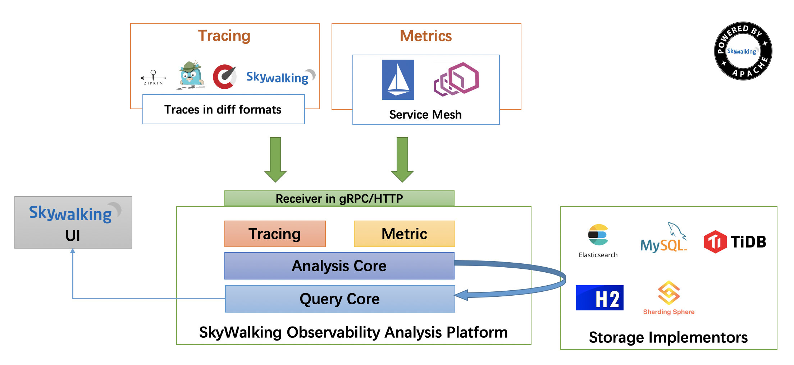
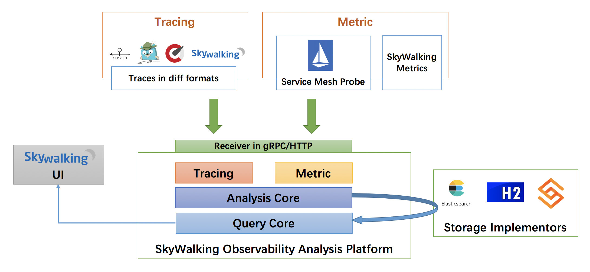
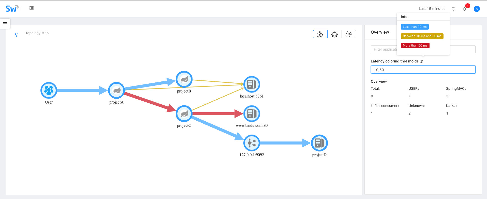
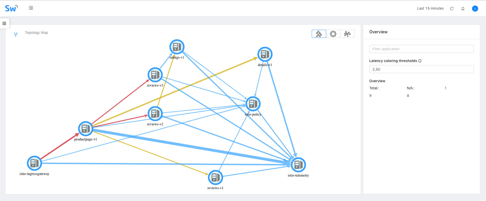
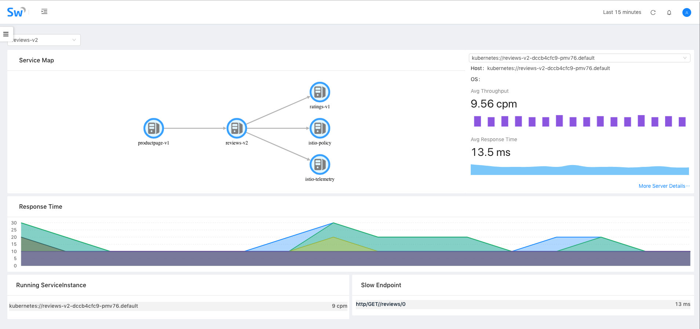

Original link, [Tetrate.io blog](https://www.tetrate.io/blog/apache-skywalking-v6/)

# Context

The integration of SkyWalking and Istio Service Mesh yields an essential open-source tool for resolving the chaos created by the proliferation of siloed, cloud-based services.

Apache SkyWalking is an open, modern performance management tool for distributed services, designed especially for microservices, cloud native and container-based (Docker, K8s, Mesos) architectures. We at Tetrate believe it is going to be an important project for understanding the performance of microservices. The recently released v6 integrates with Istio Service Mesh and focuses on metrics and tracing. It natively understands the most common language runtimes (Java, .Net, and NodeJS). With its new core code, SkyWalking v6 also supports Istrio telemetry data formats, providing consistent analysis, persistence, and visualization.

SkyWalking has evolved into an Observability Analysis Platform that enables observation and monitoring of hundreds of services all at once. It promises solutions for some of the trickiest problems faced by system administrators using complex arrays of abundant services: Identifying why and where a request is slow, distinguishing normal from deviant system performance, comparing apples-to-apples metrics across apps regardless of programming language, and attaining a complete and meaningful view of performance.

# SkyWalking History
Launched in China by Wu Sheng in 2015, SkyWalking started as just a distributed tracing system, like Zipkin, but with auto instrumentation from a Java agent. This enabled JVM users to see distributed traces without any change to their source code. In the last two years, it has been used for research and production by more than [50 companies](https://github.com/apache/incubator-skywalking/blob/master/docs/powered-by.md). With its expanded capabilities, we expect to see it adopted more globally.

# What's new
## Service Mesh Integration
Istio has picked up a lot of steam as the framework of choice for distributed services. Based on all the interest in the Istio project, and community feedback, some SkyWalking (P)PMC members decided to integrate with Istio Service Mesh to move SkyWalking to a higher level.

So now you can use Skywalking to get metrics and understand the topology of your applications. This works not just for Java, .NET and Node using our language agents, but also for microservices running under the Istio service mesh. You can get a full topology of both kinds of applications.

## Observability analysis platform
With its roots in tracing, SkyWalking is now transitioning into an open-standards based **Observability Analysis Platform**, which means the following:

* It can accept different kinds and formats of telemetry data from mesh like Istio telemetry.
* Its agents support various popular software technologies and frameworks like Tomcat, Spring, Kafka. The whole supported framework list is [here](https://github.com/apache/incubator-skywalking/blob/master/docs/en/setup/service-agent/java-agent/Supported-list.md).
* It can accept data from other compliant sources like Zipkin-formatted traces reported from Zipkin, Jaeger, or OpenCensus clients.

SkyWalking is logically split into four parts: Probes, Platform Backend, Storage and UI:

There are two kinds of **probes**:
* Language agents or SDKs following SkyWalking across-thread propagation formats and trace formats, run in the user’s application process.
* The Istio mixer adaptor, which collects telemetry from the Service Mesh.

The platform **backend** provides gRPC and RESTful HTTP endpoints for all SkyWalking-supported trace and metric telemetry data. For example, you can stream these metrics into an analysis system.

**Storage** supports multiple implementations such as ElasticSearch, H2 (alpha), MySQL, and Apache ShardingSphere for MySQL Cluster. TiDB will be supported in next release.

SkyWalking’s built-in **UI** with a GraphQL endpoint for data allows intuitive, customizable integration.

Some examples of SkyWalking’s UI:

- Observe a Spring app using the SkyWalking JVM-agent

- Observe on Istio without any agent, no matter what langugage the service is written in

- See fine-grained metrics like request/Call per Minute, P99/95/90/75/50 latency, avg response time, heatmap

- Service dependencies and metrics

# Service Focused
At Tetrate, we are focused on discovery, reliability, and security of your running services.
This is why we are embracing Skywalking, which makes service performance observable.

Behind this admittedly cool UI, the aggregation logic is very easy to understand, making it easy to customize SkyWalking in its Observability Analysis Language (OAL) script.

We’ll post more about OAL for developers looking to customize SkyWalking, and you can read the official [OAL introduction](https://github.com/apache/incubator-skywalking/blob/master/docs/en/concepts-and-designs/oal.md) document.

Scripts are based on three core concepts:
- **Service** represents a group of workloads that provide the same behaviours for incoming requests. You can define the service name whether you are using instrument agents or SDKs. Otherwise, SkyWalking uses the name you defined in the underlying platform, such as Istio.

- **Service Instance** Each workload in the Service group is called an instance. Like _Pods_ in Kubernetes, it doesn't need  to be a single OS process. If you are using an instrument agent, an instance does map to one OS process.

- **Endpoint** is a path in a certain service that handles incoming requests, such as HTTP paths or a gRPC service + method. Mesh telemetry and trace data are formatted as source objects (aka scope). These are the input for the aggregation, with the script describing how to aggregate, including input, conditions, and the resulting metric name.

# Core Features
The other core features in SkyWalking v6 are:

1. Service, service instance, endpoint metrics analysis.
1. Consistent visualization in Service Mesh and no mesh.
1. Topology discovery, Service dependency analysis.
1. Distributed tracing.
1. Slow services and endpoints detected.
1. Alarms.

Of course, SkyWalking has some more upgrades from v5, such as:

1. ElasticSearch 6 as storage is supported.
1. H2 storage implementor is back.
1. Kubernetes cluster management is provided. You don’t need Zookeeper to keep the backend running in cluster mode.
1. Totally new alarm core. Easier configuration.
1. More cloud native style.
1. MySQL will be supported in the next release.

# Please: Test and Provide Feedback!
We would love everyone to try to test our new version. You can find everything you need in our [Apache repository](https://github.com/apache/incubator-skywalking),read the [document](https://github.com/apache/incubator-skywalking/blob/master/docs/README.md) for further details. You can contact the project team through the following channels:

* Submit an issue on [GitHub repository](https://github.com/apache/incubator-skywalking/issues/new)
* Mailing list: dev@skywalking.apache.org . Send to dev-subscribe@kywalking.apache.org to subscribe the mail list.
* [Gitter](https://gitter.im/OpenSkywalking/Lobby)
* [Project twitter](https://twitter.com/ASFSkyWalking)

Oh, and one last thing! If you like our project, don't forget to [give us a star on GitHub](https://github.com/apache/incubator-skywalking).
