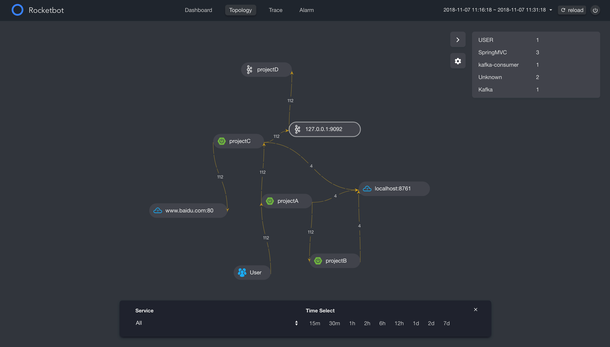
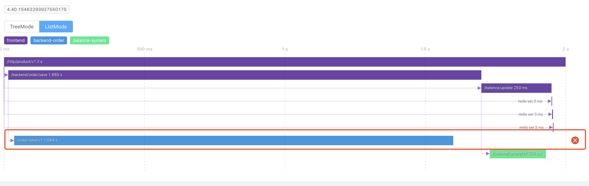
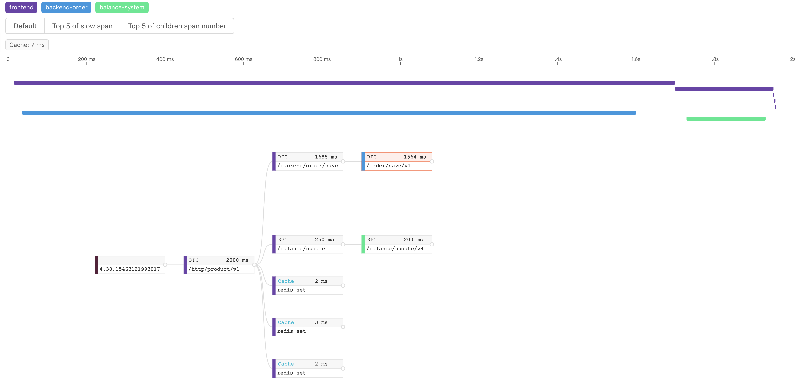
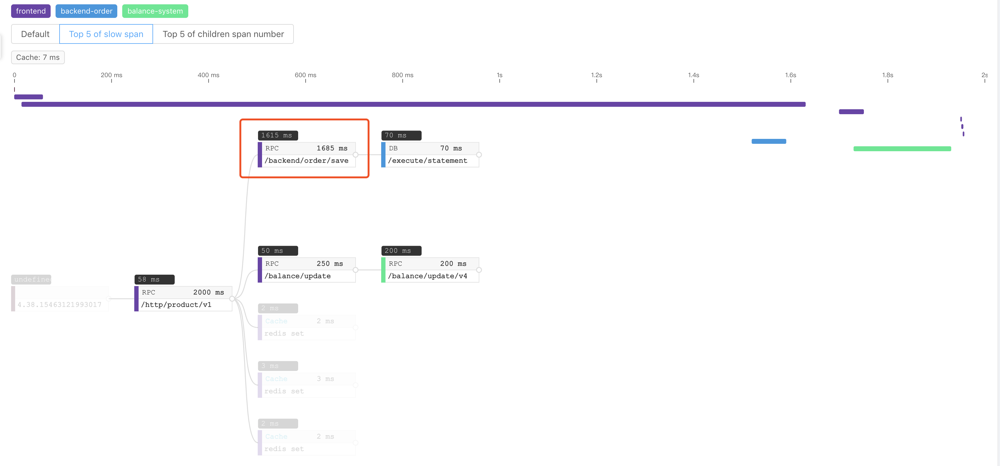
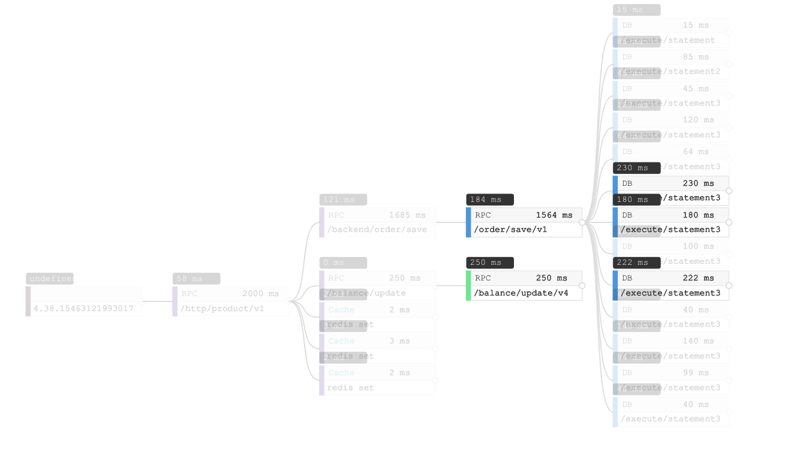
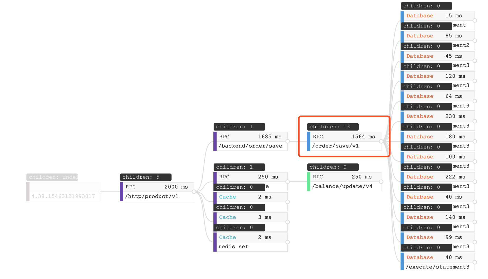
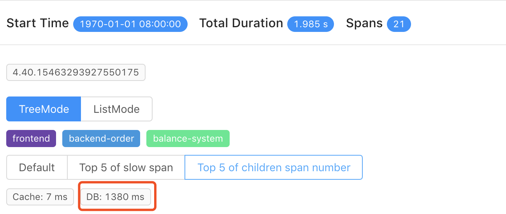
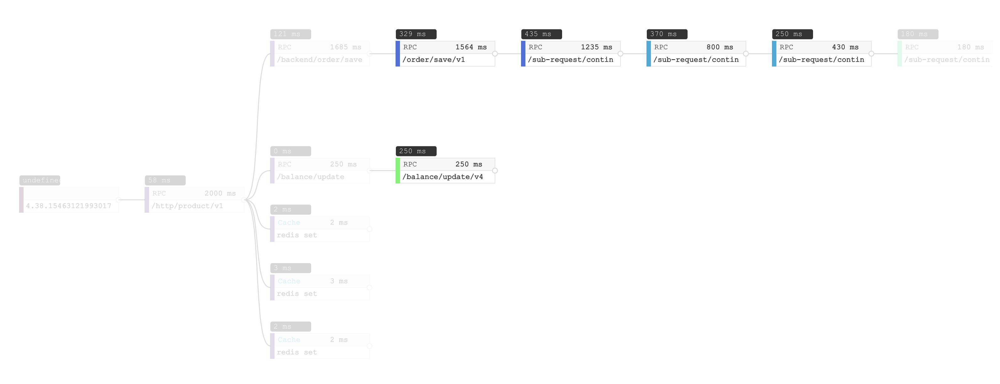

## Background

Distributed tracing is a necessary part of modern microservices architecture, but how to understand or use distributed tracing data is unclear to some end users. This blog overviews typical distributed tracing use cases with new visualization features in SkyWalking v6. We hope new users will understand more through these examples.

## Metric and topology

Trace data underpins in two well known analysis features: **metric** and **topology**

**Metric** of each service, service instance, endpoint are derived from entry spans in trace. Metrics represent response time performance. So, you could have average response time, 99% response time, success rate, etc. These are broken down by service, service instance, endpoint.

**Topology** represents links between services and is distributed tracing's most attractive feature. Topologies allows all users to understand distributed service relationships and dependencies even when they are varied or complex. This is important as it brings a single view to all interested parties, regardless of if they are a developer, designer or operator.

Here's an example topology of 4 projects, including Kafka and two outside dependencies.

Topology in SkyWalking optional UI, RocketBot

## Trace

In a distributed tracing system, we spend a lot of resources(CPU, Memory, Disk and Network) to generate, transport and persistent trace data. Let's try to answer why we do this? What are the typical diagnosis and system performance questions we can answer with trace data?

SkyWalking v6 includes two trace views:
1. TreeMode: The first time provided. Help you easier to identify issues.
1. ListMode: Traditional view in time line, also usually seen in other tracing system, such as Zipkin.

### Error occurred

In the trace view, the easiest part is locating the error, possibly caused by a code exception or network fault. Both ListMode and TreeMode can identify errors, while the span detail screen provides details.

ListMode error span

TreeMode error span

### Slow span

A high priority feature is identifying the slowest spans in a trace. This uses execution duration captured by application agents. In the old ListMode trace view, parent span almost always includes the child span's duration, due to nesting. In other words, a slow span usually causes its parent to also become slow. In SkyWalking 6, we provide `Top 5 of slow span` filter to help you locate the spans directly.

Top 5 slow span

The above screenshot highlights the top 5 slow spans, excluding child span duration. Also, this shows all spans' execution time, which helps identify the slowest ones.

### Too many child spans

In some cases, individual durations are quick, but the trace is still slow, like this one:

Trace with no slow span

To understand if the root problem is related to too many operations, use `Top 5 of children span number`. This filter shows the amount of children each span has, highlighting the top 5.

13 database accesses of a span

In this screenshot, there is a span with 13 children, which are all Database accesses. Also, when you see overview of trace, database cost 1380ms of this 2000ms trace.

1380ms database accesses

In this example, the root cause is too many database accesses. This is also typical in other scenarios like too many RPCs or cache accesses.

### Trace depth
Trace depth is also related latency. Like the [too many child spans](#too-many-child-spans) scenario, each span latency looks good, but the whole trace is slow.

Trace depth

Here, the slowest spans are less than 500ms, which are not too slow for a 2000ms trace. When you see the first line, there are four different colors representing four services involved in this distributed trace. Every one of them costs 100~400ms. For all four, there nearly 2000ms. From here, we know this slow trace is caused by 3 RPCs in a serial sequence.

## At the end

Distributed tracing and APM tools help users identify root causes, allowing development and operation teams to optimize accordingly. We hope you enjoyed this, and love Apache SkyWalking and our new trace visualization. If so, [give us a star on GitHub](https://github.com/apache/incubator-skywalking) to encourage us.

SkyWalking 6 is scheduled to release at the end of January 2019. You can contact the project team through the following channels:
- Follow [SkyWalking twitter](https://twitter.com/ASFSkyWalking)
- Subscribe mailing list: dev@skywalking.apache.org . Send to dev-subscribe@kywalking.apache.org to subscribe the mail list.
- Join [Gitter](https://gitter.im/OpenSkywalking/Lobby) room.
