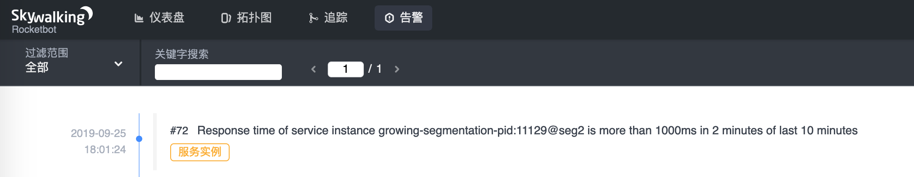
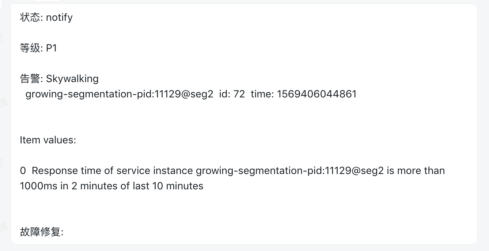

- Author: Wei Qiang
- [GitHub](https://github.com/weiqiang333)

## Background

SkyWalking backend provides the alarm function, we can define some Alarm rules, call webhook after the rule is triggered. I share my implementation


## Demonstration


<p align="center">SkyWalking alarm UI</p>


<p align="center">dingtalk message body</p>


## Introduction

- install
```bash
go get -u github.com/weiqiang333/infra-skywalking-webhook
cd $GOPATH/src/github.com/weiqiang333/infra-skywalking-webhook/
bash build/build.sh
./bin/infra-skywalking-webhook help
```
- Configuration
```yaml
main configs file: configs/production.yml
dingtalk:
  p3: token...
```
- Example
```bash
./bin/infra-skywalking-webhook --config configs/production.yml --address 0.0.0.0:8000
```
- SkyWalking backend alarm settings
```yaml
webhooks:
  - http://127.0.0.1:8000/dingtalk
```


## Collaboration

Hope that we can improve together [webhook](https://github.com/weiqiang333/infra-skywalking-webhook)

SkyWalking alarm rules may add more metric names (eg priority name), we can send different channels by locating different levels of alerts (dingtalk / SMS / phone)

Thanks.
