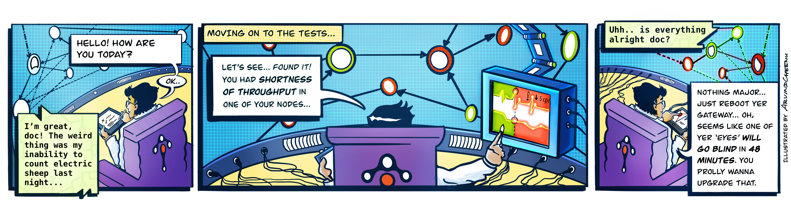

- Author: Srinivasan Ramaswamy, tetrate
- Original link, [Tetrate.io blog](https://www.tetrate.io/blog/the-apdex-score-for-measuring-service-mesh-health/)

## Asking `How are you` is more profound than `What are your symptoms`



### **Background**

Recently I visited my preferred doctor. Whenever I visit, the doctor greets me with a series of light questions: How’s your day? How about the week before? Any recent trips? Did I break my cycling record? How’s your workout regimen? _Finally _he asks, “Do you have any problems?"  On those visits when I didn't feel ok, I would say something like, "_I'm feeling dull this week, and I'm feeling more tired towards noon…."_ It's at this point that he takes out his stethoscope, his pulse oximeter, and blood pressure apparatus. Then, if he feels he needs a more in-depth insight, he starts listing out specific tests to be made.

When I asked him if the first part of the discussion was just an ice-breaker, he said, "_That's the essential part. It helps me find out how you feel, rather than what your symptoms are."_ So, despite appearances, our opening chat about life helped him structure subsequent questions on symptoms, investigations and test results.  

On the way back, I couldn't stop asking myself, _"Shouldn't we be managing our mesh this way, too?"_

If I strike parallels between my own health check and a  health check, “tests” would be log analysis, “investigations” would be tracing, and “symptoms” would be the traditional RED (Rate, Errors and Duration) metrics. That leaves the “essential part,” which is what we are talking about here: the _Wellness Factor_, primarily the health of our mesh.


### **Health in the context of service mesh**

We can measure the performance of any observed service through RED metrics.  RED metrics offer immense value in understanding the performance, reliability, and throughput of every service. Compelling visualizations of these metrics across the mesh make monitoring the entire mesh standardized and scalable. Also, setting alerts based on thresholds for each of these metrics helps to detect anomalies as and when they arise.

To establish the context of any service and observe them, it's ideal to visualize the mesh as a topology. 


A topology visualization of the mesh not only allows for picking any service and watching its metrics, but also gives vital information about service dependencies and the potential impact of a given service on the mesh.

While RED metrics of each service offer tremendous insights, the user is more concerned with the overall responsiveness of the mesh rather than each of these services in isolation.

To describe the performance of any service, right from submitting the request to receiving a completed http response, we’d be measuring the user's perception of responsiveness. This measure of response time compared with a set threshold is called Apdex. This Apdex is an indicator of the health of a service in the mesh.


### **Apdex**

Apdex is a measure of response time considered against a set threshold**.  **It is the ratio of satisfactory response times and unsatisfactory response times to total response times. 

Apdex is an industry standard to measure the satisfaction of users based on the response time of applications and services. It measures how satisfied your users are with your services, as traditional metrics such as average response time could get skewed quickly. 

_Satisfactory response time_ indicates the number of times when the roundtrip response time of a particular service was less than this threshold. _Unsatisfactory response time_ while meaning the opposite, is further categorized as _Tolerating_ and _Frustrating_. _Tolerating_ accommodates any performance that is up to four times the threshold, and anything over that or any errors encountered is considered _Frustrating_. The threshold mentioned here is an ideal roundtrip performance that we expect from any service. We could even start with an organization-wide limit of say, 500ms.

The Apdex score is a ratio of satisfied and tolerating requests to the total requests made. 

Each _satisfied request_ counts as one request, while each *tolerating request* counts as half a  *satisfied request*.

An Apdex score takes values from 0 to 1, with 0 being the worst possible score indicating that users were always frustrated, and ‘1’ as the best possible score (100% of response times were Satisfactory).

A percentage representation of this score also serves as the Health Indicator of the service.


## **The Math**

The actual computation of this Apdex score is achieved through the following formula.

```
		            SatisfiedCount +  ( ToleratingCount / 2 )

Apdex Score  =  ------------------------------------------------------

                                TotalSamples
```

A percentage representation of this score is known as the Health Indicator of a service.


### **Example Computation**

During a 2-minute period, a host handles 200 requests. 

The Apdex threshold T = 0.5 seconds (500ms). 


*   170 of the requests were handled within 500ms, so they are classified as Satisfied.
*   20 of the requests were handled between 500ms and 2 seconds (2000 ms), so they are classified as Tolerating.
*   The remaining 10 were not handled properly or took longer than 2 seconds, so they are classified as Frustrated.

The resulting Apdex score is 0.9:  (170 + (20/2))/200 = 0.9.


### **The next level**

At the next level, we can attempt to improve our topology visualization by coloring nodes based on their health. Also, we can include health as a part of the information we show when the user taps on a service.

Apdex specifications recommend the following Apdex Quality Ratings by classifying Apdex Score as Excellent (0.94 - 1.00), Good (0.85 - 0.93), Fair (0.70 - 0.84), Poor (0.50 - 0.69)  and Unacceptable (0.00 - 0.49).

To visualize this, let’s look at our topology using traffic light colors, marking our  nodes as  Healthy,  At-Risk and  Unhealthy, where **Unhealthy** indicates health that falls below 80%. A rate between 80% and 95% indicates **At-Risk**, and health at 95% and above is termed **Healthy**. 

Let’s incorporate this coloring into our topology visualization and take its usability to the next level. If implemented, we will be looking at something like this.


### **Moving further**

Apdex provides tremendous visibility into customer satisfaction on the responsiveness of our services. Even more, by extending the implementation to the edges calling this service we get further insight into the health of the mesh itself. 

Two services with similar Apdex scores offer the same customer satisfaction to the customer. However, the size of traffic that flows into the service can be of immense help in prioritizing between services to address. A service with higher traffic flow is an indication that this experience is impacting a significant number of users on the mesh.

While health relates to a service, we can also analyze the interactions between two services and calculate the health of the interaction. This health calculation of every interaction on the mesh helps us establish a critical path, based on the health of all interactions in the entire topology.

In a big mesh, showing traffic as yet another number will make it more challenging to visualize and monitor. We can, with a bit of creativity, improve the entire visualization by rendering the edges that connect services with different thickness depending on the throughput of the service.

An unhealthy service participating in a high throughput transaction could lead to excessive consumption of resources. On the other hand, this visualization also offers a great tip to maximize investment in tuning services. 

Tuning service that is a part of a high throughput transaction offers exponential benefits when compared to tuning an occasionally used service.

If we look at implementing such a visualization, which includes the health of interactions and throughput of such interactions, we would be looking at something like below : 


### **The day is not far**

These capabilities are already available to users **today** as one of the UI features of Tetrate’s service mesh platform, using the highly configurable and performant observability and performance management framework: Apache SkyWalking ([https://skywalking.apache.org](https://skywalking.apache.org/)), which monitors traffic across the mesh, aggregates RED metrics for both services and their interactions, continuously computes and monitors health of the services, and enables users to configure alerts and notifications when services cross specific thresholds, thereby having a comprehensive health visibility of the mesh.

With such tremendous visibility into our mesh performance, the day is not far when we at our NOC (Network Operations Center) for the mesh have this topology as our HUD (Heads Up Display).

This HUD, with the insights and patterns gathered over time, would predict situations and proactively prompt us on potential focus areas to improve customer satisfaction.

The visualization with rich historical data can also empower the Network Engineers to go back in time and look at the performance of the mesh on a similar day in the past.

An earnest implementation of such a visualization would be something like below : 


### **To conclude**

With all the discussion so far, the health of a mesh is more about how our users feel, and what we can proactively do as service providers to sustain, if not enhance, the experience of our users. 

As the world advances toward personalized medicine, we're not far from a day when my doctor will text me: "How about feasting yourself with ice cream today and take the Gray Butte Trail to Mount Shasta!" Likewise, we can do more for our customers by having better insight into their overall wellness.

Tetrate’s approach to “service mesh health” is not only to offer management, monitoring and support but to make infrastructure healthy from the start to reduce the probability of incidents.  Powered by the Istio, Envoy, and SkyWalking, Tetrate's solutions enable consistent end-to-end observability, runtime security, and traffic management for any workload in any environment.

Our customers deserve healthy systems! Please do share your thoughts on making service mesh an exciting and robust experience for our customers.

### **References**

- [https://en.wikipedia.org/wiki/Apdex](https://en.wikipedia.org/wiki/Apdex)
- [https://www.apdex.org/overview.html](https://www.apdex.org/overview.html)
- [https://www.apdex.org/index.php/specifications/](https://www.apdex.org/index.php/specifications/)
- [https://skywalking.apache.org/](https://skywalking.apache.org/)
