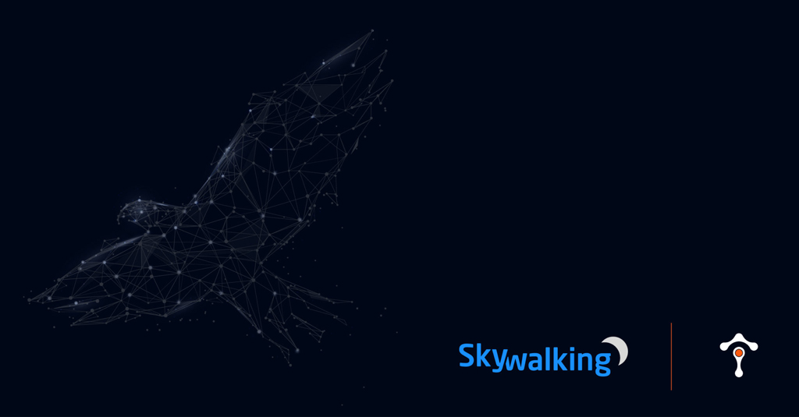
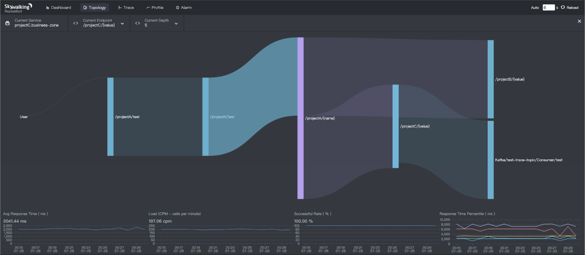
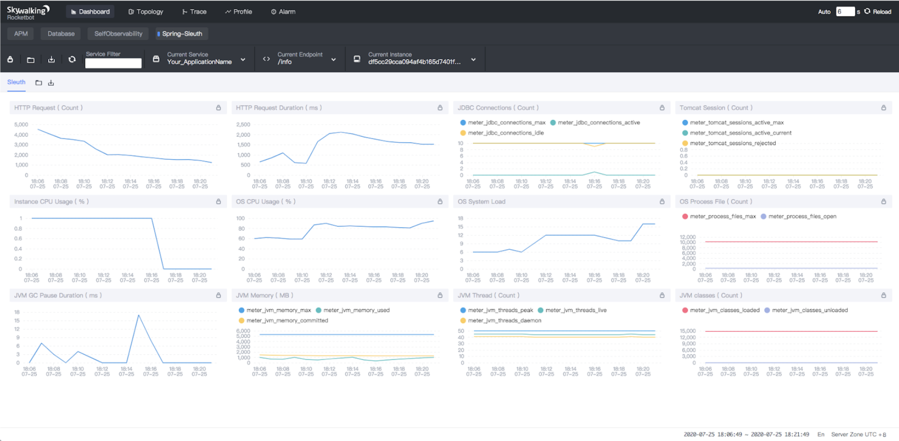

- Author: Sheng Wu, Hongtao Gao, and Tevah Platt(Tetrate)
- Original link, [Tetrate.io blog](https://www.tetrate.io/blog/skywalking8-1-release/)

Apache SkyWalking, the observability platform, and open-source application performance monitor (APM) project, today announced the general availability of its 8.1 release that extends its functionalities and provides a transport layer to maintain the lightweight of the platform that observes data continuously.

## Background

SkyWalking is an observability platform and APM tool that works with or without a service mesh, providing automatic instrumentation for microservices, cloud-native and container-based applications. The top-level Apache project is supported by a global community and is used by Alibaba, Huawei, Tencent, Baidu, and scores of others. 

## Transport traces

For a long time, SkyWalking has used gRPC and HTTP to transport traces, metrics, and logs. They provide good performance and are quite lightweight, but people kept asking about the MQ as a transport layer because they want to keep the observability data continuously as much as possible. From SkyWalking’s perspective, the MQ based transport layer consumes more resources required in the deployment and the complexity of deployment and maintenance but brings more powerful throughput capacity between the agent and backend. 

In 8.1.0, SkyWalking officially provides the typical MQ implementation, Kafka, to transport all observability data, including traces, metrics, logs, and profiling data. At the same time, the backend can support traditional gRPC and HTTP receivers, with the new Kafka consumer at the same time. Different users could choose the transport layer(s) according to their own requirements. Also, by referring to this [implementation](https://github.com/apache/skywalking/pull/4847), the community could contribute various transport plugins for Apache Pulsar, RabbitMQ.

## Automatic endpoint dependencies detection

The 8.1 SkyWalking release offers automatic detection of endpoint dependencies. SkyWalking has long offered automatic endpoint detection, but endpoint dependencies, including upstream and downstream endpoints, are critical for Ops and SRE teams’ performance analysis. The APM system is expected to detect the relationships powered by the distributed tracing. While SkyWalking has been designed to include this important information at the beginning the latest 8.1 release offers a cool visualization about the dependency and metrics between dependent endpoints. It provides a new drill-down angle from the topology. Once you have the performance issue from the service level, you could check on instance and endpoint perspectives:

## SpringSleuth metrics detection

In the Java field, the Spring ecosystem is one of the most widely used. [Micrometer](https://micrometer.io/), the metrics API lib included in the Spring Boot 2.0, is now adopted by SkyWalking’s native meter system APIs and agent. For applications using Micrometer with the SkyWalking agent installed, all Micrometer collected metrics could then be shipped into SkyWalking OAP. With [some configurations in the OAP and UI](https://github.com/apache/skywalking/blob/master/docs/en/setup/backend/spring-sleuth-setup.md), all metrics are analyzed and visualized in the SkyWalking UI, with all other metrics detected by SkyWalking agents automatically.

## Notable enhancements 

The Java agent core is enhanced in this release. It could work better in the concurrency class loader case and is more compatible with another agent solution, such as Alibaba’s Arthas.

1. With the logic endpoint supported, the local span can be analyzed to get metrics. One span could carry the raw data of more than one endpoint’s performance.
1. GraphQL, InfluxDB Java Client, and Quasar fiber libs are supported to be observed automatically.
1. Kubernetes Configmap can now for the first time be used as the dynamic configuration center– a more cloud-native solution for k8s deployment environments.
1. OAP supports health checks, especially including the storage health status. If the storage (e.g., ElasticSearch) is not available, you could get the unhealth status with explicit reasons through the health status query.
1. Opencensus receiver supports ingesting OpenTelemetry/OpenCensus agent metrics by meter-system. 

## Additional resources

- Read more about the [SkyWalking 8.1 release highlights](https://github.com/apache/skywalking/blob/v8.1.0/CHANGES.md).
- Read more about SkyWalking from Tetrate on our [blog](https://www.tetrate.io/blog/category/open-source/apache-skywalking/).
- Get more SkyWalking updates on [Twitter](https://twitter.com/ASFSkyWalking).
- Sign up to hear more about SkyWalking and observability from [Tetrate](https://www.tetrate.io/contact-us/).
