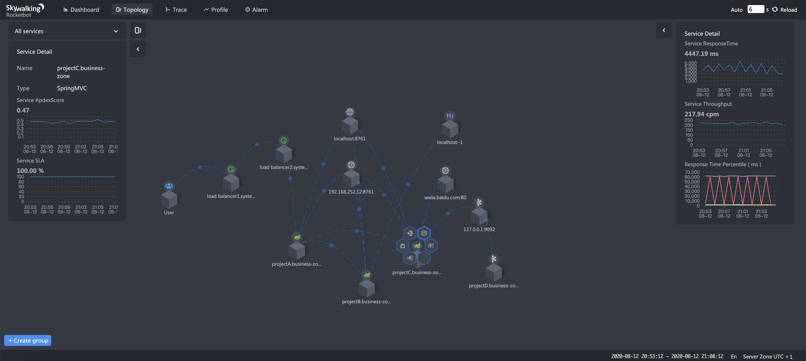
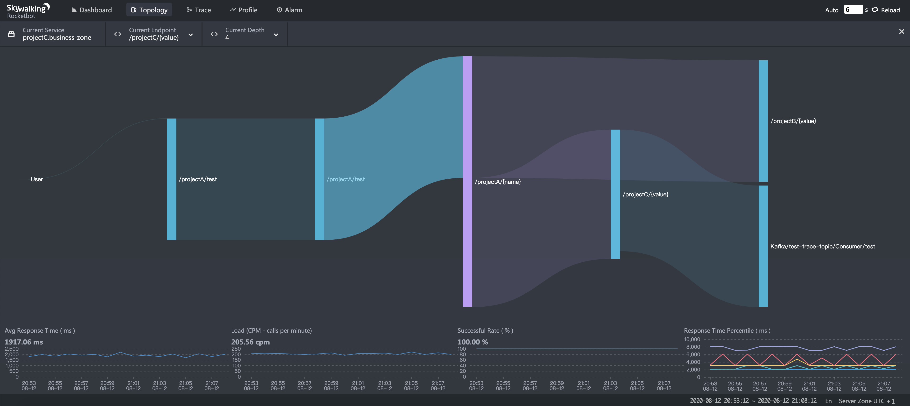

- Author: Sheng Wu
- Original link, [Tetrate.io blog](https://www.tetrate.io/blog/observability-at-scale-skywalking-it-is/)

SkyWalking, a top-level Apache project, is the open source APM and observability analysis platform that is solving the problems of 21st-century systems that are increasingly large, distributed, and heterogenous. It's built for the struggles system admins face today: To identify and locate needles in a haystack of interdependent services, to get apples-to-apples metrics across polyglot apps, and to get a complete and meaningful view of performance.

SkyWalking is a holistic platform that can observe microservices on or off a mesh, and can provide consistent monitoring with a lightweight payload.

Let's take a look at how SkyWalking evolved to address the problem of observability at scale, and grew from a pure tracing system to a feature-rich observability platform that is now used to analyze deployments that collect tens of billions of traces per day.

### Designing for scale

When SkyWalking was first initialized back in 2015, its primary use case was monitoring the first-generation distributed core system of China Top Telecom companies, China Unicom and China Mobile. In 2013-2014, the telecom companies planned to replace their old traditional monolithic applications with a distributed system. Supporting a super-large distributed system and scaleablity were the high-priority design goals from Day one. So, what matters at scale?

### Pull vs. push

Pull and push modes relate to the direction of data flow. If the agent collects data and pushes them to the backend for further analysis, we call it "push" mode. Debate over pull vs. push has gone on for a long time. The key for an observability system is to minimize the cost of the agent, and to be generally suitable for different kinds of observability data.

The agent would send the data out a short period after it is collected. Then, we would have less concern about overloading the local cache. One typical case would be endpoint (URI of HTTP, service of gRPC) metrics. Any service could easily have hundreds, even thousands of endpoints. An APM system must have these metrics analysis capabilities.

Furthermore, metrics aren't the only thing in the observability landscape; traces and logs are important too. SkyWalking is designed to provide a 100% sampling rate tracing capability in the production environment. Clearly, push mode is the only solution.

At the same time, using push mode natively doesn't mean SkyWalking can't do data pulling. In recent 8.x releases, SkyWalking supports fetching data from Prometheus-instrumented services for reducing the Non-Recurring Engineering of the end users. Also, pull mode is popular in the MQ based transport, typically as a Kafka consumer. The SkyWalking agent side uses the push mode, and the OAP server uses the pull mode.

The conclusion: push mode is the native way, but pull mode works in some special cases too.

### Metrics analysis isn't just mathematical calculation

Metrics rely on mathematical theories and calculations. Percentile is a good measure for identifying the long tail issue, and reasonable average response time and successful rate are good SLO(s). But those are not all. Distributed tracing provides not just traces with detailed information, but high values metrics that can be analyzed.

The service topology map is required from Ops and SRE teams for the NOC dashboard and confirmation of system data flow. SkyWalking uses the [STAM (Streaming Topology Analysis Method)](https://wu-sheng.github.io/STAM/) to analyze topology from the traces, or based on ALS (Envoy Access Log Service) in the service mesh environment. This topology and metrics of nodes (services) and lines (service relationships) can't be pulled from simple metrics SDKs.

As with fixing the limitation of endpoint metrics collection, SkyWalking needs to do endpoint dependency analysis from trace data too. Endpoint dependency analysis provides more important and specific information, including upstream and downstream. Those dependency relationships and metrics help the developer team to locate the boundaries of a performance issue, to specific code blocks.

### Pre-calculation vs. query stage calculation?

Query stage calculation provides flexibility. Pre-calculation, in the analysis stage, provides better and much more stable performance. Recall our design principle: SkyWalking targets a large-scale distributed system. Query stage calculation was very limited in scope, and most metrics calculations need to be pre-defined and pre-calculated. The key of supporting large datasets is reducing the size of datasets in the design level. Pre-calculation allows the original data to be merged into aggregated results downstream, to be used in a query or even for an alert check.

TTL of metrics is another important business enabler. With the near linear performance offered by queries because of pre-calculation, with a similar query infrastructure, organizations can offer higher TTL, thereby providing extended visibility of performance.

Speaking of alerts, query-stage calculation also means the alerting query is required to be based on the query engine. But in this case, when the dataset increasing, the query performance could be inconsistent. The same thing happens in a different metrics query.

### Cases today

Today, SkyWalking is monitoring super large-scale distributed systems in many large enterprises, including Alibaba, Huawei, Tencent, Baidu, China Telecom, and various banks and insurance companies. The online service companies have more traffic than the traditional companies, like banks and telecom suppliers.

SkyWalking is the observability platform used for a variety of use cases for distributed systems that are super-large by many measures:

*   Lagou.com, an online job recruitment platform
    *   SkyWalking is observing >100 services, 500+ JVM instances
    *   SkyWalking collects and analyzes 4+ billion traces per day to analyze performance data, including metrics of 300k+ endpoints and dependencies
    *   Monitoring >50k traffic per second in the whole cluster
*   Yonghui SuperMarket, online service
    *   SkyWalking analyzes at least 10+ billion (3B) traces with metrics per day
    *   SkyWalking's second, smaller deployment, analyzes 200+ million traces per day
*   Baidu, internet and AI company, Kubernetes deployment
    *   SkyWalking collects 1T+ traces a day from 1,400+ pods of 120+ services
    *   Continues to scale out as more services are added
*   Beike Zhaofang(ke.com), a Chinese online property brokerage backed by Tencent Holdings and SoftBank Group
    *   Has used SkyWalking from its very beginning, and has two members in the PMC team. 
    *   Deployments collect 16+ billion traces per day
*   Ali Yunxiao, DevOps service on the Alibaba Cloud,
    *   SkyWalking collects and analyzes billions of spans per day
    *   SkyWalking keeps AliCloud's 45 services and ~300 instances stable
*   A department of Alibaba TMall, one of the largest business-to-consumer online retailers, spun off from Taobao
    *   A customized version of SkyWalking monitors billions of traces per day
    *   At the same time, they are building a load testing platform based on SkyWalking's agent tech stack, leveraging its tracing and context propagation cabilities

### Conclusion

SkyWalking's approach to observability follows these principles:

1.  Understand the logic model: don't treat observability as a mathematical tool. 
2.  Identify dependencies first, then their metrics.
3.  Scaling should be accomplished easily and natively.
4.  Maintain consistency across different architectures, and in the performance of APM itself.

### Resources

*   Read about the [SkyWalking 8.1 release highlights](https://github.com/apache/skywalking/blob/master/CHANGES.md).
*   Get more SkyWalking updates on [Twitter](https://twitter.com/asfskywalking?lang=en).
*   Sign up to hear more about SkyWalking and observability from [Tetrate](https://www.tetrate.io/contact-us/).
