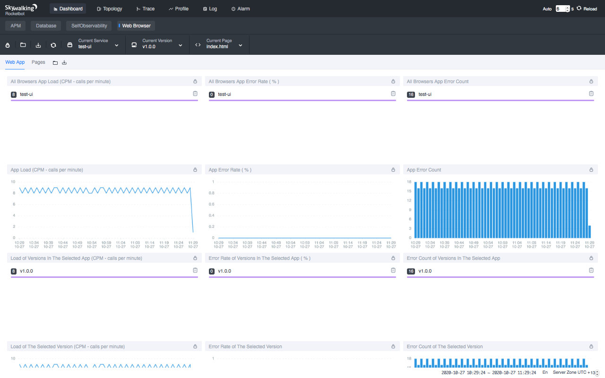

- Author: Zhenxu Ke, Sheng Wu, Hongtao Gao, and Tevah Platt. tetrate.io
- Original link, [Tetrate.io blog](https://tetrate.io/blog/whats-new-with-apache-skywalking-8-2-browser-monitoring-and-more/)
- Oct. 29th, 2020

Apache SkyWalking, the observability platform, and open-source application performance monitor (APM) project, today announced the general availability of its 8.2 release. The release extends Apache SkyWalking’s functionalities and monitoring boundary to the browser side.

## Background

SkyWalking is an observability platform and APM tool that works with or without a service mesh, providing automatic instrumentation for microservices, cloud-native and container-based applications. The top-level Apache project is supported by a global community and is used by Alibaba, Huawei, Tencent, Baidu, ByteDance, and scores of others.

## Browser side monitoring

APM helps SRE and Engineering teams to diagnose system failures, or optimize the systems before they become intolerably slow. But is it enough to always make the users happy?

In 8.2.0, SkyWalking extends its monitoring boundary to the browser side, e.g., Chrome, or the network between Chrome and the backend service, or the codes running in the browser. With this, not only can we monitor the backend services and requests sent by the browser as usual, but also the front end rendering speed, error logs, etc., which are the most efficient metrics for capturing the experiences of our end users. (This does not currently extend to IoT devices, but this feature moves SkyWalking a step in that direction).

What's more, SkyWalking browser monitoring also provides data about how the users use products, such as PV(page views), UV(unique visitors), top N PV(page views), etc., which can give a product team clues for optimizing their products.

## Query traces by tags

In SkyWalking's Span data model, there are many important fields that are already indexed and can be queried by the users, but for the sake of performance, querying by Span tags was not supported until now. In SkyWalking 8.2.0, we allow users to query traces by specified tags, which is extremely useful. For example, SRE engineers running tests on the product environment can tag the synthetic traffic and query by this tag later.

## Meter Analysis Language

In 8.2.0, the meter system provides a functional analysis language called MAL(Meter Analysis Language) that allows users to analyze and aggregate meter data in the OAP streaming system. The result of an expression can be ingested by either the agent analyzer or OpenTelemetry/Prometheus analyzer.

## Composite Alert Rules

Alerting is a good way to discover system failures in time. A common problem is that we configure too many triggers just to avoid missing any possible issue. Nobody likes to be woken up by alert messages at midnight, only to find out that the trigger is too sensitive. These kinds of alerts become noisy and don't help at all.

In 8.2.0, users can now configure composite alert rules, where composite rules take multiple metrics dimensions into account. With composite alert rules, we can leverage as many metrics as needed to more accurately determine whether there’s a real problem or just an occasional glitch.

Common scenarios like `successful rate < 90% but there are only 1~2 requests` can now be resolved by a composite rule, such as `traffic(calls per minute) > n && successful rate < m%`.

## Other Notable Enhancements 

1.  The agent toolkit exposes some APIs for users to send customizable metrics.
1.  The agent `exclude_plugins` allows you to exclude some plugins; `mount` enables you to load a new set of plugins.
1.  More than 10 new plugins have been contributed to the agent.
1.  The alert system natively supports sending alert messages to Slack, WeChat, DingTalk.

## Additional Resources

- Read more about the [SkyWalking 8.2 release highlights](https://github.com/apache/skywalking/blob/v8.2.0/CHANGES.md).
- Get more SkyWalking updates on [Twitter](https://twitter.com/ASFSkyWalking).

