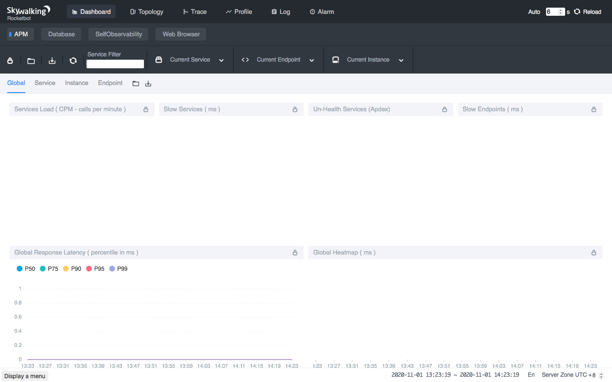

- Author: Zhenxu Ke, Sheng Wu, and Tevah Platt. tetrate.io
- Original link, [Tetrate.io blog](https://www.tetrate.io/blog/observe-service-mesh-with-skywalking-and-envoy-access-log-service/)
- Dec. 03th, 2020

[Apache SkyWalking](https://github.com/apache/skywalking): an APM (application performance monitor) system, especially designed for microservices, cloud native, and container-based (Docker, Kubernetes, Mesos) architectures.

[Envoy Access Log Service](https://www.envoyproxy.io/docs/envoy/latest/api-v2/service/accesslog/v2/als.proto): Access Log Service (ALS) is an Envoy extension that emits detailed access logs of all requests going through Envoy.

## Background
Apache SkyWalking has long supported observability in service mesh with Istio Mixer adapter. But since v1.5, Istio began to deprecate Mixer due to its poor performance in large scale clusters. Mixer’s functionalities have been moved into the Envoy proxies, and is supported only through the 1.7 Istio release. 
On the other hand, [Sheng Wu](https://github.com/wu-sheng) and [Lizan Zhou](https://github.com/lizan) presented a better solution based on the Apache SkyWalking and Envoy ALS on [KubeCon China 2019](https://kccncosschn19eng.sched.com/event/NroB/observability-in-service-mesh-powered-by-envoy-and-apache-skywalking-sheng-wu-lizan-zhou-tetrate),  to reduce the performance impact brought by Mixer, while retaining the same observability in service mesh. This solution was initially implemented by Sheng Wu, [Hongtao Gao](https://github.com/hanahmily), Lizan Zhou, and [Dhi Aurrahman](https://github.com/dio) at Tetrate.io.
If you are looking for a more efficient solution to observe your service mesh instead of using a Mixer-based solution, this is exactly what you need. In this tutorial, we will explain a little bit how the new solution works, and apply it to the bookinfo application in practice.

## How it works
From a perspective of observability, Envoy can be typically deployed in 2 modes, sidecar, and router. As a sidecar, Envoy mostly represents a single service to receive and send requests (2 and 3 in the picture below). While as a proxy, Envoy may represent many services (1 in the picture below).


In both modes, the logs emitted by ALS include a node identifier. The identifier starts with `router~` (or `ingress~`) in router mode and `sidecar~` in sidecar proxy mode.

Apart from the node identifier, there are [several noteworthy properties in the access logs](https://github.com/envoyproxy/envoy/blob/549164c42cae84b59154ca4c36009e408aa10b52/generated_api_shadow/envoy/data/accesslog/v2/accesslog.proto) that will be used in this solution:

- `downstream_direct_remote_address`: This field is the downstream direct remote address on which the request from the user was received. Note: This is always the physical peer, even if the remote address is inferred from for example the `x-forwarded-for` header, proxy protocol, etc.

- `downstream_remote_address`: The remote/origin address on which the request from the user was received.

- `downstream_local_address`: The local/destination address on which the request from the user was received.

- `upstream_remote_address`: The upstream remote/destination address that handles this exchange.

- `upstream_local_address`: The upstream local/origin address that handles this exchange.

- `upstream_cluster`: The upstream cluster that *upstream_remote_address* belongs to.

We will discuss more about the properties in the following sections.

### Sidecar
When serving as a sidecar, Envoy is deployed alongside a service, and delegates all the incoming/outgoing requests to/from the service.

1. **Delegating incoming requests:** in this case, Envoy acts as a server side sidecar, and sets the `upstream_cluster` in form of `inbound|portNumber|portName|Hostname[or]SidecarScopeID`.

    

    The SkyWalking analyzer checks whether either `downstream_remote_address` can be mapped to a Kubernetes service: 
    
    a. If there is a service (say `Service B`) whose implementation is running in this IP(and port), then we have a service-to-service relation, `Service B -> Service A`, which can be used to build the topology. Together with the `start_time` and `duration` fields in the access log, we have the latency metrics now.
  
    b. If there is no service that can be mapped to `downstream_remote_address`, then the request may come from a service out of the mesh. Since SkyWalking cannot identify the source service where the requests come from, it simply generates the metrics without source service, according to the [topology analysis method](https://wu-sheng.github.io/STAM/). The topology can be built as accurately as possible, and the metrics detected from server side are still correct.

 
2. **Delegating outgoing requests:** in this case, Envoy acts as a client-side sidecar, and sets the `upstream_cluster` in form of `outbound|<port>|<subset>|<serviceFQDN>`.

    

    Client side detection is relatively simpler than (1. Delegating incoming requests). If `upstream_remote_address` is another sidecar or proxy, we simply get the mapped service name and generate the topology and metrics. Otherwise, we have no idea what it is and consider it an `UNKNOWN` service. 

### Proxy role
When Envoy is deployed as a proxy, it is an independent service itself and doesn't represent any other service like a sidecar does. Therefore, we can build client-side metrics as well as server-side metrics. 


## Example
In this section, we will use the typical [bookinfo application](https://istio.io/latest/docs/examples/bookinfo/) to demonstrate how  Apache SkyWalking 8.3.0+ (the latest version up to Nov. 30th, 2020) works together with Envoy ALS to observe a service mesh.

### Installing Kubernetes
SkyWalking 8.3.0 supports the Envoy ALS solution under both Kubernetes environment and virtual machines (VM) environment, in this tutorial, we’ll only focus on the Kubernetes scenario, for VM solution, please stay tuned for our next blog, so we need to install Kubernetes before taking further steps.

In this tutorial, we will use the [Minikube](https://minikube.sigs.k8s.io/docs/) tool to quickly set up a local Kubernetes(v1.17) cluster for testing. In order to run all the needed components, including the bookinfo application, the SkyWalking OAP and WebUI, the cluster may need up to 4GB RAM and 2 CPU cores.

```shell
minikube start --memory=4096 --cpus=2
```

Next, run `kubectl get pods --namespace=kube-system --watch` to check whether all the Kubernetes components are ready. If not, wait for the readiness before going on.

### Installing Istio
Istio provides a very convenient way to configure the Envoy proxy and enable the access log service. The built-in configuration profiles free us from lots of manual operations. So, for demonstration purposes, we will use Istio through this tutorial.

```shell
export ISTIO_VERSION=1.7.1
curl -L https://istio.io/downloadIstio | sh - 
sudo mv $PWD/istio-$ISTIO_VERSION/bin/istioctl /usr/local/bin/
istioctl  install --set profile=demo
kubectl label namespace default istio-injection=enabled
```

Run `kubectl get pods --namespace=istio-system --watch` to check whether all the Istio components are ready. If not, wait for the readiness before going on.

### Enabling ALS
The `demo` profile doesn’t enable ALS by default. We need to reconfigure it to enable ALS via some configuration.

```shell
istioctl  manifest install \
               --set meshConfig.enableEnvoyAccessLogService=true \
               --set meshConfig.defaultConfig.envoyAccessLogService.address=skywalking-oap.istio-system:11800
```

The example command `--set meshConfig.enableEnvoyAccessLogService=true` enables the Envoy access log service in the mesh. And as we said earlier, ALS is essentially a gRPC service that emits requests logs. The config `meshConfig.defaultConfig.envoyAccessLogService.address=skywalking-oap.istio-system:11800` tells this gRPC service  where to emit the logs, say `skywalking-oap.istio-system:11800`, where we will deploy the SkyWalking ALS receiver later.

NOTE:
You can also enable the ALS when installing Istio so that you don’t need to restart Istio after installation:

```shell
istioctl install --set profile=demo \
               --set meshConfig.enableEnvoyAccessLogService=true \
               --set meshConfig.defaultConfig.envoyAccessLogService.address=skywalking-oap.istio-system:11800
kubectl label namespace default istio-injection=enabled
```

### Deploying Apache SkyWalking
The SkyWalking community provides a [Helm](https://helm.sh) Chart to make it easier to deploy SkyWalking and its dependent services in Kubernetes. The Helm Chart can be found at the [GitHub repository](https://github.com/apache/skywalking-kubernetes).

```shell
# Install Helm
curl -sSLO https://get.helm.sh/helm-v3.0.0-linux-amd64.tar.gz
sudo tar xz -C /usr/local/bin --strip-components=1 linux-amd64/helm -f helm-v3.0.0-linux-amd64.tar.gz
# Clone SkyWalking Helm Chart
git clone https://github.com/apache/skywalking-kubernetes
cd skywalking-kubernetes/chart
git reset --hard dd749f25913830c47a97430618cefc4167612e75
# Update dependencies
helm dep up skywalking
# Deploy SkyWalking
helm -n istio-system install skywalking skywalking \
               --set oap.storageType='h2'\
               --set ui.image.tag=8.3.0 \
               --set oap.image.tag=8.3.0-es7 \
               --set oap.replicas=1 \
               --set oap.env.SW_ENVOY_METRIC_ALS_HTTP_ANALYSIS=k8s-mesh \
               --set oap.env.JAVA_OPTS='-Dmode=' \
               --set oap.envoy.als.enabled=true \
               --set elasticsearch.enabled=false
```

We deploy SkyWalking to the namespace `istio-system`, so that SkyWalking OAP service can be accessed by `skywalking-oap.istio-system:11800`, to which we told ALS to emit their logs, in the previous step.

We also enable the ALS analyzer in the SkyWalking OAP: `oap.env.SW_ENVOY_METRIC_ALS_HTTP_ANALYSIS=k8s-mesh`. The analyzer parses the access logs and maps the IP addresses in the logs to the real service names in the Kubernetes, to build a topology.

In order to retrieve the metadata (such as Pod IP and service names) from a Kubernetes cluster for IP mappings, we also set `oap.envoy.als.enabled=true`, to apply for a `ClusterRole` that has access to the metadata.

```shell
export POD_NAME=$(kubectl get pods -A -l "app=skywalking,release=skywalking,component=ui" -o name)
echo $POD_NAME
kubectl -n istio-system port-forward $POD_NAME 8080:8080
```

Now navigate your browser to http://localhost:8080 . You should be able to see the SkyWalking dashboard. The dashboard is empty for now, but after we deploy the demo application and generate traffic, it should be filled up later.



### Deploying Bookinfo application
Run:

```shell
export ISTIO_VERSION=1.7.1
kubectl apply -f https://raw.githubusercontent.com/istio/istio/$ISTIO_VERSION/samples/bookinfo/platform/kube/bookinfo.yaml
kubectl apply -f https://raw.githubusercontent.com/istio/istio/$ISTIO_VERSION/samples/bookinfo/networking/bookinfo-gateway.yaml
kubectl wait --for=condition=Ready pods --all --timeout=1200s
minikube tunnel
```
Then navigate your browser to http://localhost/productpage. You should be able to see the typical bookinfo application. Refresh the webpage several times to generate enough access logs. 

### Done!
And you’re all done! Check out the SkyWalking WebUI again. You should see the topology of the bookinfo application, as well the metrics of each individual service of the bookinfo application.


### Troubleshooting
- Check all pods status: `kubectl get pods -A`.
- SkyWalking OAP logs: `kubectl -n istio-system logs -f $(kubectl get pod -A -l "app=skywalking,release=skywalking,component=oap" -o name)`.
- SkyWalking WebUI logs: `kubectl -n istio-system logs -f $(kubectl get pod -A -l "app=skywalking,release=skywalking,component=ui" -o name)`.
- Make sure the time zone at the bottom-right of the WebUI is set to `UTC +0`.

## Customizing Service Names
The SkyWalking community brought more improvements to the ALS solution in the 8.3.0 version. You can decide how to compose the service names when mapping from the IP addresses, with variables `service` and `pod`. For instance, configuring `K8S_SERVICE_NAME_RULE` to the expression `${service.metadata.name}-${pod.metadata.labels.version}` gets service names with version label such as `reviews-v1`, `reviews-v2`, and `reviews-v3`, instead of a single service `reviews`, see [the PR](https://github.com/apache/skywalking/pull/5722).

## Working ALS with VM
Kubernetes is popular, but what about VMs? From what we discussed above, in order to map the IPs to services, SkyWalking needs access to the Kubernetes cluster, fetching service metadata and Pod IPs. But in a VM environment, there is no source from which we can fetch those metadata.
In the next post, we will introduce another ALS analyzer based on the Envoy metadata exchange mechanism. With this analyzer, you are able to observe a service mesh in the VM environment. Stay tuned!
If you want to  have commercial support for the ALS solution or hybrid mesh observability, [Tetrate Service Bridge, TSB](https://www.tetrate.io/tetrate-service-bridge/) is another good option out there.

## Additional Resources
- KubeCon 2019 Recorded [Video](https://www.youtube.com/watch?v=tERm39ju9ew). 
- Get more SkyWalking updates on [the official website](https://skywalking.apache.org).

_Apache SkyWalking founder Sheng Wu, SkyWalking core maintainer Zhenxu Ke are Tetrate engineers, and Tevah Platt is a content writer for Tetrate. Tetrate helps organizations adopt open source service mesh tools, including Istio, Envoy, and Apache SkyWalking, so they can manage microservices, run service mesh on any infrastructure, and modernize their applications._
 
