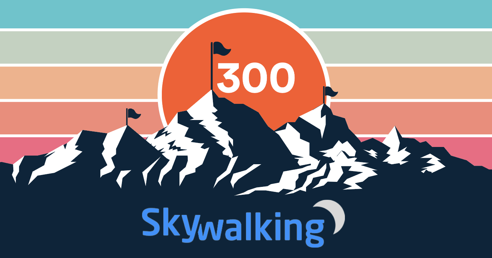
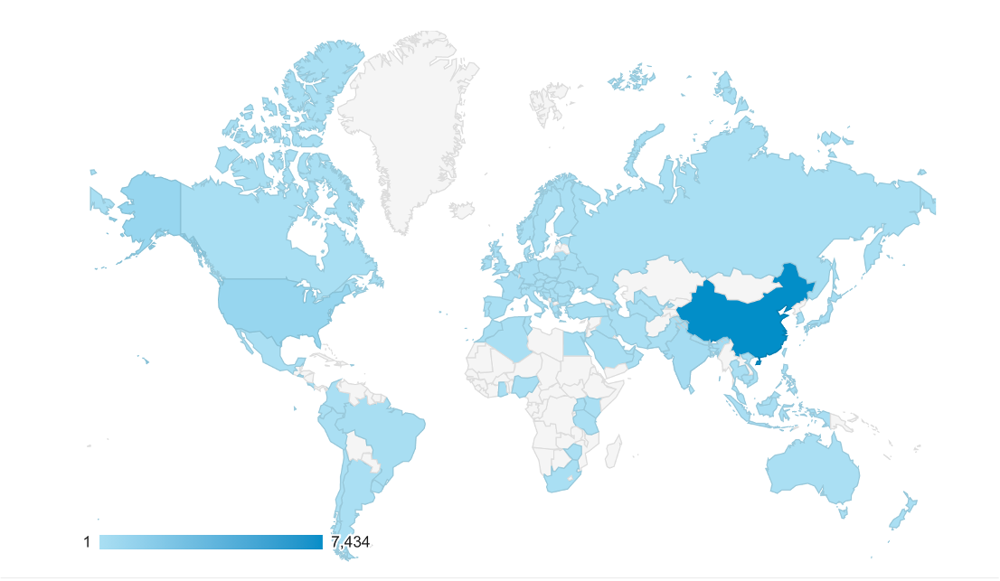
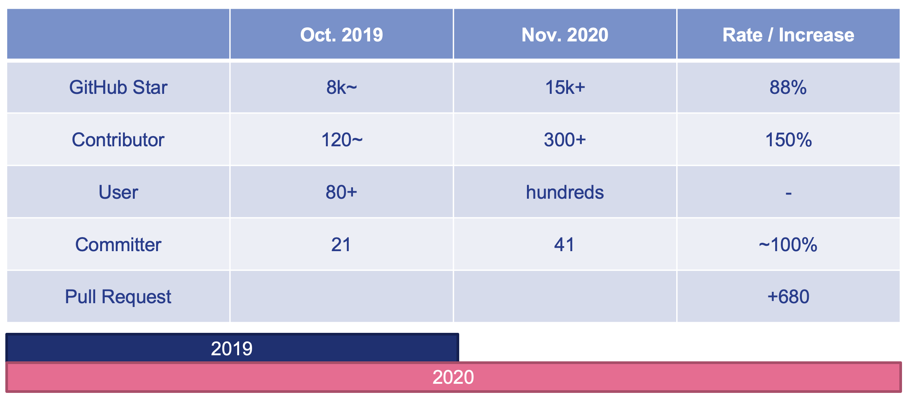

Apache SkyWalking is an open source APM for distributed system. Provide tracing, service mesh observability, metrics analysis, alarm and visualization.

Just 11 months ago, on Jan. 20th, 2020, [SkyWalking hit the 200 contributors mark](http://skywalking.apache.org/blog/2020-01-20-celebrate-200th-contributor/).
With the growth of the project and the community, SkyWalking now includes over 20 sub(ecosystem) projects covering multiple language agents and service mesh,
integration with mature open source projects, like Prometheus, Spring(Sleuth), hundreds of libraries to support all tracing/metrics/logs fields.
In the past year, the number of contributors grows super astoundingly , and all its metrics point to its community vibrancy. Many corporate titans are already using
SkyWalking in a large-scale production environment, including, Alibaba, Huawei, Baidu, Tencent, etc.

Recently, our [SkyWalking main repository](https://github.com/apache/skywalking) overs 300 contributors. 

Our [website](https://skywalking.apache.org) has thousands of views from most countries in the world every week.

Although we know that, the metrics like GitHub stars and the numbers of open users and contributors, are not a determinant of vibrancy,
they do show the trend, we are very proud to share the increased numbers here, too.

We double those numbers and are honored with the development of our community. 

Thank you, all of our contributors. Not just these 300 contributors of the main repository, or nearly 400 contributors in all repositories, counted by GitHub.
There are countless people contributing codes to SkyWalking's subprojects, ecosystem projects, and private fork versions;
writing blogs and guidances, translating documents, books, and presentations; 
setting up learning sessions for new users;
convincing friends to join the community as end-users, contributors, even committers.
Companies behinds those contributors support their employees to work with the community to provide feedback and
contribute the improvements and features upstream.
Conference organizers share the stages with speakers from the SkyWalking community. 

SkyWalking can’t make this happen without your help. You made this community extraordinary.

At this crazy distributed computing and cloud native age, we as a community could make DEV, OPS, and SRE teams' work easier by locating the issue(s) in the haystack
quicker than before, like why we named the project as SkyWalking, we will have a clear site line  when you stand on the glass bridge Skywalk at Grand Canyon West.

___
376 Contributors counted by GitHub account are following. Dec. 22st, 2020. Generated by a tool deveoped by [Yousa](https://github.com/miss-you)

- 1095071913
- 50168383
- Ahoo-Wang
- AirTrioa
- AlexanderWert
- AlseinX
- Ax1an
- BFergerson
- BZFYS
- CharlesMaster
- ChaunceyLin5152
- CommissarXia
- Cvimer
- Doublemine
- ElderJames
- EvanLjp
- FatihErdem
- FeynmanZhou
- Fine0830
- FingerLiu
- Gallardot
- GerryYuan
- HackerRookie
- Heguoya
- Hen1ng
- Humbertzhang
- IanCao
- IluckySi
- Indifer
- J-Cod3r
- JaredTan95
- Jargon96
- Jijun
- JohnNiang
- Jozdortraz
- Jtrust
- Just-maple
- KangZhiDong
- LazyLei
- LiWenGu
- Liu-XinYuan
- Miss-you
- O-ll-O
- Patrick0308
- QHWG67
- Qiliang
- RandyAbernethy
- RedzRedz
- Runrioter
- SataQiu
- ScienJus
- SevenPointOld
- ShaoHans
- Shikugawa
- SoberChina
- SummerOfServenteen
- TJ666
- TerrellChen
- TheRealHaui
- TinyAllen
- TomMD
- ViberW
- Videl
- WALL-E
- WeihanLi
- WildWolfBang
- WillemJiang
- Wooo0
- XhangUeiJong
- Xlinlin
- YczYanchengzhe
- YoungHu
- YunaiV
- ZhHong
- ZhuoSiChen
- ZS-Oliver
- a198720
- a526672351
- acurtain
- adamni135
- adermxzs
- adriancole
- aeolusheath
- agile6v
- aix3
- aiyanbo
- ajanthan
- alexkarezin
- alonelaval
- amogege
- amwyyyy
- arugal
- ascrutae
- augustowebd
- bai-yang
- beckhampu
- beckjin
- beiwangnull
- bigflybrother
- bostin
- brucewu-fly
- c1ay
- candyleer
- carlvine500
- carrypann
- cheenursn
- cheetah012
- chenpengfei
- chenvista
- chess-equality
- chestarss
- chidaodezhongsheng
- chopin-d
- clevertension
- clk1st
- cngdkxw
- codeglzhang
- codelipenghui
- coder-yqj
- coki230
- coolbeevip
- crystaldust
- cui-liqiang
- cuiweiwei
- cyberdak
- cyejing
- dagmom
- dengliming
- devkanro
- devon-ye
- dimaaan
- dingdongnigetou
- dio
- dmsolr
- dominicqi
- donbing007
- dsc6636926
- duotai
- dvsv2
- dzx2018
- echooymxq
- efekaptan
- eoeac
- evanxuhe
- feelwing1314
- fgksgf
- fuhuo
- geektcp
- geomonlin
- ggndnn
- gitter-badger
- glongzh
- gnr163
- gonedays
- grissom-grissom
- grissomsh
- guodongq
- guyukou
- gxthrj
- gzshilu
- hailin0
- hanahmily
- haotian2015
- haoyann
- hardzhang
- harvies
- hepyu
- heyanlong
- hi-sb
- honganan
- hsoftxl
- huangyoje
- huliangdream
- huohuanhuan
- innerpeacez
- itsvse
- jasonz93
- jialong121
- jinlongwang
- jjlu521016
- jjtyro
- jmjoy
- jsbxyyx
- justeene
- juzhiyuan
- jy00464346
- kaanid
- karott
- kayleyang
- kevinyyyy
- kezhenxu94
- kikupotter
- kilingzhang
- killGC
- klboke
- ksewen
- kuaikuai
- kun-song
- kylixs
- landonzeng
- langke93
- langyan1022
- langyizhao
- lazycathome
- leemove
- leizhiyuan
- libinglong
- lilien1010
- limfriend
- linkinshi
- linliaoy
- liuhaoXD
- liuhaoyang
- liuyanggithup
- liuzhengyang
- liweiv
- lkxiaolou
- llissery
- louis-zhou
- lpf32
- lsyf
- lucperkins
- lujiajing1126
- lunamagic1978
- lunchboxav
- lxliuxuankb
- lytscu
- lyzhang1999
- magic-akari
- makingtime
- maolie
- masterxxo
- maxiaoguang64
- membphis
- mestarshine
- mgsheng
- michaelsembwever
- mikkeschiren
- mm23504570
- momo0313
- moonming
- mrproliu
- muyun12
- nacx
- neatlife
- neeuq
- nic-chen
- nikitap492
- nileblack
- nisiyong
- novayoung
- oatiz
- oflebbe
- olzhy
- onecloud360
- osiriswd
- peng-yongsheng
- pengweiqhca
- potiuk
- purgeyao
- qijianbo010
- qinhang3
- qiuyu-d
- qqeasonchen
- qxo
- raybi-asus
- refactor2
- remicollet
- rlenferink
- rootsongjc
- rovast
- scolia
- sdanzo
- seifeHu
- shiluo34
- sikelangya
- simonlei
- sk163
- snakorse
- songzhendong
- songzhian
- sonxy
- spacewander
- stalary
- stenio2011
- stevehu
- stone-wlg
- sungitly
- surechen
- swartz-k
- sxzaihua
- tanjunchen
- tankilo
- taskmgr
- tbdpmi
- terranhu
- terrymanu
- tevahp
- thanq
- thebouv
- tianyuak
- tincopper
- tinyu0
- tom-pytel
- tristaZero
- tristan-tsl
- trustin
- tsuilouis
- tuohai666
- tzsword-2020
- tzy1316106836
- vcjmhg
- vision-ken
- viswaramamoorthy
- wankai123
- wbpcode
- web-xiaxia
- webb2019
- weiqiang333
- wendal
- wengangJi
- wenjianzhang
- whfjam
- wind2008hxy
- withlin
- wqr2016
- wu-sheng
- wuguangkuo
- wujun8
- wuxingye
- x22x22
- xbkaishui
- xcaspar
- xiaoxiangmoe
- xiaoy00
- xinfeingxia85
- xinzhuxiansheng
- xudianyang
- yanbw
- yanfch
- yang-xiaodong
- yangxb2010000
- yanickxia
- yanmaipian
- yanmingbi
- yantaowu
- yaowenqiang
- yazong
- ychandu
- ycoe
- yimeng
- yu199195
- yuqichou
- yuyujulin
- yymoth
- zaunist
- zaygrzx
- zcai2
- zeaposs
- zhang98722
- zhanghao001
- zhangjianweibj
- zhangkewei
- zhangsean
- zhaoyuguang
- zhentaoJin
- zhousiliang163
- zhuCheer
- zifeihan
- zkscpqm
- zoidbergwill
- zoumingzm
- zouyx
- zshit
- zxbu
- zygfengyuwuzu
