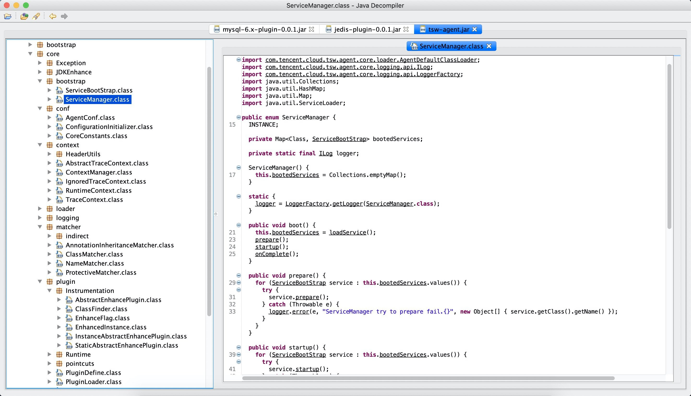
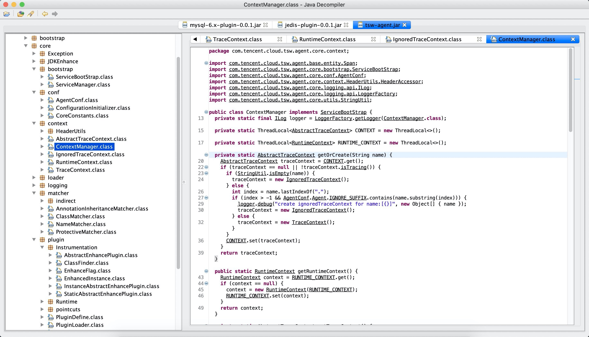
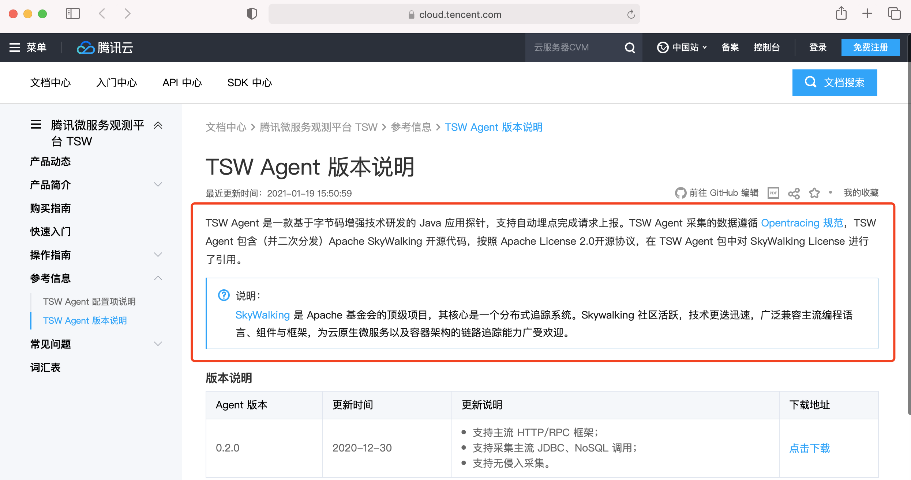
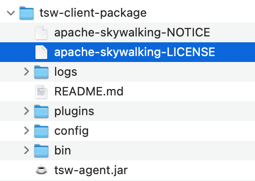

[Apache SkyWalking](https://skywalking.apache.org) is an open source APM for distributed system, Apache Software Foundation top-level project.

At Jan. 11th, 2021, we noticed the Tencent Cloud Service, [Tencent Service Watcher - TSW](https://cloud.tencent.com/product/tsw), for first time. 
Due to the similar short name, which SkyWalking is also called SW in the community, we connected with the service team of Tencent Cloud, and kindly asked.

They used to replay, **TSW is purely developed by Tencent team itself, which doesn't have any code dependency on SkyWalking.**. We didn't push harder.

But one week later, Jan 18th, 2021, our V.P., Sheng got the report again from Haoyang SkyWalking PMC member, through WeChat DM(direct message),.
He provided complete evidence to prove TSW actually re-distributed the SkyWalking's Java agent.
We keep one copy of their agent's distribution(at Jan. 18th), you could be downloaded [here](https://drive.google.com/file/d/1wCnUW0n-0qIoHuNI2pw8iAaVyRBrSuI7/view).

Some typically evidences are here

- [ServiceManager](https://github.com/apache/skywalking/blob/v8.3.0/apm-sniffer/apm-agent-core/src/main/java/org/apache/skywalking/apm/agent/core/boot/ServiceManager.java) is copied and package-name changed in the TSW's agent.

- [ContextManager](https://github.com/apache/skywalking/blob/v8.3.0/apm-sniffer/apm-agent-core/src/main/java/org/apache/skywalking/apm/agent/core/context/ContextManager.java ) is copied and ackage-name changed in the TSW's agent.

At the same time, we checked their tsw-client-package.zip, it didn't include the SkyWalking's LICENSE and NOTICE. Also, they didn't mention TSW agent is the re-ditribution SkyWalking on their website.

With all above information, we had enough reason to believe, from the tech perspective, **they were violating the Apache 2.0 License.**

From the 18th Jan., 2021, we sent mail `[Apache 2.0 License Violation] Tencent Cloud TSW service doesn't follow the Apache 2.0 License` to brief the SkyWalking PMC, and
took the following actions to connect with Tencent.
- Made direct call to Tencent Open Source Office.
- Connected with Tencent Cloud TVP program committee, as Sheng Wu(Our VP) is a Tencent Cloud TVP.
- Talked with the Tencent Cloud team lead.

**In all above channels, we provided the evidences of copy-redistribution hebaviors, requested them to revaluate their statements on the website, and follow the License's requirements.**

## Resolution
At Jan. 19th night, UTC+8, 2021. We received response from the Tencent cloud team. They admited their violation behaviors, and did following changes
1. Tencent Cloud TSW service page states, the agent is the fork version(re-distribution) of Apache SkyWalking agent.

2. TSW agent distributions include the SkyWalking's License and NOTICE. Below is the screenshot, you could download from their product page. We keep a copy of their Jan. 19th 2021 at [here](https://drive.google.com/file/d/1Z9EkOpi-lyFosmvuoqPZ57sY-gLdwNLq/view).

We have updated the status to the PMC mail list. This license violation issue has been resolved for now.

##### The SkyWalking community and program management committee will keep our eyes on Tencent TSW.
