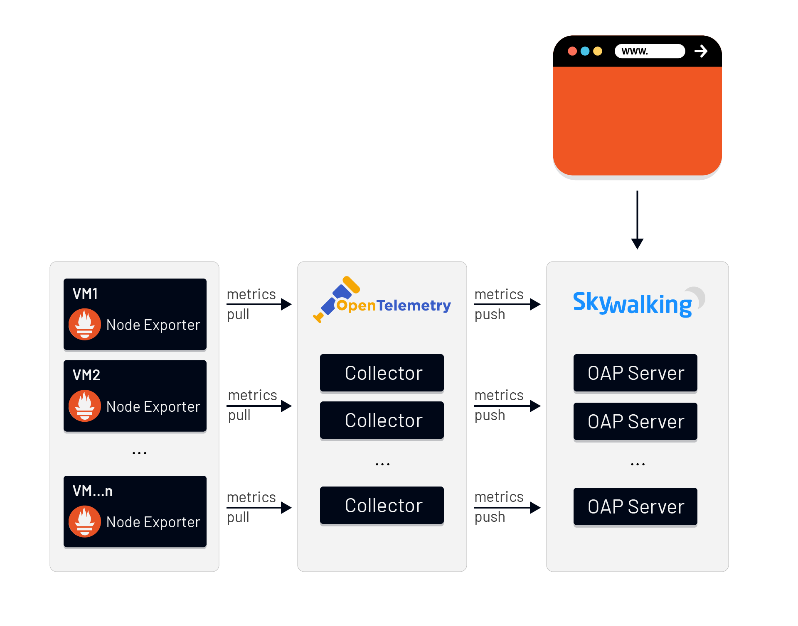

> Origin: [Tetrate.io blog](https://www.tetrate.io/blog/skywalking-8-4-provides-infrastucture-monitoring-for-vms/)

## Background
Apache SkyWalking-- the APM tool for distributed systems--  has historically focused on providing observability around tracing and metrics, but service performance is often affected by the host. The newest release, SkyWalking 8.4.0, introduces a new  feature for monitoring  virtual machines. Users can easily detect possible problems from the dashboard-- for example, when CPU usage is overloaded, when there’s not enough memory or disk space, or when the network status is unhealthy, etc. 

## How it works
SkyWalking leverages Prometheus and OpenTelemetry for collecting metrics data as we did for Istio control panel metrics; Prometheus is mature and widely used, and we expect to see increased adoption of the new CNCF project, OpenTelemetry. The SkyWalking OAP Server receives these metrics data of OpenCensus format from OpenTelemetry. The process is as follows:



1. Prometheus Node Exporter collects metrics data from the VMs.
2. OpenTelemetry Collector fetches metrics from Node Exporters via Prometheus Receiver,  and pushes metrics to SkyWalking OAP Server via the OpenCensus GRPC Exporter.
3. The SkyWalking OAP Server parses the expression with [MAL](https://github.com/apache/skywalking/blob/master/docs/en/concepts-and-designs/mal.md) to filter/calculate/aggregate and store the results. The expression rules are in `/config/otel-oc-rules/vm.yaml`.
4. We can now see the data on the SkyWalking WebUI dashboard.
   
## What to monitor
SkyWalking provides default monitoring metrics including:
* CPU Usage (%)
* Memory RAM Usage (MB)
* Memory Swap Usage (MB)
* CPU Average Used
* CPU Load
* Memory RAM (total/available/used MB)
* Memory Swap (total/free MB)
* File System Mount point Usage (%)
* Disk R/W (KB/s)
* Network Bandwidth Usage (receive/transmit KB/s)
* Network Status (tcp_curr_estab/tcp_tw/tcp_alloc/sockets_used/udp_inuse)
* File fd Allocated
 
The following is how it looks when we monitor Linux:


## How to use
To enable this feature, we need to install Prometheus Node Exporter and OpenTelemetry Collector and activate the VM monitoring rules in SkyWalking OAP Server.

### Install Prometheus Node Exporter

```shell
wget https://github.com/prometheus/node_exporter/releases/download/v1.0.1/node_exporter-1.0.1.linux-amd64.tar.gz
tar xvfz node_exporter-1.0.1.linux-amd64.tar.gz
cd node_exporter-1.0.1.linux-amd64
./node_exporter
```

In linux Node Exporter  exposes metrics on port `9100` by default. When it is running, we can get the metrics  from the `/metrics` endpoint. Use a web browser or command `curl` to verify.

```shell
curl http://localhost:9100/metrics
```

We should see all the metrics from the output like:
```shell
# HELP go_gc_duration_seconds A summary of the pause duration of garbage collection cycles.
# TYPE go_gc_duration_seconds summary
go_gc_duration_seconds{quantile="0"} 7.7777e-05
go_gc_duration_seconds{quantile="0.25"} 0.000113756
go_gc_duration_seconds{quantile="0.5"} 0.000127199
go_gc_duration_seconds{quantile="0.75"} 0.000147778
go_gc_duration_seconds{quantile="1"} 0.000371894
go_gc_duration_seconds_sum 0.292994058
go_gc_duration_seconds_count 2029
...
```

Note: We only need to install Node Exporter,  rather than Prometheus server. 
If you want to get more information about Prometheus Node Exporter  see: https://prometheus.io/docs/guides/node-exporter/

### Install OpenTelemetry Collector
We can quickly install a OpenTelemetry Collector instance by using `docker-compose` with the following steps:
1. Create a directory to store the configuration files, like `/usr/local/otel`.
2. Create `docker-compose.yaml` and `otel-collector-config.yaml` in this directory represented below:

`docker-compose.yaml`
```yaml
version: "2"
services:
  # Collector
  otel-collector:
    # Specify the image to start the container from
    image: otel/opentelemetry-collector:0.19.0
    # Set the  otel-collector configfile 
    command: ["--config=/etc/otel-collector-config.yaml"]
    # Mapping the configfile to host directory
    volumes:
      - ./otel-collector-config.yaml:/etc/otel-collector-config.yaml
    ports:
      - "13133:13133" # health_check extension
      - "55678"       # OpenCensus receiver
```

`otel-collector-config.yaml`
```yaml
extensions:
  health_check:
# A receiver is how data gets into the OpenTelemetry Collector
receivers:
  # Set Prometheus Receiver to collects metrics from targets
  # It’s supports the full set of Prometheus configuration
  prometheus:
    config:
      scrape_configs:
        - job_name: 'otel-collector'
          scrape_interval: 10s
          static_configs: 
              # Replace the IP to your VMs‘s IP which has installed Node Exporter
            - targets: [ 'vm1:9100' ] 
            - targets: [ 'vm2:9100' ]
            - targets: [ ‘vm3:9100' ]

processors:
  batch:

# An exporter is how data gets sent to different systems/back-ends
exporters:
  # Exports metrics via gRPC using OpenCensus format
  opencensus:
    endpoint: "docker.for.mac.host.internal:11800" # The OAP Server address
    insecure: true
  logging:
    logLevel: debug

service:
  pipelines:
    metrics:
      receivers: [prometheus]
      processors: [batch]
      exporters: [logging, opencensus]

  extensions: [health_check]
```

3. In this  directory use command `docker-compose` to start up the container:

```shell
docker-compose up -d
```


After the container is up and running, you should see metrics already exported in the logs:

```shell
...
Metric #165
Descriptor:
-> Name: node_network_receive_compressed_total
-> Description: Network device statistic receive_compressed.
-> Unit:
-> DataType: DoubleSum
-> IsMonotonic: true
-> AggregationTemporality: AGGREGATION_TEMPORALITY_CUMULATIVE
DoubleDataPoints #0
Data point labels:
-> device: ens4
StartTime: 1612234754364000000
Timestamp: 1612235563448000000
Value: 0.000000
DoubleDataPoints #1
Data point labels:
-> device: lo
StartTime: 1612234754364000000
Timestamp: 1612235563448000000
Value: 0.000000
...
```

If you want to get more information about OpenTelemetry Collector  see: https://opentelemetry.io/docs/collector/

### Set up SkyWalking OAP Server
To activate the oc handler and vm relevant rules, set your environment variables:

```
SW_OTEL_RECEIVER=default
SW_OTEL_RECEIVER_ENABLED_OC_RULES=vm
```

Note: If there are other rules already activated , you can add vm with use `,` as a separator.
```
SW_OTEL_RECEIVER_ENABLED_OC_RULES=vm,oap
```

Start the SkyWalking OAP Server.

### Done!
After all of the above steps are completed, check out the SkyWalking WebUI.  Dashboard `VM` provides the default metrics of all observed virtual machines.
Note: Clear the browser local cache if you used it to access deployments of  previous SkyWalking versions.


## Additional Resources
- Read more about the [SkyWalking 8.4 release highlights](https://github.com/apache/skywalking/blob/v8.4.0/changes/changes-8.4.0.md).
- Get more SkyWalking updates on [Twitter](https://twitter.com/ASFSkyWalking).
