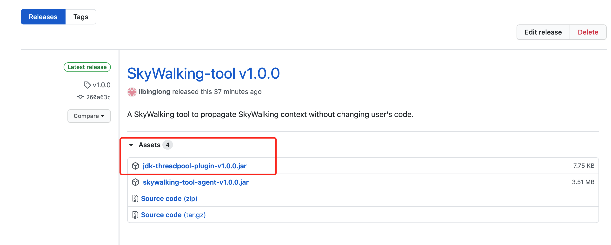
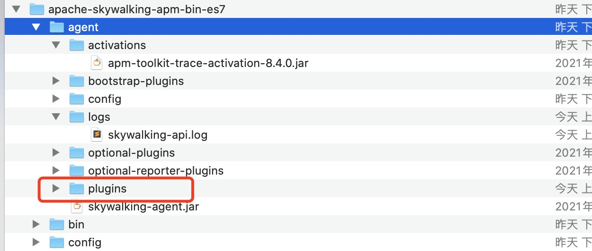
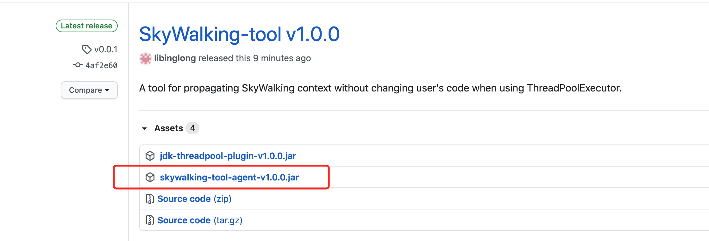

When using SkyWalking java agent, people usually propagate context easily. They even do not need to change the business 
code. However, it becomes harder when you want to propagate context between threads when using ThreadPoolExecutor. 
You can use the RunnableWrapper in the maven artifact org.apache.skywalking:apm-toolkit-trace. This way you must change 
your code. The developer manager usually don't like this because there may be lots of projects, or lots of runnable code. 
If they don't use SkyWalking some day, the code added will be superfluous and inelegant.

Is there a way to propagate context without changing the business code? Yes. 

Skywalking java agent enhances a class by add a field and implement an interface. The ThreadPoolExecutor is a special
class that is used widely. We even don't know when and where it is loaded. Most JVMs do not allow changes in the class
file format for classes that have been loaded previously. So SkyWalking should not enhance the ThreadPoolExecutor successfully by retransforming when the ThreadPoolExecutor has been loaded. 
However, we can apply advice to the ThreadPoolExecutor#execute method and wrap the Runnable param using our 
own agent, then enhance the wrapper class by SkyWalking java agent. An advice do not change the layout of a class.

Now we should decide how to do this. You can use the RunnableWrapper in the maven artifact 
org.apache.skywalking:apm-toolkit-trace to wrap the param, but you need to face another problem. This RunnableWrapper 
has a plugin whose active condition is checking if there is @TraceCrossThread. Agent core uses net.bytebuddy.pool.TypePool.Default.WithLazyResolution.LazyTypeDescription to find the annotations
of a class. The LazyTypeDescription finds annotations by using a URLClassLoader with no urls if the classloader is
null(bootstrap classloader). So it can not find the @TraceCrossThread class unless you change the LocationStrategy of
SkyWalking java agent builder.

In [this project](https://github.com/libinglong/skywalking-threadpool-agent), I write my own wrapper class, 
and simply add a plugin with a name match condition. 
Next, Let me show you how these two agents work together.

* Move the plugin to the skywalking "plugins" directory.

  
  
  

* Add this agent after the SkyWalking agent since the wrapper class should not be loaded before
  SkyWalking agent instrumentation have finished. For example,

  > java -javaagent:/path/to/skywalking-agent.jar -javaagent:/path/to/skywalking-tool-agent-v1.0.0.jar ...
  
  

* When our application runs
  * SkyWalking java agent adds a transformer by parsing the plugin for enhancing the wrapper class in the tool agent.
  * The tool agent loads the wrapper class into bootstrap classloader. This triggers the previous transformer.
  * The tool agent applies an advice to the ThreadPoolExecutor class, wrapping the java.lang.Runnable param of "execute" method with the wrapper class.
  * Now SkyWalking propagates the context with the wrapper class.

Enjoy tracing with ThreadPoolExecutor in SkyWalking!