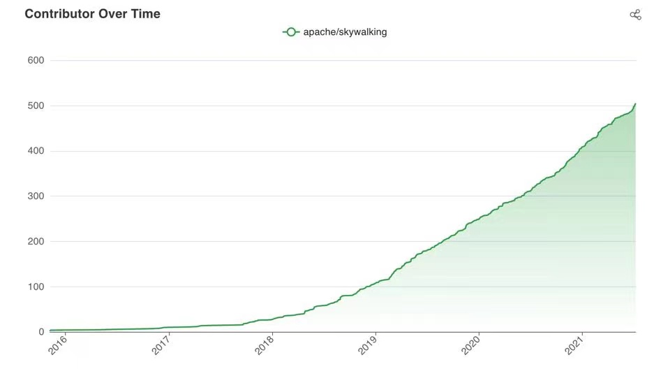

SkyWalking is an open source APM (application performance monitor) system, especially designed for microservices, cloud native, and container-based architectures. 

From 2020, it has dominated the open source APM market in China, and expanded aggressively in North American, Europe and Asia's other countries.

With over 6 years (2015-2021) of development, driven by the global open source community, SkyWalking now provides full stack observability covering metrics, tracing and logging, plus event detector, which are built based on various native and ecosystem solutions.

1. Language agent-based(Java, Dot Net, Golang, PHP, NodeJS, Python, C++, LUA) in-process monitoring, is as powerful as commercial APM vendors' agents. Mostly auto-instrumentation, and good interactivity.
2. Service Mesh Observability, working closely with Envoy and Istio teams.
3. Transparent integration of popular metrics ecosystem. Accept metrics from Prometheus SDK, OpenTelemetry collectors, Zabbix agents, etc.
4. Log collection with analysis capability from FluentD, Fluent-bit, Filebeat, etc. agents.
5. Infrastructure monitoring, such as Linux and k8s, is out of the box.

The SkyWalking ecosystem was started by very few people. The community drives the project to cover real scenarios, from tracing to the whole APM field. Even today, more professional open source developers, powered by the vendors behind them, are bringing the project to a different level. 

Typically and most attractively, SkyWalking is going to build the first known open source APM specific database in the world, at least providing
1. Time series-based database engine.
2. Support traces/logs and metrics in the database core level.
3. High performance with cluster mode and HPA.
4. Reasonable resource cost.

We nearly doubled the number of contributors in the last year, from ~300 to over 500. The whole community is very energetic. Here, we want to thank our 47 committers(28 PMC members included), listed [here](https://skywalking.apache.org/team/), and over 400 other contributors. 

**We together built this humongous Apache Top Level project, and proved the stronge competitiveness of an open-source project.**

**This is a hard-won and impressive achievement. We won't stop here. The trend is there, the ground is solid. We are going to build the top-level APM system relying on our open-source community.**

### 500 Contributors List
|GitHub|||||
|----|----|----|----|----|
|1095071913|182148432**|295198088**|394102339**|437376068**|
|50168383|55846420**|826245622**|844067874|Ahoo-Wang|
|AirTrioa|AlexanderWert|AlseinX|AngryMills|Ax1an|
|BFergerson|BZFYS|CalvinKirs|CharlesMaster|ChaunceyLin5152|
|CommissarXia|Cvimer|DeadLion|Doublemine|Du-fei|
|ElderJames|EvanLjp|FatihErdem|FeynmanZhou|Fine0830|
|FingerLiu|FrankyXu|Gallardot|GerryYuan|HackerRookie|
|HarryFQ|Heguoya|Hen1ng|HendSame|Humbertzhang|
|IanCao|IluckySi|Indifer|J-Cod3r|JaredTan95|
|Jargon96|Jijun|JoeKerouac|JohnNiang|Johor03|
|Jozdortraz|Jtrust|Just-maple|KangZhiDong|LazyLei|
|LiWenGu|Lin1997|Linda-pan|LiteSun|Liu-XinYuan|
|MiracleDx|Miss-you|MoGuGuai-hzr|MrYzys|O-ll-O|
|Patrick0308|QHWG67|Qiliang|QuanjieDeng|RandyAbernethy|
|RedzRedz|Runrioter|SataQiu|ScienJus|SevenBlue2018|
|ShaoHans|Shikugawa|SoberChina|SummerOfServenteen|Switch-vov|
|TJ666|Technoboy-|TerrellChen|TeslaCN|TheRealHaui|
|TinyAllen|TomMD|ViberW|Videl|WALL-E|
|WeihanLi|WildWolfBang|WillemJiang|Wooo0|XhangUeiJong|
|Xlinlin|YczYanchengzhe|Yebemeto|YoungHu|YunaiV|
|YunfengGao|Z-Beatles|ZS-Oliver|ZhHong|ZhuoSiChen|
|a198720|a1vin-tian|a526672351|acurtain|adamni135|
|adermxzs|adriancole**|aeolusheath|agile6v|aix3|
|aiyanbo|ajanthan|alexkarezin|alonelaval|amogege|
|amwyyyy|andyliyuze|andyzzl|aoxls|arugal|
|ascrutae|ascrutae**|augustowebd|aviaviavi|bai-yang|
|beckhampu|beckjin|beiwangnull|bigflybrother|bootsrc|
|bostin|brucewu-fly|buxingzhe|buzuotaxuan|bwh12398**|
|c feng|c1ay|candyleer|carllhw|carlvine500|
|carrypann|cheenursn|cheetah012|chenbeitang|chenglei**|
|chengshiwen|chenmudu|chenpengfei|chenvista|chess-equality|
|chestarss|chidaodezhongsheng|chopin-d|clevertension|clk1st|
|cngdkxw|cnlangzi|codeglzhang|codelipenghui|coder-yqj|
|coki230|compilerduck|constanine|coolbeevip|crystaldust|
|cui-liqiang|cuiweiwei|cutePanda123|cyberdak|cyejing|
|cyhii|dafu-wu|dagmom|dalekliuhan**|darcydai|
|dengliming|devkanro|devon-ye|dickens7|dimaaan|
|dingdongnigetou|dio|divyakumarjain|dmsolr|dominicqi|
|donbing007|dsc6636926|dvsv2|dzx2018|echooymxq|
|efekaptan|elk-g|emschu|eoeac|evanljp**|
|evanxuhe|feelwing1314|fgksgf|fredster33|fuhuo|
|fulmicoton|fushiqinghuan111|geektcp|geomonlin|ggndnn|
|gitter-badger|givingwu|glongzh|gnr163|gonedays|
|grissom-grissom|grissomsh|guodongq|guyukou|gxthrj|
|gy09535|gzshilu|hailin0|hanahmily|haotian2015|
|haoyann|hardzhang|harvies|heihaozi|hepyu|
|heyanlong|hi-sb|honganan|horber|hsoftxl|
|huangyoje|huliangdream|huohuanhuan|iluckysi|innerpeacez|
|itsvse|jasper-zsh|jbampton|jialong121|jinlongwang|
|jjlu521016|jjtyro|jmjoy|jsbxyyx|justeene|
|juzhiyuan|jy00464346|kaanid|kagaya85|karott|
|kayleyang|kevinyyyy|kezhenxu94|kikupotter|kilingzhang|
|killGC|kkl129|klboke|ksewen|kuaikuai|
|kun-song|kylixs|landonzeng|langke93|langyan1022|
|langyizhao|lazycathome|leemove|leizhiyuan|libinglong|
|lijial|lilien1010|limfriend|linkinshi|linliaoy|
|liqiangz|liu-junchi|liufei**|liuhaoXD|liuhaoyang|
|liuweiyi**|liuyanggithup|liuzhengyang|liweiv|lixin40**|
|lizl9**|lkxiaolou|llissery|louis-zhou|lpcy|
|lpf32|lsyf|lucperkins|lujiajing1126|lunamagic1978|
|lunchboxav|lxin96**|lxliuxuankb|lytscu|lyzhang1999|
|mage3k|makefriend8|makingtime|mantuliu|maolie|
|margauxcabrera|masterxxo|maxiaoguang64|me**|membphis|
|mestarshine|mgsheng|michaelsembwever|mikkeschiren|ming_flycash**|
|minquan.chen**|misaya|momo0313|moonming|mrproliu|
|mrproliu**|muyun12|nacx|neatlife|neeuq|
|nic-chen|nickwongwong|nikitap492|nileblack|nisiyong|
|novayoung|oatiz|oflebbe|olzhy|onecloud360|
|osiriswd|panniyuyu|peng-yongsheng|pengweiqhca|potiuk|
|probeyang|purgeyao|qijianbo010|qinhang3|qiuyu-d|
|qjgszzx|qq362220083|qqeasonchen|qxo|ralphgj|
|raybi-asus|refactor2|remicollet|rlenferink|rootsongjc|
|rovast|ruibaby|s00373198|scolia|sdanzo|
|seifeHu|sergicastro|shiluo34|sikelangya|simonlei|
|sk163|snakorse|songzhendong|songzhian|songzhian**|
|sonxy|spacewander|stalary|stenio2011|stevehu|
|stone-wlg|sungitly|surechen|swartz-k|sxzaihua|
|tangxqa|tanjunchen|tankilo|tanzhen**|taskmgr|
|tbdpmi|terranhu|terrymanu|tevahp|thanq|
|thebouv|tianyk|tianyuak|tincopper|tinyu0|
|tom-pytel|tristaZero|tristan-tsl|trustin|tsuilouis|
|tuohai666|tzsword-2020|tzy1316106836|vcjmhg|viktoryi|
|vision-ken|viswaramamoorthy|wallezhang|wang-yeliang|wang_weihan**|
|wangrzneu|wankai123|wbpcode|web-xiaxia|webb2019|
|weiqiang-w|weiqiang333|wendal|wengangJi|wenjianzhang|
|whfjam|whl12345|willseeyou|wilsonwu|wind2008hxy|
|wingwong-knh|withlin|wl4g|wqr2016|wu-sheng|
|wuguangkuo|wujun8|wuwen5|wuxingye|x22x22|
|xbkaishui|xcaspar|xdRight|xiaoweiyu**|xiaoxiangmoe|
|xiaoy00|xinfeingxia85|xingren23|xinzhuxiansheng|xonze|
|xuanyu66|xuchangjunjx|xudianyang|yanbw|yanfch|
|yang-xiaodong|yangxb2010000|yanickxia|yanmaipian|yanmingbi|
|yantaowu|yaojingguo|yaowenqiang|yazong|ychandu|
|ycoe|yimeng|yu199195|yuqichou|yushuqiang**|
|yuyujulin|yxudong|yymoth|zaunist|zaygrzx|
|zcai2|zeaposs|zhang98722|zhanghao001|zhangjianweibj|
|zhangkewei|zhangsean|zhangxin**|zhaoyuguang|zhe1926|
|zhentaoJin|zhongjianno1**|zhousiliang163|zhuCheer|zhyyu|
|zifeihan|zijin-m|zkscpqm|zoidbergwill|zoumingzm|
|zouyx|zpf1989|zshit|zxbu|zygfengyuwuzu|
