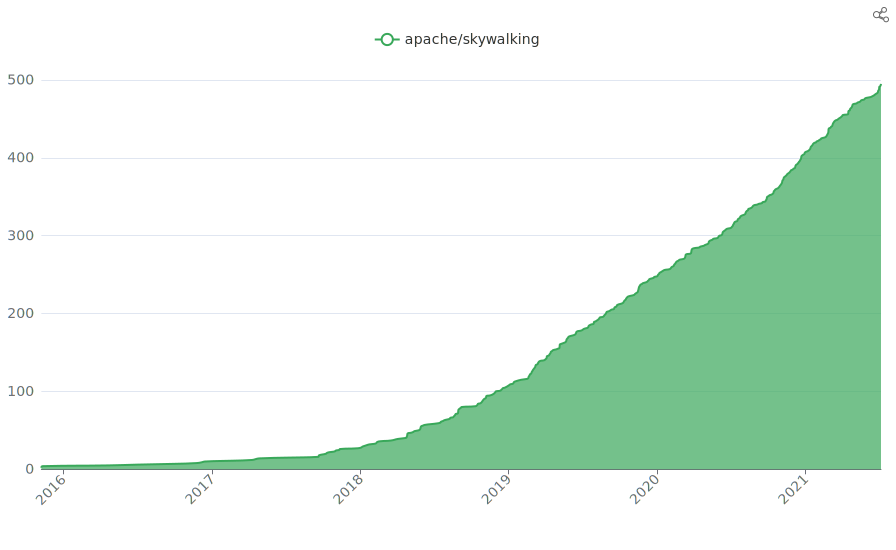

SkyWalking is an open source APM(application performance monitor) system, especially designed for microservices, cloud native and container-based architectures. 

From 2020, it has dominated the open source APM market in China, and expanded aggressively in North American, Euro and Asia's other countries.

With over 6 years(2015-2021) development, driven by the global open source community, SkyWalking now provides full stack observability covering metrics, tracing and logging, plus event detector, which are built based on various native and ecosystem solution.

1. Language agents(Java, Dot Net, Golang, PHP, NodeJS, Python, C++, LUA) based in-process monitoring, are as powerful as commercial APM vendors' agents. Mostly auto-instrumentation, and good interactivity.
2. Provide Service Mesh Observability, working closely with Envoy and Istio teams.
3. Integrate popular metrics ecosystem transparently . Accept metrics from Prometheus SDK, OpenTelemetry collectors, Zabbix agents, etc.
4. Collecting logs and provide analysis capability from FluentD, Fluent-bit, Filebeat, etc. agents.
5. Infrastructure monitoring, such as Linux and k8s, is out of box.

SkyWalking ecosystem was started by a very few of people, the community drives the project to cover the real scenarios, from tracing to the whole APM field. Even today, more professional open source developers powered by the vendors behind them, are bringing the project to a different level. 

Typically and most attractively, SkyWalking is going to build first known open source APM specific database in the world, at least providing
1. Time series based
2. Support tracing/loggings and metrics in the database core level
3. High performance with cluster mode and HPA
4. Reasonable resource cost.

We nearly double the number of contributors in the last year, from ~300 to over 500. The whole community is very energetic. At here, we want to thanks our 47 committers(28 PMC members included), listed [here](https://skywalking.apache.org/team/), and other over 400 contributors. 

**We together built this humongous Apache Top Level project, and proved the stronge competitiveness of an open-source project.**

**This is a hard-won and impressive achievement. We wouldn't stop here, the trend is there, the ground is solid, we are going to build the top level APM system relying on our open-source community.**

### Contributors List

