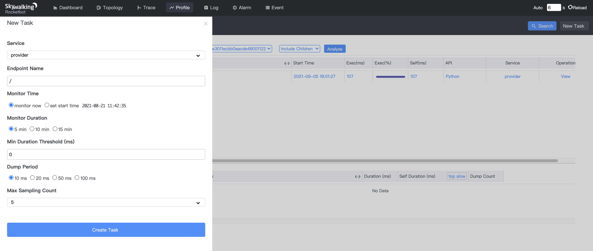
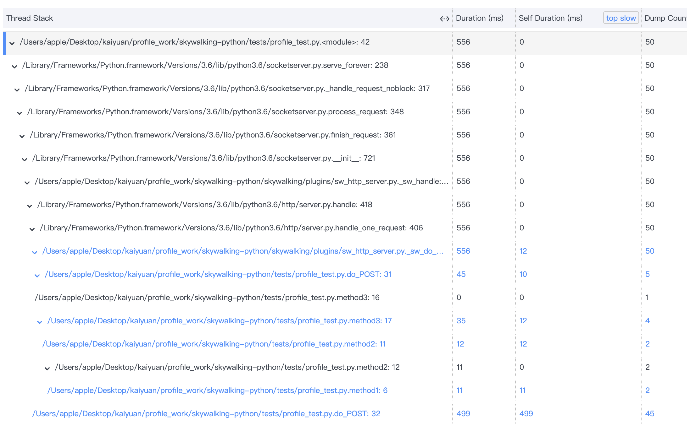
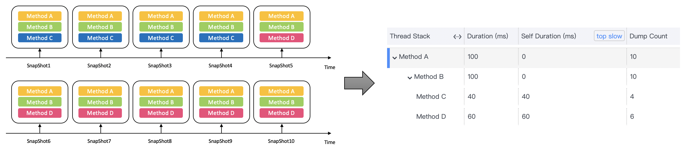

The Java Agent of Apache SkyWalking has supported profiling since [v7.0.0](https://github.com/apache/skywalking/releases/tag/v7.0.0), and it enables users to troubleshoot the root cause of performance issues, and now we bring it into Python Agent.
In this blog, we will show you how to use it, and we will introduce the mechanism of profiling.

### How to use profiling in Python Agent

This feature is released in Python Agent at v0.7.0. It is turned on by default, so you don't need any extra configuration to use it. You can find the environment variables about it [here](https://github.com/apache/skywalking-python/blob/master/docs/en/setup/EnvVars.md#:~:text=SW_AGENT_PROFILE_ACTIVE).

Here are the demo codes of an intentional slow application.

```Python
import time

def method1():
    time.sleep(0.02)
    return '1'

def method2():
    time.sleep(0.02)
    return method1()

def method3():
    time.sleep(0.02)
    return method2()

if __name__ == '__main__':
    import socketserver
    from http.server import BaseHTTPRequestHandler

    class SimpleHTTPRequestHandler(BaseHTTPRequestHandler):

        def do_POST(self):
            method3()
            time.sleep(0.5)
            self.send_response(200)
            self.send_header('Content-Type', 'application/json')
            self.end_headers()
            self.wfile.write('{"song": "Despacito", "artist": "Luis Fonsi"}'.encode('ascii'))

    PORT = 19090
    Handler = SimpleHTTPRequestHandler

    with socketserver.TCPServer(("", PORT), Handler) as httpd:
        httpd.serve_forever()
```

We can start it with SkyWalking Python Agent CLI without changing any application code now, which is also the latest feature of v0.7.0.  We just need to add `sw-python run` before our start command(i.e. `sw-python run python3 main.py`), to start the application with python agent attached. More information about sw-python can be found [there](https://github.com/apache/skywalking-python/blob/master/docs/en/setup/CLI.md).

Then, we should add a new profile task for the ` / ` endpoint from the SkyWalking UI, as shown below. 



We can access it by `curl -X POST http://localhost:19090/`, after that, we can view the result of this profile task on the SkyWalking UI. 




### The mechanism of profiling

When a request lands on an application with the profile function enabled, the agent begins the profiling automatically if the request’s URI is as required by the profiling task. A new thread is spawned to fetch the thread dump periodically until the end of request.

The agent sends these thread dumps, called `ThreadSnapshot`, to SkyWalking OAPServer, and the OAPServer analyzes those `ThreadSnapshot(s)` and gets the final result. It will take a method invocation with the same stack depth and code signature as the same operation, and estimate the execution time of each method from this.

Let's demonstrate how this analysis works through the following example. Suppose we have such a program below and we profile it at 10ms intervals.

```Python
def main():
    methodA()

def methodA():
    methodB()

def methodB():
    methodC()
    methodD()

def methodC():
    time.sleep(0.04)

def methodD():
    time.sleep(0.06)
```

The agent collects a total of 10 `ThreadSnapShot(s)` over the entire time period(Diagram A). The first 4 snapshots represent the thread dumps during the execution of function C, and the last 6 snapshots represent the thread dumps during the execution of function D.  After the analysis of OAPServer, we can see the result of this profile task on the SkyWalking Rocketbot UI as shown in the right of the diagram. With this result, we can clearly see the function call relationship and the time consumption situation of this program.



<center>Diagram A</center>
<br>

You can read more details of profiling theory from this [blog](https://skywalking.apache.org/blog/2020-04-13-apache-skywalking-profiling/).

We hope you enjoy the profile in the Python Agent, and if so, you can give us a star on [Python Agent](https://github.com/apache/skywalking-python) and [SkyWalking](https://github.com/apache/skywalking) on GitHub.
