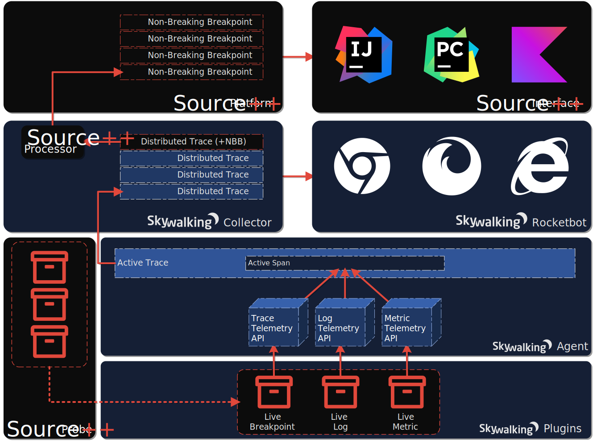
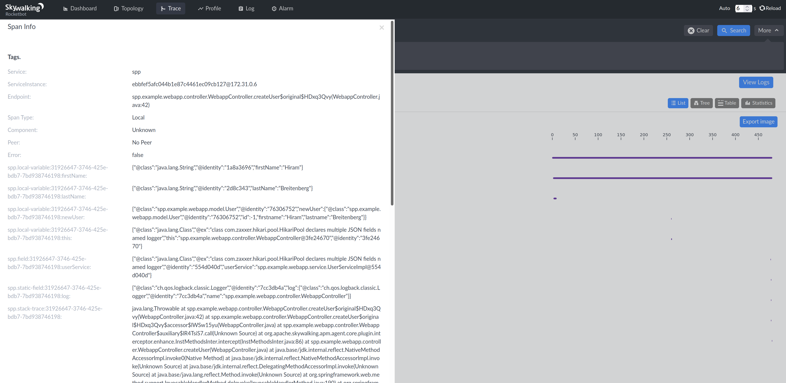
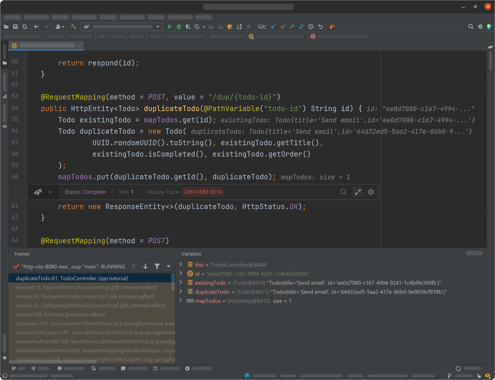

Non-breaking breakpoints are breakpoints specifically designed for live production environments. With non-breaking breakpoints, reproducing production bugs locally or in staging is conveniently replaced with capturing them directly in production.

Like regular breakpoints, non-breaking breakpoints can be:
- placed almost anywhere
- added and removed at will
- set to fire on specific conditions
- expose internal application state
- persist as long as desired (even between application reboots)

The last feature is especially useful given non-breaking breakpoints can be left in production for days, weeks, and even months at a time while waiting to capture behavior that happens rarely and unpredictably.

#### How do non-breaking breakpoints work?

If you're familiar with general distributed tracing concepts, such as "traces" and "spans", then you're already broadly familiar with how non-breaking breakpoints work. Put simply, non-breaking breakpoints are small fragments of code added during runtime that, upon the proper conditions, save a portion of the application's current state, and resume normal execution. In SkyWalking, this can be implemented by simply opening a new local span, adding some tags, and closing the local span. 

While this process is relatively simple, the range of functionality that can be achieved through this technique is quite impressive.
Save the current and global variables to create a non-breaking breakpoint; add the ability to format log messages to create just-in-time logging; add the ability to trigger metric telemetry to create real-time KPI monitoring. If you keep moving in this direction, you eventually enter the realm of live debugging/coding, and this is where Source++ comes in.

#### Live Coding Platform

[Source++](https://github.com/sourceplusplus) is an open-source live coding platform designed for production environments, powered by Apache SkyWalking. Using Source++, developers can add breakpoints, logs, metrics, and distributed tracing to live production software in real-time on-demand, right from their IDE or CLI. While capable of stand-alone deployment, the latest version of Source++ makes it easier than ever to integrate into existing Apache SkyWalking installations. This process can be completed in a few minutes and is easy to customize for your specific needs.

For a better idea of how Source++ works, take a look at the following diagram:

In this diagram, blue components represent existing SkyWalking architecture, black components represent new Source++ architecture, and the red arrows show how non-breaking breakpoints make their way from production to IDEs. A process that is facilitated by Source++ components: Live Probe, Live Processors, Live Platform, and Live Interface.

#### Live Probe

The Live Probe is currently available for [JVM](https://github.com/sourceplusplus/probe-jvm) and [Python](https://github.com/sourceplusplus/probe-python) applications. It runs alongside the SkyWalking agent and is responsible for dynamically adding and removing code fragments based on valid instrumentation requests from developers. These code fragments in turn make use of the SkyWalking agent's internal APIs to facilitate production instrumentation.

#### Live Processors

Live Processors are responsible for finding, extracting, and transforming data found in distributed traces produced via live probes. They run alongside SkyWalking collectors and implement additional post-processing logic, such as PII redaction. Live processors work via uniquely identifiable tags (prefix `spp.`) added previously by live probes.

One could easily view a non-breaking breakpoint ready for processing using Rocketbot, however, it will look like this:

Even though the above does not resemble what's normally thought of as a breakpoint, the necessary information is there. With live processors added to your SkyWalking installation, this data is refined and may be viewed more traditionally via live interfaces.

#### Live Platform

The [Live Platform](https://github.com/sourceplusplus/live-platform) is the core part of the Source++ architecture. Unlike the live probe and processors, the live platform does not have a direct correlation with SkyWalking components. It is a standalone server responsible for validating and distributing production breakpoints, logs, metrics, and traces. Each component of the Source++ architecture (probes, processors, interfaces) communicates with each other through the live platform. It is important to ensure the live platform is accessible to all of these components. 

#### Live Interface

Finally, with all the previous parts installed, we're now at the component software developers will find the most useful. A Live Interface is what developers use to create, manage, and view non-breaking breakpoints, and so on. There are a few live interfaces available:
- [JetBrains Plugin](https://github.com/sourceplusplus/interface-jetbrains)
- [CLI](https://github.com/sourceplusplus/interface-cli)

With the [Live Instrument Processor](https://github.com/sourceplusplus/processor-live-instrument) enabled, and the [JetBrains Plugin](https://github.com/sourceplusplus/interface-jetbrains) installed, non-breaking breakpoints appear as such:

The above should be a sight far more familiar to software developers. Beyond the fact that you can't step through execution, non-breaking breakpoints look and feel just like regular breakpoints.

---

For more details and complete setup instructions, please visit:
- https://github.com/sourceplusplus/deploy-skywalking
