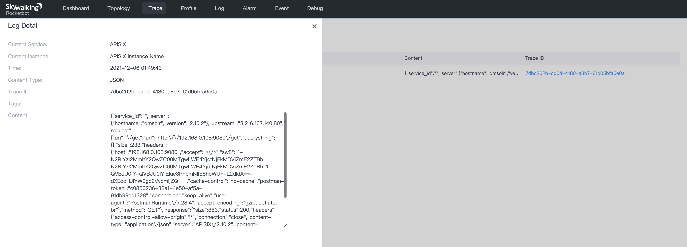
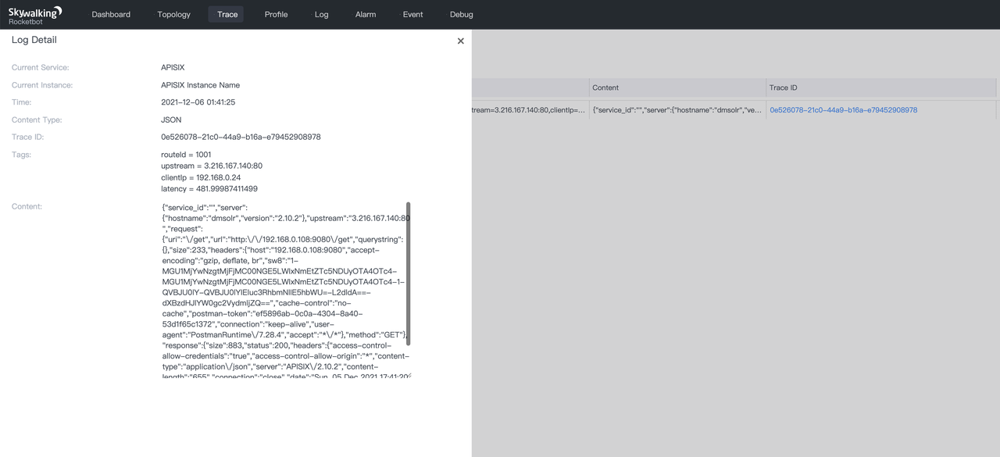
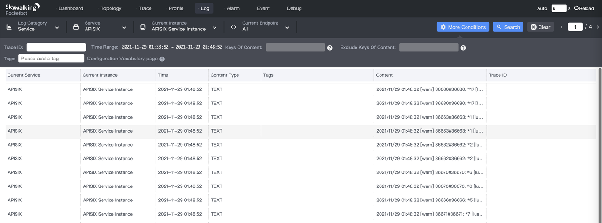

In the field of observability, the three main directions of data collection and analysis, Metrics, Logger and Tracing, are usually used to achieve insight into the operational status of applications.

Apache APISIX has integrated Apache SkyWaling Tracing capabilities as early as version 1.4, with features such as error logging and access log collection added in subsequent versions. Now with Apache SkyWalking's support for Metrics, it enables Apache APISIX to implement a one-stop observable solution in integrated mode, covering both logging, metrics and call tracing.

## Feature Development Background

Those of you who are familiar with Apache APISIX should know that Apache APISIX produces two types of logs during operation, namely the access log and the error log.

Access logs record detailed information about each request and are logs generated within the scope of the request, so they can be directly associated with Tracing. Error logs, on the other hand, are Apache APISIX runtime output log messages, which are application-wide logs, but cannot be 100% associated with requests.

At present, Apache APISIX provides very rich log processing plug-ins, including TCP/HTTP/Kafka and other collection and reporting plug-ins, but they are weakly associated with Tracing. Take Apache SkyWalking as an example. We extract the SkyWalking Tracing Conetxt Header from the log records of Apache APISIX and export it to the file system, and then use the log processing framework (fluentbit) to convert the logs into a log format acceptable to SkyWalking. The Tracing Context is then parsed and extracted to obtain the Tracing ID to establish a connection with the Trace.

Obviously, the above way of handling the process is tedious and complicated, and requires additional conversion of log formats. For this reason, in [PR#5500](https://github.com/apache/apisix/pull/5550) we have implemented the Apache SkyWalking access log into the Apache APISIX plug-in ecosystem to make it easier for users to collect and process logs using Apache SkyWalking in Apache APISIX.

## Introduction of the New Plugins

### SkyWalking Logger Pulgin

The SkyWalking Logger plugin parses the SkyWalking Tracing Context Header and prints the relevant Tracing Context information to the log, thus enabling the log to be associated with the call chain.

By using this plug-in, Apache APISIX can get the SkyWalking Tracing Context and associate it with Tracing even if the SkyWalking Tracing plug-in is not turned on, if Apache SkyWalking is already integrated downstream.



The above Content is the log content, where the Apache APISIX metadata configuration is used to collect request-related information. You can later modify the Log Format to customize the log content by Plugin Metadata, please refer to the [official documentation.](https://apisix.apache.org/docs/apisix/plugins/skywalking-logger#metadata)

#### How to Use

When using this plugin, since the SkyWalking plugin is "not enabled" by default, you need to manually modify the `plugins` section in the `conf/default-apisix.yaml` file to enable the plugin.

```yaml
plugins: ...
  - error-log-logger
  ...
```

Then you can use the SkyWalking Tracing plug-in to get the tracing data directly, so you can verify that the Logging plug-in-related features are enabled and working properly.

##### Step 1: Create a route

Next, create a route and bind the SkyWalking Tracing plugin and the SkyWalking Logging plugin. More details of the plugin configuration can be found in the [official Apache APISIX documentation](https://apisix.apache.org/docs/apisix/plugins/skywalking-logger).

```shell
curl -X PUT 'http://192.168.0.108:9080/apisix/admin/routes/1001' \
-H 'X-API-KEY:  edd1c9f034335f136f87ad84b625c8f1' \
-H 'Content-Type: application/json' \
-d '{
    "uri": "/get",
    "plugins": {
        "skywalking": {
            "sample_ratio": 1
        },
        "skywalking-logger": {
            "endpoint_addr": "http://127.0.0.1:12800"
        }
    },
    "upstream": {
        "type": "roundrobin",
        "nodes": {
            "httpbin.org:80": 1
        }
    }
}'
```

##### Step 2: Log Processing

On the Apache SkyWalking side, you can use LAL (Logger Analysis Language) scripts for log processing, such as Tag extraction, SkyWalking metadata correction, and so on.

The main purpose of Tag extraction here is to facilitate subsequent retrieval and to add dependencies to the Metrics statistics. The following code can be used to configure the SkyWalking LAL script to complete the Tag extraction. For more information on how to use the SkyWalking LAL script, please refer to the [official Apache SkyWalking documentation](https://skywalking.apache.org/docs/main/latest/en/concepts-and-designs/lal/).

```yaml
# The default LAL script to save all logs, behaving like the versions before 8.5.0.
rules:
  - name: default
    dsl: |
      filter {
        json {
          abortOnFailure false
        }

        extractor {
          tag routeId: parsed.route_id
          tag upstream: parsed.upstream
          tag clientIp: parsed.client_ip
          tag latency: parsed.latency
        }

        sink {
        }
      }
```

After configuring the above LAL script in SkyWalking OAP Server the following log will be displayed.


Details of the expanded log are as follows.



As you can see from the above, displaying `routeId`, `upstream` and `clientIp` as key-value pairs is much easier than searching directly in the log body. This is because the Tag format not only supports log display format and search, but also generates information such as Metrics using MAL statistics.

### SkyWalking Error Logger Plugin

The error-log-logger plug-in now supports the SkyWalking log format, and you can now use the http-error-log plug-in to quickly connect Apache APISIX error logs to Apache SkyWalking. Currently, error logs do not have access to SkyWalking Tracing Context information, and therefore cannot be directly associated with SkyWalking Tracing.

The main reason for the error log to be integrated into SkyWalking is to centralize the Apache APISIX log data and to make it easier to view all observable data within SkyWalking.



#### How to Use

Since the error-log-logger plugin is "not enabled" by default, you still need to enable the plugin in the way mentioned above.

```yaml
plugins: ...
  - error-log-logger
  ...
```

##### Step 1: Bind the route

After enabling, you need to bind the plugin to routes or global rules. Here we take "bind routes" as an example.

```shell
curl -X PUT 'http://192.168.0.108:9080/apisix/admin/plugin_metadata/error-log-logger' \
-H 'X-API-KEY:  edd1c9f034335f136f87ad84b625c8f1' \
-H 'Content-Type: application/json' \
-d '{
    "inactive_timeout": 10,
    "level": "ERROR",
    "skywalking": {
        "endpoint_addr": "http://127.0.0.1:12800/v3/logs"
    }
}'
```

> Note that the `endpoint_addr` is the SkyWalking OAP Server address and needs to have the URI (i.e. `/v3/logs`).

##### Step 2: LAL Processing

In much the same way as the Access Log processing, the logs are also processed by LAL when they reach SkyWalking OAP Server. Therefore, we can still use the SkyWalking LAL script to analyze and process the log messages.

It is important to note that the Error Log message body is in text format. If you are extracting tags, you will need to use regular expressions to do this. Unlike Access Log, which handles the message body in a slightly different way, Acces Log uses JSON format and can directly reference the fields of the JSON object using JSON parsing, but the rest of the process is largely the same.

Tags can also be used to optimize the display and retrieval for subsequent metrics calculations using SkyWalking MAL.

```json
rules:
  - name: apisix-errlog
    dsl: |
      filter {
        text {
          regexp "(?<datetime>\\d{4}/\\d{2}/\\d{2} \\d{2}:\\d{2}:\\d{2}) \\[(?<level>\\w+)\\] \\d+\\#\\d+:( \\*\\d+ \\[(?<module>\\w+)\\] (?<position>.*\\.lua:\\d+): (?<function>\\w+\\(\\)):)* (?<msg>.+)"
        }
        extractor {
          tag level: parsed.level
          if (parsed?.module) {
            tag module: parsed.module
            tag position: parsed.position
            tag function: parsed.function
          }
        }
        sink {
        }
      }
```

After the LAL script used by SkyWalking OAP Server, some of the Tags will be extracted from the logs, as shown below.


## Summary

This article introduces two logging plug-ins for Apache APISIX that integrate with SkyWalking to provide a more convenient operation and environment for logging in Apache APISIX afterwards.

We hope that through this article, you will have a fuller understanding of the new features and be able to use Apache APISIX for centralized management of observable data more conveniently in the future.
