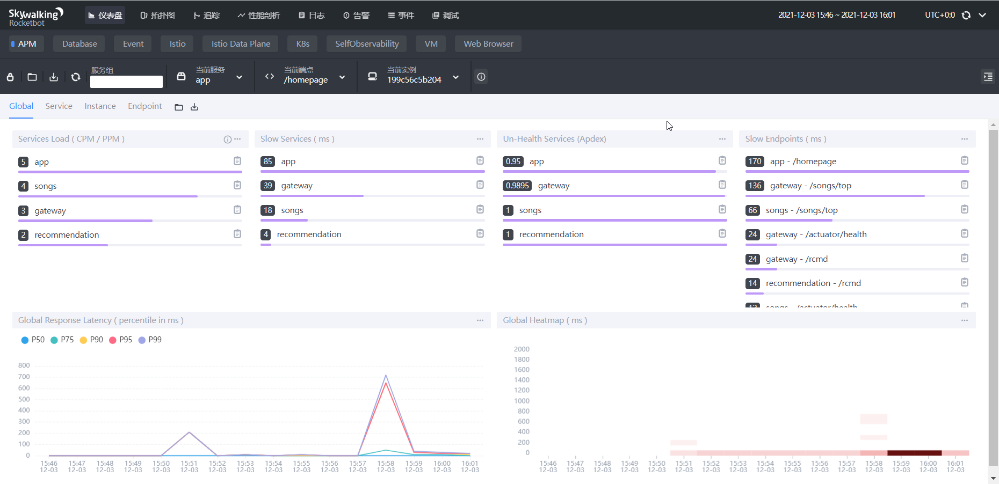

This document is one of the outcomes of [Apache IoTDB - Apache SkyWalking Adapter](https://summer.iscas.ac.cn/#/org/prodetail/210070771) in [Summer 2021 of Open Source Promotion Plan](https://summer.iscas.ac.cn/#/homepage). The design and development work is under the guidance of [@jixuan1989](https://github.com/jixuan1989) from IoTDB and [@wu-sheng](https://github.com/wu-sheng) from SkyWalking. Thanks for their guidance and the help from community.

## Start with SkyWalking Showcase
Before using SkyWalking Showcase to quick start with IoTDB, please ensure your have `make` installed and Docker daemon running.

Please run the command below.
```shell
git clone https://github.com/LIU-WEI-git/skywalking-showcase.git
cd skywalking-showcase
make deploy.docker FEATURE_FLAGS=single-node.iotdb,agent
```

The former variable `single-node.iotdb` will deploy only one single node of SkyWalking OAP-v8.9.0, and SkyWalking RocketBot UI-v8.9.0, IoTDB-v0.12.3 as storage. The latter variable `agent` will deploy micro-services with SkyWalking agent enabled, which include agents for Java, NodeJS server, browser, Python.


These shell command maybe take a long while. After pulling and running docker image, please visit http://localhost:9999/. Then you will see the SkyWalking UI and data from OAP backend.



If you want to use more functions of SkyWalking Showcase, please visit its [official document](https://skywalking.apache.org/docs/skywalking-showcase/latest/readme/) and clone [official repository](https://github.com/apache/skywalking-showcase).

## Start Manually
If you want to download and run IoTDB and SkyWalking manually, here is the guidance.

### Install and Run IoTDB
Apache IoTDB (Database for Internet of Things) is an IoT native database with high performance for data management and analysis, deployable on the edge and the cloud. It is a time-series database storage option for SkyWalking now.
Please ensure your **IoTDB server version >= [0.12.3](https://github.com/apache/iotdb/releases/tag/v0.12.3)** and a single node version is sufficient. For more installation details, please see official document: [IoTDB Quick Start](https://iotdb.apache.org/UserGuide/V0.12.x/QuickStart/QuickStart.html) and [IoTDB Download Page](https://iotdb.apache.org/Download/). You could download it from [Docker Hub](https://hub.docker.com/r/apache/iotdb) as well. 

There is some connection tools for IoTDB
- [Command Line Interface(CLI)](https://iotdb.apache.org/UserGuide/V0.12.x/CLI/Command-Line-Interface.html)  
  If iotdb-cli connects successfully, you will see
```
 _____       _________  ______   ______
|_   _|     |  _   _  ||_   _ `.|_   _ \
  | |   .--.|_/ | | \_|  | | `. \ | |_) |
  | | / .'`\ \  | |      | |  | | |  __'.
 _| |_| \__. | _| |_    _| |_.' /_| |__) |
|_____|'.__.' |_____|  |______.'|_______/  version x.x.x


IoTDB> login successfully
IoTDB>
```
- [IoTDB-Grafana](https://iotdb.apache.org/UserGuide/V0.12.x/Ecosystem%20Integration/Grafana.html)  
  IoTDB-Grafana is a connector which we developed to show time series data in IoTDB by reading data from IoTDB and sends to [Grafana](https://grafana.com/).
  
- [Zeppelin-IoTDB](https://iotdb.apache.org/UserGuide/V0.12.x/Ecosystem%20Integration/Zeppelin-IoTDB.html)  
  You could enable Zeppelin to operate IoTDB via SQL.
  

For more ecosystem integration, please visit official documents.

We will use iotdb-cli in the next examples. 

### Run SkyWalking OAP Server
There are some SkyWalking official documents which will help you start. Please ensure your **SkyWalking version >= [8.9.0](https://github.com/apache/skywalking/releases/tag/v8.9.0)**. We recommend you download SkyWalking OAP distributions from its official download page or pull docker images.
- [SkyWalking Download Page](https://skywalking.apache.org/downloads/)
- [SkyWalking Backend Setup](https://skywalking.apache.org/docs/main/latest/en/setup/backend/backend-setup/)
- [SkyWalking UI Setup](https://skywalking.apache.org/docs/main/latest/en/setup/backend/ui-setup/)

Before starting SkyWalking backend, please edit `/config/application.yml`, set `storage.selector: ${SW_STORAGE:iotdb}` or set environment variable `SW_STORAGE=iotdb`. All config options about IoTDB is following, please edit it or not according to your local environment:
```yaml
storage:
  selector: ${SW_STORAGE:iotdb}
  iotdb:
    host: ${SW_STORAGE_IOTDB_HOST:127.0.0.1}
    rpcPort: ${SW_STORAGE_IOTDB_RPC_PORT:6667}
    username: ${SW_STORAGE_IOTDB_USERNAME:root}
    password: ${SW_STORAGE_IOTDB_PASSWORD:root}
    storageGroup: ${SW_STORAGE_IOTDB_STORAGE_GROUP:root.skywalking}
    sessionPoolSize: ${SW_STORAGE_IOTDB_SESSIONPOOL_SIZE:16}
    fetchTaskLogMaxSize: ${SW_STORAGE_IOTDB_FETCH_TASK_LOG_MAX_SIZE:1000} # the max number of fetch task log in a request
```

## Visit IoTDB Server and Query SkyWalking Data
There are some official document about data model and IoTDB-SQL language:
- [Data Model and Terminology](https://iotdb.apache.org/UserGuide/V0.12.x/Data-Concept/Data-Model-and-Terminology.html)
- [DDL (Data Definition Language)](https://iotdb.apache.org/UserGuide/V0.12.x/IoTDB-SQL-Language/DDL-Data-Definition-Language.html)
- [DML (Data Manipulation Language)](https://iotdb.apache.org/UserGuide/V0.12.x/IoTDB-SQL-Language/DML-Data-Manipulation-Language.html)
- [Maintenance Command](https://iotdb.apache.org/UserGuide/V0.12.x/IoTDB-SQL-Language/Maintenance-Command.html)

### Example Model and Insert SQL
Before giving any example, we set time display type as long (CLI: `set time_display_type=long`).

In our design, we choose `id`, `entity_id`, `node_type`, `service_id`, `service_group`, `trace_id` as indexes and fix their appearance order. The value of these indexed fields store in the path with double quotation mark wrapping, just like `"value"`.

There is a model named `service_traffic` with fields `id`, `time_bucket`, `name`, `node_type`, `service_group`. In order to see its data, we could use a query SQL: `select * from root.skywalking.service_traffic align by device`. `root.skywalking` is the default storage group and `align by device` could return a more friendly result. The query result is following:

| Time          | Device                                                                      | name                   |
| ------------- | --------------------------------------------------------------------------- | ---------------------- |
| 1637919540000 | root.skywalking.service_traffic."YXBwbGljYXRpb24tZGVtbw==.1"."0".""         | application-demo       |
| 1637919600000 | root.skywalking.service_traffic."YXBwbGljYXRpb24tZGVtby1teXNxbA==.1"."0"."" | application-demo-mysql |

Another example model is `service_cpm` which has fields `id`, `service_id`, `total`, `value`. Query its data with `select * from root.skywalking.service_cpm align by device`. The result is following:

| Time          | Device                                                                                                             | total | value |
| ------------- | ------------------------------------------------------------------------------------------------------------------ | ----- | ----- |
| 1637919540000 | root.skywalking.service_cpm."202111261739_YXBwbGljYXRpb24tZGVtbw==.1"."YXBwbGljYXRpb24tZGVtbw==.1"                 | 2     | 2     |
| 1637919600000 | root.skywalking.service_cpm."202111261740_YXBwbGljYXRpb24tZGVtby1teXNxbA==.1"."YXBwbGljYXRpb24tZGVtby1teXNxbA==.1" | 1     | 1     |
| 1637917200000 | root.skywalking.service_cpm."2021112617_YXBwbGljYXRpb24tZGVtbw==.1"."YXBwbGljYXRpb24tZGVtbw==.1"                   | 2     | 0     |

For the first data of `service_traffic`, the mapping between fields and values is following. Notice, all `time_bucket` are converted to `timestamp`(also named `time` in IoTDB) and the value of all indexed fields are stored in the Device path.

| Field                            | Value                      |
| -------------------------------- | -------------------------- |
| id(indexed)                      | YXBwbGljYXRpb24tZGVtbw==.1 |
| time(converted from time_bucket) | 1637919540000              |
| name                             | application-demo           |
| node_type(indexed)               | 0                          |
| service_group(indexed)           | (empty string)             |

You could use the SQL below to insert example data.
```sql
create storage group root.skywalking
insert into root.skywalking.service_traffic."YXBwbGljYXRpb24tZGVtbw==.1"."0".""(timestamp, name) values(1637919540000, "application-demo")
insert into root.skywalking.service_traffic."YXBwbGljYXRpb24tZGVtby1teXNxbA==.1"."0".""(timestamp, name) values(1637919600000, "application-demo-mysql")
insert into root.skywalking.service_cpm."202111261739_YXBwbGljYXRpb24tZGVtbw==.1"."YXBwbGljYXRpb24tZGVtbw==.1"(timestamp, total, value) values(1637919540000, 2, 2)
insert into root.skywalking.service_cpm."202111261740_YXBwbGljYXRpb24tZGVtby1teXNxbA==.1"."YXBwbGljYXRpb24tZGVtby1teXNxbA==.1"(timestamp, total, value) values(1637919600000, 1, 1)
insert into root.skywalking.service_cpm."2021112617_YXBwbGljYXRpb24tZGVtbw==.1"."YXBwbGljYXRpb24tZGVtbw==.1"(timestamp, total, value) values(1637917200000, 2, 0)
```

### Query SQL
Now, let's show some query examples.
1. Filter Query  
    - If you want to query `name` field of `service_traffic`, the query SQL is `select name from root.skywalking.service_traffic align by device`.
    - If you want to query `service_traffic` with `id = YXBwbGljYXRpb24tZGVtbw==.1`, the query SQL is `select * from root.skywalking.service_traffic."YXBwbGljYXRpb24tZGVtbw==.1" align by device`.
    - If you want to query `service_traffic` with `name = application-demo`, the query SQL is `select * from root.skywalking.service_traffic where name = "application-demo" align by device`.
    - Combining the above three, the query SQL is `select name from root.skywalking.service_traffic."YXBwbGljYXRpb24tZGVtbw==.1" where name = "application-demo" align by device`.

2. Fuzzy Query  
   - If you want to query `service_traffic` with `name` contains `application`, the query SQL is `select * from root.skywalking.service_traffic.*.*.* where name like '%application%' align by device`.

3. Aggregate Query  
   IoTDB only supports `group by time` and `group by level`. The former please refer to [Down-Frequency Aggregate Query](https://iotdb.apache.org/UserGuide/V0.12.x/IoTDB-SQL-Language/DML-Data-Manipulation-Language.html#down-frequency-aggregate-query) and the latter please refer to [Aggregation By Level](https://iotdb.apache.org/UserGuide/V0.12.x/IoTDB-SQL-Language/DML-Data-Manipulation-Language.html#aggregation-by-level). Here is an example about `group by level`: `select sum(total) from root.skywalking.service_cpm.*.* group by level = 3`. We couldn't get a expected result since our design make the data of one model spread across multiple devices. So we don't recommend using `group by level` to query SkyWalking backend data. You could refer to the [Discussion #3907](https://github.com/apache/iotdb/discussions/3907) in IoTDB community for more details. 
   
4. Sort Query  
   IoTDB only supports `order by time`, but we could use its [select function](https://iotdb.apache.org/UserGuide/V0.12.x/IoTDB-SQL-Language/DML-Data-Manipulation-Language.html#selector-functions) which contains `top_k` and `bottom_k` to get top/bottom k data. For example, `select top_k(total, "k"="3") from root.skywalking.service_cpm.*.*`. We don't recommend using this to query SkyWalking backend data since its result is not friendly. You could refer to the [Discussion #3888](https://github.com/apache/iotdb/discussions/3888) in IoTDB community for more details.

5. Pagination Query  
   We could use `limit` and `offset` to paginate the query result. Please refer to [Row and Column Control over Query Results](https://iotdb.apache.org/UserGuide/V0.12.x/IoTDB-SQL-Language/DML-Data-Manipulation-Language.html#row-and-column-control-over-query-results).
   
6. Delete  
   - Delete storage group: 
     - `delete storage group root.skywalking`
   - Delete timeseries: 
     - `delete timeseries root.skywalking.service_cpm.*.*.total`
     - `delete timeseries root.skywalking.service_cpm."202111261739_YXBwbGljYXRpb24tZGVtbw==.1"."YXBwbGljYXRpb24tZGVtbw==.1".total`
   - Delete data: 
     - `delete from root.skywalking.service_traffic`
     - `delete from root.skywalking.service_traffic where time < 1637919540000`

