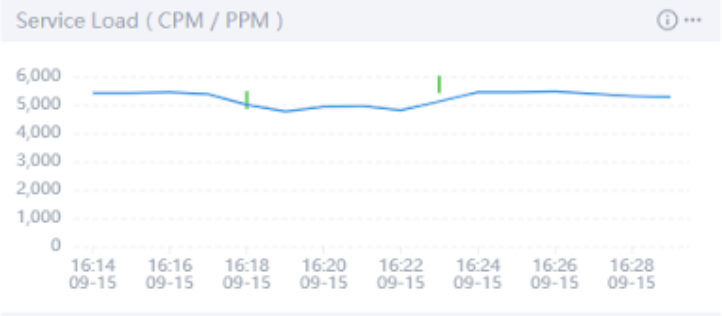

[Chaos Mesh](https://github.com/chaos-mesh/chaos-mesh) is an open-source cloud-native [chaos engineering](https://en.wikipedia.org/wiki/Chaos_engineering) platform. You can use Chaos Mesh to conveniently inject failures and simulate abnormalities that might occur in reality, so you can identify potential problems in your system. Chaos Mesh also offers a Chaos Dashboard which allows you to monitor the status of a chaos experiment. However, this dashboard cannot let you observe how the failures in the experiment impact the service performance of applications. This hinders us from further testing our systems and finding potential problems. 

<!--truncate-->

[Apache SkyWalking](https://github.com/apache/skywalking) is an open-source application performance monitor (APM), specially designed to monitor, track, and diagnose cloud native, container-based distributed systems. It collects events that occur and then displays them on its dashboard, allowing you to observe directly the type and number of events that have occurred in your system and how different events impact the service performance. 

When you use SkyWalking and Chaos Mesh together during chaos experiments, you can observe how different failures impact the service performance. 

This tutorial will show you how to configure SkyWalking and Chaos Mesh. You’ll also learn how to leverage the two systems to monitor events and observe in real time how chaos experiments impact applications’ service performance. 

## Preparation

Before you start to use SkyWalking and Chaos Mesh, you have to:

* Set up a SkyWalking cluster according to [the SkyWalking configuration guide](https://github.com/apache/skywalking-kubernetes#install).
* Deploy Chao Mesh [using Helm](https://chaos-mesh.org/docs/production-installation-using-helm/).
* Install [JMeter](https://jmeter.apache.org/index.html) or other Java testing tools (to increase service loads).
* Configure SkyWalking and Chaos Mesh according to [this guide](https://github.com/chaos-mesh/chaos-mesh-on-skywalking) if you just want to run a demo.

Now, you are fully prepared, and we can cut to the chase. 

## Step 1: Access the SkyWalking cluster

After you install the SkyWalking cluster, you can access its user interface (UI). However, no service is running at this point, so before you start monitoring, you have to add one and set the agents.

In this tutorial, we take Spring Boot, a lightweight microservice framework, as an example to build a simplified demo environment.

1. Create a SkyWalking demo in Spring Boot by referring to [this document](https://github.com/chaos-mesh/chaos-mesh-on-skywalking/blob/master/demo-deployment.yaml).
2. Execute the command `kubectl apply -f demo-deployment.yaml -n skywalking` to deploy the demo. 

After you finish deployment, you can observe the real-time monitoring results at the SkyWalking UI. 

**Note:** Spring Boot and SkyWalking have the same default port number: 8080. Be careful when you configure the port forwarding; otherise, you may have port conflicts. For example, you can set Spring Boot’s port to 8079 by using a command like `kubectl port-forward svc/spring-boot-skywalking-demo 8079:8080 -n skywalking` to avoid conflicts. 

## Step 2: Deploy SkyWalking Kubernetes Event Exporter

[SkyWalking Kubernetes Event Exporter](https://github.com/apache/skywalking-kubernetes-event-exporter) is able to watch, filter, and send Kubernetes events into the SkyWalking backend. SkyWalking then associates the events with the system metrics and displays an overview about when and how the metrics are affected by the events.

If you want to deploy SkyWalking Kubernetes Event Explorer with one line of commands, refer to [this document](https://github.com/chaos-mesh/chaos-mesh-on-skywalking/blob/master/exporter-deployment.yaml) to create configuration files in YAML format and then customize the parameters in the filters and exporters. Now, you can use the command `kubectl apply` to deploy SkyWalking Kubernetes Event Explorer. 

## Step 3: Use JMeter to increase service loads

To better observe the change in service performance, you need to increase the service loads on Spring Boot. In this tutorial, we use JMeter, a widely adopted Java testing tool, to increase the service loads. 

Perform a stress test on `localhost:8079` using JMeter and add five threads to continuously increase the service loads. 

Open the SkyWalking Dashboard. You can see that the access rate is 100%, and that the service loads reach about 5,300 calls per minute (CPM). 

## Step 4: Inject failures via Chaos Mesh and observe results 

After you finish the three steps above, you can use the Chaos Dashboard to simulate stress scenarios and observe the change in service performance during chaos experiments. 

The following sections describe how service performance varies under the stress of three chaos conditions:

* CPU load: 10%;  memory load: 128 MB
   
    The first chaos experiment simulates low CPU usage. To display when a chaos experiment starts and ends, click the switching button on the right side of the dashboard. To learn whether the experiment is Applied to the system or Recovered from the system, move your cursor onto the short, green line. 
    
    During the time period between the two short, green lines, the service load decreases to 4,929 CPM, but returns to normal after the chaos experiment ends. 
    
    

* CPU load: 50%; memory load: 128 MB
    
    When the application’s CPU load increases to 50%,  the service load decreases to 4,307 CPM.
    
    

* CPU load: 100%; memory load: 128 MB

    When the CPU usage is at 100%, the service load decreases to only 40% of what it would be if no chaos experiments were taking place. 
    
    
    
    Because the process scheduling under the Linux system does not allow a process to occupy the CPU all the time, the deployed Spring Boot Demo can still handle 40% of the access requests even in the extreme case of a full CPU load.

## Summary

By combining SkyWalking and Chaos Mesh, you can clearly observe when and to what extent chaos experiments affect application service performance. This combination of tools lets you observe the service performance in various extreme conditions, thus boosting your confidence in your services. 

Chaos Mesh has grown a lot in 2021 thanks to the unremitting efforts of all PingCAP engineers and community contributors. In order to continue to upgrade our support for our wide variety of users and learn more about users’ experience in Chaos Engineering, we’d like to invite you to take[ this survey](https://www.surveymonkey.com/r/X77BCNM) and give us your valuable feedback. 

If you want to know more about Chaos Mesh, you’re welcome to join [the Chaos Mesh community on GitHub](https://github.com/chaos-mesh) or our [Slack discussions](https://slack.cncf.io/) (#project-chaos-mesh). If you find any bugs or missing features when using Chaos Mesh, you can submit your pull requests or issues to our [GitHub repository](https://github.com/chaos-mesh/chaos-mesh). 
