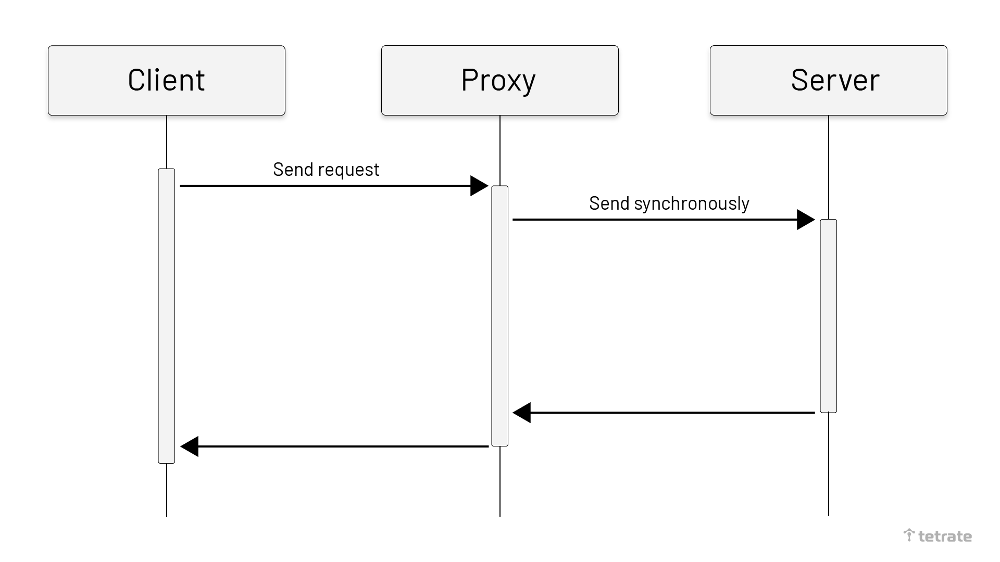
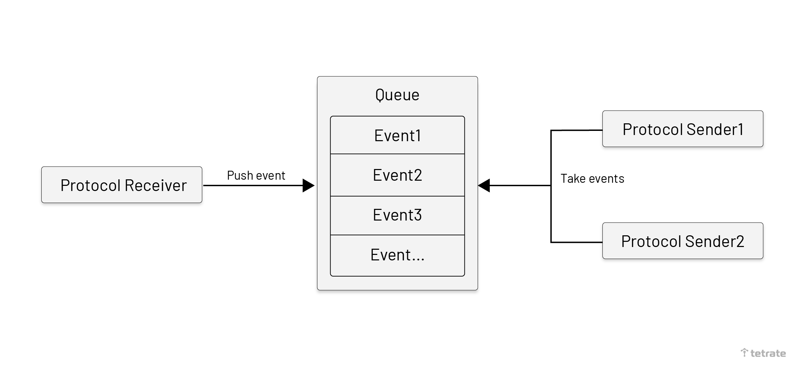
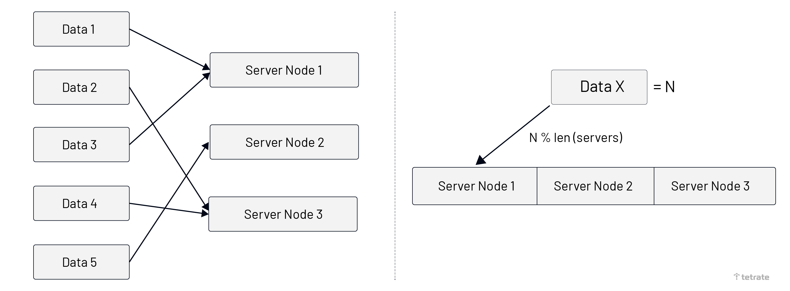

## Background

In the Apache SkyWalking ecosystem, the OAP obtains metrics, traces, logs, and event data through SkyWalking Agent, Envoy, or other data sources. Under the gRPC protocol, it transmits data by communicating with a single server node. Only when the connection is broken, the reconnecting policy would be used based on DNS round-robin mode. When new services are added at runtime or the OAP load is kept high due to increased traffic of observed services, the OAP cluster needs to scale out for increased traffic. The load of the new OAP node would be less due to all existing agents having connected to previous nodes. Even without scaling, the load of OAP nodes would be unbalanced, because the agent would keep the connection due to random policy at the booting stage. In these cases, it would become a challenge to keep up the health status of all nodes, and be able to scale out when needed.

In this article, we mainly discuss how to solve this challenge in SkyWalking.

## How to Load Balance

SkyWalking mainly uses the gRPC protocol for data transmission, so this article mainly introduces load balancing in the gRPC protocol.

### Proxy Or Client-side

Based on the [gRPC official Load Balancing blog](https://grpc.io/blog/grpc-load-balancing/), there are two approaches to load balancing:

1. **Client-side**: The client perceives multiple back-end services and uses a load-balancing algorithm to select a back-end service for each RPC.
2. **Proxy**: The client sends the message to the proxy server, and the proxy server load balances the message to the back-end service.

From the perspective of observability system architecture:

|     | Pros | Cons |
| --- | ---- | ---- |
|Client-side|<li>High performance because of the elimination of extra hop</li> | <li>Complex client (cluster awareness, load balancing, health check, etc.)</li><li>Ensure each data source to be connected provides complex client capabilities</li> |
|Proxy|<li>Simple Client</li>|<li>Higher latency</li>|

We choose Proxy mode for the following reasons:

1. Observable data is not very time-sensitive, a little latency caused by transmission is acceptable. A little extra hop is acceptable and there is no impact on the client-side.
2. As an observability platform, we cannot/should not ask clients to change. They make their own tech decisions and may have their own commercial considerations.

### Transmission Policy

In the proxy mode, we should determine the transmission path between downstream and upstream.

Different data protocols require different processing policies. There are two transmission policies:

1. **Synchronous**: Suitable for protocols that require data exchange in the client, such as SkyWalking Dynamic Configuration Service. This type of protocol provides real-time results.
2. **Asynchronous batch**: Used when the client doesn’t care about the upstream processing results, but only the transmitted data (e.g., trace report, log report, etc.)

The synchronization policy requires that the proxy send the message to the upstream server when receiving the client message, and synchronously return the response data to the downstream client. Usually, only a few protocols need to use the synchronization policy.

As shown below, after the client sends the request to the Proxy, the proxy would send the message to the server synchronously. When the proxy receives the result, it returns to the client.



The asynchronous batch policy means that the data is sent to the upstream server in batches asynchronously. This policy is more common because most protocols in SkyWalking are primarily based on data reporting. We think using the queue as a buffer could have a good effect. The asynchronous batch policy is executed according to the following steps:

1. The proxy receives the data and wraps it as an Event object.
2. An event is added into the queue.
3. When the cycle time is reached or when the queue elements reach the fixed number, the elements in the queue will parallel consume and send to the OAP.

The advantage of using queues is:

1. Separate data receiving and sending to reduce the mutual influence.
2. The interval quantization mechanism can be used to combine events, which helps to speed up sending events to the OAP.
3. Using multi-threaded consumption queue events can make fuller use of network IO.

As shown below, after the proxy receives the message, the proxy would wrap the message as an event and push it to the queue. The message sender would take batch events from the queue and send them to the upstream OAP.



### Routing

Routing algorithms are used to route messages to a single upstream server node.

The Round-Robin algorithm selects nodes in order from the list of upstream service nodes. The advantage of this algorithm is that the number of times each node is selected is average. When the size of the data is close to the same, each upstream node can handle the same quantity of data content.


With the Weight Round-Robin, each upstream server node has a corresponding routing weight ratio. The difference from Round-Robin is that each upstream node has more chances to be routed according to its weight. This algorithm is more suitable to use when the upstream server node machine configuration is not the same.


The Fixed algorithm is a hybrid algorithm. It can ensure that the same data is routed to the same upstream server node, and when the upstream server scales out, it still maintains routing to the same node; unless the upstream node does not exist, it will reroute. This algorithm is mainly used in the SkyWalking Meter protocol because this protocol needs to ensure that the metrics of the same service instance are sent to the same OAP node.
The Routing steps are as follows:

1. Generate a unique identification string based on the data content, as short as possible. The amount of data is controllable.
2. Get the upstream node of identity from LRU Cache, and use it if it exists.
3. According to the identification, generate the corresponding hash value, and find the upstream server node from the upstream list.
4. Save the mapping relationship between the upstream server node and identification to LRU Cache.

The advantage of this algorithm is to bind the data with the upstream server node as much as possible, so the upstream server can better process continuous data. The disadvantage is that it takes up a certain amount of memory space to save the corresponding relationship.

As shown below, the image is divided into two parts:

1. The left side represents that the same data content always is routed to the same server node.
2. The right side represents the data routing algorithm. Get the number from the data, and use the remainder algorithm to obtain the position.



We choose to use a combination of Round-Robin and Fixed algorithm for routing:

1. The Fixed routing algorithm is suitable for specific protocols, mainly used when passing metrics data to the SkyWalking Meter protocol
2. The Round-Robin algorithm is used by default. When the SkyWalking OAP cluster is deployed, the configuration of the nodes needs to be as much the same as possible, so there would be no need to use the Weight Round-Robin algorithm.

## How to balance the load balancer itself?

Proxy still needs to deal with the load balancing problem from client to itself, especially when deploying a Proxy cluster in a production environment.

There are three ways to solve this problem:

1. **Connection management**: Use the `max_connection` config on the client-side to specify the maximum connection duration of each connection. For more information, please read the [proposal](https://github.com/grpc/proposal/blob/master/A9-server-side-conn-mgt.md).
2. **Cluster awareness**: The proxy has cluster awareness, and actively disconnects the connection when the load is unbalanced to allow the client to re-pick up the proxy.
3. **Resource limit+HPA**: Restrict the connection resource situation of each proxy, and no longer accept new connections when the resource limit is reached. And use the HPA mechanism of Kubernetes to dynamically scale out the number of the proxy.

|     | Connection management | Cluster awareness | Resource Limit+HPA |
| --- | ---- | ---- | ---- |
|Pros|<li>Simple to use</li> | <li>Ensure that the number of connections in each proxy is relatively </li> | <li>Simple to use</li> |
|Cons|<li>Each client needs to ensure that data is not lost</li><li>The client is required to accept GOWAY responses</li>|<li>May cause a sudden increase in traffic on some nodes</li><li>Each client needs to ensure that data is not lost </li>|<li>Traffic will not be particularly balanced in each instance</li>|

We choose Limit+HPA for these reasons:

1. Easy to config and use the proxy and easy to understand based on basic data metrics.
2. No data loss due to broken connection. There is no need for the client to implement any other protocols to prevent data loss, especially when the client is a commercial product.
3. The connection of each node in the proxy cluster does not need to be particularly balanced, as long as the proxy node itself is high-performance.

## SkyWalking-Satellite

We have implemented this Proxy in the [SkyWalking-Satellite](https://github.com/apache/skywalking-satellite) project. It’s used between Client and SkyWalking OAP, effectively solving the load balancing problem.

After the system is deployed, the Satellite would accept the traffic from the Client, and the Satellite will perceive all the nodes of the OAP through Kubernetes Label Selector or manual configuration, and load balance the traffic to the upstream OAP node.

As shown below, a single client still maintains a connection with a single Satellite, Satellite would establish the connection with each OAP, and load balance message to the OAP node.


When scaling Satellite, we need to deploy the [SWCK](https://github.com/apache/skywalking-swck) adapter and configure the HPA in Kubernetes. SWCK is a platform for the SkyWalking users, provisions, upgrades, maintains SkyWalking relevant components, and makes them work natively on Kubernetes.

After deployment is finished, the following steps would be performed:

1. **Read metrics from OAP**: HPA requests the SWCK metrics adapter to dynamically read the metrics in the OAP.
2. **Scaling the Satellite**: Kubernetes HPA senses that the metrics values are in line with expectations, so the Satellite would be scaling automatically.

As shown below, use the dotted line to divide the two parts. HPA uses SWCK Adapter to read the metrics in the OAP. When the threshold is met, HPA would scale the Satellite deployment.


## Example

In this section, we will demonstrate two cases:

1. SkyWalking Scaling: After SkyWalking OAP scaling, the traffic would auto load balancing through Satellite.
2. Satellite Scaling: Satellite’s own traffic load balancing. 

NOTE: All commands could be accessed through [GitHub](https://github.com/mrproliu/sw-satellite-demo-scripts/tree/1180c23e8f3bb36778307f9ae15395274ca039b3).

### SkyWalking Scaling

We will use the [bookinfo application](https://istio.io/latest/docs/examples/bookinfo/) to demonstrate how to integrate Apache SkyWalking 8.9.1 with Apache SkyWalking-Satellite 0.5.0, and observe the service mesh through the Envoy ALS protocol.

Before starting, please make sure that you already have a Kubernetes environment.

#### Install Istio

Istio provides a very convenient way to configure the Envoy proxy and enable the access log service. The following step:

1. Install the istioctl locally to help manage the Istio mesh.
2. Install Istio into the Kubernetes environment with a demo configuration profile, and enable the Envoy ALS. Transmit the ALS message to the satellite. The satellite we will deploy later.
3. Add the label into the default namespace so Istio could automatically inject Envoy sidecar proxies when you deploy your application later.

```shell
# install istioctl
export ISTIO_VERSION=1.12.0
curl -L https://istio.io/downloadIstio | sh - 
sudo mv $PWD/istio-$ISTIO_VERSION/bin/istioctl /usr/local/bin/

# install istio
istioctl install -y --set profile=demo \
	--set meshConfig.enableEnvoyAccessLogService=true \
	--set meshConfig.defaultConfig.envoyAccessLogService.address=skywalking-system-satellite.skywalking-system:11800

# enbale envoy proxy in default namespace
kubectl label namespace default istio-injection=enabled
```

#### Install SWCK

SWCK provides convenience for users to deploy and upgrade SkyWalking related components based on Kubernetes. The automatic scale function of Satellite also mainly relies on SWCK. For more information, you could refer to the [official documentation](https://github.com/apache/skywalking-swck/blob/master/docs/operator.md#guides-of-operator-deployment).

```shell
# Install cert-manager
kubectl apply -f https://github.com/jetstack/cert-manager/releases/download/v1.3.1/cert-manager.yaml

# Deploy SWCK
mkdir -p skywalking-swck && cd skywalking-swck
wget https://dlcdn.apache.org/skywalking/swck/0.6.1/skywalking-swck-0.6.1-bin.tgz
tar -zxvf skywalking-swck-0.6.1-bin.tgz
cd config
kubectl apply -f operator-bundle.yaml
```

#### Deploy Apache SkyWalking And Apache SkyWalking-Satellite

We have provided a simple script to deploy the skywalking OAP, UI, and Satellite.

```shell
# Create the skywalking components namespace
kubectl create namespace skywalking-system
kubectl label namespace skywalking-system swck-injection=enabled
# Deploy components
kubectl apply -f https://raw.githubusercontent.com/mrproliu/sw-satellite-demo-scripts/5821a909b647f7c8f99c70378e197630836f45f7/resources/sw-components.yaml
```

#### Deploy Bookinfo Application

```shell
export ISTIO_VERSION=1.12.0
kubectl apply -f https://raw.githubusercontent.com/istio/istio/$ISTIO_VERSION/samples/bookinfo/platform/kube/bookinfo.yaml
kubectl wait --for=condition=Ready pods --all --timeout=1200s
kubectl port-forward service/productpage 9080
```

Next, please open your browser and visit `http://localhost:9080`. You should be able to see the Bookinfo application. Refresh the webpage several times to generate enough access logs.

Then, you can see the topology and metrics of the Bookinfo application on SkyWalking WebUI. At this time, you can see that the Satellite is working!

#### Deploy Monitor

We need to install OpenTelemetry Collector to collect metrics in OAPs and analyze them.

```shell
# Add OTEL collector
kubectl apply -f https://raw.githubusercontent.com/mrproliu/sw-satellite-demo-scripts/5821a909b647f7c8f99c70378e197630836f45f7/resources/otel-collector-oap.yaml

kubectl port-forward -n skywalking-system  service/skywalking-system-ui 8080:80
```

Next, please open your browser and visit `http://localhost:8080/` and create a new item on the dashboard. The SkyWalking Web UI pictured below shows how the data content is applied.


#### Scaling OAP

Scaling the number of OAPs by deployment.

```shell
kubectl scale --replicas=3 -n skywalking-system deployment/skywalking-system-oap
```

#### Done!

After a period of time, you will see that the number of OAPs becomes 3, and the ALS traffic is balanced to each OAP.


### Satellite Scaling

After we have completed the SkyWalking Scaling, we would carry out the Satellite Scaling demo.

#### Deploy SWCK HPA

SWCK provides an adapter to implement the Kubernetes external metrics to adapt the HPA through reading the metrics in SkyWalking OAP. We expose the metrics service in Satellite to OAP and configure HPA Resource to auto-scaling the Satellite.

Install the SWCK adapter into the Kubernetes environment:
```shell
kubectl apply -f skywalking-swck/config/adapter-bundle.yaml
```

Create the HPA resource, and limit each Satellite to handle a maximum of 10 connections:
```shell
kubectl apply -f https://raw.githubusercontent.com/mrproliu/sw-satellite-demo-scripts/5821a909b647f7c8f99c70378e197630836f45f7/resources/satellite-hpa.yaml
```

Then, you could see we have 9 connections in one satellite. One envoy proxy may establish multiple connections to the satellite.
```shell
$ kubectl get HorizontalPodAutoscaler -n skywalking-system
NAME       REFERENCE                                TARGETS   MINPODS   MAXPODS   REPLICAS   AGE
hpa-demo   Deployment/skywalking-system-satellite   9/10      1         3         1          5m18s
```

#### Scaling Application

The scaling application could establish more connections to the satellite, to verify whether the HPA is in effect.
```shell
kubectl scale --replicas=3 deployment/productpage-v1 deployment/details-v1
```

#### Done!

By default, Satellite will deploy a single instance and a single instance will only accept 11 connections. HPA resources limit one Satellite to handle 10 connections and use a stabilization window to make Satellite stable scaling up. In this case, we deploy the Bookinfo application in 10+ instances after scaling, which means that 10+ connections will be established to the Satellite. 

So after HPA resources are running, the Satellite would be automatically scaled up to 2 instances. You can learn about the calculation algorithm of replicas through the [official documentation](https://kubernetes.io/docs/tasks/run-application/horizontal-pod-autoscale/#algorithm-details). Run the following command to view the running status:

```shell
$ kubectl get HorizontalPodAutoscaler -n skywalking-system --watch
NAME       REFERENCE                                TARGETS   MINPODS   MAXPODS   REPLICAS   AGE
hpa-demo   Deployment/skywalking-system-satellite   11/10     1         3         1          3m31s
hpa-demo   Deployment/skywalking-system-satellite   11/10     1         3         1          4m20s
hpa-demo   Deployment/skywalking-system-satellite   11/10     1         3         2          4m38s
hpa-demo   Deployment/skywalking-system-satellite   11/10     1         3         2          5m8s
hpa-demo   Deployment/skywalking-system-satellite   6/10      1         3         2          5m23s
```

By observing the “number of connections” metric, we would be able to see that when the number of connections of each gRPC exceeds 10 connections, then the satellite automatically scales through the HPA rule. As a result, the connection number is down to normal status (in this example, less than 10)

```shell
swctl metrics linear --name satellite_service_grpc_connect_count --service-name satellite::satellite-service
```

