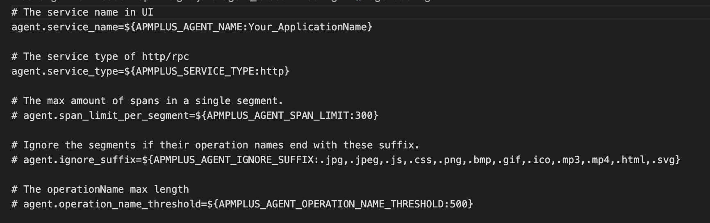
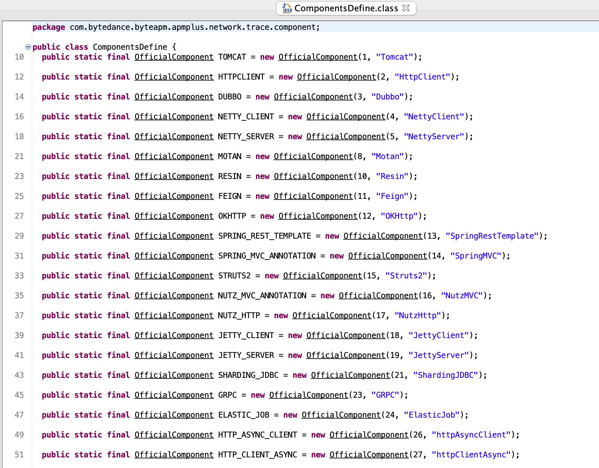
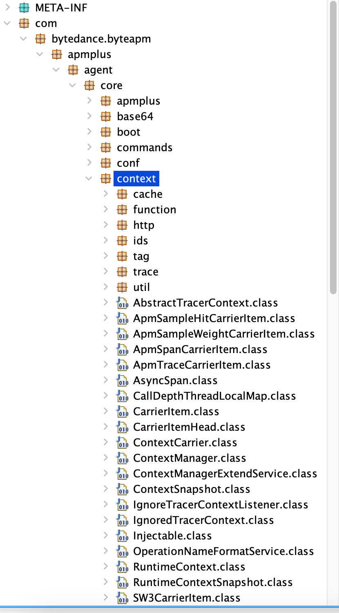

[Apache SkyWalking](https://skywalking.apache.org) is an open-source APM for a distributed system, Apache Software Foundation top-level project.

On Jan. 28th, we received a License violation report from one of the committers (anonymously). They have a cloud service called [Application Performance Monitoring - Distributed Tracing (应用性能监控全链路版)](https://www.volcengine.com/docs/6431/69088). 
At the [Java service monitoring section](https://www.volcengine.com/docs/6431/81123), it provides this agent download link

> wget https://datarangers.com.cn/apminsight/repo/v2/download/java-agent/apminsight-java-agent_latest.tar.gz

We downloaded it at 23:15 Jan. 28th UTC+8(Beijing), and archived it at [here](https://drive.google.com/file/d/1UCITmAfoKWfQpBXoQWfhaSA_5C88_sgO/view?usp=sharing)

**We have confirmed this is a distribution of SkyWalking Java agent.**

We listed several pieces of evidence to prove this here, every reader could compare with the official [SkyWalking source codes](https://github.com/apache/skywalking-java)

1. The first and the easiest one is `agent.config` file, which is using the same config keys, and the same config format.

This is the Volcengine's version, and check [SkyWalking agent.config](https://github.com/apache/skywalking-java/blob/395ce4f86ae14cf24af489a6aa7e849b1d9a27ed/apm-sniffer/config/agent.config)

2. In the `apmplus-agent.jar`, Volcengine's agent core jar, you could easily find several core classes exactly as same as SkyWalking's.

The **ComponentsDefine** class is unchanged, even with component ID and name. This is Volcengine's version, and check [SkyWalking's version](https://github.com/apache/skywalking-java/blob/395ce4f86ae14cf24af489a6aa7e849b1d9a27ed/apm-protocol/apm-network/src/main/java/org/apache/skywalking/apm/network/trace/component/ComponentsDefine.java)

3. The whole code names, package names, and hierarchy structure are all as same as SkyWalking 6.x version.

This is the Volcengine package hierarchy structure, and check the [SkyWalking's version](https://github.com/apache/skywalking-java/tree/v6.6.0/apm-sniffer/apm-agent-core/src/main/java/org/apache/skywalking/apm/agent/core/context)

___

**Volcengine Inc.'s team changed all package names, removed the Apache Software Foundation's header, and don't keep Apache Software Foundation and Apache SkyWalking's LICENSE and NOTICE file in their redistribution**.

Also, we can't find anything on their website to declare they are distributing SkyWalking.

**All above have proved they are violating the Apache 2.0 License, and don't respect Apache Software Foundation and Apache SkyWalking's IP and Branding**.

We have contacted their legal team, and wait for their official response.