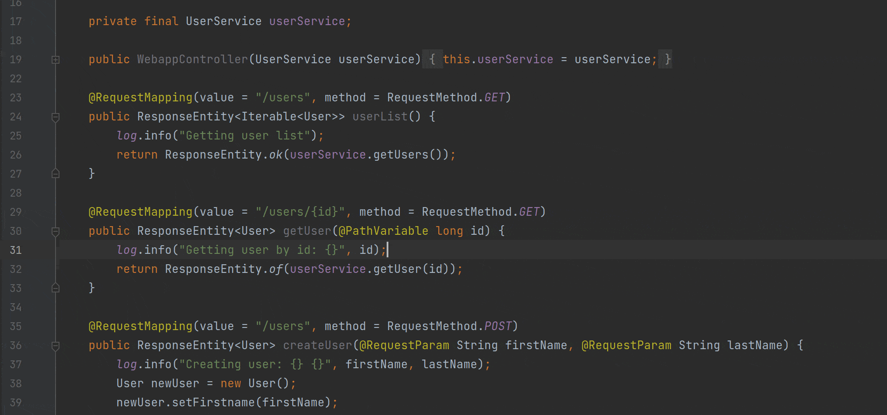
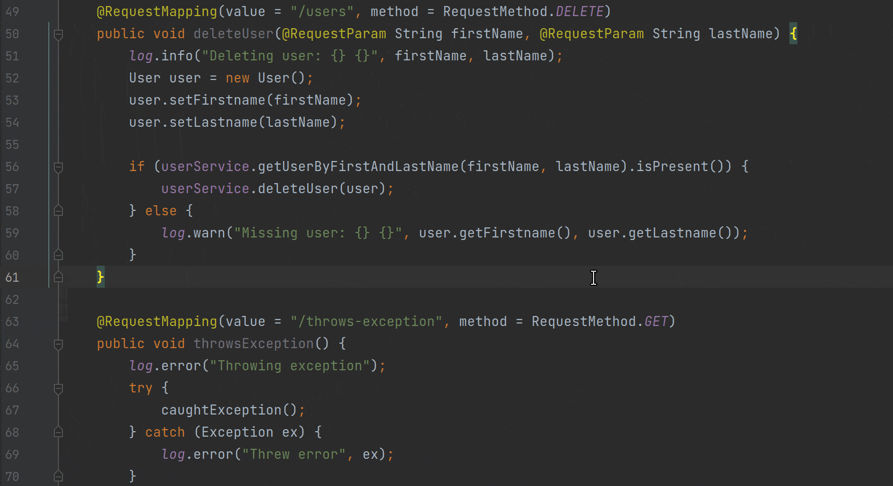
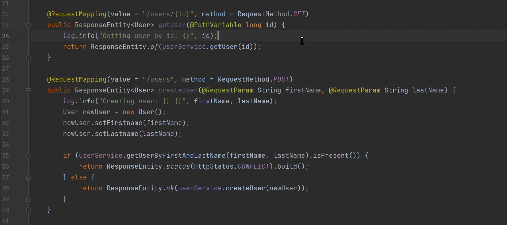

## Introduction

> The most profound technologies are those that disappear. They weave themselves into the fabric of everyday life until they are indistinguishable from it. - Mark Weiser

Mark Weiser prophetically argued in the late 1980s, that the most far-reaching technologies are those which vanish into thin air. According to Weiser, "Whenever people learn something sufficiently well, they cease to be aware of it." This disappearing act, as Weiser claimed, is not limited to technology but rather human psychology. It is this very experience that allows us to escape lower-level thinking into higher-level thinking. For once we are no longer impeded by mundane details, we are then free to focus on new goals.

This realization becomes more relevant as APMs become increasingly popular. As more applications are deployed with APMs, the number of abstract representations of the underlying source code also increases. While this provides great value to many non-development roles within an organization, it does pose additional challenges to those in development roles who must translate these representations into concepts they can work with (i.e. source code). Weiser sums this difficultly up rather succinctly when he states that "Programmers should no more be asked to work without access to source code than auto-mechanics should be asked to work without looking at the engine."

Still, APMs collect more information only to produce a plethora of new abstract representations. In this article, we will introduce a new concept in [Source++](https://github.com/sourceplusplus/live-platform), the open-source live-coding platform, specifically designed to allow developers to monitor production applications more intuitively.

## Live Views

> And we really don't understand even yet, hundreds of metrics later, what make a program easier to understand or modify or reuse or borrow. I don't think we'll find out by looking away from programs to their abstract interfaces. The answers are in the source code. - Mark Weiser

As APMs move from the "nice to have" category to the "must-have" category, there is a fundamental feature holding them back from ubiquity. They must disappear from consciousness. As developers, we should feel no impulse to open our browsers to better understand the underlying source code. The answers are literally in the source code. Instead, we should improve our tools so the source code conveniently tells us what we need to know. Think of how simple life could be if failing code always indicated how and why it failed. This is the idea behind Source++.

In our last blog post, we discussed [Extending Apache SkyWalking with non-breaking breakpoints](https://skywalking.apache.org/blog/2021-12-06-extend-skywalking-with-nbb/). In that post, we introduced a concept called **Live Instruments**, which developers can use to easily debug live production applications without leaving their IDE. Today, we will discuss how existing SkyWalking installations can be integrated into your IDE via a new concept called **Live Views**. Unlike Live Instruments, which are designed for debugging live applications, Live Views are designed for increasing application comprehension and awareness. This is accomplished through a variety of commands which are input into the Live Command Palette.

### Live Command Palette

The Live Command Palette (LCP) is a contextual command prompt, included in the [Source++ JetBrains Plugin](https://github.com/sourceplusplus/interface-jetbrains), that allows developers to control and query live applications from their IDE. Opened via keyboard shortcut (`Ctrl+Shift+S`), the LCP allows developers to easily view metrics relevant to the source code they're currently viewing. The following Live View commands are currently supported:

#### Command: view (overview/activity/traces/logs)

The `view` commands display contextual popups with live operational data of the current source code. These commands allow developers to view traditional SkyWalking operational data filtered down to the relevant metrics.

#### Command: watch log

The `watch log` command allows developers to follow individual log statements of a running application in real-time. This command allows developers to negate the need for manually scrolling through the logs to find instances of a specific log statement.

#### Command: (show/hide) quick stats

The `show quick stats` command displays live endpoint metrics for a quick idea of an endpoint's activity. Using this command, developers can quickly assess the status of an endpoint and determine if the endpoint is performing as expected.

## Future Work

> A good tool is an invisible tool. By invisible, I mean that the tool does not intrude on your consciousness; you focus on the task, not the tool. Eyeglasses are a good tool -- you look at the world, not the eyeglasses. - Mark Weiser

Source++ aims to extend SkyWalking in such a way that SkyWalking itself becomes invisible. To accomplish this, we plan to support custom developer commands. Developers will be able to build customized commands for themselves, as well as commands to share with their team. These commands will recognize context, types, and conditions allowing for a wide possibility of operations. As more commands are added, developers will be able to expose everything SkyWalking has to offer while focusing on what matters most, the source code.

If you find these features useful, please consider giving Source++ a try. You can install the plugin directly from your JetBrains IDE, or through the [JetBrains Marketplace](https://plugins.jetbrains.com/plugin/12033-source-). If you have any issues or questions, please [open an issue](https://github.com/sourceplusplus/interface-jetbrains/issues). Feedback is always welcome!
