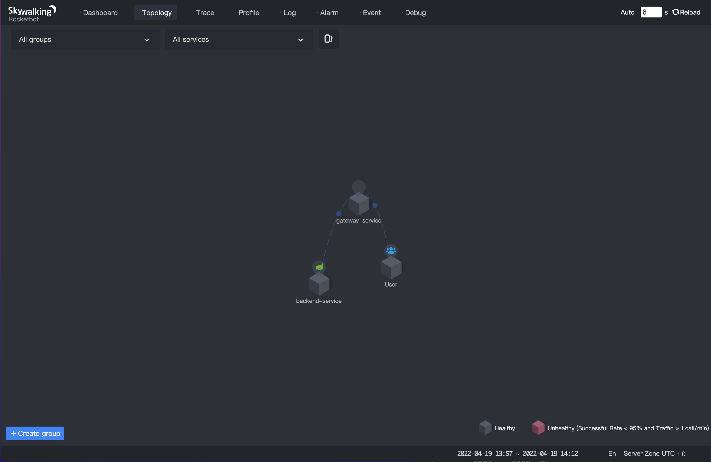

### content:

1. [Introduction](#1.-Introduction)
2. [Features](#2.-Features)
3. [Install SWCK](#3.-Install-SWCK)
4. [Deploy a demo application](#4.-Deploy-a-demo-application)
5. [Verify the injector](#5.-Verify-the-injector)
6. [Concluding remarks](#6.-Concluding-remarks)


## 1. Introduction 


### 1.1 What's SWCK?

[SWCK](https://github.com/apache/skywalking-swck) is a platform for the SkyWalking user, provisions, upgrades, maintains SkyWalking relevant components, and makes them work natively on Kubernetes.

In fact, SWCK is an operator developed based on [kubebuilder](https://book.kubebuilder.io/introduction.html), providing users with Custom Resources ( CR ) and controllers for managing resources ( Controller ), all CustomResourceDefinitions（CRDs）are as follows:

- [JavaAgent](https://github.com/apache/skywalking-swck/blob/master/docs/operator.md#javaagent)
- [OAP](https://github.com/apache/skywalking-swck/blob/master/docs/operator.md#oap)
- [UI](https://github.com/apache/skywalking-swck/blob/master/docs/operator.md#ui)
- [Storage](https://github.com/apache/skywalking-swck/blob/master/docs/operator.md#storage)
- [Satellite](https://github.com/apache/skywalking-swck/blob/master/docs/operator.md#satellite)
- [Fetcher](https://github.com/apache/skywalking-swck/blob/master/docs/operator.md#fetcher)


### 1.2 What's the java agent injector?

For a java application, users need to inject the java agent into the application to get metadata and send it to the SkyWalking backend. To make users use the java agent more natively, we propose the java agent injector to inject the java agent sidecar into a pod. The java agent injector is actually a [Kubernetes Mutation Webhook Controller](https://kubernetes.io/docs/reference/access-authn-authz/admission-controllers/). The controller intercepts pod events and applies mutations to the pod if annotations exist within the request.


## 2. Features

- **Transparent**. User’s applications generally run in normal containers while the java agent runs in the init container, and both belong to the same pod. Each container in the pod mounts a shared memory volume that provides a storage path for the java agent. When the pod starts, the java agent in the init container will run before the application container, and the injector will store the java agent file in the shared memory volume. When the application container starts, the injector injects the agent file into the application by setting the JVM parameter. Users can inject the java agent in this way without rebuilding the container image containing the java agent.

- **Configurability.** The injector provides two ways to configure the java agent: global configuration and custom configuration. The default global configuration is stored in the [configmap](https://kubernetes.io/docs/concepts/configuration/configmap/), you can update it as your own global configuration, such as `backend_service`. In addition, you can also set custom configuration for some applications via [annotation](https://kubernetes.io/zh/docs/concepts/overview/working-with-objects/annotations/), such as “service_name”. For more information, please see [java-agent-injector](https://github.com/apache/skywalking-swck/blob/master/docs/java-agent-injector.md).

- **Observability.** For each injected java agent, we provide [CustomDefinitionResources](https://kubernetes.io/docs/tasks/extend-kubernetes/custom-resources/custom-resource-definitions/) called `JavaAgent` to observe the final agent configuration. Please refer to [javaagent](https://github.com/apache/skywalking-swck/blob/master/docs/javaagent.md) to get more details.


## 3. Install SWCK

In the next steps, we will show how to build a stand-alone Kubernetes cluster and deploy the 0.6.1 version of SWCK on the platform.


### 3.1 Tool Preparation

Firstly, you need to install some tools as follows:

1. [kind](http://kind.sigs.k8s.io), which is used to create a stand-alone Kubernetes cluster.
2. [kubectl](https://kubernetes.io/docs/tasks/tools/), which is used to communicate with the Kubernetes cluster.


### 3.2 Install stand-alone Kubernetes cluster

After installing `kind` , you could use the following command to create a stand-alone Kubernetes cluster.

> Notice! If your terminal is configured with a proxy, you need to close it before the cluster is created to avoid some errors.

```sh
$ kind create cluster --image=kindest/node:v1.19.1
```

After creating a cluster, you can get the pods as below.

```sh
$ kubectl get pod -A                          
NAMESPACE            NAME                                         READY   STATUS    RESTARTS   AGE
kube-system          coredns-f9fd979d6-57xpc                      1/1     Running   0          7m16s
kube-system          coredns-f9fd979d6-8zj8h                      1/1     Running   0          7m16s
kube-system          etcd-kind-control-plane                      1/1     Running   0          7m23s
kube-system          kindnet-gc9gt                                1/1     Running   0          7m16s
kube-system          kube-apiserver-kind-control-plane            1/1     Running   0          7m23s
kube-system          kube-controller-manager-kind-control-plane   1/1     Running   0          7m23s
kube-system          kube-proxy-6zbtb                             1/1     Running   0          7m16s
kube-system          kube-scheduler-kind-control-plane            1/1     Running   0          7m23s
local-path-storage   local-path-provisioner-78776bfc44-jwwcs      1/1     Running   0          7m16s
```


### 3.3 Install certificates manger(cert-manger)

The certificates of SWCK are distributed and verified by the certificate manager. You need to install the [cert-manager](https://cert-manager.io/docs/) through the following command.

```sh
$ kubectl apply -f https://github.com/jetstack/cert-manager/releases/download/v1.3.1/cert-manager.yaml
```

Verify whether cert-manager is installed successfully.

```sh
$ kubectl get pod -n cert-manager
NAME                                       READY   STATUS    RESTARTS   AGE
cert-manager-7dd5854bb4-slcmd              1/1     Running   0          73s
cert-manager-cainjector-64c949654c-tfmt2   1/1     Running   0          73s
cert-manager-webhook-6bdffc7c9d-h8cfv      1/1     Running   0          73s
```


### 3.4 Install SWCK

The java agent injector is a component of the operator, so please follow the next steps to install the operator first.

1. Get the deployment yaml file of SWCK and deploy it.

```sh
$ curl -Ls https://archive.apache.org/dist/skywalking/swck/0.6.1/skywalking-swck-0.6.1-bin.tgz | tar -zxf - -O ./config/operator-bundle.yaml | kubectl apply -f -
```

2. Check SWCK as below.

```sh
$ kubectl get pod -n skywalking-swck-system
NAME                                                  READY   STATUS    RESTARTS   AGE
skywalking-swck-controller-manager-7f64f996fc-qh8s9   2/2     Running   0          94s
```


### 3.5 Install Skywalking components — OAPServer and UI

1. Deploy the OAPServer and UI in the `default` namespace.

```sh
$ kubectl apply -f https://raw.githubusercontent.com/apache/skywalking-swck/master/operator/config/samples/default.yaml
```

2. Check the OAPServer.

```sh
$ kubectl get oapserver
NAME      INSTANCES   RUNNING   ADDRESS
default   1           1         default-oap.default
```

3. Check the UI.

```sh
$ kubectl get ui
NAME      INSTANCES   RUNNING   INTERNALADDRESS      EXTERNALIPS   PORTS
default   1           1         default-ui.default                 [80]
```


## 4. Deploy a demo application

In the third step, we have installed SWCK and related Skywalking components. Next, we will show how to use the java agent injector in SWCK through two java application examples in two ways: global configuration and custom configuration.


### 4.1 Set the global configuration

When we have installed SWCK, the default configuration is the configmap in the system namespace, we can get it as follows.

```sh
$  kubectl get configmap skywalking-swck-java-agent-configmap -n skywalking-swck-system -oyaml
apiVersion: v1
data:
  agent.config: |-
    # The service name in UI
    agent.service_name=${SW_AGENT_NAME:Your_ApplicationName}

    # Backend service addresses.
    collector.backend_service=${SW_AGENT_COLLECTOR_BACKEND_SERVICES:127.0.0.1:11800}

    # Please refer to https://skywalking.apache.org/docs/skywalking-java/latest/en/setup/service-agent/java-agent/configurations/#table-of-agent-configuration-properties to get more details.
```

In the cluster created by `kind`, the `backend_service` may not be correct, we need to use the real OAPServer's address `default-oap.default` to replace the default `127.0.0.1`, so we can edit the configmap as follow.

```sh
$ kubectl edit configmap skywalking-swck-java-agent-configmap -n skywalking-swck-system
configmap/skywalking-swck-java-agent-configmap edited

$ kubectl get configmap skywalking-swck-java-agent-configmap -n skywalking-swck-system -oyaml
apiVersion: v1
data:
  agent.config: |-
    # The service name in UI
    agent.service_name=${SW_AGENT_NAME:Your_ApplicationName}

    # Backend service addresses.
    collector.backend_service=${SW_AGENT_COLLECTOR_BACKEND_SERVICES:default-oap.default:11800}

    # Please refer to https://skywalking.apache.org/docs/skywalking-java/latest/en/setup/service-agent/java-agent/configurations/#table-of-agent-configuration-properties to get more details.
```


### 4.2 Set the custom configuration

In some cases, we need to use the Skywalking component to monitor different java applications, so the agent configuration of different applications may be different, such as the name of the application, and the plugins that the application needs to use, etc. Next, we will take two simple java applications developed based on `spring boot` and `spring cloud gateway` as examples for a detailed description. You can use the [source code](https://github.com/dashanji/swck-spring-cloud-k8s-demo) to build the image.

```sh
# build the springboot and springcloudgateway image 
$ git clone https://github.com/dashanji/swck-spring-cloud-k8s-demo 
$ cd swck-spring-cloud-k8s-demo && make

# check the image
$ docker images
REPOSITORY     TAG       IMAGE ID       CREATED          SIZE
gateway        v0.0.1    51d16251c1d5   48 minutes ago   723MB
app            v0.0.1    62f4dbcde2ed   48 minutes ago   561MB

# load the image into the cluster
$ kind load docker-image app:v0.0.1 && kind load docker-image gateway:v0.0.1
```


### 4.3 deploy spring boot application

1. Create the `springboot-system` namespace.

```sh
$ kubectl create namespace springboot-system
```

2. Label the `springboot-system`namespace to enable the java agent injector.

```sh
$ kubectl label namespace springboot-system swck-injection=enabled
```

3. Deploy the corresponding deployment file `springboot.yaml` for the spring boot application, which uses annotation to override the default agent configuration, such as `service_name`.

> Notice! Before using the annotation to override the agent configuration, you need to add `strategy.skywalking.apache.org/agent.Overlay: "true"` to make the override take effect.

```yaml
apiVersion: apps/v1
kind: Deployment
metadata:
  name: demo-springboot
  namespace: springboot-system
spec:
  selector:
    matchLabels:
      app: demo-springboot
  template:
    metadata:
      labels:
        swck-java-agent-injected: "true"  # enable the java agent injector
        app: demo-springboot
      annotations:
        strategy.skywalking.apache.org/agent.Overlay: "true"  # enable the agent overlay
        agent.skywalking.apache.org/agent.service_name: "backend-service"
    spec:
      containers:
      - name: springboot
        imagePullPolicy: IfNotPresent
        image: app:v0.0.1
        command: ["java"]
        args: ["-jar","/app.jar"]
---
apiVersion: v1
kind: Service
metadata:
  name: demo
  namespace: springboot-system
spec:
  type: ClusterIP
  ports:
  - name: 8085-tcp
    port: 8085
    protocol: TCP
    targetPort: 8085
  selector:
    app: demo-springboot
```

4. Deploy a `spring boot` application in the `springboot-system` namespace.

```sh
$ kubectl apply -f springboot.yaml
```

5. Check for deployment.

```sh
$ kubectl get pod -n springboot-system
NAME                               READY   STATUS    RESTARTS   AGE
demo-springboot-7c89f79885-dvk8m   1/1     Running   0          11s
```

6. Get the finnal injected java agent configuration through `JavaAgent`.

```sh
$ kubectl get javaagent -n springboot-system
NAME                            PODSELECTOR           SERVICENAME       BACKENDSERVICE
app-demo-springboot-javaagent   app=demo-springboot   backend-service   default-oap.default:11800
```


### 4.4 deploy spring cloud gateway application

1. Create the `gateway-system` namespace.

```sh
$ kubectl create namespace gateway-system
```

2. Label the `gateway-system`namespace to enable the java agent injector.

```sh
$ kubectl label namespace gateway-system swck-injection=enabled
```

3. Deploy the corresponding deployment file `springgateway.yaml` for the spring cloud gateway application, which uses annotation to override the default agent configuration, such as `service_name`. In addition, when using `spring cloud gateway`, we need to add the `spring cloud gateway` plugin to the agent configuration.

> Notice! Before using the annotation to override the agent configuration, you need to add `strategy.skywalking.apache.org/agent.Overlay: "true"` to make the override take effect.

```yaml
apiVersion: apps/v1
kind: Deployment
metadata:
  labels:
    app: demo-gateway
  name: demo-gateway
  namespace: gateway-system
spec:
  selector:
    matchLabels:
      app: demo-gateway
  template:
    metadata:
      labels:
        swck-java-agent-injected: "true"
        app: demo-gateway
      annotations:
        strategy.skywalking.apache.org/agent.Overlay: "true"
        agent.skywalking.apache.org/agent.service_name: "gateway-service"     
        optional.skywalking.apache.org: "cloud-gateway-3.x" # add spring cloud gateway plugin
    spec:
      containers:
      - image: gateway:v0.0.1
        name: gateway
        command: ["java"]
        args: ["-jar","/gateway.jar"]
---
apiVersion: v1
kind: Service
metadata:
  name: service-gateway
  namespace: gateway-system
spec:
  type: ClusterIP
  ports:
  - name: 9999-tcp
    port: 9999
    protocol: TCP
    targetPort: 9999
  selector:
    app: demo-gateway
```

4. Deploy a `spring cloud gateway` application in the `gateway-system` namespace.

```sh
$ kubectl apply -f springgateway.yaml
```

5. Check for deployment.

```sh
$ kubectl get pod -n gateway-system
NAME                           READY   STATUS    RESTARTS   AGE
demo-gateway-5bb77f6d85-9j7c6   1/1     Running   0          15s
```

6. Get the finnal injected java agent configuration through `JavaAgent`.

```sh
$ kubectl get javaagent -n gateway-system
NAME                         PODSELECTOR        SERVICENAME       BACKENDSERVICE
app-demo-gateway-javaagent   app=demo-gateway   gateway-service   default-oap.default:11800
```


## 5. Verify the injector

1. After completing the above steps, we can view detailed state of the injected pod, like the injected `agent` container.

```sh
# get all injected pod
$ kubectl get pod -A -lswck-java-agent-injected=true
NAMESPACE           NAME                               READY   STATUS    RESTARTS   AGE
gateway-system      demo-gateway-5bb77f6d85-lt4z7      1/1     Running   0          69s
springboot-system   demo-springboot-7c89f79885-lkb5j   1/1     Running   0          75s

# view detailed state of the injected pod [demo-springboot]
$ kubectl describe pod -l app=demo-springboot -n springboot-system
...
Events:
  Type   Reason   Age                From                           Message
  ----   ------  ----                ----                           -------
  ...
  Normal Created  91s  kubelet,kind-control-plane Created  container inject-skywalking-agent
  Normal Started  91s  kubelet,kind-control-plane Started  container inject-skywalking-agent
  ...
  Normal Created  90s  kubelet,kind-control-plane Created  container springboot
  Normal Started  90s  kubelet,kind-control-plane Started  container springboot

# view detailed state of the injected pod [demo-gateway] 
$ kubectl describe pod -l app=demo-gateway -n gateway-system
...
Events:
  Type   Reason   Age            From                         Message
  ----   ------  ----            ----                         -------
  ...
  Normal Created 2m20s kubelet,kind-control-plane Created container inject-skywalking-agent
  Normal Started 2m20s kubelet,kind-control-plane Started container inject-skywalking-agent
  ...
  Normal Created 2m20s kubelet,kind-control-plane Created container gateway
  Normal Started 2m20s kubelet,kind-control-plane Started container gateway
```

2. Now we can expose the service and watch the data displayed on the web. First of all, we need to get the `gateway` service and the `ui` service as follows.

```sh
$ kubectl get service service-gateway -n gateway-system
NAME              TYPE        CLUSTER-IP      EXTERNAL-IP   PORT(S)    AGE
service-gateway   ClusterIP   10.99.181.145   <none>        9999/TCP   9m19s

$ kubectl get service default-ui
NAME         TYPE        CLUSTER-IP      EXTERNAL-IP   PORT(S)   AGE
default-ui   ClusterIP   10.111.39.250   <none>        80/TCP    82m
```

3. Then open two terminals to expose the service:  `service-gateway`、`default-ui`.

```sh
$ kubectl port-forward service/service-gateway -n gateway-system 9999:9999
Forwarding from 127.0.0.1:9999 -> 9999
Forwarding from [::1]:9999 -> 9999
```

```sh
$ kubectl port-forward service/default-ui 8090:80                     
Forwarding from 127.0.0.1:8090 -> 8080
Forwarding from [::1]:8090 -> 8080
```

4. Use the following commands to access the `spring boot` demo 10 times through the `spring cloud gateway` service.

```sh
$ for i in {1..10}; do curl http://127.0.0.1:9999/gateway/hello && echo ""; done
Hello World!
Hello World!
Hello World!
Hello World!
Hello World!
Hello World!
Hello World!
Hello World!
Hello World!
Hello World!
```

5. We can see the Dashboard by accessing `http://127.0.0.1:8090`.


6. All services' topology is shown below.



7. We can see the trace information of `gateway-service`.


8. We can see the trace information of `backend-service`.


## 6. Concluding remarks

If your application is deployed in the Kubernetes platform and requires Skywalking to provide monitoring services, SWCK can help you deploy, upgrade and maintain the Skywalking components in the Kubernetes cluster. In addition to this blog, you can also view [swck document](https://github.com/apache/skywalking-swck/blob/master/docs/operator.md#operator-Usage-Guide) and [Java agent injector documentation](https://github.com/apache/skywalking-swck/blob/master/docs/java-agent-injector.md) for more information. If you find this project useful, please give [SWCK](https://github.com/apache/skywalking-swck) a star! If you have any questions, welcome to ask in [Issues](https://github.com/apache/skywalking/issues) or [Discussions](https://github.com/apache/skywalking/discussions).

