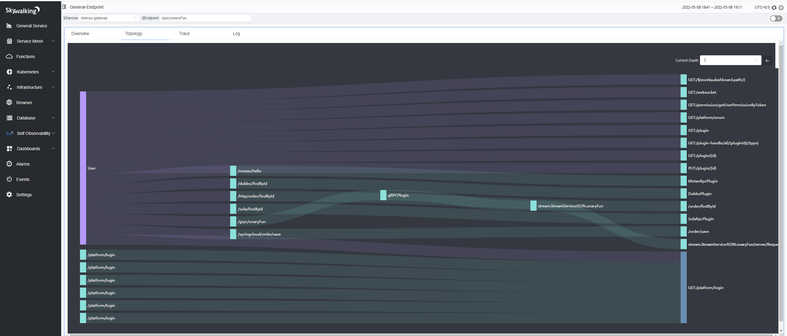
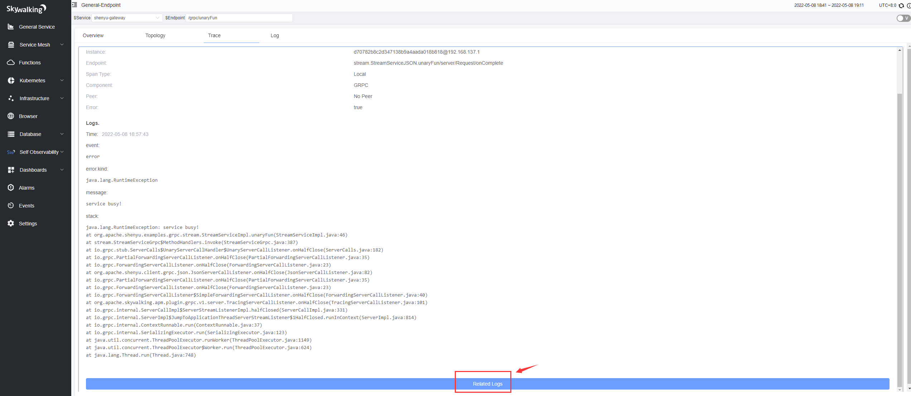
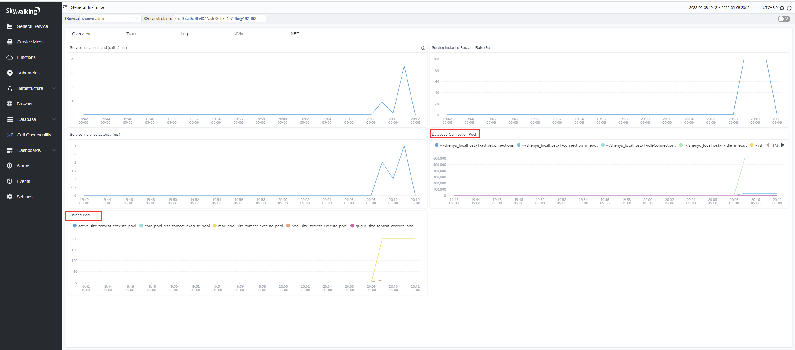
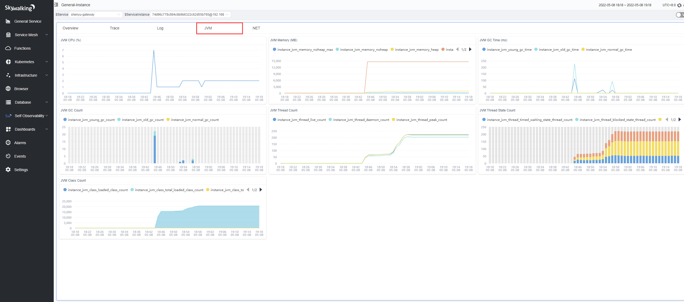
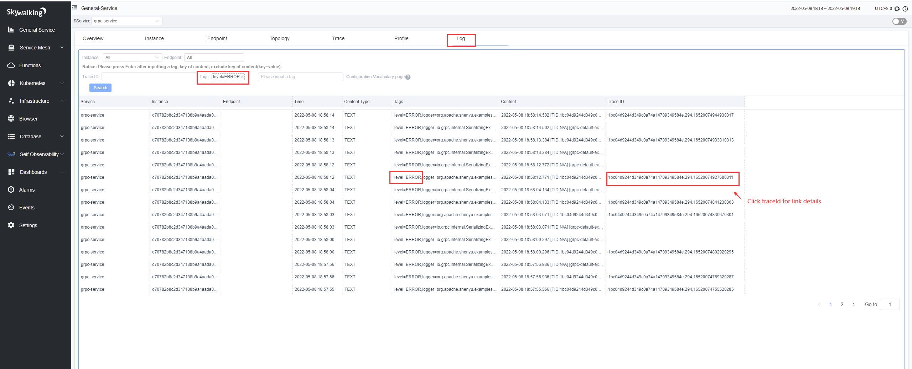
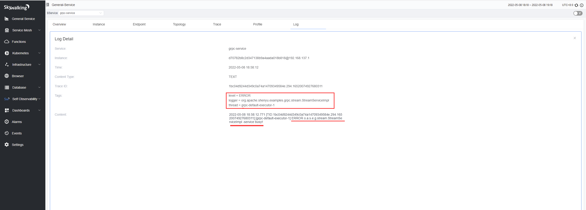

### Content

1. [Introduction of SkyWalking and ShenYu](#1.-Introduction-of-SkyWalking-and-ShenYu)
2. [Apache ShenYu plugin implementation principle](#2.-Apache-ShenYu-plugin-implementation-principle)
3. [Adding generalized call tracking to the gRPC plugin and keeping it compatible](#3.-Adding-generalized-call-tracking-to-the-gRPC-plugin-and-keeping-it-compatible)
4. [ShenYu Gateway Observability Practice](#4.-ShenYu-Gateway-Observability-Practice)
5. [Summary](#5.-Summary)

## 1. Introduction of SkyWalking and ShenYu

### 1.1 SkyWalking

[SkyWalking](https://github.com/hutaishi/skywalking) is an Application Performance Monitoring (APM) and Observability Analysis Platform (OAP) for microservices, distributed systems, and cloud natives,
Has powerful features that provide a multi-dimensional means of application performance analysis, including distributed topology diagrams, application performance metrics, distributed link tracing, log correlation analysis and alerts. Also has a very rich ecology. Widely used in various companies and open source projects.

### 1.2 Apache ShenYu (incubating)

[Apache ShenYu (incubating)](https://github.com/apache/incubator-shenyu)
High-performance,multi-protocol,extensible,responsive API Gateway. Compatible with a variety of mainstream framework systems, support hot plug, 
users can customize the development, meet the current situation and future needs of users in a variety of scenarios, experienced the temper of large-scale scenes.
Rich protocol support: `Http`, `Spring Cloud`, `gRPC`, `Dubbo`, `SOFARPC`, `Motan`, `Tars`, etc.

## 2. Apache ShenYu plugin implementation principle

ShenYu's asynchrony is a little different from previous exposure to asynchrony, it is a full-link asynchrony, the execution of each plug-in is asynchronous, and thread switching is not a single fixed situation (and the individual plug-in implementation is related).
The gateway initiates service calls of various protocol types, and the existing SkyWalking plugins create ExitSpan (synchronous or asynchronous) when they initiate service calls.  The gateway receives the request and creates an asynchronous EntrySpan.
The asynchronous EntrySpan needs to be concatenated with the synchronous or asynchronous ExitSpan, otherwise the link will be broken.

There are 2 types of tandem solutions：
- **Snapshot Delivery**:  
  Pass the snapshot after creating the EntrySpan to the thread that created the ExitSpan in some way.  
  Currently this approach is used in the asynchronous WebClient plugin, which can receive asynchronous snapshots. shenYu proxy Http service or SpringCloud service is to achieve span concatenation through snapshot passing.
- **LocalSpan transit**:  
  Other RPC class plugins do not receive snapshots for concatenation like Asynchronous WebClient. Although you can modify other RPC plugins to receive snapshots for concatenation, it is not recommended or necessary to do so.
  This can be achieved by creating a LocalSpan in the thread where the ExitSpan is created, and then connecting the asynchronous EntrySpan and LocalSpan by `snapshot passing`. This can be done without changing the original plugin code.

The span connection is shown below:  

You may ask if it is possible to create LocalSpan inside a generic plugin, instead of creating one separately for ShenYu RPC plugin?
The answer is no, because you need to ensure that LocalSpan and ExitSpan are in the same thread, and ShenYu is fully linked asynchronously. The code to create LocalSpan is reused in the implementation.

## 3. Adding generalized call tracking to the gRPC plugin and keeping it compatible

The existing SkyWalking gRPC plugin only supports calls initiated by way of stubs. For the gateway there is no proto file, the gateway takes generalized calls (not through stubs), so tracing RPC requests, you will find that the link will break at the gateway node.
In this case, it is necessary to make the gRPC plugin support generalized calls, while at the same time needing to remain compatible and not affect the original tracing method. This is achieved by determining whether the request parameter is a DynamicMessage, and if it is not, then the original tracing logic through the stub is used.
If not, then the original tracing logic via stubs is used, and if not, then the generalized call tracing logic is used. The other compatibility is the difference between the old and new versions of gRPC, as well as the compatibility of various cases of obtaining server-side IP, for those interested in the source code.

## 4. ShenYu Gateway Observability Practice
The above explains the principle of SkyWalking ShenYu plug-in implementation, the following deployment application to see the effect. SkyWalking powerful, in addition to the link tracking requires the development of plug-ins, other powerful features out of the box.
Here only describe the link tracking and application performance analysis part, if you want to experience the power of SkyWalking features, please refer to the [SkyWalking official documentation](https://skywalking.apache.org/).  
Version description:  
- skywalking-java: `8.11.0-SNAPSHOT` source code build. Note: The shenyu plugin will be released in version 8.11.0, and will probably release it initially in May or June. the Java agent is in the regular release phase.
- skywalking: `9.0.0` V9 version

Usage instructions:  
SkyWalking is designed to be very easy to use. Please refer to the official documentation for configuring and activating the shenyu plugin.
- [SkyWalking Documentation](https://skywalking.apache.org/docs/main/latest/readme/)
- [SkyWalking Java Agent Documentation](https://skywalking.apache.org/docs/skywalking-java/latest/readme/)

### 4.1 Sending requests to the gateway
Initiate various service requests to the gateway via the `postman` client or `other means`.

### 4.2 Request Topology Diagram

  
---

---
### 4.3 Request Trace (in the case of gRPC)

#### Normal Trace：  

#### Abnormal Trace：  

Click on the link node to see the corresponding node information and exception information   
#### Service Provider Span  

#### Gateway request span

### 4.4 Service Metrics Monitoring

### 4.5 Gateway background metrics monitoring

#### Database Monitoring:

#### Thread pool and connection pool monitoring:

### 4.6 JVM Monitoring

### 4.7 Endpoint Analysis

### 4.8 Exception log and exception link analysis
[See official documentation for log configuration](https://skywalking.apache.org/docs/skywalking-java/latest/en/setup/service-agent/java-agent/application-toolkit-logback-1.x/)

Log monitoring

Distributed link trace details corresponding to exception logs

## 5. Summary
SkyWalking has very comprehensive support for metrics, link tracing, and logging in observability, and is powerful, easy to use, and designed for large distributed systems, microservices, cloud-native, container architectures, and has a rich ecosystem.
Using SkyWalking to provide powerful observability support for Apache ShenYu (incubating) gives ShenYu a boost. Finally, if you are interested in high-performance responsive gateways, you can follow
[Apache ShenYu (incubating)](https://github.com/apache/incubator-shenyu).
Also, thanks to SkyWalking such an excellent open source software to the industry contributions.