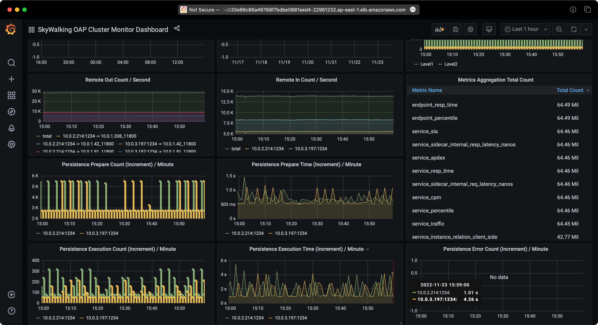
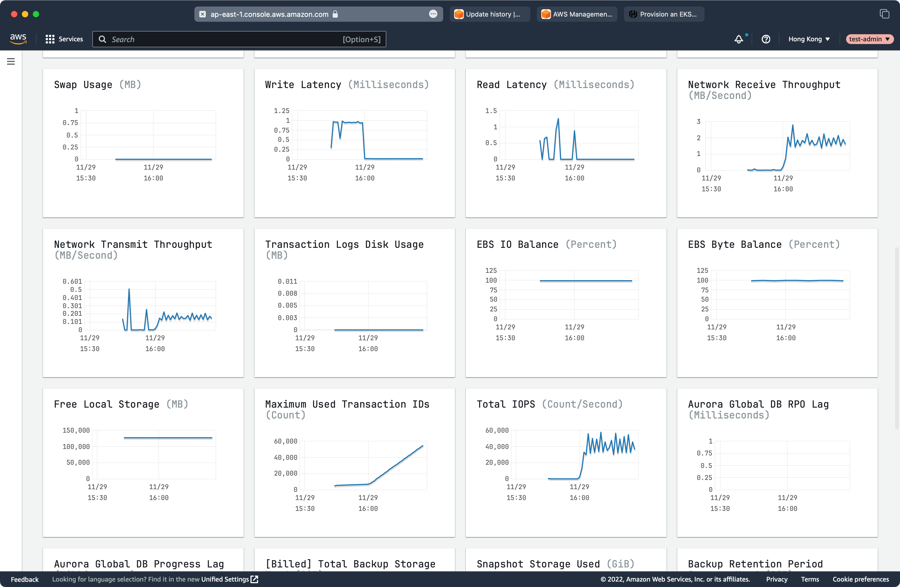
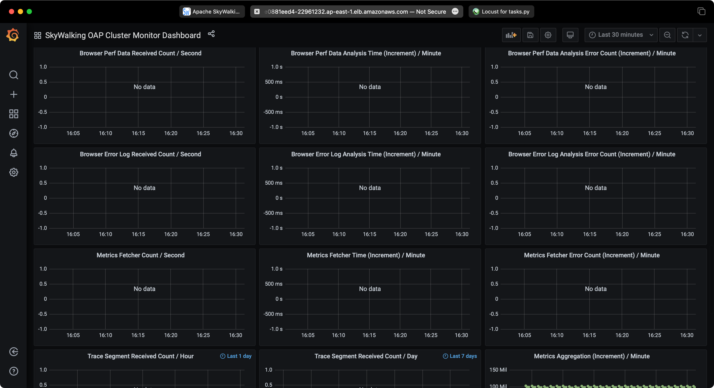

## Introduction

Apache SkyWalking is an open source APM tool for monitoring and troubleshooting distributed systems,
especially designed for microservices, cloud native and container-based (Docker, Kubernetes, Mesos)
architectures. It provides distributed tracing, service mesh observability, metric aggregation and
visualization, and alarm.

In this article, I will introduce how to quickly set up Apache SkyWalking on AWS EKS and RDS/Aurora,
as well as a couple of sample services, monitoring services to observe SkyWalking itself.

## Prerequisites

- AWS account
- [AWS CLI](https://docs.aws.amazon.com/cli/latest/userguide/install-cliv2.html)
- [Terraform](https://www.terraform.io/downloads.html)
- [kubectl](https://kubernetes.io/docs/tasks/tools/#kubectl)

We can use the AWS web console or CLI to create all resources needed in this tutorial, but it can be
too tedious and hard to debug when something goes wrong. So in this artical I will use Terraform to
create all AWS resources, deploy SkyWalking, sample services, and load generator services (Locust).

## Architecture

The demo architecture is as follows:


As shown in the architecture diagram, we need to create the following AWS resources:

- EKS cluster
- RDS instance or Aurora cluster

Sounds simple, but there are a lot of things behind the scenes, such as VPC, subnets, security groups, etc.
You have to configure them correctly to make sure the EKS cluster can connect to RDS instance/Aurora cluster
otherwise the SkyWalking won't work. Luckily, Terraform can help us to create and destroy all these resources
automatically.

I have created a Terraform module to create all AWS resources needed in this tutorial, you can find it in the
[GitHub repository](https://github.com/kezhenxu94/oap-load-test/tree/main/aws).

## Create AWS resources

First, we need to clone the GitHub repository and `cd` into the folder:

```bash
git clone https://github.com/kezhenxu94/oap-load-test.git
```

Then, we need to create a file named `terraform.tfvars` to specify the AWS region and other variables:

```bash
cat > terraform.tfvars <<EOF
aws_access_key = ""
aws_secret_key = ""
cluster_name   = "skywalking-on-aws"
region         = "ap-east-1"
db_type        = "rds-postgresql"
EOF
```

If you have already configured the AWS CLI, you can skip the `aws_access_key` and `aws_secret_key` variables.
To install SkyWalking with RDS postgresql, set the `db_type` to `rds-postgresql`, to install SkyWalking with
Aurora postgresql, set the `db_type` to `aurora-postgresql`.

There are a lot of other variables you can configure, such as tags, sample services count, replicas, etc.,
you can find them in the [variables.tf](https://github.com/kezhenxu94/oap-load-test/blob/main/aws/variables.tf).

Then, we can run the following commands to initialize the Terraform module and download the required providers,
then create all AWS resources:

```bash
terraform init
terraform apply -var-file=terraform.tfvars
```

Type `yes` to confirm the creation of all AWS resources, or add the `-auto-approve` flag to the `terraform apply`
to skip the confirmation:

```bash
terraform apply -var-file=terraform.tfvars -auto-approve
```

Now what you need to do is to wait for the creation of all AWS resources to complete, it may take a few minutes.
You can check the progress of the creation in the AWS web console, and check the deployment progress of the services
inside the EKS cluster.

## Generate traffic

Besides creating necessary AWS resources, the Terraform module also deploys SkyWalking, sample services, and Locust
load generator services to the EKS cluster.

You can access the Locust web UI to generate traffic to the sample services:

```bash
open http://$(kubectl get svc -n locust -l app=locust-master -o jsonpath='{.items[0].status.loadBalancer.ingress[0].hostname}'):8089
```

The command opens the browser to the Locust web UI, you can configure the number of users and hatch rate to generate
traffic.

## Observe SkyWalking

You can access the SkyWalking web UI to observe the sample services.

First you need to forward the SkyWalking UI port to local

```bash
kubectl -n istio-system port-forward $(kubectl -n istio-system get pod -l app=skywalking -l component=ui -o name) 8080:8080
```

And then open the browser to http://localhost:8080 to access the SkyWalking web UI.

## Observe RDS/Aurora

You can also access the RDS/Aurora web console to observe the performance of RDS/Aurora instance/Aurora cluste.

## Test Results

### Test 1: SkyWalking with EKS and RDS PostgreSQL

#### Service Traffic


#### RDS Performance


#### SkyWalking Performance




### Test 2: SkyWalking with EKS and Aurora PostgreSQL

#### Service Traffic


#### RDS Performance





#### SkyWalking Performance





## Clean up

When you are done with the demo, you can run the following command to destroy all AWS resources:

```bash
terraform destroy -var-file=terraform.tfvars -auto-approve
```
