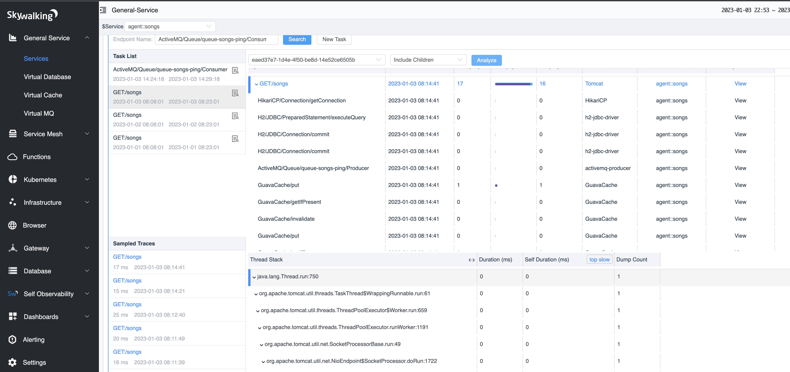
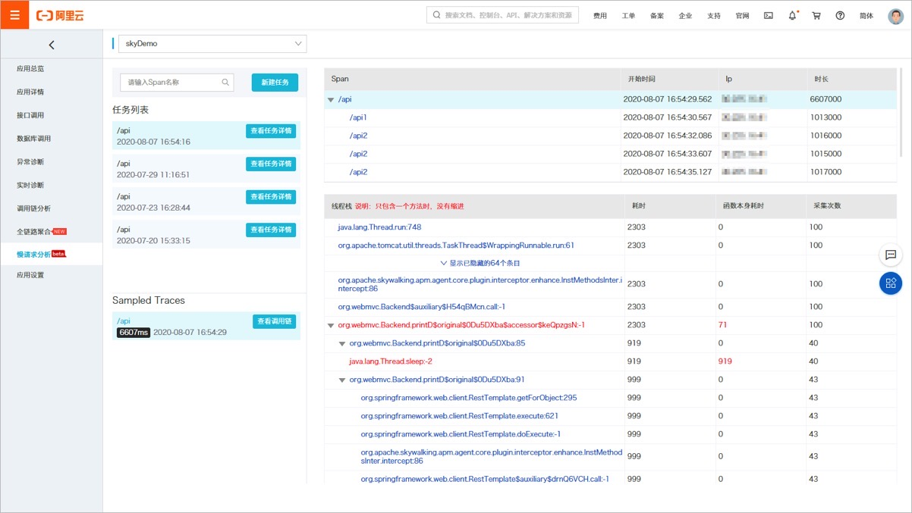

[Apache SkyWalking](https://skywalking.apache.org) is an open-source APM for a distributed system, Apache Software Foundation top-level project.

On Jan. 3rd, 2022, we received reports about [Aliyun Trace Analysis Service](https://help.aliyun.com/document_detail/90277.html). It provides a cloud service compatible
with SkyWalking trace APIs and agents. 

On their product page, there is a [`best-practice` document](https://help.aliyun.com/document_detail/178204.html) describing about their service is not SkyWalking OAP, but can work with SkyWalking agents to 
support [SkyWalking's In-Process(Trace) Profiling](https://skywalking.apache.org/docs/main/next/en/concepts-and-designs/profiling/#in-process-profiling).

**BUT, they copied the whole page of SkyWalking's profiling UI, including page layout, words,  and profiling task setup.** The only difference is the color schemes.

### SkyWalking UI

### Aliyun Trace Analysis UI on their document page

The UI visualization is a part of the copyright. Aliyun declared their backend is NOT a re-distribution of SkyWalking repeatedly on their website, 
and they never mentioned this page is actually copied from upstream.

**This is a LICENSE issue, violating SkyWalking's copyright and Apache 2.0 License. They don't respect Apache Software Foundation and Apache SkyWalking's IP and Branding.**