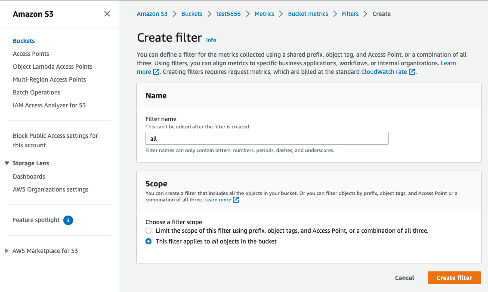

SKyWalking OAP's existing [OpenTelemetry receiver](https://skywalking.apache.org/docs/main/next/en/setup/backend/opentelemetry-receiver/) can receive metrics through the [OTLP protocol, and use ](https://github.com/open-telemetry/opentelemetry-specification/blob/main/specification/protocol/otlp.md)[MAL](https://skywalking.apache.org/docs/main/next/en/concepts-and-designs/mal/) to analyze related metrics in real time. Starting from OAP 9.4.0, SkyWalking has added [an AWS Firehose receiver](https://skywalking.apache.org/docs/main/next/en/setup/backend/aws-firehose-receiver/) to receive and analyze CloudWatch metrics data. This article will take EKS and S3 as examples to introduce the process of SkyWalking OAP receiving and analyzing the indicator data of AWS services.

### EKS

#### OpenTelemetry Collector

[OpenTelemetry (OTel)](https://opentelemetry.io/) is a series of tools, APIs, and SDKs that can generate, collect, and export telemetry data, such as metrics, logs, and traces. OTel Collector is mainly responsible for collecting, processing, and exporting. For telemetry data, Collector consists of the following main components:

1. **Receiver**: Responsible for obtaining telemetry data, different receivers support different data sources, such as prometheus, kafka, otlp.
2. **Processor**: Process data between receiver and exporter, such as adding or deleting attributes.
3. **Exporter**: Responsible for sending data to different backends, such as kafka, SkyWalking OAP (via OTLP).
4. **Service**: Components enabled as a unit configuration, only configured components will be enabled.

###### OpenTelemetry Protocol Specification(OTLP)

[OTLP](https://github.com/open-telemetry/opentelemetry-specification/blob/main/specification/protocol/otlp.md) mainly describes how to receive (pull) indicator data through gRPC and HTTP protocols. [The OpenTelemetry receiver](https://skywalking.apache.org/docs/main/next/en/setup/backend/opentelemetry-receiver/) of SKyWalking OAP implements the OTLP/gRPC protocol, and the indicator data can be exported to OAP through the OTLP/gRPC exporter. Usually the data flow of a Collector is as follows:


#### Monitor EKS with OTel

EKS monitoring is realized through OTel. You only need to deploy OpenTelemetry Collector in the EKS cluster in the way of `DaemonSet ` -- use [AWS Container Insights Receiver](https://github.com/open-telemetry/opentelemetry-collector-contrib/blob/main/receiver/awscontainerinsightreceiver/README.md) as the receiver, and set the address of otlp exporter to the address of OAP. In addition, it should be noted that OAP is used `job_name : aws-cloud-eks-monitoring` as the identifier of EKS metrics according to the attribute, so it is necessary to configure a processor in the collector to add this attribute.

###### OTel Collector configuration demo

```yaml

extensions:
  health_check:
receivers:
  awscontainerinsightreceiver:
processors:
# To enable OAP to correctly identify EKS metrics, add the job_name attribute
  resource/job-name:
    attributes:
    - key: job_name   
      value: aws-cloud-eks-monitoring
      action: insert     

# Specify OAP as exporters
exporters:
  otlp:
    endpoint: oap-service:11800 
    tls:
      insecure: true
  logging:
      loglevel: debug          
service:
  pipelines:
    metrics:
      receivers: [awscontainerinsightreceiver]
      processors: [resource/job-name]
      exporters: [otlp,logging]
  extensions: [health_check]
  
```

By default, SkyWalking OAP counts the network, disk, CPU and other related indicator data in the three dimensions of Node, Pod, and Service. Only part of the content is shown here.

######  Pod dimensions


######  Service dimensions


###### EKS monitoring complete configuration

<details>
<summary>Click here to view complete k8s resource configuration </summary>

```yaml

apiVersion: v1
kind: ServiceAccount
metadata:
  name: aws-otel-sa
  namespace: aws-otel-eks

---
kind: ClusterRole
apiVersion: rbac.authorization.k8s.io/v1
metadata:
  name: aoc-agent-role
rules:
  - apiGroups: [""]
    resources: ["pods", "nodes", "endpoints"]
    verbs: ["list", "watch"]
  - apiGroups: ["apps"]
    resources: ["replicasets"]
    verbs: ["list", "watch"]
  - apiGroups: ["batch"]
    resources: ["jobs"]
    verbs: ["list", "watch"]
  - apiGroups: [""]
    resources: ["nodes/proxy"]
    verbs: ["get"]
  - apiGroups: [""]
    resources: ["nodes/stats", "configmaps", "events"]
    verbs: ["create", "get"]
  - apiGroups: [""]
    resources: ["configmaps"]
    resourceNames: ["otel-container-insight-clusterleader"]
    verbs: ["get","update"]
  - apiGroups: ["coordination.k8s.io"]
    resources: ["leases"]
    verbs: ["create","get","update"]    

---
kind: ClusterRoleBinding
apiVersion: rbac.authorization.k8s.io/v1
metadata:
  name: aoc-agent-role-binding
subjects:
  - kind: ServiceAccount
    name: aws-otel-sa
    namespace: aws-otel-eks
roleRef:
  kind: ClusterRole
  name: aoc-agent-role
  apiGroup: rbac.authorization.k8s.io

---
apiVersion: v1
kind: ConfigMap
metadata:
  name: otel-agent-conf
  namespace: aws-otel-eks
  labels:
    app: opentelemetry
    component: otel-agent-conf
data:
  otel-agent-config: |
    extensions:
      health_check:

    receivers:
      awscontainerinsightreceiver:

    processors:
      resource/job-name:
        attributes:
        - key: job_name   
          value: aws-cloud-eks-monitoring
          action: insert     

    exporters:
      otlp:
        endpoint: oap-service:11800
        tls:
          insecure: true
      logging:
          loglevel: debug          

    service:
      pipelines:
        metrics:
          receivers: [awscontainerinsightreceiver]
          processors: [resource/job-name]
          exporters: [otlp,logging]
      extensions: [health_check]

---

apiVersion: apps/v1
kind: DaemonSet
metadata:
  name: aws-otel-eks-ci
  namespace: aws-otel-eks
spec:
  selector:
    matchLabels:
      name: aws-otel-eks-ci
  template:
    metadata:
      labels:
        name: aws-otel-eks-ci
    spec:
      containers:
        - name: aws-otel-collector
          image: amazon/aws-otel-collector:v0.23.0
          env:
         	  # Specify region
            - name: AWS_REGION
              value: "ap-northeast-1"
            - name: K8S_NODE_NAME
              valueFrom:
                fieldRef:
                  fieldPath: spec.nodeName
            - name: HOST_IP
              valueFrom:
                fieldRef:
                  fieldPath: status.hostIP
            - name: HOST_NAME
              valueFrom:
                fieldRef:
                  fieldPath: spec.nodeName
            - name: K8S_NAMESPACE
              valueFrom:
                 fieldRef:
                   fieldPath: metadata.namespace
          imagePullPolicy: Always
          command:
            - "/awscollector"
            - "--config=/conf/otel-agent-config.yaml"
          volumeMounts:
            - name: rootfs
              mountPath: /rootfs
              readOnly: true
            - name: dockersock
              mountPath: /var/run/docker.sock
              readOnly: true
            - name: varlibdocker
              mountPath: /var/lib/docker
              readOnly: true
            - name: containerdsock
              mountPath: /run/containerd/containerd.sock
              readOnly: true
            - name: sys
              mountPath: /sys
              readOnly: true
            - name: devdisk
              mountPath: /dev/disk
              readOnly: true
            - name: otel-agent-config-vol
              mountPath: /conf
            - name: otel-output-vol  
              mountPath: /otel-output
          resources:
            limits:
              cpu:  200m
              memory: 200Mi
            requests:
              cpu: 200m
              memory: 200Mi
      volumes:
        - configMap:
            name: otel-agent-conf
            items:
              - key: otel-agent-config
                path: otel-agent-config.yaml
          name: otel-agent-config-vol
        - name: rootfs
          hostPath:
            path: /
        - name: dockersock
          hostPath:
            path: /var/run/docker.sock
        - name: varlibdocker
          hostPath:
            path: /var/lib/docker
        - name: containerdsock
          hostPath:
            path: /run/containerd/containerd.sock
        - name: sys
          hostPath:
            path: /sys
        - name: devdisk
          hostPath:
            path: /dev/disk/
        - name: otel-output-vol  
          hostPath:
            path: /otel-output
      serviceAccountName: aws-otel-sa
        
```

</details>


### S3

#### Amazon CloudWatch

[Amazon CloudWatch](https://docs.aws.amazon.com/AmazonCloudWatch/latest/monitoring/WhatIsCloudWatch.html) is a monitoring service provided by AWS. It is responsible for collecting indicator data of AWS services and resources. CloudWatch metrics stream is responsible for converting indicator data into stream processing data, and supports output in two formats: json and OTel v0.7.0.

#### Amazon Kinesis Data Firehose (Firehose)

[Firehose](https://aws.amazon.com/cn/kinesis/data-firehose/) is an extract, transform, load (ETL) service that reliably captures, transforms, and serves streaming data into data lakes, data stores (such as S3), and analytics services.

To ensure that external services can correctly receive indicator data, AWS provides [Kinesis Data Firehose HTTP Endpoint Delivery Request and Response Specifications (Firehose Specifications)](https://docs.aws.amazon.com/firehose/latest/dev/httpdeliveryrequestresponse.html) . Firhose pushes Json data by POST

###### Json data example

```json
{
  "requestId": "ed4acda5-034f-9f42-bba1-f29aea6d7d8f",
  "timestamp": 1578090901599
  "records": [
    {
      "data": "aGVsbG8="
    },
    {
      "data": "aGVsbG8gd29ybGQ="
    }
  ]
}
```
1. **requestId**: Request id, which can achieve deduplication and debugging purposes.
2. **timestamp**: Firehose generated the timestamp of the request (in milliseconds).
3. **records**: Actual delivery records
   1. data: The delivered data, encoded in base64, can be in json or OTel v0.7.0 format, depending on the format of CloudWatch data (described later). Skywalking currently supports OTel v0.7.0 format.

##### aws-firehose-receiver

`aws-firehose-receiver`  provides an HTTP Endpoint that implements Firehose Specifications: `/aws/firehose/metrics`. The figure below shows the data flow of monitoring DynamoDB, S3 and other services through CloudWatch, and using Firehose to send indicator data to SKywalking OAP.


#### Step-by-step setup of S3 monitoring

1. Enter the S3 console and create a filter for`Request metrics`: `Amazon S3 >> Buckets >> (Your Bucket) >> Metrics >> metrics >> View additional charts >> Request metrics`
  
2. Enter the Amazon Kinesis console, create a delivery stream, `Source` select `Direct PUT`, `Destination` select `HTTP Endpoint`. And set `HTTP endpoint URL` to `https://your_domain/aws/firehose/metrics`. Other configuration items:
  *  `Buffer hints`: Set the size and period of the cache
  * `Access key` just matches the AccessKey in aws-firehose-receiver
  * `Retry duration`:  Retry period
  * `Backup settings`: Backup settings, optionally backup the posted data to S3 at the same time.


3.  Enter the CloudWatch console `Streams` and click Create CloudWatch Stream. And `Select your Kinesis Data Firehose stream` configure the delivery stream created in the second step in the item. Note that it needs to be set `Change output format` to `OpenTelemetry v0.7.0`.


At this point, the S3 monitoring configuration settings are complete. The S3 metrics currently collected by SkyWalking by default are shown below:


### Other service

Currently SkyWalking officially supports EKS, S3, DynamoDB monitoring. Users also refer to [the OpenTelemetry receiver](https://skywalking.apache.org/docs/main/next/en/setup/backend/opentelemetry-receiver/) to configure OTel rules to collect and analyze CloudWatch metrics of other AWS services, and display them through [a custom dashboard](https://skywalking.apache.org/docs/main/next/en/ui/readme/).

### Material

* [Monitoring S3 metrics with Amazon CloudWatch](https://docs.aws.amazon.com/AmazonS3/latest/userguide/cloudwatch-monitoring.html)
* [Monitoring DynamoDB metrics with Amazon CloudWatch](https://docs.aws.amazon.com/amazondynamodb/latest/developerguide/monitoring-cloudwatch.html)
* [Supported metrics in AWS Firehose receiver of OAP](https://skywalking.apache.org/docs/main/next/en/setup/backend/aws-firehose-receiver/)
* [Configuration Vocabulary | Apache SkyWalking](https://skywalking.apache.org/docs/main/next/en/setup/backend/configuration-vocabulary/)