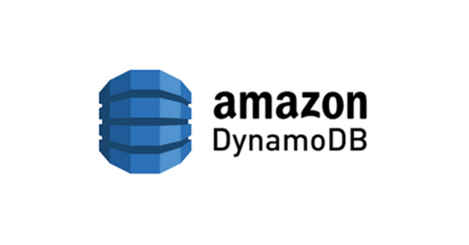
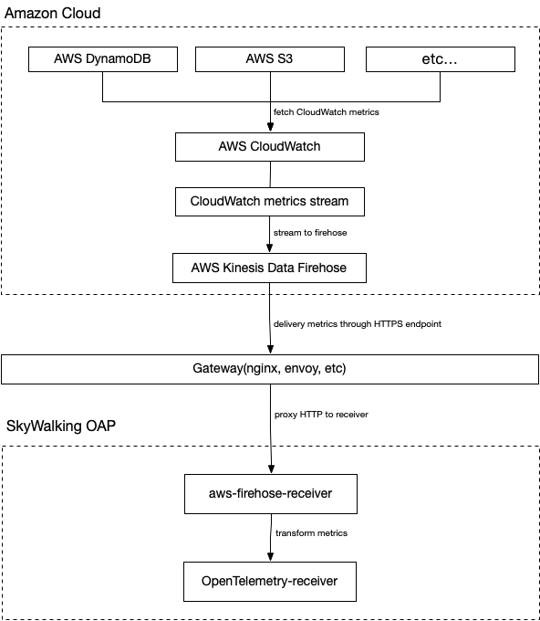
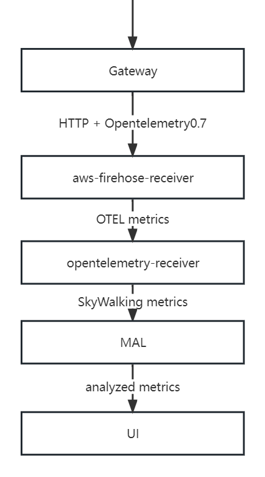
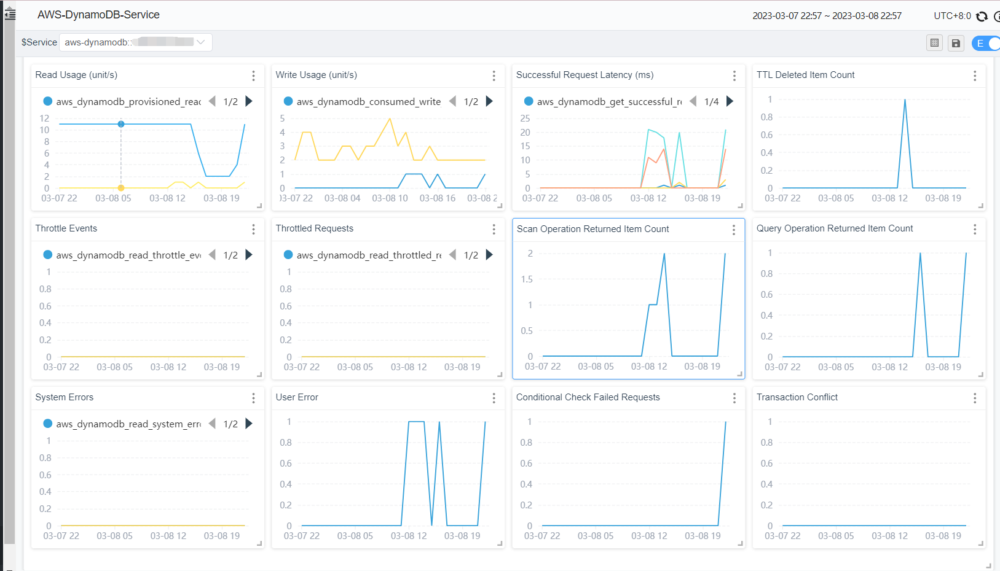
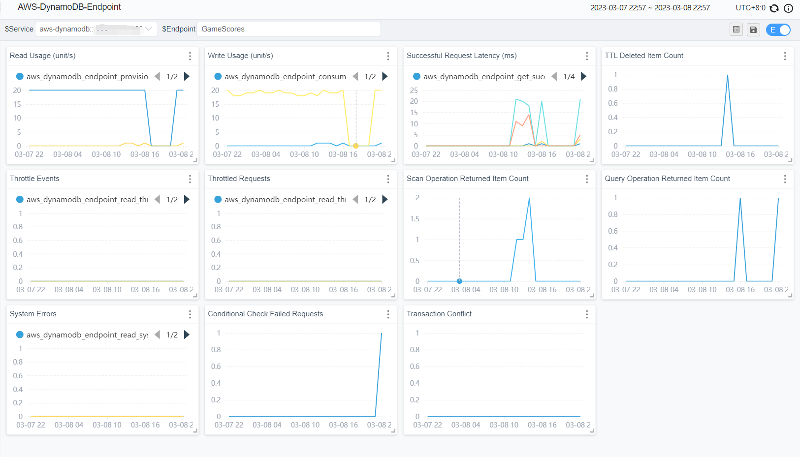

## Background
[Apache SkyWalking](https://skywalking.apache.org/) is an open source application performance management system that helps users collect and aggregate logs, traces, metrics and events, and display them on the UI. Starting from OAP 9.4.0, SkyWalking has added [AWS Firehose receiver](https://skywalking.apache.org/docs/main/next/en/setup/backend/aws-firehose-receiver/), which is used to receive and calculate the data of CloudWatch metrics. In this article, we will take DynamoDB as an example to show how to use SkyWalking to receive and calculate CloudWatch metrics data for monitoring Amazon Web Services.

## What is Amazon CloudWatch and Amazon Kinesis Data Firehose ？

[Amazon CloudWatch](https://aws.amazon.com/cloudwatch/) is a metrics repository, this tool can collect raw data from AWS (e.g. DynamoDB) and process it into readable metrics in near real-time. Also, we can use **Metric Streaming** to continuously stream CloudWatch metrics to a selected target location for near real-time delivery and low latency. SkyWalking takes advantage of this feature to create metric streams and direct them to Amazon Kinesis Data Firehose transport streams for further transport processing.

[Amazon Kinesis Data Firehose](https://aws.amazon.com/kinesis/data-firehose/)is an extract, transform, and load (ETL) service that reliably captures, transforms, and delivers streaming data to data lakes, data stores, and analytics services. SkyWalking takes advantage of this feature to eventually direct the metrics stream to the aws-firehose-receiver for OAP to calculate and ultimately display the metrics.

The flow chart is as follows.



###### Notice

-   Due to Kinesis Data Firehose specifications, the URL of the HTTP endpoint must use the HTTPS protocol and must use port 443. Also, this URL must be proxied by Gateway and forwarded to the real aws-firehose-receiver.
- The TLS certificate must be signed by a CA and the self-signed certificate will not be trusted by Kinesis Data Firehose.

## Setting up DynamoDB monitoring
Next, let's take DynamoDB as an example to illustrate the necessary settings in aws before using OAP to collect CloudWatch metrics:

1. Go to [Kinesis Console](https://console.aws.amazon.com/kinesis/home), create a data stream, select `Direct PUT` for `Source` and `HTTP Endpoint` for `Destination`. And set `HTTP Endpoint URL` to `Gateway URL`. The rest of the configuration options can be configured as needed.

! [image.png](. /kinesis.png)

2. Go to the [CloudWatch Console](https://console.aws.amazon.com/cloudwatch/home), select `Metrics-Stream` in the left control panel, and click Create metric stream. Select `AWS/DynamoDB` for `namepsace`. Also, you can add other namespaces as needed. `Kinesis Data Firehose` selects the data stream created in the first step. Finally, set the output format to opentelemetry0.7. The rest of the configuration options can be configured as needed.

! [cloudwatch.png](. /cloudwatch.png)

At this point, the AWS side of DynamoDB monitoring configuration is set up.
## SkyWalking OAP metrics processing analysis
SkyWalking uses aws-firehose-receiver to receive and decode AWS metrics streams forwarded by Gateway to [Opentelemetry-receiver](https://github.com/apache/skywalking/tree/master/oap-server/server-receiver-plugin/otel-receiver-plugin) for processing and transforming into SkyWalking metrics. And the metrics are analyzed and aggregated by [Meter Analysis Language (MAL)](https://skywalking.apache.org/docs/main/next/en/concepts-and-designs/mal/) and finally presented on the UI.

The MAL part and the UI part of SkyWalking support users' customization, so as to display the metrics data in a more diversified way. For details, please refer to [MAL doc](https://skywalking.apache.org/docs/main/next/en/concepts-and-designs/mal/) and [UI doc](https://skywalking.apache.org/docs/main/next/en/ui/readme/).



## Typical metrics analysis
### Scope
In SkyWalking, there is the concept of scope. By using scope, we can classify and aggregate metrics in a more reasonable way. In the monitoring of DynamoDB, two of these scopes are used - Service and Endpoint.

Service represents a set of workloads that provide the same behavior for incoming requests. Commonly used as cluster-level scopes for services, user accounts are closer to the concept of clusters in AWS. So SkyWalking uses AWS account id as a key to map AWS accounts to Service types.

Similarly, Endpoint represents a logical concept, often used in services for the path of incoming requests, such as HTTP URI path or gRPC service class + method signature, and can also represent the table structure in the database. So SkyWalking maps DynamoDB tables to Endpoint type.
### Metrics

| Metric Name | Meaning |
| --- | --- |
| AccountMaxReads / AccountMaxWrites | The maximum number of read/write capacity units that can be used by an account.  |
| AccountMaxTableLevelReads / AccountMaxTableLevelWrites | The maximum number of read/write capacity units that can be used by a table or global secondary index of an account.  |
| AccountProvisionedReadCapacityUtilization / AccountProvisionedWriteCapacityUtilization | The percentage of provisioned read/write capacity units utilized by an account. |
| MaxProvisionedTableReadCapacityUtilization / MaxProvisionedTableWriteCapacityUtilization | The percentage of provisioned read/write capacity utilized by the highest provisioned read table or global secondary index of an account. |

Above are some common account metrics (Serivce scope). They are various configuration information in DynamoDB, and SkyWalking can show a complete picture of the database configuration changes by monitoring these metrics.

| Metric Name | Meaning |
| --- | --- |
| ConsumedReadCapacityUnits / ConsumedWriteCapacityUnits | The number of read/write capacity units consumed over the specified time period.  |
| ReturnedItemCount | The number of items returned by Query, Scan or ExecuteStatement (select) operations during the specified time period. |
| SuccessfulRequestLatency | The latency of successful requests to DynamoDB or Amazon DynamoDB Streams during the specified time period. |
| TimeToLiveDeletedItemCount | The number of items deleted by Time to Live (TTL) during the specified time period. |

The above are some common table metrics (Endpoint scope), which will also be aggregated into account metrics. These metrics are generally used to analyze the performance of the database, and users can use them to determine the reasonable level of database configuration. For example, userscan track how much of your provisioned throughput is used through ConsumedReadCapicityUnits / ConsumedReadCapicityUnits to determine the reasonableness of the preconfigured throughput of a table or account. For more information about provisioned throughput, see [ProvisionedThroughputIntro](https://docs.aws.amazon.com/amazondynamodb/latest/developerguide/ProvisionedThroughputIntro.html).

| Metric Name | Meaning |
| --- | --- |
| UserErrors |Requests to DynamoDB or Amazon DynamoDB Streams that generate an HTTP 400 status code during the specified time period.  |
| SystemErrors |The requests to DynamoDB or Amazon DynamoDB Streams that generate an HTTP 500 status code during the specified time period. |
| ThrottledRequests | Requests to DynamoDB that exceed the provisioned throughput limits on a resource.|
| TransactionConflict | Rejected item-level requests due to transactional conflicts between concurrent requests on the same items. |

The above are some common error metrics, among which UserErrors are user-level metrics and the rest are table-level metrics. Users can set alarms on these metrics, and if warnings appear, then it may indicate that there are some problems with the use of the database, and users need to check and verify by themselves.

### Notice
SkyWalking's metrics selection for DynamoDB comes directly from CloudWatch metrics, which can also be found at [CloudWatch metrics doc](https://docs.aws.amazon.com/amazondynamodb/latest/developerguide/metrics-dimensions.html) to get metrics details.

## Demo
In this section, we will demonstrate how to use terraform to create a DynamoDB table and other AWS services that can generate metrics streams, and deploy Skywalking to complete the metrics collection.

First, you need a running gateway instance, such as [NGINX](https://www.nginx.com/), which is responsible for receiving metrics streams from AWS and forwarding them to the aws-firehose-receiver. Note that the gateway needs to be configured with certificates to accept HTTPS protocol requests.

Below is an example configuration for NGINX. The configuration does not need to be identical, as long as it can send incoming HTTPS requests to `oap host:12801/aws/firehose/metrics`.

```
server {
        listen       443 ssl;
        
        ssl_certificate     /crt/test.pem;
        ssl_certificate_key  /crt/test.key; 
        
        ssl_session_timeout  5m;   
        ssl_ciphers ECDHE-RSA-AES128-GCM-SHA256:ECDHE:ECDH:AES:HIGH:!NULL:!aNULL:!MD5:!ADH:!RC4; 
        ssl_protocols TLSv1 TLSv1.1 TLSv1.2;  
        ssl_prefer_server_ciphers on; 
    
        location /aws/firehose/metrics {
            proxy_pass http://test.xyz:12801/aws/firehose/metrics;
        }
    }
```

### Deploying SkyWalking
There are various ways to deploy SkyWalking, and you can get them directly from the [release page](https://github.com/apache/skywalking/releases/tag/v9.4.0).

Of course, if you are more comfortable with Kubernetes, you can also find the appropriate deployment method from [SkyWalking-kubernetes](https://github.com/apache/skywalking-kubernetes).

Please note that no matter which deployment method you use, please make sure that the OAP and UI version is 9.4.0 or higher and that port 12801 needs to be open.

The following is an example of a deployment using the helm command.

```
export SKYWALKING_RELEASE_VERSION=4.3.0 
export SKYWALKING_RELEASE_NAME=skywalking  
export SKYWALKING_RELEASE_NAMESPACE=default

helm install "${SKYWALKING_RELEASE_NAME}" \
  oci://registry-1.docker.io/apache/skywalking-helm \
  --version "${SKYWALKING_RELEASE_VERSION}" \
  -n "${SKYWALKING_RELEASE_NAMESPACE}" \
  --set oap.image.tag=9.4.0 \
  --set oap.storageType=elasticsearch \
  --set ui.image.tag=9.4.0 \
  --set oap.ports.firehose=12801
```

### Start the corresponding AWS service

The terraform configuration file is as follows (example modified in[Terraform Registry - kinesis_firehose_delivery_stream](https://registry.terraform.io/providers/hashicorp/aws/latest/docs/resources/kinesis_firehose_delivery_stream)）：
<details>
<summary>terraform configuration file </summary>
    
```
provider "aws" {
  region = "ap-northeast-1"
  access_key = "[need change]your access_key"
  secret_key = "[need change]your secret_key"
}
resource "aws_dynamodb_table" "basic-dynamodb-table" {
  name           = "GameScores"
  billing_mode   = "PROVISIONED"
  read_capacity  = 20
  write_capacity = 20
  hash_key       = "UserId"
  range_key      = "GameTitle"

  attribute {
    name = "UserId"
    type = "S"
  }

  attribute {
    name = "GameTitle"
    type = "S"
  }

  attribute {
    name = "TopScore"
    type = "N"
  }

  ttl {
    attribute_name = "TimeToExist"
    enabled        = true
  }

  global_secondary_index {
    name               = "GameTitleIndex"
    hash_key           = "GameTitle"
    range_key          = "TopScore"
    write_capacity     = 10
    read_capacity      = 10
    projection_type    = "INCLUDE"
    non_key_attributes = ["UserId"]
  }

  tags = {
    Name        = "dynamodb-table-1"
    Environment = "production"
  }
}

resource "aws_cloudwatch_metric_stream" "main" {
  name          = "my-metric-stream"
  role_arn      = aws_iam_role.metric_stream_to_firehose.arn
  firehose_arn  = aws_kinesis_firehose_delivery_stream.http_stream.arn
  output_format = "opentelemetry0.7"

  include_filter {
    namespace = "AWS/DynamoDB"
  }
}

# https://docs.aws.amazon.com/AmazonCloudWatch/latest/monitoring/CloudWatch-metric-streams-trustpolicy.html
data "aws_iam_policy_document" "streams_assume_role" {
  statement {
    effect = "Allow"

    principals {
      type        = "Service"
      identifiers = ["streams.metrics.cloudwatch.amazonaws.com"]
    }

    actions = ["sts:AssumeRole"]
  }
}

resource "aws_iam_role" "metric_stream_to_firehose" {
  name               = "metric_stream_to_firehose_role"
  assume_role_policy = data.aws_iam_policy_document.streams_assume_role.json
}

# https://docs.aws.amazon.com/AmazonCloudWatch/latest/monitoring/CloudWatch-metric-streams-trustpolicy.html
data "aws_iam_policy_document" "metric_stream_to_firehose" {
  statement {
    effect = "Allow"

    actions = [
      "firehose:PutRecord",
      "firehose:PutRecordBatch",
    ]

    resources = [aws_kinesis_firehose_delivery_stream.http_stream.arn]
  }
}
resource "aws_iam_role_policy" "metric_stream_to_firehose" {
  name   = "default"
  role   = aws_iam_role.metric_stream_to_firehose.id
  policy = data.aws_iam_policy_document.metric_stream_to_firehose.json
}

resource "aws_s3_bucket" "bucket" {
  bucket = "metric-stream-test-bucket"
}

resource "aws_s3_bucket_acl" "bucket_acl" {
  bucket = aws_s3_bucket.bucket.id
  acl    = "private"
}

data "aws_iam_policy_document" "firehose_assume_role" {
  statement {
    effect = "Allow"

    principals {
      type        = "Service"
      identifiers = ["firehose.amazonaws.com"]
    }

    actions = ["sts:AssumeRole"]
  }
}

resource "aws_iam_role" "firehose_to_s3" {
  assume_role_policy = data.aws_iam_policy_document.firehose_assume_role.json
}

data "aws_iam_policy_document" "firehose_to_s3" {
  statement {
    effect = "Allow"

    actions = [
      "s3:AbortMultipartUpload",
      "s3:GetBucketLocation",
      "s3:GetObject",
      "s3:ListBucket",
      "s3:ListBucketMultipartUploads",
      "s3:PutObject",
    ]

    resources = [
      aws_s3_bucket.bucket.arn,
      "${aws_s3_bucket.bucket.arn}/*",
    ]
  }
}

resource "aws_iam_role_policy" "firehose_to_s3" {
  name   = "default"
  role   = aws_iam_role.firehose_to_s3.id
  policy = data.aws_iam_policy_document.firehose_to_s3.json
}

resource "aws_kinesis_firehose_delivery_stream" "http_stream" {
  name        = "metric-stream-test-stream"
  destination = "http_endpoint"

  http_endpoint_configuration {
    name       = "test_http_endpoint"
    url        = "[need change]Gateway url"
    role_arn   = aws_iam_role.firehose_to_s3.arn
  }
  s3_configuration {
    role_arn   = aws_iam_role.firehose_to_s3.arn
    bucket_arn = aws_s3_bucket.bucket.arn
  }
}
```
</details>

Steps to use.

1. Get the access_key and secret_key of the AWS account.( For how to get them, please refer to: [create-access-key](https://aws.amazon.com/premiumsupport/knowledge-center/create- access-key/) )

2. Fill in the access_key and secret_key you got in the previous step, and fill in the corresponding url of your gateway in the corresponding location of `aws_kinesis_firehose_delivery_stream` configuration.

3. Copy the above content and save it to the main.tf file.

4. Execute the following code in the corresponding path.

```
terraform init
terraform apply
```

At this point, all the required AWS services have been successfully created, and you can check your console to see if the services were successfully created.
### Done!

If all the above steps were successful, please wait for about five minutes. After that, you can visit the SkyWalking UI to see the metrics.


Currently, the metrics collected by SkyWalking by default are displayed as follows.

**account metrics:**



**table metrics：**



### Other service

Currently SkyWalking officially supports EKS, S3, DynamoDB monitoring. Users also refer to [the OpenTelemetry receiver](https://skywalking.apache.org/docs/main/next/en/setup/backend/opentelemetry-receiver/) to configure OTel rules to collect and analyze CloudWatch metrics of other AWS services, and display them through [a custom dashboard](https://skywalking.apache.org/docs/main/next/en/ui/readme/).

### Material

* [Monitoring S3 metrics with Amazon CloudWatch](https://docs.aws.amazon.com/AmazonS3/latest/userguide/cloudwatch-monitoring.html)
* [Monitoring DynamoDB metrics with Amazon CloudWatch](https://docs.aws.amazon.com/amazondynamodb/latest/developerguide/monitoring-cloudwatch.html)
* [Supported metrics in AWS Firehose receiver of OAP](https://skywalking.apache.org/docs/main/next/en/setup/backend/aws-firehose-receiver/)
* [Configuration Vocabulary | Apache SkyWalking](https://skywalking.apache.org/docs/main/next/en/setup/backend/configuration-vocabulary/)
