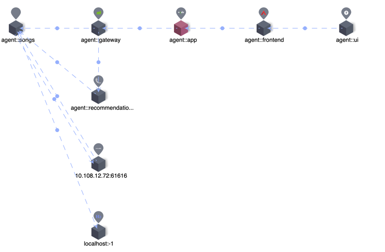

## Background
As an application performance monitoring tool for distributed systems, Apache SkyWalking provides monitoring, tracing, diagnosing capabilities for distributed system in Cloud Native architecture.
[Prometheus](https://prometheus.io/docs/introduction/overview/#what-is-prometheus) is an open-source systems monitoring and alerting toolkit with an active ecosystem.
Especially Prometheus metrics receive widespread support through [exporters and integrations](https://prometheus.io/docs/instrumenting/exporters/#exporters-and-integrations).
[PromQL](https://prometheus.io/docs/prometheus/latest/querying/basics/#querying-prometheus) as Prometheus Querying Language containing a set of expressions and expose HTTP APIs to read metrics.

SkyWalking supports to ingest Prometheus metrics through [OpenTelemetry collector](https://opentelemetry.io/ecosystem/integrations/) and through the aggregate calculation of these metrics
to provide a variety of systems monitoring, such as Linux Monitoring and Kubernetes monitoring.
SkyWalking already provides [native UI](https://skywalking.apache.org/docs/main/next/en/ui/readme/) and [GraphQL API](https://skywalking.apache.org/docs/main/next/en/api/query-protocol/) for users.
But as designed to provide wider ecological integration capabilities, since 9.4.0, it provides PromQL Service, the third-party systems or visualization platforms that already support PromQL (such as Grafana),
could obtain metrics through it. SkyWalking users will benefit from it when they integrate with different systems.

## What is PromQL Service in SkyWalking?
PromQL Service is a query engine on the top of SkyWalking native GraphQL query, with additional query stage calculation capabilities powered by Prometheus expressions.
It can accept PromQL HTTP API requests, parse Prometheus expressions, and transform between Prometheus metrics and SkyWalking metrics.


As SkyWalking is fundamentally different from Prometheus in terms of metric classification, format, storage, etc.
The PromQL Service supported will be a subset of the full PromQL.
Refer to the documentation for specific [compatibility](https://skywalking.apache.org/docs/main/next/en/api/promql-service/#promql-service).


## SkyWalking Basic Concepts
Here are some basic concepts and differences from Prometheus that users need to understand in order to use the PromQL service:
Prometheus metrics specify the naming format and structure, the actual metric names and labels are determined by the client provider, and the details are stored.
The user aggregates and calculates the metrics using the expression in PromQL.
Unlike Prometheus, SkyWalking's metric mechanism is built around the following core concepts with a hierarchical structure:
- Layer: represents an abstract framework in computer science, such as Operating System(OS_LINUX layer), Kubernetes(k8s
  layer). This layer would be the owner of different services detected from different technologies. All Layers definitions can be found [here](https://github.com/apache/skywalking/blob/master/oap-server/server-core/src/main/java/org/apache/skywalking/oap/server/core/analysis/Layer.java).
- Service: Represents a set/group of workloads which provides the same behaviors for incoming requests.
- Service Instance: An individual workload in the Service group.
- Endpoint: A path in a service for incoming requests.
- Process: An operating system process. In some scenarios, a `service instance` is not a process, such as a pod Kubernetes could contain multiple processes.

The metric name and properties (labels) are configured by the SkyWalking OAP server based on the data source as well as OAL and MAL.
SkyWalking provides the ability to down-sampling time series metrics, and generate different time bucket data (minute, hour, day).

The SkyWalking metric stream is as follows:


### Traffic
- The metadata of the
  Service/ServiceRelation/Instance/ServiceInstanceRelation/Endpoint/EndpointRelation/Process/ProcessRelation.
  Include names, layers, properties, relations between them, etc.

### Metric
- Name: metric name, configuration from OAL and MAL.
- Entity: represents the metrics' belonging and used for the query.
  An Entity will contain the following information depending on the `Scope`：
  Scope represents the metrics level and in query stage represents the Scope catalog,
  Scope catalog provides high-dimension classifications for all scopes as a hierarchy structure.

| Scope                   | Entity Info                            |
|-------------------------|----------------------------------------|
| Service                 | Service(include layer info)            |
| ServiceInstance         | Service, ServiceInstance               |
| Endpoint                | Service, Endpoint                      |
| ServiceRelation         | Service, DestService                   |
| ServiceInstanceRelation | ServiceInstance, DestServiceInstance   |
| EndpointRelation        | Endpoint, DestEndpoint                 |
| Process                 | Service, ServiceInstance, Process      |
| ProcessRelation         | Process,  ServiceInstance, DestProcess |

- Value:
1. single value: long.
2. labeled value: text, `label1,value1|label2,value2|...`, such as `L2 aggregation,5000 | L1 aggregation,8000`.

- TimeBucket: the time is accurate to minute, hour, day.

## How to use PromQL Service

### Setup
PromQL Service is enabled by default after v9.4.0, so no additional configuration is required.
The default ports, for example, can be configured by using OAP environment variables:
```text
restHost: ${SW_PROMQL_REST_HOST:0.0.0.0}
restPort: ${SW_PROMQL_REST_PORT:9090}
restContextPath: ${SW_PROMQL_REST_CONTEXT_PATH:/}
restMaxThreads: ${SW_PROMQL_REST_MAX_THREADS:200}
restIdleTimeOut: ${SW_PROMQL_REST_IDLE_TIMEOUT:30000}
restAcceptQueueSize: ${SW_PROMQL_REST_QUEUE_SIZE:0}
```

### Use Prometheus expression
PromQL matches metric through the Prometheus expression. Here is a typical Prometheus metric.


To match the metric, the Prometheus expression is as follows:


In the PromQL Service, these reserved labels would be parsed as the metric name and entity info fields with other labels for the query. The mappings are as follows.

| SkyWalking Concepts | Prometheus expression   |
|---------------------|-------------------------|
| Metric name         | Metric name             |
| Layer               | Label<layer>            |
| Service             | Label<service>          |
| ServiceInstance     | Label<service_instance> |
| Endpoint            | Label<endpoint>         |
| ...                 | ...                     |

For example, the following expressions are used to match query metrics: service_cpm, service_instance_cpm, endpoint_cpm

```text
service_cpm{service='agent::songs', layer='GENERAL'}
service_instance_cpm{service='agent::songs', service_instance='agent::songs_instance_1', layer='GENERAL'}
endpoint_cpm{service='agent::songs', endpoint='GET:/songs', layer='GENERAL'} 
```

### Typical Query Example 
Using the following services observed by SkyWalking as the example (deployment from [SkyWalking Showcase](https://skywalking.apache.org/docs/skywalking-showcase/next/readme/)),



The following examples can be used to query the metadata and metrics from PromQL Service: 

#### Get metrics names
Query:
```text
http://localhost:9099/api/v1/label/__name__/values
```

Result:
```json
{
    "status": "success",
    "data": [
        "meter_mysql_instance_qps",
        "service_cpm",
        "envoy_cluster_up_rq_active",
        "instance_jvm_class_loaded_class_count",
        "k8s_cluster_memory_requests",
        "meter_vm_memory_used",
        "meter_apisix_sv_bandwidth_unmatched",
        "meter_vm_memory_total",
        ...
    ]
}
```

#### Select a metric and get the labels
Query:
```text
http://localhost:9099/api/v1/labels?match[]=service_cpm
```

Result:
```json
{
  "status": "success",
  "data": [
    "layer",
    "service",
    "top_n",
    "order"
  ]
}
```

#### Get services from a specific layer
Query:
```text
http://127.0.0.1:9099/api/v1/series?match[]=service_traffic{layer='GENERAL'}&start=1677479336&end=1677479636
```

Result:
```json
{
    "status": "success",
    "data": [
        {
            "__name__": "service_traffic",
            "service": "agent::songs",
            "scope": "Service",
            "layer": "GENERAL"
        },
        {
            "__name__": "service_traffic",
            "service": "agent::recommendation",
            "scope": "Service",
            "layer": "GENERAL"
        },
        {
            "__name__": "service_traffic",
            "service": "agent::app",
            "scope": "Service",
            "layer": "GENERAL"
        },
        {
            "__name__": "service_traffic",
            "service": "agent::gateway",
            "scope": "Service",
            "layer": "GENERAL"
        },
        {
            "__name__": "service_traffic",
            "service": "agent::frontend",
            "scope": "Service",
            "layer": "GENERAL"
        }
    ]
}
```

#### Query specific metric for a service
Query:
```text
http://127.0.0.1:9099/api/v1/query?query=service_cpm{service='agent::songs', layer='GENERAL'}
```

Result:
```json
{
  "status": "success",
  "data": {
    "resultType": "vector",
    "result": [
      {
        "metric": {
          "__name__": "service_cpm",
          "layer": "GENERAL",
          "scope": "Service",
          "service": "agent::songs"
        },
        "value": [
          1679559960,
          "6"
        ]
      }
    ]
  }
}
```
About the `range query` and different `metrics type for query` can refer to the document [here](https://skywalking.apache.org/docs/main/next/en/api/promql-service).

## Build Grafana Dashboard
From the above, we know the mechanism and how to query from PromQL Service, now we can build the Grafana Dashboard for the above service example.
**Note**: All the following configurations are based on Grafana version 9.1.0.

SkyWalking Showcase provides dashboards files such as services of `General` and `Service Mesh` layers，
we can quickly create a dashboard for the `General` layer service by importing the dashboard JSON file.

After the Grafana application is deployed, follow the steps below:

### Configure Data Source
First, we need to create a data source:
In the data source config panel, chose `Prometheus` and set the URL to the OAP server address, the default port is `9090`.
Here set the data source name `SkyWalking` in case there are multiple Prometheus data sources.


### Import Dashboard File
1. Create a dashboard folder named `SkyWalking`.

   

2. Import the dashboard file into Grafana, there are two ways to get the file:
   1. From [SkyWalking Showcase](https://github.com/apache/skywalking-showcase/tree/main/deploy/platform/config/promql/dashboards).
   2. Go to SkyWaking Demo: [Preview metrics on Grafana](https://skywalking.apache.org/#demo), and export it from the `General Service` dashboard.

   

3. Done! Now we can see the dashboard is working, the services are in the drop-down list and the metrics are displayed on the panels.

   

This is an easy way to build, but we need to know how it works if we want to customize it.

### How the dashboard works

#### Dashboard Settings
Open the `Settings-Variables` we can see the following variables:


Let's look at what each variable does:
1. **$DS_SkyWalking**

   This is a data source ty variable that specifies the Prometheus data source which was defined earlier as `SkyWalking`.
   
   

2. **$layer**

   This is a constant type because in the 'General Service' dashboard, all services belong to the 'GENERAL' layer, so they can be used directly in each query
   **Note** When you customize other layers, this value must be defined in the `Layer` mentioned above.
   
     

3. **$service**

   Query type variable, to get all service names under this layer for the drop-down list.

   Query expression:
   ```text
   label_values(service_traffic{layer='$layer'}, service)
   ```
   The query expression will query HTTP API `/api/v1/series` for service metadata in `$layer` and fetch the service name according to the label(service).

   

4. **$service_instance**

   Same as the `$service` is a query variable that is used to select all instances of the service in the drop-down list.

   Query expression:
   ```text
   label_values(instance_traffic{layer='$layer', service='$service'}, service_instance)
   ```
   The query expression here not only specifies the `$layer` but also contains the variable `$service`, which is used to correlate with the services for the drop-down list.

5. **$endpoint**

   Same as the `$service` is a query variable that is used to select all endpoints of the service in the drop-down list.

   Query expression:
   ```text
   label_values(endpoint_traffic{layer='$layer', service='$service', keyword='$endpoint_keyword', limit='$endpoint_limit'}, endpoint)
   ```
   The query expression here specifies the `$layer` and '$service' which are used to correlate with the services for the drop-down list. And also
   accept variables `$endpoint_keyword` and `$endpoint_limit` as filtering condition.

6. **$endpoint_keyword**

   A text type variable that the user can input to filter the return value of `$endpoint`.
   
   

7. **$endpoint_limit**

   Custom type, which the user can select to limit the maximum number of returned endpoints.

   


#### Panel Configurations
There are several typical metrics panels on this dashboard, let's see how it's configured.
##### Common Value Metrics
Select `Time series chart` panel `Service Apdex` and click `edit`.

1. Query expression
   ```text
   service_apdex{service='$service', layer='$layer'} / 10000
   ```
   The metric scope is `Service`, add labels `service` and `layer` for the match, and the label value used the variables configured above.
   The calculation `Divided by 10000` is used for matching the result units.
   The document for the query can refer to [here](https://skywalking.apache.org/docs/main/next/en/api/promql-service/#common-value-metrics).
2. Set `Query options --> Min interval = 1m`, because the metrics min time bucket in SkyWalking is 1m.
3. Set `Connect null values --> Always` and `Show points --> Always` because when the query interval > 1 hour or 1 day SkyWalking returns
   the hour/day step metrics values.

##### Labeled Value Metrics
Select `Time series chart` panel `Service Response Time Percentile` and click `edit`.

1. Query expression
   ```text
   service_percentile{service='$service', layer='$layer', labels='0,1,2,3,4', relabels='P50,P75,P90,P95,P99'}
   ```
   The metric scope is `Service`, add labels `service` and `layer` for the match, and the label value used the variables configured above.
   Add `labels='0,1,2,3,4'` filter the result label, and add`relabels='P50,P75,P90,P95,P99'` rename the result label.
   The document for the query can refer to [here](https://skywalking.apache.org/docs/main/next/en/api/promql-service/#labeled-value-metrics).
2. Set `Query options --> Min interval = 1m`, because the metrics min time bucket in SkyWalking is 1m.
3. Set `Connect null values --> Always` and `Show points --> Always` because when the query interval > 1 hour or 1 day SkyWalking returns
   the hour/day step metrics values.
4. Set `Legend` to `{{label}}` for show up.

##### Sort Metrics
Select `Time series chart` panel `Service Response Time Percentile` and click `edit`.

1. Query expression
   ```text
   service_instance_cpm{parent_service='$service', layer='$layer', top_n='10', order='DES'}
   ```
   The expression is used for query the sore metrics under service, so add labels `parent_service` and `layer` for the match.
   Add `top_n='10'` and `order='DES'` filter the result.
   The document for the query can refer to [here](https://skywalking.apache.org/docs/main/next/en/api/promql-service/#sort-metrics).
2. Set `Query options --> Min interval = 1m`, because the metrics min time bucket in SkyWalking is 1m.
3. Set the `Calculation --> Latest*`.
4. Set `Legend` to `{{service_instance}}` for show up.

## Conclusion
In this article, we introduced what is the PromQL Service in SkyWalking and its background.
Detailed how to use PromQL Service and the basic concepts related to SkyWalking, and show how to use PromQL Service to build Grafana dashboards for SkyWalking.

In the future, there will be more integrations by leveraging this protocol, such as CI/CD, HPA (scaling), etc.
