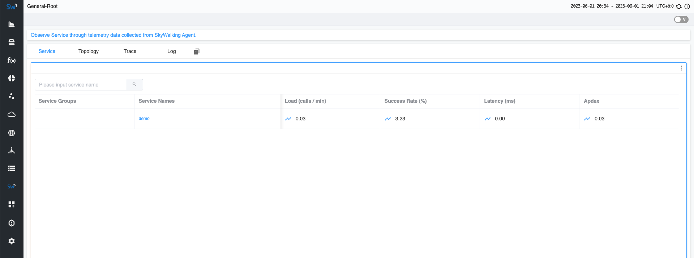

# Background

Previously, if you wanted to monitor a Golang application in SkyWalking, you would integrate your project with the [go2sky](https://github.com/skyapm/go2sky) project 
and manually write various frameworks with go2sky plugins. Now, we have a brand-new project ([Skywalking Go](https://github.com/apache/skywalking-go)) 
that allows you to integrate your Golang projects into SkyWalking with almost zero coding, while offering greater flexibility and scalability.

In this article, we will guide you quickly integrating the skywalking-go project into your Golang project.

# Quick start

This demonstration will consist of the following steps:

1. **Deploy SkyWalking**: This involves setting up the SkyWalking backend and UI programs, enabling you to see the final effect.
2. **Compile Golang with SkyWalking Go**: Here, you'll compile the SkyWalking Go Agent into the Golang program you wish to monitor.
3. **Application Deployment**: You'll export environment variables and deploy the application to facilitate communication between your service and the SkyWalking backend.
4. **Visualization on SkyWalking UI**: Finally, you'll send requests and observe the effects within the SkyWalking UI.

## Deploy SkyWalking

Please download the [SkyWalking APM program from the official SkyWalking website](https://skywalking.apache.org/downloads/#SkyWalkingAPM). 
Then execute the following two commands to start the service:

```shell
# startup the OAP backend
> bin/oapService.sh
# startup the UI
> bin/webappService.sh
```

Next, you can access the address at `http://localhost:8080/`. At this point, as no applications have been deployed yet, you will not see any data.

## Compile Golang with SkyWalking GO

Here is a simple business application here that starts an HTTP service.

```go
package main

import "net/http"

func main() {
	http.HandleFunc("/hello", func(writer http.ResponseWriter, request *http.Request) {
		writer.Write([]byte("Hello World"))
	})
	err := http.ListenAndServe(":8000", nil)
	if err != nil {
		panic(err)
	}
}
```

Execute the following command in the project's root directory. This command will download the dependencies required for skywalking-go:

```shell
go get github.com/apache/skywalking-go
```

Also, include it in the `main` package of the project. After the inclusion, the code will update to:

```go
package main

import (
	"net/http"

    // This is an important step. DON'T MISS IT.
	_ "github.com/apache/skywalking-go"
)

func main() {
	http.HandleFunc("/hello", func(writer http.ResponseWriter, request *http.Request) {
		writer.Write([]byte("Hello World"))
	})
	err := http.ListenAndServe(":8000", nil)
	if err != nil {
		panic(err)
	}
}
```

Next, please download the [Go Agent program from the official SkyWalking website](https://skywalking.apache.org/downloads/#GoAgent). 
When you compile with the go build command, find the agent program that matches your current operating system in the **bin** directory, 
and add the `-toolexec="/path/to/go-agent -a` parameter. For example, use the following command:

```shell
# Build application with SkyWalking go agent
# -toolexec parameter define the path of go-agent
# -a parameter is used to force rebuild all packages
> go build -toolexec="/path/to/go-agent" -a -o test .
```

## Application Deployment


Before you start to deploy the application, you can change the service name of the current application in SkyWalking through environment variables. 
You can also change its configuration such as the address with the server-side. For specific details, please [refer to the documentation](https://skywalking.apache.org/docs/skywalking-go/next/en/advanced-features/settings-override/). 

Here, we're just changing the name of the current service to `demo`.

```shell
# Change the service name
> export SW_AGENT_NAME=demo
```

Next, you can start the application:

```shell
# Start the application
> ./test
```

## Visualization on SkyWalking UI

Now, you can send a request to the application and observe the results in the SkyWalking UI.

```shell
# Send a request
> curl http://localhost:8000/hello
```

After a few seconds, you can revisit the SkyWalking UI at `http://localhost:8080`. You will be able to see the `demo` service you deployed on the homepage.



Moreover, on the Trace page, you can see the request you just sent.


# Conclusion

In this article, we've guided you to quickly develop a `demo` service and integrate it with SkyWalking Go Agent. 
This process is also applicable to your own Golang services. Ultimately, you can view the display effect in the SkyWalking service. 
If you're interested in learning which frameworks the SkyWalking Go agent currently supports, please [refer to this documentation](https://skywalking.apache.org/docs/skywalking-go/next/en/agent/support-plugins/).

In the future, we will continue to expand the functionality of SkyWalking Go, adding more plugin support. So, stay tuned!


