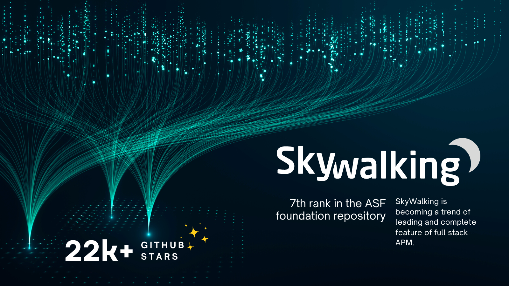

# Celebrating 22k Stars!

The Apache SkyWalking community is thrilled to reach the milestone of 22k stars on GitHub! This showcases its popularity and impact as an APM and observability tool.

Since launching in 2016 to provide an open source APM solution, SkyWalking has evolved into a full stack observability platform with distributed tracing, metrics monitoring and alerting. It's seeing widespread adoption globally, especially in Asia where APM needs are expanding rapidly.

The growing user base has enabled SkyWalking to achieve massive deployments demonstrating its ability to scale to extreme levels. There have been reported deployments collecting over 100TB of data from companies' complex distributed applications, monitoring over 8000 microservices and analyzing 100 billion distributed traces - providing end-to-end visibility, performance monitoring and issue troubleshooting for some of the largest distributed systems in the world.

This success and widespread adoption has attracted an active community of nearly 800 contributors, thanks in part to programs like GSoC and OSPP(Open Source Promotion Plan) that bring in university contributors. The SkyWalking team remains focused on building a reliable, performant platform to observe complex distributed systems. We'll continue innovating with features like service mesh monitoring and metric analytics.Your ongoing support, feedback and contributions inspire us!

Thank you for helping SkyWalking reach 22k stars on GitHub! This is just the beginning - we have ambitious plans and can't wait to have you along our journey!
