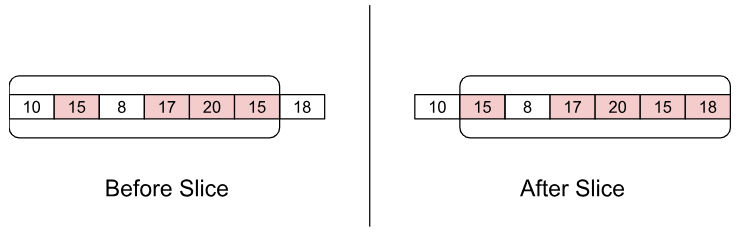
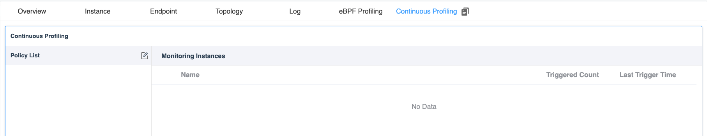
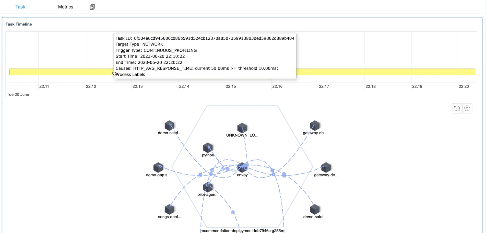

# Background

In previous articles, We have discussed how to use SkyWalking and eBPF for performance problem detection within [processes](/blog/2022-07-05-pinpoint-service-mesh-critical-performance-impact-by-using-ebpf) and [networks](blog/diagnose-service-mesh-network-performance-with-ebpf). 
However, there are still two outstanding issues:

1. **The timing of the task initiation**: It's always challenging to address the processes that require performance monitoring when problems occur.
Typically, manual engagement is required to identify processes and the types of performance analysis necessary, which cause extra time during the crash recovery.
The root cause locating and the time of crash recovery conflict with each other from time to time. 
In the real case, rebooting would be the first choice of recovery, meanwhile, it destroys the site of crashing.
2. **Resource consumption of tasks**: The difficulties to determine the profiling scope. Wider profiling causes more resources than it should. 
We need a method to manage resource consumption and understand which processes necessitate performance analysis.
3. **Engineer capabilities**: On-call is usually covered by the whole team, which have junior and senior engineers, even senior engineers have their understanding limitation of the complex distributed system, 
it is nearly impossible to understand the whole system by a single one person.

The **Continuous Profiling** is a new created mechanism to resolve the above issues.

# Mechanism

If profiling tasks consume a significant amount of system resources, can we find alternative ways to monitor processes that use fewer system resources? The answer is yes. 
Currently, SkyWalking establishes policy rules for specified target services, which are then monitored by the eBPF Agent in a low-energy manner. 
When a policy match occurs, a profiling task is automatically triggered.

## Policy

Policy rules specify how to monitor target processes and determine the type of profiling task to initiate when certain threshold conditions are met.

These policy rules primarily consist of the following configuration information:

1. **Monitoring type**: This specifies what kind of monitoring should be implemented on the target process.
2. **Threshold determination**: This defines how to determine whether the target process requires the initiation of a profiling task.
3. **Trigger task**: This specifies what kind of performance analysis task should be initiated.

### Monitoring type

The type of monitoring is determined by observing the data values of a specified process to generate corresponding metrics. 
These metric values can then facilitate subsequent threshold judgment operations. 
In eBPF observation, we believe the following metrics can most directly reflect the current performance of the program:

| Monitor Type | Unit | Description |
|--------------|------|-------------|
| System Load | Load | System load average over a specified period. |
| Process CPU | Percentage | The CPU usage of the process as a percentage. |
| Process Thread Count | Count | The number of threads in the process. |
| HTTP Error Rate | Percentage | The percentage of HTTP requests that result in error responses (e.g., 4xx or 5xx status codes). |
| HTTP Avg Response Time | Millisecond | The average response time for HTTP requests. |

#### Network related monitoring

Monitoring network type metrics is not as simple as obtaining basic process information. 
It requires the initiation of eBPF programs and attaching them to the target process for observation. 
This is similar to the principles of [network profiling task we introduced in the previous article](blog/diagnose-service-mesh-network-performance-with-ebpf), 
except that we no longer collect the full content of the data packets. Instead, we only collect the content of messages that match specified HTTP prefixes.

By using this method, we can significantly reduce the number of times the kernel sends data to the user space, 
and the user-space program can parse the data content with less system resource usage. This ultimately helps in conserving system resources.

#### Metrics collector

When the eBPF Agent is monitoring a target process, it would report the collected data to the SkyWalking backend in the form of metrics. 
This allows users to understand real-time execution status promptly.

| Name                   | Unit     | Description                                                               |
|------------------------|----------|---------------------------------------------------------------------------|
| process_cpu            | (0-100)% | The CPU usage percent                                                     |
| process_thread_count   | count    | The thread count of process                                               |
| system_load            | count    | The average system load for the last minute, each process have same value |
| http_error_rate        | (0-100)% | The network request error rate percentage                                 |
| http_avg_response_time | ms       | The network average response duration                                     |

### Threshold determination

For the threshold determination, the judgement is made by the eBPF Agent based on the target monitoring process in its own memory, 
rather than relying on calculations performed by the SkyWalking backend. 
The advantage of this approach is that it doesn't have to wait for the results of complex backend computations, 
and it reduces potential issues brought about by complicated interactions. 

By using this method, the eBPF Agent can swiftly initiate tasks immediately after conditions are met, without any delay.

It includes the following configuration items:

1. **Threshold**: Check if the monitoring value meets the specified expectations. 
2. **Period**: The time period(seconds) for monitoring data, which can also be understood as the most recent duration. 
3. **Count**: The number of times(seconds) the threshold is triggered within the detection period, which can also be understood as the total number of times the specified threshold rule is triggered in the most recent duration(seconds). Once the count check is met, the specified Profiling task will be started.

### Trigger task

When the eBPF Agent detects that the threshold determination in the specified policy meets the rules, it can initiate the corresponding task according to pre-configured rules. 
For each different target performance task, their task initiation parameters are different:

* **On/Off CPU Profiling**: It automatically performs performance analysis on processes that meet the conditions, defaulting to `10` minutes of monitoring.
* **Network Profiling**: It performs network performance analysis on all processes in the same **Service Instance on the current machine**, 
to prevent the cause of the issue from being unrealizable due to too few process being collected, defaulting to `10` minutes of monitoring.

Once the task is initiated, no new profiling tasks would be started for the current process for a certain period. 
The main reason for this is to prevent frequent task creation due to low threshold settings, which could affect program execution. The default time period is `20` minutes.

## Data Flow

The following figure illustrates the data flow of the continuous profiling feature:


### eBPF Agent with Process

Firstly, we need to ensure that the eBPF Agent and the process to be monitored are deployed on the same host machine, 
so that we can collect relevant data from the process. When the eBPF Agent detects a threshold validation rule that conforms to the policy, 
it immediately triggers the profiling task for the target process, thereby reducing any intermediate steps and accelerating the ability to pinpoint performance issues.

#### Sliding window

The sliding window plays a crucial role in the eBPF Agent's threshold determination process, as illustrated in the following figure:



Each element in the array represents the data value for a specified second in time.
When the sliding window needs to verify whether it is responsible for a rule,
it fetches the content of each element from a certain number of recent elements (period parameter).
If an element exceeds the threshold, it is marked in red and counted. If the number of red elements exceeds a certain number, it is deemed to trigger a task.

Using a sliding window offers the following two advantages:

1. **Fast retrieval of recent content**: With a sliding window, complex calculations are unnecessary.
   You can know the data by simply reading a certain number of recent array elements.
2. **Solving data spikes issues**: Validation through count prevents situations where a data point suddenly spikes and then quickly returns to normal.
   Verification with multiple values can reveal whether exceeding the threshold is frequent or occasional.

### eBPF Agent with SkyWalking Backend

The eBPF Agent communicates periodically with the SkyWalking backend, involving three most crucial operations:

1. **Policy synchronization**: Through periodic policy synchronization, the eBPF Agent can keep processes on the local machine updated with the latest policy rules as much as possible.
2. **Metrics sending**: For processes that are already being monitored, the eBPF Agent periodically sends the collected data to the backend program. 
This facilitates real-time query of current data values by users, who can also compare this data with historical values or thresholds when problems arise.
3. **Profiling task reporting**: When the eBPF detects that a certain process has triggered a policy rule, it automatically initiates a performance task, 
collects relevant information from the current process, and reports it to the SkyWalking backend. This allows users to know **when, why, and what** type of profiling task was triggered from the interface.

# Demo

Next, let's quickly demonstrate the continuous profiling feature, so you can understand more specifically what it accomplishes.

## Deploy SkyWalking Showcase

SkyWalking Showcase contains a complete set of example services and can be monitored using SkyWalking. 
For more information, please check the [official documentation](https://skywalking.apache.org/docs/skywalking-showcase/next/readme/).

In this demo, we only deploy service, the latest released SkyWalking OAP, and UI.

```shell
export SW_OAP_IMAGE=apache/skywalking-oap-server:9.5.0
export SW_UI_IMAGE=apache/skywalking-ui:9.5.0
export SW_ROVER_IMAGE=apache/skywalking-rover:0.5.0

export FEATURE_FLAGS=mesh-with-agent,single-node,elasticsearch,rover
make deploy.kubernetes
```

After deployment is complete, please run the following script to open SkyWalking UI: http://localhost:8080/.

```shell
kubectl port-forward svc/ui 8080:8080 --namespace default
```

## Create Continuous Profiling Policy

Currently, we can select the specific service that we wish to monitoring by clicking the **Services** item in the **Service Mesh** panel.



By clicking on the edit button in the above figure, we can edit the continuous analysis configuration for this service.


The following configuration are support:

1. **Target Type**: Specifies the type of profiling task to be triggered when the threshold determination is met.
2. **Items**: For profiling task of the same target, one or more validation items can be specified. 
As long as one validation item meets the threshold determination, the corresponding performance analysis task will be launched.
   1. **Monitor Type**: Specifies the type of monitoring to be carried out for the target process.
   2. **Threshold**: Depending on the type of monitoring, you need to fill in the corresponding threshold to complete the verification work. 
   3. **Period**: Specifies the number of recent seconds of data you want to monitor. 
   4. **Count**: Determines the total number of seconds triggered within the recent period. 
   5. **URI Regex/List**: This is applicable to HTTP monitoring types, allowing URL filtering.

## Done

After clicking the save button, you can see the currently created monitoring rules, as shown in the figure below:


The data can be divided into the following parts:

1. **Rule list**: On the left, you can see the rule list you have created.
2. **Monitoring Summary List**: Once a rule is selected, you can see which pods and processes would be monitored by this rule. 
It also summarizes how many profiling tasks have been triggered in the **last 48 hours** by the current pod or process, as well as the last trigger time. 
This list is also sorted in descending order by the number of triggers to facilitate your quick review.

When you click on a specific process, you can see the data displayed as shown in the figure below:



The current figure contains the following data contents:

1. **Task Timeline**: It shows when the current process has triggered performance analysis tasks in the **past 48 hours**. And when the mouse hovers over a task, it would also display detailed information: 
   1. **Task start and end time**: It indicates when the current performance analysis task was triggered.
   2. **Trigger reason**: It would display the reason why the current process was triggered and list out what the monitoring indicator was at the time it exceeded the threshold, 
   so you can quickly understand the reason.
2. **Task Detail**: Similar to the CPU Profiling and Network Profiling introduced in previous articles, this would display the flame graph or process topology map of the current task, 
depending on the target type you created.

When you click on the **Metrics** tab, it would display the metric content related to the profiling of the current process, as shown in the figure below.
Here, only the metrics you have configured for the current process would be collected, other metric information would not be collected. 
Based on the collected metrics, you can get a comprehensive understanding of the monitoring status of the current process.


# Conclusion

In this article, I have detailed how the continuous profiling feature in SkyWalking and eBPF works. 
In general, it involves deploying the eBPF Agent service on the same machine where the process to be monitored resides, 
and monitoring the target process with low resource consumption. When it meets the threshold conditions, 
it would initiate more complex CPU Profiling and Network Profiling tasks.

In the future, we will offer even more features. Stay tuned!

