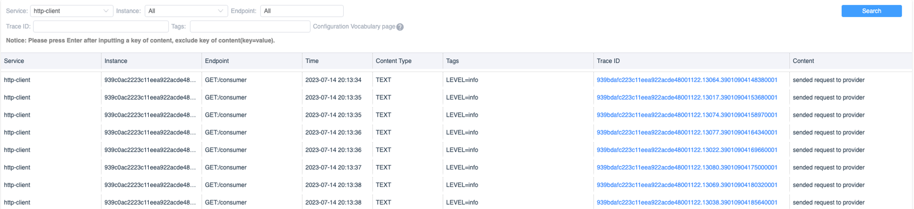
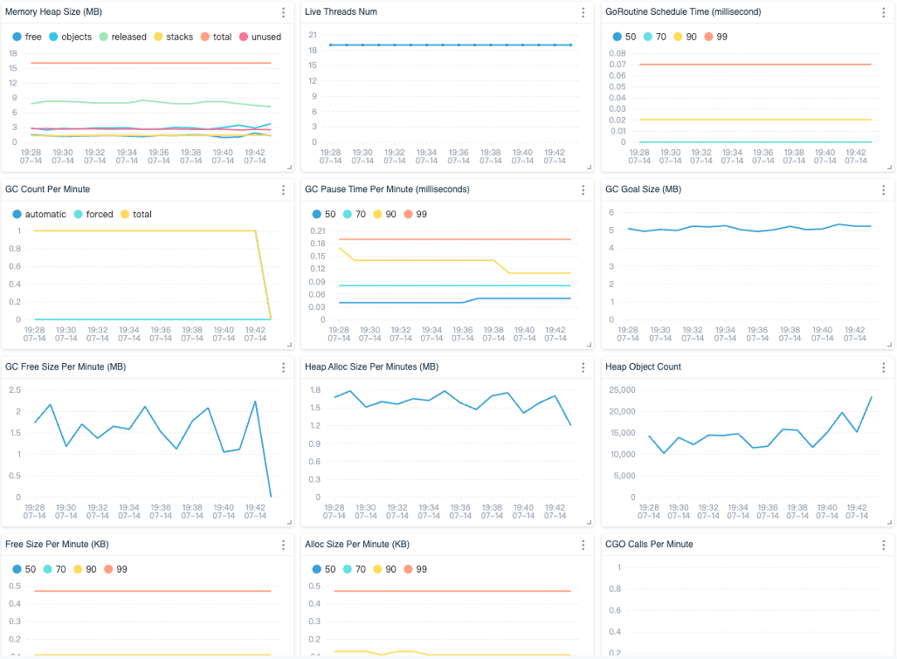

# Background

I am delighted to announce that Apache SkyWalking Go 0.2.0 has been released. 
This version comes with a plethora of exciting new features. Below, I would provide a detailed overview of each of them.

# Log Reporter

The log reporting feature allows the Go Agent to automatically collect log content from the currently supported logging frameworks. 
The collected data is then organized and sent to the SkyWalking backend for further processing. 
The following image illustrates how the logs appear in the SkyWalking UI for the respective service.

Currently, support for the [logrus](https://github.com/sirupsen/logrus) and [zap](http://go.uber.org/zap) frameworks is available.



## Searchable logs settings

You can configure certain fields (key-value pairs) to allow the SkyWalking Go Agent to make your logs searchable. 
This can be achieved by setting the `SW_AGENT_LOG_REPORTER_LABEL_KEYS` environment variable. By default, only the current log `level` would be included in the search.

In the following example, I will utilize the `logrus` logging framework for logging. At this point, you can make the logs searchable by setting the module field:

```go
# define log with fields
logrus.WithField("module", "test-service").Info("test log")
```

# Metrics Reporter

SkyWalking Go program originally had the ability to generate metric data related to request tracing. 
Now, it also supports custom metric data reporting functionality. Currently, it can collect data from `runtime/metrics` and report it to the backend.
You can find the metrics currently supported in [this document](https://pkg.go.dev/runtime/metrics#hdr-Metric_key_format).



# Project Injector

In the SkyWalking Go Agent v0.1.0 version, if you want to introduce `skywalking-go` into your project, you need to handle it manually. [Please refer to the documentation for more details](https://github.com/apache/skywalking-go/blob/main/docs/en/setup/gobuild.md#22-code-dependency).

In the latest version of SkyWalking Go Agent, you can use the commands provided by the Agent to automatically introduce `skywalking-go` without the need to manually modify any code. 
It would analyze all the projects in the specified address and automatically introduce them. 
Of course, you can still use the original method if you prefer. [Please refer to the documentation for more information](https://github.com/apache/skywalking-go/blob/main/docs/en/setup/gobuild.md#22-code-dependency).

# Release

In this version, we have also introduced new frameworks and bug fixes. If you are interested, please read the [CHANGE Log](https://github.com/apache/skywalking-go/blob/main/CHANGES.md#020). Welcome to use it!