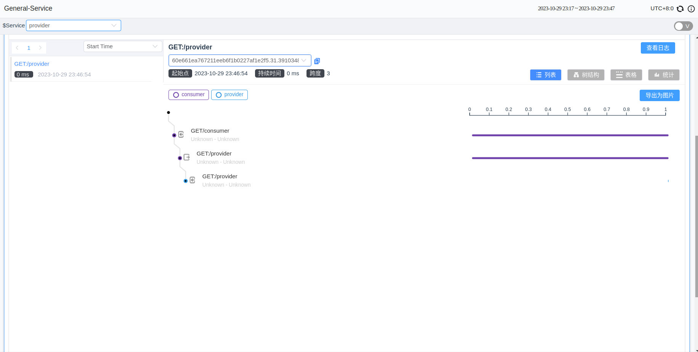
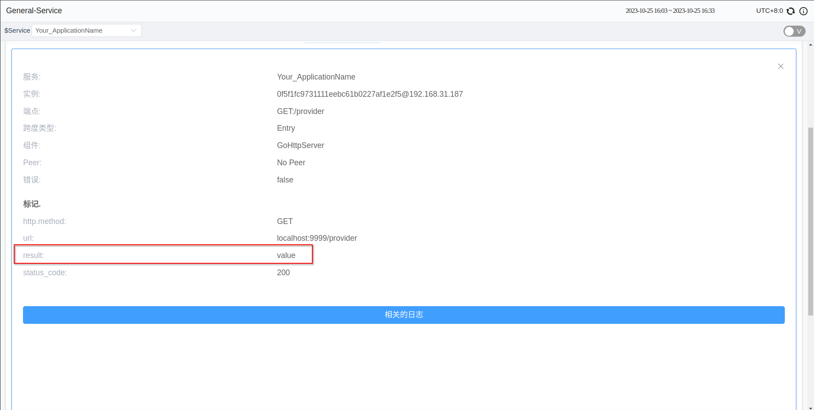

## Background

SkyWalking Go is an open-source, non-intrusive Golang agent used for monitoring, tracing, and data collection within distributed systems. It enables users to observe the flow and latency of requests within the system, collect performance data from various system components for performance monitoring, and troubleshoot issues by tracing the complete path of requests.

In version v0.3.0, Skywalking Go introduced the toolkit trace tool. Trace APIs allow users to include critical operations, functions, or services in the tracing scope in situations where plugins do not support them. This inclusion enables tracking and monitoring of these operations and can be used for fault analysis, diagnosis, and performance monitoring.

Before diving into this, you can learn how to use the Skywalking Go agent by referring to the [SkyWalking Go Agent Quick Start Guide](https://skywalking.apache.org/zh/2023-06-01-quick-start-with-skywalking-go-agent/).

The following sections will explain how to use these interfaces in specific scenarios.

## Introducing the Trace Toolkit

Execute the following command in the project's root directory:

```shell
go get github.com/apache/skywalking-go/toolkit
```

To use the toolkit trace interface, you need to import the package into your project:

```go
"github.com/apache/skywalking-go/toolkit/trace"
```

## Manual Tracing

A Span is the fundamental unit of an operation in Tracing. It represents an operation within a specific timeframe, such as a request, a function call, or a specific action. It records essential information about a particular operation, including start and end times, the operation's name, tags (key-value pairs), and relationships between operations. Multiple Spans can form a hierarchical structure.

In situations where Skywalking-go doesn't support a particular framework, users can manually create Spans to obtain tracing information.

(Here, I have removed the supported frameworks for the sake of the example. These are only examples. You should reference this when using the APIs in private and/or unsupported frameworks)

For example, when you need to trace an HTTP response, you can create a span using trace.CreateEntrySpan() within the method handling the request, and end the span using trace.StopSpan() after processing.
When sending an HTTP request, use trace.CreateExitSpan() to create a span, and end the span after the request returns.

Here are two HTTP services named `consumer` and `provider`. When a user accesses the `consumer` service, it receives the user's request internally and then accesses the provider to obtain resources.

```go
// consumer.go
package main

import (
	"io"
	"net/http"

	_ "github.com/apache/skywalking-go"
	"github.com/apache/skywalking-go/toolkit/trace"
)

func getProvider() (*http.Response, error) {
	// Create an HTTP request
	req, err := http.NewRequest("GET", "http://localhost:9998/provider", http.NoBody)
	// Create an ExitSpan before sending the HTTP request.
	trace.CreateExitSpan("GET:/provider", "localhost:9999",
		func(headerKey, headerValue string) error {
			// Injector adds specific header information to the request.
			req.Header.Add(headerKey, headerValue)
			return nil
		})
	// Finish the ExitSpan and ensure it executes when the function returns using defer.
	defer trace.StopSpan()

	// Send the request.
	client := &http.Client{}
	resp, err := client.Do(req)
	if err != nil {
		return nil, err
	}
	return resp, nil
}

func consumerHandler(w http.ResponseWriter, r *http.Request) {
	// Create an EntrySpan to trace the execution of the consumerHandler method.
	trace.CreateEntrySpan(r.Method+"/consumer", func(headerKey string) (string, error) {
		// Extractor retrieves the header information added to the request.
		return r.Header.Get(headerKey), nil
	})
	// Finish the EntrySpan.
	defer trace.StopSpan()

	// Prepare to send an HTTP request.
	resp, err := getProvider()

	body, err := io.ReadAll(resp.Body)
	if err != nil {
		return
	}
	_, _ = w.Write(body)
}

func main() {
	http.HandleFunc("/consumer", consumerHandler)

	_ = http.ListenAndServe(":9999", nil)
}
```

```go
// provider.go
package main

import (
	"net/http"

	_ "github.com/apache/skywalking-go"
	"github.com/apache/skywalking-go/toolkit/trace"
)

func providerHandler(w http.ResponseWriter, r *http.Request) {
	//Create an EntrySpan to trace the execution of the providerHandler method.
	trace.CreateEntrySpan("GET:/provider", func(headerKey string) (string, error) {
		return r.Header.Get(headerKey), nil
	})
	// Finish the EntrySpan.
	defer trace.StopSpan()

	_, _ = w.Write([]byte("success from provider"))
}

func main() {
	http.HandleFunc("/provider", providerHandler)

	_ = http.ListenAndServe(":9998", nil)
}

```


Then, in the terminal, execute:

```shell
go build -toolexec="/path/to/go-agent" -a -o consumer ./consumer.go
./consumer
```

```shell
go build -toolexec="/path/to/go-agent" -a -o provider ./provider.go
./provider
```

```shell
curl 127.0.0.1:9999/consumer
```

At this point, the UI will display the span information you created.



If you need to trace methods that are executed only locally, you can use trace.CreateLocalSpan(). If you don't need to monitor information or states from the other end, you can change ExitSpan and EntrySpan to LocalSpan.

The usage examples provided are for illustration purposes, and users can decide the tracing granularity and where in the program they need tracing.

Please note that if a program ends too quickly, it may cause tracing data to be unable to be asynchronously sent to the SkyWalking backend.

## Populate The Span

When there's a necessity to record additional information, including creating/updating tags, appending logs, and setting a new operation name of the current traced Span, these APIs should be considered. These actions are used to enhance trace information, providing a more detailed and precise contextual description, which aids in better understanding the events or operations being traced.

Toolkit trace APIs provide a convenient way to access and manipulate trace data, including:

- Setting Tags: `SetTag()`
- Adding Logs: `AddLog()`
- Setting Span Names: `SetOperationName()`
- Getting various IDs: `GetTraceID()`, `GetSegmentID()`, `GetSpanID()`

For example, if you need to record the HTTP status code in a span, you can use the following interfaces while the span is not yet finished:

```go
trace.CreateExitSpan("GET:/provider", "localhost:9999", func(headerKey, headerValue string) error {
	r.Header.Add(headerKey, headerValue)
	return nil
})
resp, err := http.Get("http://localhost:9999/provider")
trace.SetTag("status_code", fmt.Sprintf("%d", resp.StatusCode))
spanID := trace.GetSpanID()
trace.StopSpan()
```

It's important to note that when making these method calls, the current thread should have an active span.

## Async APIs

Async APIs work for manipulating spans across Goroutines. These scenarios might include:

- Applications involving concurrency or multiple goroutines where operating on Spans across different execution contexts is necessary.
- Updating or logging information for a Span during asynchronous operations.
- Requiring a delayed completion of a Span.

To use it, follow these steps:

- Obtain the return value of CreateSpan, which is `SpanRef`.
- Call `spanRef.PrepareAsync()` to prepare for operations in another goroutine.
- When the current goroutine's work is done, call `trace.StopSpan()` to end the span (affecting only in the current goroutine).
- Pass the `spanRef` to another goroutine.
- After the work is done in any goroutine, call `spanRef.AsyncFinish()`.

Here's an example:

```go
spanRef, err := trace.CreateLocalSpan("LocalSpan")
if err != nil {
	return
}
spanRef.PrepareAsync()
go func(){
	// some work
    spanRef.AsyncFinish()
}()
// some work
trace.StopSpan()
```

## Correlation Context

Correlation Context is used to pass parameters within a Span, and the parent Span will pass the Correlation Context to all its child Spans. It allows the transmission of information between spans across different applications. The default number of elements in the Correlation Context is 3, and the content's length cannot exceed 128 bytes.

Correlation Context is commonly applied in the following scenarios:

- `Passing Information Between Spans`: It facilitates the transfer of critical information between different Spans, enabling upstream and downstream Spans to understand the correlation and context between each other.
- `Passing Business Parameters`: In business scenarios, it involves transmitting specific parameters or information between different Spans, such as authentication tokens, business transaction IDs, and more.

Users can set the Correlation Context using `trace.SetCorrelation(key, value)` and then retrieve the corresponding value in downstream spans using `value := trace.GetCorrelation(key)`.

For example, in the code below, we store the value in the tag of the span, making it easier to observe the result:

```go
package main

import (
	_ "github.com/apache/skywalking-go"
	"github.com/apache/skywalking-go/toolkit/trace"
	"net/http"
)

func providerHandler(w http.ResponseWriter, r *http.Request) {
	ctxValue := trace.GetCorrelation("key")
	trace.SetTag("result", ctxValue)
}

func consumerHandler(w http.ResponseWriter, r *http.Request) {
	trace.SetCorrelation("key", "value")
	_, err := http.Get("http://localhost:9999/provider")
	if err != nil {
		return
	}
}

func main() {
	http.HandleFunc("/provider", providerHandler)

	http.HandleFunc("/consumer", consumerHandler)

	_ = http.ListenAndServe(":9999", nil)
}
```

Then, in the terminal, execute:

```shell
export SW_AGENT_NAME=server
go build -toolexec="/path/to/go-agent" -a -o server ./server.go
./server
```

```shell
curl 127.0.0.1:9999/consumer
```

Finally, in the `providerHandler()` span, you will find the information from the Correlation Context:



## Conclusion

This article provides an overview of Skywalking Go's Trace APIs and their practical application. These APIs empower users with the ability to customize tracing functionality according to their specific needs.

For detailed information about the interfaces, please refer to the documentation: [Tracing APIs](https://skywalking.apache.org/docs/skywalking-go/next/en/advanced-features/manual-apis/toolkit-trace/).

Welcome everyone to try out the new version.