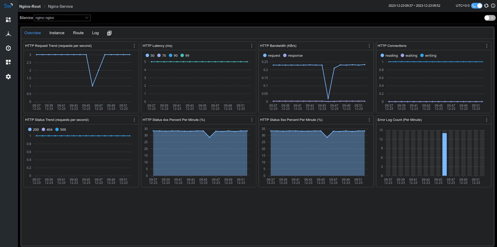
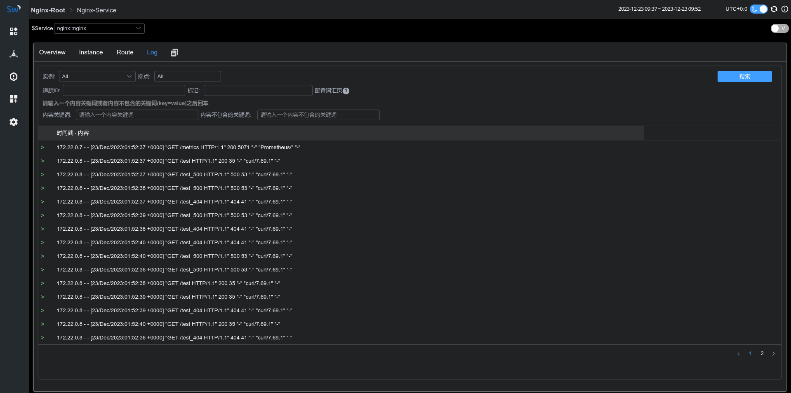

## Background
[Apache SkyWalking](https://skywalking.apache.org/) is an open-source application performance management system that helps users collect and aggregate logs, traces, metrics, and events, and display them on the UI.

In order to achieve monitoring capabilities for Nginx, we have introduced the Nginx monitoring dashboard in SkyWalking 9.7, 
and this article will demonstrate the use of this monitoring dashboard and introduce the meaning of related metrics.

## Setup Monitoring Dashboard
### Metric Define and Collection
Since [nginx-lua-prometheus](https://github.com/knyar/nginx-lua-prometheus) is used to define and expose metrics, 
we need to install [lua_nginx_module](https://github.com/openresty/lua-nginx-module) for Nginx, or use [OpenResty](https://openresty.org) directly.

In the following example, we define four metrics via nginx-lua-prometheus and expose the metrics interface via nginx ip:9145/metrics:
- histogram: nginx_http_latency，monitoring http latency
- gauge: nginx_http_connections，monitoring nginx http connections
- counter: nginx_http_size_bytes，monitoring http size of request and response
- counter: nginx_http_requests_total，monitoring total http request numbers
```
http {
    log_format  main  '$remote_addr - $remote_user [$time_local] "$request" '
                      '$status $body_bytes_sent "$http_referer" '
                      '"$http_user_agent" "$http_x_forwarded_for"';

    access_log  /var/log/nginx/access.log  main;

    lua_shared_dict prometheus_metrics 10M;
    # lua_package_path "/path/to/nginx-lua-prometheus/?.lua;;";

    init_worker_by_lua_block {
      prometheus = require("prometheus").init("prometheus_metrics")

      metric_bytes = prometheus:counter(
        "nginx_http_size_bytes", "Total size of HTTP", {"type", "route"})
      metric_requests = prometheus:counter(
        "nginx_http_requests_total", "Number of HTTP requests", {"status", "route"})
      metric_latency = prometheus:histogram(
        "nginx_http_latency", "HTTP request latency", {"route"})
      metric_connections = prometheus:gauge(
        "nginx_http_connections", "Number of HTTP connections", {"state"})
    }

    server {
        listen 8080;

        location /test {
          default_type application/json;
          return 200  '{"code": 200, "message": "success"}';

          log_by_lua_block {
            metric_bytes:inc(tonumber(ngx.var.request_length), {"request", "/test/**"})
            metric_bytes:inc(tonumber(ngx.var.bytes_send), {"response", "/test/**"})
            metric_requests:inc(1, {ngx.var.status, "/test/**"})
            metric_latency:observe(tonumber(ngx.var.request_time), {"/test/**"})
          }
        }
    }

    server {
      listen 9145;
      location /metrics {
        content_by_lua_block {
          metric_connections:set(ngx.var.connections_reading, {"reading"})
          metric_connections:set(ngx.var.connections_waiting, {"waiting"})
          metric_connections:set(ngx.var.connections_writing, {"writing"})
          prometheus:collect()
        }
      }
    }
}
```
In the above example, we exposed the route-level metrics, and you can also choose to expose the host-level metrics according to the monitoring granularity:
```
http {
  log_by_lua_block {
      metric_bytes:inc(tonumber(ngx.var.request_length), {"request", ngx.var.host})
      metric_bytes:inc(tonumber(ngx.var.bytes_send), {"response", ngx.var.host})
      metric_requests:inc(1, {ngx.var.status, ngx.var.host})
      metric_latency:observe(tonumber(ngx.var.request_time), {ngx.var.host})
  }
}
```
or upstream-level metrics：
```
upstream backend {
  server ip:port;
}

server {
  
  location /test_upstream {
  
    proxy_pass http://backend;
  
    log_by_lua_block {
      metric_bytes:inc(tonumber(ngx.var.request_length), {"request", "upstream/backend"})
      metric_bytes:inc(tonumber(ngx.var.bytes_send), {"response", "upstream/backend"})
      metric_requests:inc(1, {ngx.var.status, "upstream/backend"})
      metric_latency:observe(tonumber(ngx.var.request_time), {"upstream/backend"})
    }
  }
}
```
After defining the metrics, we start nginx and opentelemetry-collector to collect the metrics and send them to the SkyWalking backend for analysis and storage.

Please ensure that `job_name: 'nginx-monitoring'`, otherwise the reported data will be ignored by SkyWalking.
If you have multiple Nginx instances, you can distinguish them using the `service` and `service_instance_id` labels：
```
receivers:
  prometheus:
    config:
      scrape_configs:
        - job_name: 'nginx-monitoring'
          scrape_interval: 5s
          metrics_path: "/metrics"
          static_configs:
            - targets: ['nginx:9145']
              labels:
                service: nginx
                service_instance_id: nginx-instance
processors:
  batch:

exporters:
  otlp:
    endpoint: oap:11800
    tls:
      insecure: true
service:
  pipelines:
    metrics:
      receivers:
        - prometheus
      processors:
        - batch
      exporters:
        - otlp
```
If everything goes well, you will see the metric data reported by Nginx under the gateway menu of the skywalking-ui:



### Access & Error Log Collection
SkyWalking Nginx monitoring provides log collection and error log analysis. We can use [fluent-bit](https://fluentbit.io/) to collect and report access logs and error logs to SkyWalking for analysis and storage.

Fluent-bit configuration below defines the log collection directory as `/var/log/nginx/`. 
The access and error logs will be reported through rest port 12800 of oap after being processed by `rewrite_access_log` and `rewrite_error_log` functions:
```
[SERVICE]
    Flush          5
    Daemon         Off
    Log_Level      warn
[INPUT]
    Name           tail
    Tag            access
    Path           /var/log/nginx/access.log
[INPUT]
    Name           tail
    Tag            error
    Path           /var/log/nginx/error.log
[FILTER]
    Name           lua
    Match          access
    Script         fluent-bit-script.lua
    Call           rewrite_access_log
[FILTER]
    Name           lua
    Match          error
    Script         fluent-bit-script.lua
    Call           rewrite_error_log
[OUTPUT]
    Name            stdout
    Match           *
    Format          json
[OUTPUT]
    Name            http
    Match           *
    Host            oap
    Port            12800
    URI             /v3/logs
    Format          json
```
In the `fluent-bit-script.lua`, we use `LOG_KIND` tag to distinguish between access logs and error logs.

To associate with the metrics, please ensure that the values of `service` and `serviceInstance` are consistent with the metric collection definition in the previous section.
```
function rewrite_access_log(tag, timestamp, record)
    local newRecord = {}
    newRecord["layer"] = "NGINX"
    newRecord["service"] = "nginx::nginx"
    newRecord["serviceInstance"] = "nginx-instance"
    newRecord["body"] = { text = { text = record.log } }
    newRecord["tags"] = { data = {{ key = "LOG_KIND", value = "NGINX_ACCESS_LOG"}}}
    return 1, timestamp, newRecord
end

function rewrite_error_log(tag, timestamp, record)
    local newRecord = {}
    newRecord["layer"] = "NGINX"
    newRecord["service"] = "nginx::nginx"
    newRecord["serviceInstance"] = "nginx-instance"
    newRecord["body"] = { text = { text = record.log } }
    newRecord["tags"] = { data = {{ key = "LOG_KIND", value = "NGINX_ERROR_LOG" }}}
    return 1, timestamp, newRecord
end
```
After starting fluent-it, we can see the collected log information in the Log tab of the monitoring panel：



## Meaning of Metrics

| Metric Name             | Unit | Description                                          | Data Source          |
|-------------------------|------|------------------------------------------------------|----------------------|
| HTTP Request Trend      |      | The increment rate of HTTP requests                  | nginx-lua-prometheus |
| HTTP Latency            | ms   | The increment rate of the latency of HTTP requests   | nginx-lua-prometheus |
| HTTP Bandwidth          | KB   | The increment rate of the bandwidth of HTTP requests | nginx-lua-prometheus |
| HTTP Connections        |      | The avg number of the connections                    | nginx-lua-prometheus |
| HTTP Status Trend       | %    | The increment rate of the status of HTTP requests    | nginx-lua-prometheus |
| HTTP Status 4xx Percent | %    | The percentage of 4xx status of HTTP requests        | nginx-lua-prometheus |
| HTTP Status 5xx Percent | %    | The percentage of 4xx status of HTTP requests        | nginx-lua-prometheus |
| Error Log Count         |      | The count of log level of nginx error.log            | fluent-bit           |


## References
- [nginx-lua-prometheus](https://github.com/knyar/nginx-lua-prometheus)
- [fluent-bit-lua-filter](https://docs.fluentbit.io/manual/pipeline/filters/lua)
- [skywalking-apisix-monitoring](https://skywalking.apache.org/docs/main/next/en/setup/backend/backend-apisix-monitoring)