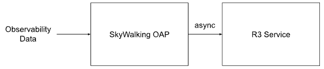
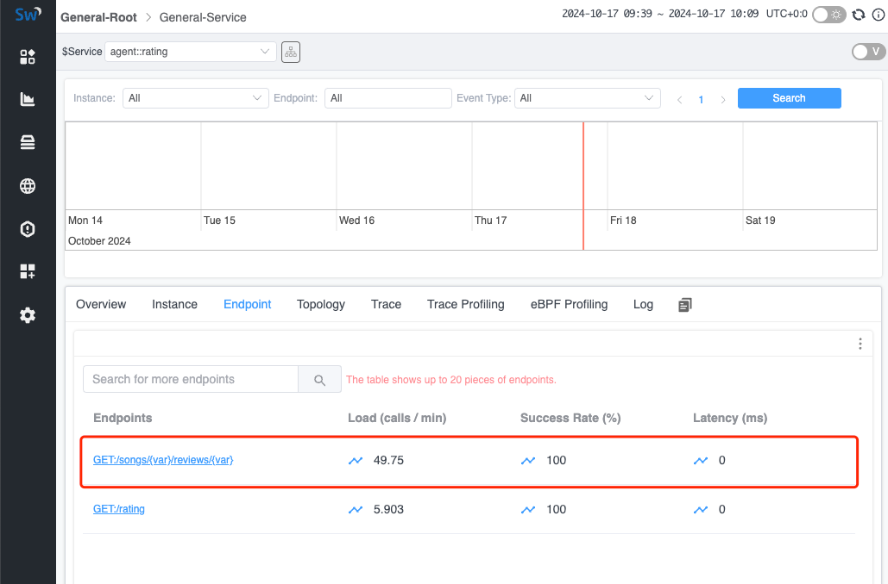

## Background

In modern applications, services are typically provided through RESTFul HTTP URIs.
Using RESTFul HTTP URIs (as unique resource identifiers) offers high readability, making it easier for both clients and servers to understand.
However, in the observability field, this approach poses several challenges:

1. **A large number of endpoints (HTTP URI)**: Browsing through all externally provided endpoints becomes more difficult, making it hard to identify problematic endpoints.
2. **Metrics are difficult to collect**: It becomes particularly challenging to categorize similar endpoints and generate observability metrics.

In existing solutions, this issue can be resolved following these application-level resolutions:

1. **Agent Detection**: In certain frameworks, rules are often declared to handle RESTFul requests. For example, in Java's Spring Web, annotations like `@GET` can be used,
   which can then be linked to current requests using a Java Agent.
2. **OpenAPI**: Predefined files can be associated with the application, allowing the observability system to be aware of the URIs that may be used.

Both resolutions are tightly coupled with application settings, which can be limiting for unknown applications or applications
where the agent cannot be monitored. Therefore, we need to consider whether there is a more general solution to identify URIs and
merge metrics generated from similar URIs for better representation.

## R3

R3(RESTFul Pattern Recognition) is a high-performance RESTFul URI recognition tool inspired by [Drain3](https://github.com/logpai/Drain3).
It can be deployed as a standalone application on the observability server and communicate with the SkyWalking OAP.

R3 can accept a URI list via the gRPC protocol and aggregate similar URIs into a specific format.
The aggregated (formatted) URI list can also be queried using the gRPC protocol.

### Data Interaction Flow



1. **OAP receives and caches unformatted URI list**: OAP receives observability data through different protocols and identifies all unformatted URIs. These URIs are stored in a temporary list categorized by the service they belong to.
2. **OAP sends URIs to be formatted to R3**: OAP periodically batches the URIs that need formatting and sends them to the R3 service.
3. **R3 receives and parses the URI list**: R3 asynchronously analyzes the similarity of the received URIs and stores (persists) the results on the local disk to allow features like recovery after a restart.
4. **OAP queries formatted URI list from R3**: OAP periodically queries R3 for the detected formatted URIs and saves the results in memory.
5. **OAP formats URIs**: When OAP receives new observability data, it matches the URIs against the formatted URIs retrieved from R3. If a match is found, the formatted URI is used for subsequent metric calculations.

### Scenarios

In R3, the following scenarios are primarily addressed. For URIs identified as duplicates, R3 would replace the variable parts with `{var}` to standardize them.

#### ID Matching

A common practice in RESTFul APIs is to include various IDs in the URI paths,
which leads to a large number of unique URI endpoints.
For example, paths like the following will be aggregated by R3 into a standardized format: `/api/users/{var}`.

* /api/users/cbf11b02ea464447b507e8852c32190a
* /api/users/5e363a4a18b7464b8cbff1a7ee4c91ca
* /api/users/44cf77fc351f4c6c9c4f1448f2f12800
* /api/users/38d3be5f9bd44f7f98906ea049694511
* /api/users/5ad14302e7924f4aa1d60e58d65b3dd2

#### Word Detection

In RESTFul URIs, operations on an entity are usually specified using HTTP methods,
but often additional types are needed. This is addressed by including specific nouns in the path.
To handle this, R3 implements word parsing: when R3 detects specific words in the path, it will not format that part.
For example, URIs like the following would not be considered similar and therefore will not be merged:

* /api/sale
* /api/product_sale
* /api/ProductSale

#### Low Sample

To prevent incorrect judgments due to insufficient sample sizes, R3 allows the configuration of a
[combine min URI count](https://github.com/SkyAPM/R3/blob/main/servers/simple/uri_drain.ini#L38) parameter in the
[configuration file](https://github.com/SkyAPM/R3/blob/main/servers/simple/uri_drain.ini).
This parameter sets the minimum number of similar paths required before proceeding with the analysis.

Such as the threshold is `3`, the following URI would keep the original URI, not parameterized.

* /api/fetch1
* /api/fetch2

But the following URI would be parametrized to `/api/{var}`, since the sample count is bigger than the threshold.

* /api/fetch1
* /api/fetch2
* /api/fetch3

#### Version API

In real-world scenarios, we often encounter URIs with multiple versions.
R3 addresses this by ensuring that if a specified path contains a `v\\d+` parameter (indicating version information),
that part would not be parameterized.
For example, the following URIs will be separately parsed into `/test/v1/{var}` and `/test/v999/{var}`.

* /test/v1/cbf11b02ea464447b507e8852c32190a
* /test/v1/5e363a4a18b7464b8cbff1a7ee4c91ca
* /test/v1/38d3be5f9bd44f7f98906ea049694511
* /test/v999/1
* /test/v999/2
* /test/v999/3

## Demo

Next, let’s quickly demonstrate how to use R3 to format observed endpoints, so you can understand more specifically what it accomplishes.

### Deploy SkyWalking Showcase

SkyWalking Showcase contains a complete set of example services and can be monitored using SkyWalking. For more information, please check the [official documentation](https://skywalking.apache.org/docs/skywalking-showcase/next/readme/).

In this demo, we only deploy service, the latest released SkyWalking OAP, R3 service and UI.

```shell
export FEATURE_FLAGS=java-agent-injector,single-node,elasticsearch,r3
make deploy.kubernetes
```

After deployment is complete, please run the following script to open SkyWalking UI: http://localhost:8080/.

```shell
kubectl port-forward svc/ui 8080:8080 --namespace default
```

### Trigger RESTFul Requests

In R3, a scheduled task is started by default to generate RESTFul traffic at regular intervals.
However, you can also manually trigger this process using the following command:

```shell
kubectl exec -n sample-services $(kubectl get pod -n sample-services --selector=app=gateway -o jsonpath='{.items[0].metadata.name}') -- /bin/bash -c 'for i in $(seq 1 200); do curl http://rating/songs/$i/reviews/$((i+1)); sleep 1; done'
```

In the above command, R3 would automatically locate the gateway node and send requests in RESTFul format to the rating service within that node.
This allows R3 to generate and test traffic patterns that simulate real RESTFul requests to the target service.

### Check Formatted URIs

Once the RESTFul requests are triggered, you can view the aggregated endpoints in the UI.

**Note**: Since the formatted endpoints are generated asynchronously, some of the earlier requests may not yet be formatted. You may need to wait for some time before the UI shows only the formatted addresses.



## Conclusion

In this article, we discussed in detail how SkyWalking utilizes the R3 service to format RESTFul URIs and aggregate related metrics upon receiving them.
Currently, it applies to most RESTFul scenarios, and if more cases need to be supported, we can extend it further as needed.