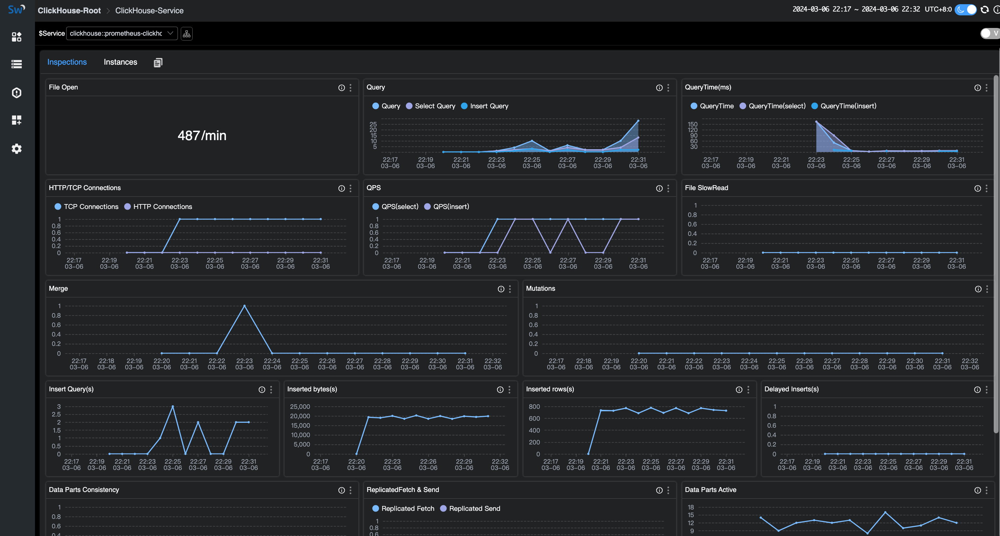

## Background

[ClickHouse](https://clickhouse.com/) is an open-source column-oriented database management system that allows generating analytical data reports in real-time, so it is widely used for online analytical processing (OLAP).

[Apache SkyWalking](https://skywalking.apache.org/) is an open-source APM system that provides monitoring, tracing and diagnosing capabilities for distributed systems in Cloud Native architectures. Increasingly, App Service architectures incorporate Skywalking as an essential monitoring component of a service or instance.

Both ClickHouse and Skywalking are popular frameworks, and it would be great to monitor your ClickHouse database through Skywalking. Next, let's share how to monitor ClickHouse database with Skywalking.

## Prerequisites and configurations

Make sure you've met the following prerequisites before you start onboarding your monitor.

Config steps:

1. Exposing [prometheus endpoint](https://clickhouse.com/docs/en/operations/server-configuration-parameters/settings#prometheus).
2. Fetching ClickHouse metrics by [OpenTelemetry](https://opentelemetry.io/).
3. Exporting metrics to Skywalking OAP server.

### Prerequisites for setup

The monitoring for ClickHouse relies on the embedded prometheus endpoint of ClickHouse and will not be supported in previous versions starting from v20.1.2.4.

You can check the version of your server:

```sql
:) select version();

SELECT version()

Query id: 2d3773ca-c320-41f6-b2ac-7ebe37eddc58

┌─version()───┐
│ 24.2.1.2248 │
└─────────────┘
```

If your ClickHouse version is earlier than v20.1.2.4, you need to set up [ClickHouse-exporter](https://github.com/ClickHouse/clickhouse_exporter) to access data.

### Expose prometheus Endpoint

The [embedded prometheus endpoint](https://clickhouse.com/docs/en/operations/server-configuration-parameters/settings#prometheus) will make it easy for data collection, you just need to open the required configuration in the core configuration file config.xml of ClickHouse. In addition to your original configuration, you only need to modify the configuration of Prometheus.

`/etc/clickhouse-server/config.xml`:

```xml
<clickhouse> 
    ......
    <prometheus>
        <endpoint>/metrics</endpoint>
        <port>9363</port>
        <metrics>true</metrics>
        <events>true</events>
        <asynchronous_metrics>true</asynchronous_metrics>
        <errors>true</errors>
    </prometheus>
</clickhouse>
```

Settings:

- endpoint – HTTP endpoint for scraping metrics by prometheus server. Start from ‘/’.
- port – Port for endpoint.
- metrics – Expose metrics from the `system.metrics` table.
- events – Expose metrics from the `system.events` table.
- asynchronous_metrics – Expose current metrics values from the `system.asynchronous_metrics` table.
- errors - Expose the number of errors by error codes occurred since the last server restart. This information could be obtained from the `system.errors` as well.

Save the config and restart the ClickHouse server.

It contains more than 1,000 metrics, covering services、networks、disk、MergeTree、errors and so on. For more details, after restarting the server, you can call `curl 127.0.0.1:9363/metrics` to know about the metrics.

You also can check the metrics by tables to make a contrast.

```sql
:) select * from system.metrics limit 10

SELECT *
FROM system.metrics
LIMIT 10

Query id: af677622-960e-4589-b2ca-0b6a40c443aa

┌─metric───────────────────────────────┬─value─┬─description─────────────────────────────────────────────────────────────────────┐
│ Query                                │     1 │ Number of executing queries                                                     │
│ Merge                                │     0 │ Number of executing background merges                                           │
│ Move                                 │     0 │ Number of currently executing moves                                             │
│ PartMutation                         │     0 │ Number of mutations (ALTER DELETE/UPDATE)                                       │
│ ReplicatedFetch                      │     0 │ Number of data parts being fetched from replica                                 │
│ ReplicatedSend                       │     0 │ Number of data parts being sent to replicas                                     │
│ ReplicatedChecks                     │     0 │ Number of data parts checking for consistency                                   │
│ BackgroundMergesAndMutationsPoolTask │     0 │ Number of active merges and mutations in an associated background pool          │
│ BackgroundMergesAndMutationsPoolSize │    64 │ Limit on number of active merges and mutations in an associated background pool │
│ BackgroundFetchesPoolTask            │     0 │ Number of active fetches in an associated background pool                       │
└──────────────────────────────────────┴───────┴─────────────────────────────────────────────────────────────────────────────────┘

:) select * from system.events limit 10;

SELECT *
FROM system.events
LIMIT 10

Query id: 32c618d0-037a-400a-92a4-59fde832e4e2

┌─event────────────────────────────┬──value─┬─description────────────────────────────────────────────────────────────────────────────────────────────────────────────────────────────────────────────────────────────────────────────────────────────────────────────────────────────────────────────────┐
│ Query                            │      7 │ Number of queries to be interpreted and potentially executed. Does not include queries that failed to parse or were rejected due to AST size limits, quota limits or limits on the number of simultaneously running queries. May include internal queries initiated by ClickHouse itself. Does not count subqueries. │
│ SelectQuery                      │      7 │ Same as Query, but only for SELECT queries.                                                                                                                                                                                                                │
│ InitialQuery                     │      7 │ Same as Query, but only counts initial queries (see is_initial_query).                                                                                                                                                                                     │
│ QueriesWithSubqueries            │     40 │ Count queries with all subqueries                                                                                                                                                                                                                          │
│ SelectQueriesWithSubqueries      │     40 │ Count SELECT queries with all subqueries                                                                                                                                                                                                                   │
│ QueryTimeMicroseconds            │ 202862 │ Total time of all queries.                                                                                                                                                                                                                                 │
│ SelectQueryTimeMicroseconds      │ 202862 │ Total time of SELECT queries.                                                                                                                                                                                                                              │
│ FileOpen                         │  40473 │ Number of files opened.                                                                                                                                                                                                                                    │
│ Seek                             │    100 │ Number of times the 'lseek' function was called.                                                                                                                                                                                                           │
│ ReadBufferFromFileDescriptorRead │  67995 │ Number of reads (read/pread) from a file descriptor. Does not include sockets.                                                                                                                                                                             │
└──────────────────────────────────┴────────┴────────────────────────────────────────────────────────────────────────────────────────────────────────────────────────────────────────────────────────────────────────────────────────────────────────────────────────────────────────────────────────────┘

```

### Start up Opentelemetry-Collector

[Configure OpenTelemetry](https://opentelemetry.io/docs/collector/quick-start/) based on your own requirements. Following the example below:

`otel-collector-config.yaml`:

```xml
receivers:
  prometheus:
    config:
     scrape_configs:
       - job_name: 'clickhouse-monitoring'
         scrape_interval: 15s
         static_configs:
           - targets: ['127.0.0.1:9363','127.0.0.1:9364','127.0.0.1:9365']
             labels:
               host_name: prometheus-clickhouse

processors:
  batch:
 
exporters:
  otlp:
    endpoint: 127.0.0.1:11800
    tls:
      insecure: true
service:
  pipelines:
    metrics:
      receivers:
      - prometheus
      processors:
      - batch
      exporters:
      - otlp
```

Please ensure:

- `job_name: 'clickhouse-monitoring'` that marked the data from ClickHouse, If modified, it will be ignored.
- `host_name` defines the service name, you have to make one.
- `endpoint` point to the oap server address.
- the network between ClickHouse, OpenTelemetry Collector, and Skywalking OAP Server must be accessible.

If goes well, refresh the Skywalking-ui home page in a few seconds and you can see ClickHouse under the database menu.

success log:

```log
2024-03-12T03:57:39.407Z	info	service@v0.93.0/telemetry.go:76	Setting up own telemetry...
2024-03-12T03:57:39.412Z	info	service@v0.93.0/telemetry.go:146	Serving metrics	{"address": ":8888", "level": "Basic"}
2024-03-12T03:57:39.416Z	info	service@v0.93.0/service.go:139	Starting otelcol...	{"Version": "0.93.0", "NumCPU": 4}
2024-03-12T03:57:39.416Z	info	extensions/extensions.go:34	Starting extensions...
2024-03-12T03:57:39.423Z	info	prometheusreceiver@v0.93.0/metrics_receiver.go:240	Starting discovery manager	{"kind": "receiver", "name": "prometheus", "data_type": "metrics"}
2024-03-12T03:57:59.431Z	info	prometheusreceiver@v0.93.0/metrics_receiver.go:231	Scrape job added	{"kind": "receiver", "name": "prometheus", "data_type": "metrics", "jobName": "clickhouse-monitoring"}
2024-03-12T03:57:59.431Z	info	service@v0.93.0/service.go:165	Everything is ready. Begin running and processing data.
2024-03-12T03:57:59.432Z	info	prometheusreceiver@v0.93.0/metrics_receiver.go:282	Starting scrape manager	{"kind": "receiver", "name": "prometheus", "data_type": "metrics"}
```

## ClickHouse monitoring dashboard

### About the dashboard

The dashboard includes the service dashboard and the instance dashboard.

Metrics include servers, queries, networks, insertions, replicas, MergeTree, ZooKeeper and embedded ClickHouse Keeper.

The service dashboard displays the metrics of the entire cluster.



The instance dashboard displays the metrics of an instance.


### About the metrics

Here are some meanings of ClickHouse Instance metrics, [more here](https://github.com/apache/skywalking/blob/master/docs/en/swip/SWIP-5.md).

| Monitoring Panel | Unit       | Description                                                                                                      | Data Source |
| ---------------- | ---------- | ---------------------------------------------------------------------------------------------------------------- | ----------- |
| CpuUsage         | count      | CPU time spent seen by OS per second(according to ClickHouse.system.dashboard.CPU Usage (cores)).                | ClickHouse  |
| MemoryUsage      | percentage | Total amount of memory (bytes) allocated by the server/ total amount of OS memory.                               | ClickHouse  |
| MemoryAvailable  | percentage | Total amount of memory (bytes) available for program / total amount of OS memory.                                | ClickHouse  |
| Uptime           | sec        | The server uptime in seconds. It includes the time spent for server initialization before accepting connections. | ClickHouse  |
| Version          | string     | Version of the server in a single integer number in base-1000.                                                   | ClickHouse  |
| FileOpen         | count      | Number of files opened.                                                                                          | ClickHouse  |

- metrics about ZooKeeper are valid when managing cluster by ZooKeeper
- metrics about embedded [ClickHouse Keeper](https://clickhouse.com/docs/en/guides/sre/keeper/clickhouse-keeper) are valid when ClickHouse Keeper is enabled

## References

- [ClickHouse prometheus endpoint](https://clickhouse.com/docs/en/operations/server-configuration-parameters/settings#prometheus)
- [ClickHouse built-in observability dashboard](https://clickhouse.com/docs/en/operations/monitoring#built-in-observability-dashboard)
- [ClickHouse Keeper](https://clickhouse.com/docs/en/guides/sre/keeper/clickhouse-keeper)
