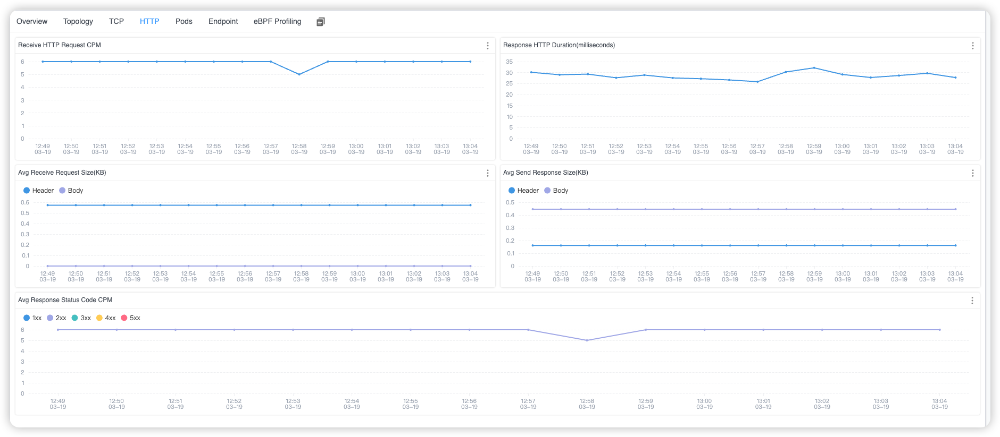

## Background


[Apache SkyWalking](https://skywalking.apache.org/) is an open-source Application Performance Management system that helps users gather logs, traces, metrics, and events from various platforms and display them on the UI.
With version 9.7.0, SkyWalking can collect access logs from probes in multiple languages and from Service Mesh, generating corresponding topologies, tracing, and other data. However, it could not initially collect and map access logs from applications in Kubernetes environments. This article explores how the 10.0.0 version of Apache SkyWalking employs eBPF technology to collect and store application access logs, addressing this limitation.

## Why eBPF?

To monitor the network traffic in Kubernetes, the following features support be support:

1. **Cross Language**: Applications deployed in Kubernetes may be written in any programming language, making support for diverse languages important.
2. **Non-Intrusiveness**: It's imperative to monitor network traffic without making any modifications to the applications, as direct intervention with applications in Kubernetes is not feasible.
3. **Kernel Metrics Monitoring**: Often, diagnosing network issues by analyzing traffic performance at the user-space level is insufficient. A deeper analysis incorporating kernel-space network traffic metrics is frequently necessary.
4. **Support for Various Network Protocols**: Applications may communicate using different transport protocols, necessitating support for a range of protocols.

Given these requirements, eBPF emerges as a capable solution. In the next section, we will delve into detailed explanations of how Apache SkyWalking Rover resolves these aspects.

## Kernel Monitoring and Protocol Analysis

In previous articles, we've discussed how to monitor network traffic from programs written in various languages.
This technique remains essential for network traffic monitoring, allowing for the collection of traffic data without language limitations.
However, due to the unique aspects of our monitoring trigger mechanism and the specific features of kernel monitoring, these two areas warrant separate explanations.

### Kernel Monitoring

Kernel monitoring allows users to gain insights into network traffic performance based on the execution at the kernel level,
specifically from Layer 2 (Data Link) to Layer 4 (Transport) of the OSI model.

Network monitoring at the kernel layer is deference from the syscall (user-space) layer in terms of the metrics and identifiers used.
While the syscalls layer can utilize file descriptors to correlate various operations, kernel layer network operations primarily use packets as unique identifiers.
This discrepancy necessitates a mapping relationship that SkyWalking Rover can use to bind these two layers together for comprehensive monitoring.

Let's dive into the details of how data is monitored in both sending and receiving modes.

#### Observe Sending

When sending data, tracking the status and timing of each packet is crucial for understanding the state of each transmission.
Within the kernel, operations progress from Layer 4 (L4) down to Layer 2 (L2), maintaining the same thread ID as during the syscalls layer, which simplifies data correlation.

SkyWalking Rover monitors several key kernel functions to observe packet transmission dynamics, listed from L4 to L2:

1. **kprobe/tcp_sendmsg**: Captures the time when a packet enters the L4 protocol stack for sending and the time it finishes processing.
   This function is essential for tracking the initial handling of packets at the transport layer.
2. **kprobe/tcp_transmit_skb**: Records the total number of packet transmissions and the size of each packet sent.
   This function helps identify how many times a packet or a batch of packets is attempted to be sent, which is critical for understanding network throughput and congestion.
3. **tracepoint/tcp/tcp_retransmit_skb**: Notes whether packet retransmission occurs, providing insights into network reliability and connection quality.
   Retransmissions can significantly impact application performance and user experience.
4. **tracepoint/skb/kfree_skb**: Records packet loss during transmission and logs the reason for such occurrences.
   Understanding packet loss is crucial for diagnosing network issues and ensuring data integrity.
5. **kprobe/__ip_queue_xmit**: Records the start and end times of processing by the L3 protocol. This function is vital for understanding the time taken for IP-level operations, including routing decisions.
6. **kprobe/nf_hook_slow**: Records the total time and number of occurrences spent in Netfilter hooks, such as iptables rule evaluations.
   This monitoring point is important for assessing the impact of firewall rules and other filtering mechanisms on packet flow.
7. **kprobe/neigh_resolve_output**: If resolving an unknown MAC address is necessary before sending a network request,
   this function records the occurrences and total time spent on this resolution. MAC address resolution times can affect the initial packet transmission delay.
8. **kprobe/__dev_queue_xmit**: Records the start and end times of entering the L2 protocol stack, providing insights into the data link layer's processing times.
9. **tracepoint/net/net_dev_start_xmit** and **tracepoint/net/net_dev_xmit**: Records the actual time taken to transmit each packet at the network interface card (NIC).
   These functions are crucial for understanding the hardware-level performance and potential bottlenecks at the point of sending data to the physical network.

According to the interception of the above method, Apache SkyWalking Rover can provide key execution time and metrics for each level when sending network data,
from the application layer (Layer 7) to the transport layer (Layer 4), and finally to the data link layer (Layer 2).

#### Observe Receiving

When receiving data, the focus is often on the time it takes for packets to travel from the network interface card (NIC) to the user space.
Unlike the process of sending data, data receiving in the kernel proceeds from the data link layer (Layer 2) up to the transport layer (Layer 4), until the application layer (Layer 7) retrieves the packet's content.
In SkyWalking Rover, monitors the following key system functions to observe this process, listed from L2 to L4:
1. **tracepoint/net/netif_receive_skb**: Records the time when a packet is received by the network interface card.
   This tracepoint is crucial for understanding the initial point of entry for incoming data into the system.
2. **kprobe/ip_rcv**: Records the start and end times of packet processing at the network layer (Layer 3).
   This probe provides insights into how long it takes for the IP layer to handle routing, forwarding, and delivering packets to the correct application.
3. **kprobe/nf_hook_slow**: Records the total time and occurrences spent in Netfilter hooks, same with the sending traffic flow.
4. **kprobe/tcp_v4_rcv**: Records the start and end times of packet processing at the transport layer (Layer 4).
   This probe is key to understanding the efficiency of TCP operations, including connection management, congestion control, and data flow.
5. **tracepoint/skb/skb_copy_datagram_iovec**: When application layer protocols use the data, this tracepoint binds the packet to the syscall layer data at Layer 7.
   This connection is essential for correlating the kernel's handling of packets with their consumption by user-space applications.

Based on the above methods, network monitoring can help you understand the complete execution process and execution time from when data is received by the network card to when it is used by the program.

#### Metrics

By intercepting the methods mentioned above, we can gather key metrics that provide insights into network performance and behavior. These metrics include:

1. **Packets**: The size of the packets and the frequency of their transmission or reception.
   These metric offers a fundamental understanding of the network load and the efficiency of data movement between the sender and receiver.
2. **Connections**: The number of connections established or accepted between services and the time taken for these connections to be set up.
   This metric is crucial for analyzing the efficiency of communication and connection management between different services within the network.
3. **L2-L4 Events**: The time spent on key events within the Layer 2 to Layer 4 protocols.
   This metric sheds light on the processing efficiency and potential bottlenecks within the lower layers of the network stack, which are essential for data transmission and reception.

### Protocol Analyzing

In previous articles, we have discussed parsing HTTP/1.x protocols. However, with HTTP/2.x, the protocol's stateful nature and the pre-established connections between services complicate network profiling.
This complexity makes it challenging for Apache SkyWalking Rover to fully perceive the connection context, hindering protocol parsing operations.

Transitioning network monitoring to Daemon mode offers a solution to this challenge. By continuously observing service operations around the clock,
SkyWalking Rover can begin monitoring as soon as a service starts. This immediate initiation allows for the tracking of the complete execution context,
making the observation of stateful protocols like HTTP/2.x feasible.

#### Probes

To detect when a process is started, monitoring a specific trace point (**tracepoint/sched/sched_process_fork**) is essential.
This approach enables the system to be aware of process initiation events.
Given the necessity to filter process traffic based on certain criteria such as the process's namespace,
Apache SkyWalking Rover follows a series of steps to ensure accurate and efficient monitoring. These steps include:

1. **Monitoring Activation**: The process is immediately added to a monitoring whitelist upon detection.
   This step ensures that the process is considered for monitoring from the moment it starts, without delay.
2. **Push to Queue**: The process's PID (Process ID) is pushed into a monitoring confirmation queue.
   This queue holds the PIDs of newly detected processes that are pending further confirmation from a user-space program.
   This asynchronous approach allows for the separation of immediate detection and subsequent processing, optimizing the monitoring workflow.
3. **User-Space Program Confirmation**: The user-space program retrieves process PIDs from the queue and assesses whether
   each process should continue to be monitored. If a process is deemed unnecessary for monitoring, it is removed from the whitelist.

This process ensures that SkyWalking Rover can dynamically adapt its monitoring scope based on real-time conditions and configurations, allowing for both comprehensive coverage and efficient resource use.

#### Limitations

The monitoring of stateful protocols like HTTP/2.x currently faces certain limitations:

1. **Inability to Observe Pre-existing Connections**: Monitoring the complete request and response cycle requires that monitoring be initiated before any connections are established.
   This requirement means that connections set up before the start of monitoring cannot be observed.
2. **Challenges with TLS Requests**: Observing TLS encrypted traffic is complex because it relies on **asynchronously attaching uprobes** (user-space attaching) for observation.
   If new requests are made before these uprobes are successfully attached, it becomes impossible to access the data before encryption or after decryption.

## Demo

Next, let’s quickly demonstrate the Kubernetes monitoring feature, so you can understand more specifically what it accomplishes.

### Deploy SkyWalking Showcase

SkyWalking Showcase contains a complete set of example services and can be monitored using SkyWalking. For more information, please check the [official documentation](https://skywalking.apache.org/docs/skywalking-showcase/next/readme/).

In this demo, we only deploy service, the latest released SkyWalking OAP, and UI.

```shell
export FEATURE_FLAGS=java-agent-injector,single-node,elasticsearch,rover
make deploy.kubernetes
```

After deployment is complete, please run the following script to open SkyWalking UI: http://localhost:8080/.

```shell
kubectl port-forward svc/ui 8080:8080 --namespace default
```

### Done

Once deployed, Apache SkyWalking Rover automatically begins monitoring traffic within the system upon startup.
Then, reports this traffic data to SkyWalking OAP, where it is ultimately stored in a database.

In the Service Dashboard within Kubernetes, you can view a list of monitored Kubernetes services.
If any of these services have HTTP traffic, this information would be displayed alongside them in the dashboard.


*Figure 1: Kubernetes Service List*

Additionally, within the Topology Tab, you can observe the topology among related services. In each service or call relationship, there would display relevant TCP and HTTP metrics.


*Figure 2: Kubernetes Service Topology*

When you select a specific service from the Service list, you can view service metrics at both the TCP and HTTP levels for the chosen service.


*Figure 3: Kubernetes Service TCP Metrics*



*Figure 4: Kubernetes Service HTTP Metrics*

Furthermore, by using the Endpoint Tab, you can see which URIs have been accessed for the current service.


*Figure 5: Kubernetes Service Endpoint List*

## Conclusion

In this article, I've detailed how to utilize eBPF technology for network monitoring of services within a Kubernetes cluster,
a capability that has been implemented in Apache SkyWalking Rover.
This approach leverages the power of eBPF to provide deep insights into network traffic and service interactions,
enhancing visibility and observability across the cluster.

