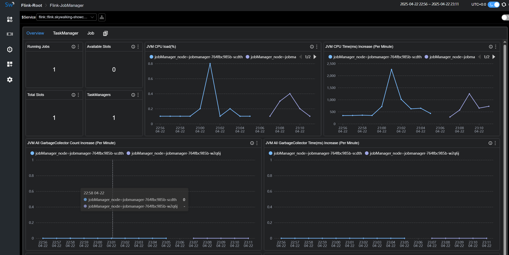
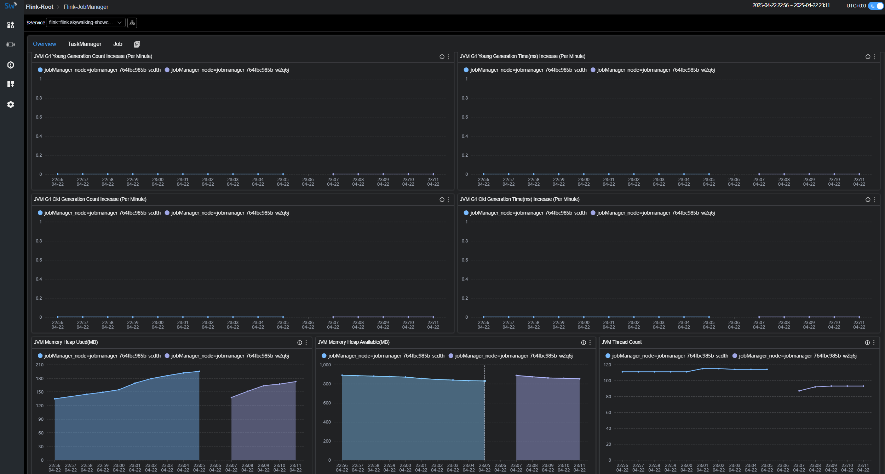
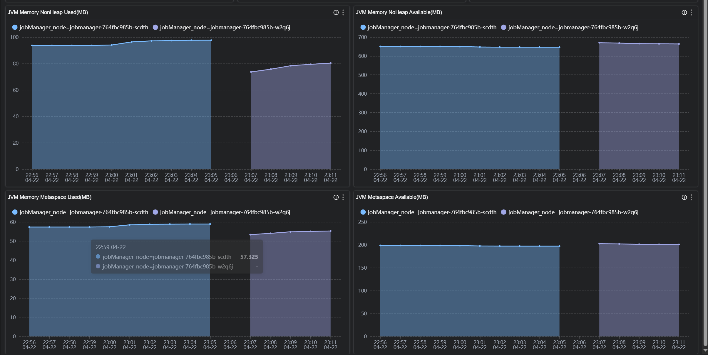
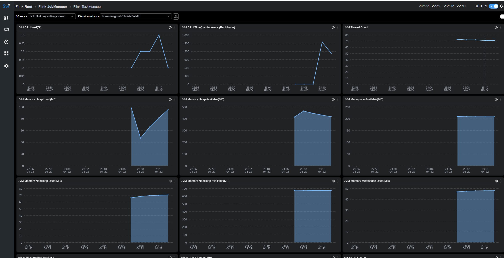
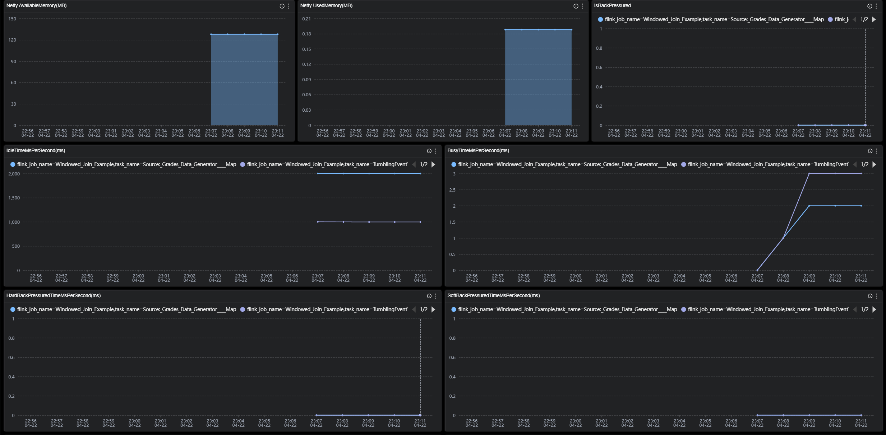
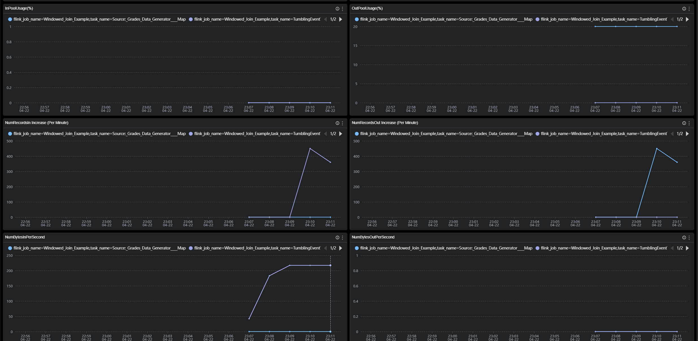
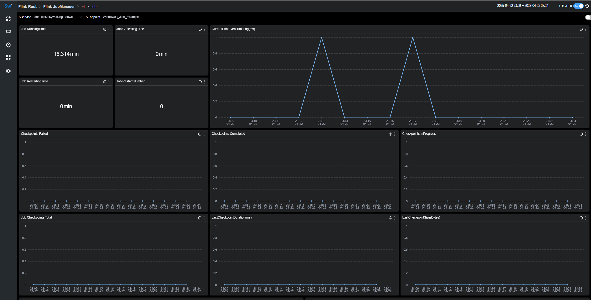
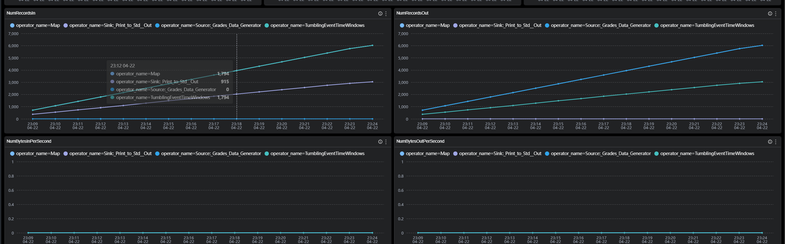
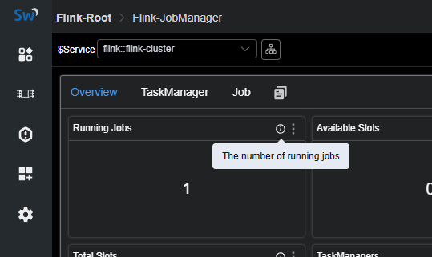

# Background
[Apache Flink](https://flink.apache.org/) is a framework and distributed processing engine for stateful computations over unbounded and bounded data streams. Flink has been designed to run in all common cluster environments, perform computations at in-memory speed and at any scale.

[Apache SkyWalking](https://skywalking.apache.org/) is an application performance monitor tool for distributed systems, especially designed for microservices, cloud native and container-based (Kubernetes) architectures.

[OpenTelemetry](https://opentelemetry.io/) is a collection of APIs, SDKs, and tools. Use it to instrument, generate, collect, and export telemetry data (metrics, logs, and traces) to help you analyze your software’s performance and behavior.

Since `SkyWalking` 10.3, a new out-of-the-box feature has been introduced that enables Flink monitoring data to be visualized on the SkyWalking UI via the OpenTelemetry Collector, which gathers metrics from Flink endpoints.

# Development

## Preparation
1. [SkyWalking OAP,v10.3 +](https://github.com/apache/skywalking)
2. [Flink v2.0-preview1 +](https://github.com/apache/flink)
3. [OpenTelemetry-collector v0.87+](https://github.com/open-telemetry/opentelemetry-collector-contrib)

## Process
 1. Set up `SkyWalking` oap and UI.
 2. Set up the `Flink` cluster By configuring `jobmanager` and `taskmanager` to expose prometheus http endpoints.
 3. Set up `OpenTelemetry-collector`.
 4. Run your job.

## Data flow


## Configuration

### docker-compose
````
version: "3"

services:
  oap:
    extends:
      file: ../../script/docker-compose/base-compose.yml
      service: oap
    ports:
      - "12800:12800"
    networks:
      - e2e

  banyandb:
    extends:
      file: ../../script/docker-compose/base-compose.yml
      service: banyandb
    ports:
      - 17912

  jobmanager:
    image: flink:2.0-preview1
    environment:
      - |
        FLINK_PROPERTIES=
        jobmanager.rpc.address: jobmanager
        metrics.reporter.prom.factory.class: org.apache.flink.metrics.prometheus.PrometheusReporterFactory
        metrics.reporter.prom.port: 9260
    ports:
      - "8081:8081"
      - "9260:9260"
    command: jobmanager
    healthcheck:
      test: ["CMD", "curl", "-f", "http://localhost:8081"]
      interval: 30s
      timeout: 10s
      retries: 3
    networks:
      - e2e

  taskmanager:
    image: flink:2.0-preview1
    environment:
      - |
        FLINK_PROPERTIES=
        jobmanager.rpc.address: jobmanager
        metrics.reporter.prom.factory.class: org.apache.flink.metrics.prometheus.PrometheusReporterFactory
        metrics.reporter.prom.port: 9261
    depends_on:
      jobmanager:
        condition: service_healthy
    ports:
      - "9261:9261"
    command: taskmanager
    healthcheck:
      test: ["CMD", "curl", "-f", "http://localhost:9261/metrics"]
      interval: 30s
      timeout: 10s
      retries: 3
    networks:
      - e2e

  executeJob:
    image: flink:2.0-preview1
    depends_on:
      taskmanager:
        condition: service_healthy
    command: >
      bash -c "
      ./bin/flink run -m jobmanager:8081 examples/streaming/WindowJoin.jar"
    networks:
      - e2e

  otel-collector:
    image: otel/opentelemetry-collector:${OTEL_COLLECTOR_VERSION}
    networks:
      - e2e
    command: [ "--config=/etc/otel-collector-config.yaml" ]
    volumes:
      - ./otel-collector-config.yaml:/etc/otel-collector-config.yaml
    expose:
      - 55678
    depends_on:
      oap:
        condition: service_healthy

networks:
  e2e:
````

If you plan to expose metrics data using the pushGateway pattern, 
please refer to the [documentation](https://nightlies.apache.org/flink/flink-docs-release-2.0-preview1/docs/deployment/metric_reporters/#prometheuspushgateway).

### OpenTelemetry-collector
````
receivers:
  prometheus:
    config:
      scrape_configs:
        - job_name: "flink-jobManager-monitoring"
          scrape_interval: 30s
          static_configs:
            - targets: ['jobmanager:9260']
              labels:
                cluster: flink-cluster
          relabel_configs:
            - source_labels: [ __address__ ]
              target_label: jobManager_node
              replacement: $$1
          metric_relabel_configs:
            - source_labels: [ job_name ]
              action: replace
              target_label: flink_job_name
              replacement: $$1
            - source_labels: [ ]
              target_label: job_name
              replacement: flink-jobManager-monitoring

        - job_name: "flink-taskManager-monitoring"
          scrape_interval: 30s
          static_configs:
            - targets: [ "taskmanager:9261" ]
              labels:
                cluster: flink-cluster
          relabel_configs:
            - source_labels: [ __address__ ]
              regex: (.+)
              target_label: taskManager_node
              replacement: $$1
          metric_relabel_configs:
            - source_labels: [ job_name ]
              action: replace
              target_label: flink_job_name
              replacement: $$1
            - source_labels: [ ]
              target_label: job_name
              replacement: flink-taskManager-monitoring

exporters:
  otlp:
    endpoint: oap:11800
    tls:
      insecure: true

processors:
  batch:
service:
  pipelines:
    metrics:
      receivers:
        - prometheus
      processors:
        - batch
      exporters:
        - otlp
````

Warning:  
Please do not edit the value of the `job_name` configuration, otherwise `SkyWalking` will not handle these data.  
`oap` means the address of your `SkyWalking oap` address,please replace it accordingly.  
Since the original `Flink metrics` contain the  `job_name` labels, and SkyWalking relies on the `job_name` label to handle OpenTelemetry data,
to avoid conflicts, we use `metric_relabel_configs` to rename the original `job_name` label to `flink_job_name`.

# Metrics Definition

Monitoring metrics involve in `Cluster Metrics`, `TaskManager Metrics`, and `Job Metrics`.

## Cluster Metrics




`Cluster Metrics` mainly focuses on statistics from the perspective of the entire cluster, as well as displaying JVM-related metrics of the JobManager, such as:  

- `Running Jobs`：The number of currently running jobs.
- `TaskManagers`：The number of TaskManagers.
- `Task Managers Slots Total`：The total number of TaskManager slots.
- `Task Managers Slots Available`：The number of available TaskManager slots.
- `JVM CPU Load`：The CPU load of the JobManager's JVM.

## TaskManager Metrics





`TaskManager Metrics` mainly focuses on statistics from the perspective of individual TaskManager nodes, such as:

- `JVM Memory Heap Used`：The amount of JVM heap memory used on the TaskManager node.
- `JVM Memory Heap Available`：The amount of JVM heap memory available on the TaskManager node.
- `NumRecordsIn`：The number of records received per minute by the TaskManager.
- `NumBytesInPerSecond`：The number of bytes received per second by the TaskManager.
- `IsBackPressured`：Indicates whether the TaskManager node is under backpressure.
- `IdleTimeMsPerSecond`：The idle time per second of the TaskManager node.

## Job Metrics




`Job Metrics`mainly focuses on statistics from the perspective of running jobs, such as:

- `Job RunningTime`：The duration for which the job has been running.
- `Job Restart Number`：The number of times the job has been restarted.
- `Checkpoints Failed`：The number of failed checkpoints.
- `NumBytesInPerSecond`：The number of bytes received per second by the job.

You can find explanations for each metric in the tip of the corresponding chart.  


# References

- [Flink Prometheus](https://nightlies.apache.org/flink/flink-docs-release-2.0-preview1/docs/deployment/metric_reporters/#prometheus)
- [SkyWalking Flink Monitoring](https://skywalking.apache.org/docs/main/next/en/setup/backend/backend-flink-monitoring/)