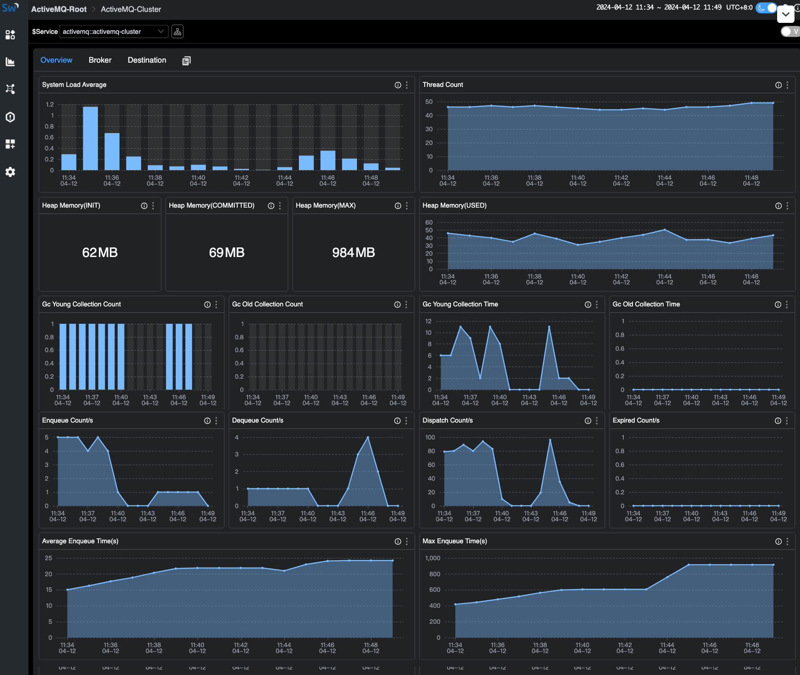

## Introduction

[Apache ActiveMQ Classic](https://activemq.apache.org/components/classic/) is a popular and powerful open-source messaging and integration pattern server. Founded in 2004, it has evolved into a mature and widely used open-source messaging middleware that complies with the `Java Message Service (JMS)`.
Today, with its stability and wide range of feature support, it still has a certain number of users of `small and medium-sized` enterprises. It‘s high-performance version [Apache Artemis](https://activemq.apache.org/components/artemis/) is developing rapidly and is also attracting attention from users of ActiveMQ.

ActiveMQ has broad support for [JMX (Java Management Extensions)](https://docs.oracle.com/javase/tutorial/jmx/overview/index.html), allowing to be monitored through `JMX MBean`.
After enabling JMX, you can use JAVA's built-in `jconsole` or `VisualVM` to view the metrics. In addition, some Collector components can also be used to convert `JMX-style` data into `Prometheus-style` data, which is suitable for more tools.

[OpenTelemetry](https://opentelemetry.io/) as an industry-recognized, standardized solution that provides consistent and interoperable telemetry data collection, transmission, and analysis capabilities for distributed systems, and is also used here for data collection and transmission.
Although it can directly accept `JMX` type data, the JMX indicators for collecting ActiveMQ are not in the standard library, and some versions are incompatible, so this article adopts two steps: convert `JMX data` into `Prometheus-style` indicator data, and then use OpenTelemetry to scrape `HTTP` endpoint data.

[SkyWalking](https://skywalking.apache.org/) as a one-stop distributed system monitoring solution, it accepts metrics from `ActiveMQ` and provides a basic monitoring dashboard.

## Deployment

Please set up the following services:

1. [SkyWalking OAP, v10.0+](https://github.com/apache/skywalking).
2. [ActiveMQ v6.0.X+](https://activemq.apache.org/components/classic/download/).
3. [JMX Exporter v0.20.0](https://github.com/prometheus/jmx_exporter/releases). If using docker, refer [bitnami/jmx-exporter](https://github.com/bitnami/containers/tree/main/bitnami/jmx-exporter).
4. [OpenTelmetry-Collector v0.92.0](https://github.com/open-telemetry/opentelemetry-collector-contrib).

### Preparation

The following describes how to deploy ActiveMQ with 2 single-node brokers and SkyWalking OAP with one single node. JMX Exporter runs in agent mode (recommended).

### Configuration

1. [Enable JMX](https://activemq.apache.org/components/classic/documentation/jmx) in ActiveMQ, the JMX remote port defaults to `1616`, you can change it through `ACTIVEMQ_SUNJMX_START`.
2. Set up the exporter:
   1. [Recommended] If run exporter in `agent mode`, need to append the startup parameter `-DACTIVEMQ_OPTS=-javaagent:{activemqPath}/bin/jmx_prometheus_javaagent-0.20.0.jar=2345:{activemqPath}/conf/config.yaml` in ActiveMQ env, then exporter server starts at the same time.
   2. If run exporter in `single server`, [refer here](https://github.com/prometheus/jmx_exporter/tree/release-0.20.0?tab=readme-ov-file#running-the-standalone-http-server) to deploy the server alone.
   3. `2345` is open HTTP port that can be customized. JMX's metrics can be queried through `http://localhost:2345/metrics`.

example of `docker-compose.yml` with agent exporter for ActiveMQ:

```yml
version: '3.8'
services: 
  amq1:
    image: apache/activemq-classic:latest
    container_name: amq1
    hostname: amq1
    volumes:
      - ~/activemq1/conf/activemq.xml:/opt/apache-activemq/conf/activemq.xml
      - ~/activemq1/bin/jmx_prometheus_javaagent-0.20.0.jar:/opt/apache-activemq/bin/jmx_prometheus_javaagent-0.20.0.jar
      - ~/activemq1/conf/config.yaml:/opt/apache-activemq/conf/config.yaml
    ports:
      - "61616:61616"
      - "8161:8161"
      - "2345:2345"
    environment:
      ACTIVEMQ_OPTS: "-javaagent:/opt/apache-activemq/bin/jmx_prometheus_javaagent-0.20.0.jar=2345:/opt/apache-activemq/conf/config.yaml"
      ACTIVEMQ_BROKER_NAME: broker-1
    networks:
      - amqtest    
  amq2:
    image: apache/activemq-classic:latest
    container_name: amq2
    hostname: amq2
    volumes:
      - ~/activemq2/conf/activemq.xml:/opt/apache-activemq/conf/activemq.xml
      - ~/activemq2/bin/jmx_prometheus_javaagent-0.20.0.jar:/opt/apache-activemq/bin/jmx_prometheus_javaagent-0.20.0.jar
      - ~/activemq2/conf/config.yaml:/opt/apache-activemq/conf/config.yaml      
    ports:
      - "61617:61616" 
      - "8162:8161"
      - "2346:2346"      
    environment:
      ACTIVEMQ_OPTS: "-javaagent:/opt/apache-activemq/bin/jmx_prometheus_javaagent-0.20.0.jar=2346:/opt/apache-activemq/conf/config.yaml"
      ACTIVEMQ_BROKER_NAME: broker-2 
    networks:
      - amqtest
  otel-collector1:
    image: otel/opentelemetry-collector:latest
    container_name: otel-collector1
    command: [ "--config=/etc/otel-collector-config.yaml" ]
    volumes:
      - ./otel-collector-config1.yaml:/etc/otel-collector-config.yaml
    depends_on:
      - amq1
    networks:
      - amqtest 
  otel-collector2:
    image: otel/opentelemetry-collector:latest
    container_name: otel-collector2
    command: [ "--config=/etc/otel-collector-config.yaml" ]
    volumes:
      - ./otel-collector-config2.yaml:/etc/otel-collector-config.yaml
    depends_on:
      - amq2
    networks:
      - amqtest            
networks:
  amqtest:
```

example of `otel-collector-config.yaml` for OpenTelemetry:

```yaml
receivers:
  prometheus:
    config:
     scrape_configs:
       - job_name: 'activemq-monitoring'
         scrape_interval: 30s
         static_configs:
           - targets: ['amq1:2345']
             labels:
               cluster: activemq-broker1

processors:
  batch:
 
exporters:
  otlp:
    endpoint: oap:11800
    tls:
      insecure: true
service:
  pipelines:
    metrics:
      receivers:
      - prometheus
      processors:
      - batch
      exporters:
      - otlp
```

example of `config.yaml` for ActiveMQ Exporter:

```yaml
---
startDelaySeconds: 10
username: admin
password: activemq
ssl: false
lowercaseOutputName: false
lowercaseOutputLabelNames: false
includeObjectNames: ["org.apache.activemq:*","java.lang:type=OperatingSystem","java.lang:type=GarbageCollector,*","java.lang:type=Threading","java.lang:type=Runtime","java.lang:type=Memory","java.lang:name=*"]
excludeObjectNames: ["org.apache.activemq:type=ColumnFamily,*"]
autoExcludeObjectNameAttributes: true
excludeObjectNameAttributes:
  "java.lang:type=OperatingSystem":
    - "ObjectName"
  "java.lang:type=Runtime":
    - "ClassPath"
    - "SystemProperties"
rules:
- pattern: ".*"    
```

### Steps

1. Start `ActiveMQ`, and the Exporter(agent) and the service start at the same time.
2. Start `SkyWalking OAP` and `SkyWalking UI`.
3. Start `OpenTelmetry-Collector`.

After completed, node metrics will be captured and pushed to SkyWalking.

## Metrics

Monitoring metrics involve in `Cluster Metrics`, `Broker Metrics`, and `Destination Metrics`.

- Cluster Metrics: including memory usage, rates of write/read, and average/max duration of write.
- Broker Metrics: including node state, number of connections, number of producers/consumers, and rate of write/read under the broker. Depending on the cluster mode, one cluster may include one or more brokers.
- Destination Metrics: including number of producers/consumers, messages in different states, queues, and enqueue duration in a queue/topic.

### Cluster Metrics



- System Load: range in [0, 100].
- Thread Count: the number of threads currently used by the JVM.
- Heap Memory: capacity of heap memory.
- GC: memory of ActiveMQ is managed by Java's garbage collection (GC) process.
- Enqueue/Dequeue/Dispatch/Expired Rate: growth rate of messages in different states.
- Average/Max Enqueue Time: time taken to join the queue.

### Broker Metrics


- Uptime: duration of the node.
- State: 1 = slave node, 0 = master node.
- Current Connentions: number of connections.
- Current Producer/Consumer Count: number of current producers/consumers.
- Increased Producer/Consumer Count: number of increased producers/consumers.
- Enqueue/Dequeue Count: number of enqueue and dequeue.
- Enqueue/Dequeue Rate: rate of enqueue and dequeue.
- Memory Percent Usage: amount of memory space used by undelivered messages.
- Store Percent Usage: space used by pending persistent messages.
- Temp Percent Usage: space used by non-persistent messages.  
- Average/Max Message Size: number of messages.
- Queue Size: number of messages in the queue.

### Destination Metrics


- Produser/Consumer Count: number of producers/Consumers.
- Queue Size: unacknowledged messages of the queue.
- Memory usage: usage of memory.
- Enqueue/Dequeue/Dispatch/Expired/Inflight Count: number of messages in different states.
- Average/Max Message Size: number of messages.
- Average/Max Enqueue Time: time taken to join the queue.

## Reference

- [ActiveMQ Classic clustering](https://activemq.apache.org/components/classic/documentation/clustering)
- [JMX Exporter Configuration](https://github.com/prometheus/jmx_exporter/tree/release-0.20.0#Configuration)
- [JMX Exporter-Running the Standalone HTTP Server](https://github.com/prometheus/jmx_exporter/tree/release-0.20.0)
- [OpenTelemetry Collector Contrib Jmxreceiver](https://github.com/open-telemetry/opentelemetry-collector-contrib/tree/main/receiver/jmxreceiver)
