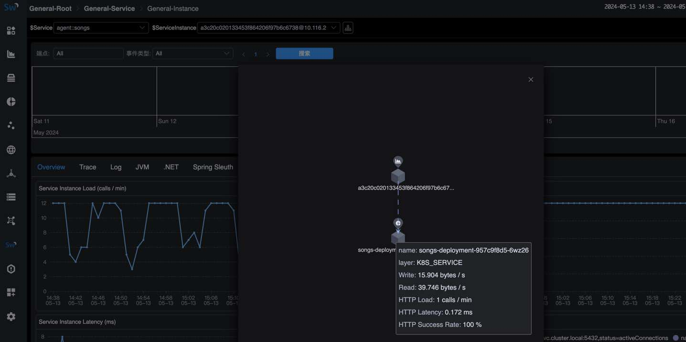

The Apache SkyWalking team today announced the 10 release. SkyWalking 10 provides a host of groundbreaking features and enhancements. 
The introduction of Layer and Service Hierarchy streamlines monitoring by organizing services and metrics into distinct layers and providing seamless navigation across them.
Leveraging eBPF technology, Kubernetes Network Monitoring delivers granular insights into network traffic, topology, and TCP/HTTP metrics. 
BanyanDB emerges as a high-performance native storage solution, while expanded monitoring support encompasses Apache RocketMQ, ClickHouse, 
and Apache ActiveMQ Classic. Support for Multiple Labels Names enhances flexibility in metrics analysis, 
while enhanced exporting and querying capabilities streamline data dissemination and processing.

This release blog briefly introduces these new features and Enhancements as well as some other notable changes.

## Layer and Service Hierarchy
`Layer` concept was introduced in SkyWalking 9.0.0, it represents an abstract framework in computer science, 
such as Operating System(OS_LINUX layer), Kubernetes(k8s layer). It organizes services and metrics into different layers based on their roles
and responsibilities in the system. SkyWalking provides a suite of monitoring and diagnostic tools for each layer, but there is a gap between the layers,
which can not easily bridge the data across different layers.

In SkyWalking 10, SkyWalking provides new abilities to jump/connect across different layers and provide a seamless monitoring experience for users.

### Layer Jump
In the topology graph, users can click on a service node to jump to the dashboard of the service in another layer.
The following figures show the jump from the `GENERAL` layer service topology to the `VIRTUAL_DATABASE` service layer dashboard by clicking the topology node.

Figure 1: Layer Jump</br>


Figure 2: Layer jump Dashboard

### Service Hierarchy
SkyWalking 10 introduces a new concept called `Service Hierarchy`, which defines the relationships of existing logically same services in various layers.
OAP will detect the services from different layers, and try to build the connections. 
Users can click the `Hierarchy Services` in any layer's service topology node or service dashboard to get the `Hierarchy Topology`.
In this topology graph, users can see the relationships between the services in different layers and the summary of the metrics and also can jump to the service dashboard in the layer.
When a service occurrs performance issue, users can easily analyze the metrics from different layers and track down the root cause:

The examples of the `Service Hierarchy` relationships:

1. The application `song` deployed in the Kubernetes cluster with SkyWalking agent and Service Mesh at the same time.
So the application `song` across the `GENERAL`, `MESH`, `MESH_DP` and `K8S_SERVICE` layers which could be monitoring by SkyWalking, 
the `Service Hierarchy` topology as below:

Figure 3: Service Hierarchy Agent With K8s Service And Mesh With K8s Service.</br>
</br>
And can also have the `Service Instance Hierarchy` topology to get the single instance status across the layers as below:

Figure 4: Instance Hierarchy Agent With K8s Service(Pod)</br>
</br>
2. The PostgreSQL database `psql` deployed in the Kubernetes cluster and used by the application `song`.
So the database `psql` across the `VIRTUAL_DATABASE`, `POSTGRESQL` and `K8S_SERVICE` layers which could be monitoring by SkyWalking, 
the `Service Hierarchy` topology as below:

Figure 5: Service Hierarchy Agent(Virtual Database) With Real Database And K8s Service

For more supported layers and how to detect the relationships between services in different layers please refer to the [Service Hierarchy](https://skywalking.apache.org/docs/main/latest/en/concepts-and-designs/service-hierarchy/#service-hierarchy).
how to configure the `Service Hierarchy` in SkyWalking, please refer to the [Service Hierarchy Configuration](https://skywalking.apache.org/docs/main/latest/en/concepts-and-designs/service-hierarchy-configuration/) section.

## Monitoring Kubernetes Network Traffic by using eBPF

In the previous version, skyWalking provides [Kubernetes (K8s) monitoring from kube-state-metrics and cAdvisor](https://skywalking.apache.org/docs/main/latest/en/setup/backend/backend-k8s-monitoring-metrics-cadvisor/), 
which can monitor the Kubernetes cluster status and the metrics of the Kubernetes resources.

In SkyWalking 10, by leverage [Apache SkyWalking Rover](https://skywalking.apache.org/docs/skywalking-rover/latest/readme/) 0.6+, 
SkyWalking has the ability to monitor the Kubernetes network traffic by using eBPF, which can collect and map access logs from applications in Kubernetes environments.
Through these data, SkyWalking can analyze and provide the Service Traffic, Topology, TCP/HTTP level metrics from the Kubernetes aspect.

The following figures show the Topology and TCP Dashboard of the Kubernetes network traffic:


Figure 6: Kubernetes Network Traffic Topology</br>


Figure 7: Kubernetes Network Traffic TCP Dashboard</br>

More details about how to monitor the Kubernetes network traffic by using eBPF, please refer to the [Monitoring Kubernetes Network Traffic by using eBPF](https://skywalking.apache.org/blog/2024-03-18-monitor-kubernetes-network-by-ebpf/).

## BanyanDB - Native APM Database
[BanyanDB](https://skywalking.apache.org/docs/skywalking-banyandb/latest/readme/) 0.6.0 and [BanyanDB Java client](https://github.com/apache/skywalking-banyandb-java-client) 0.6.0 are released with SkyWalking 10, 
As a native storage solution for SkyWalking, BanyanDB is going to be SkyWalking's next-generation storage solution. This is recommended to use for medium-scale deployments from 0.6 until 1.0.  
It has shown high potential performance improvement. Less than 50% CPU usage and 50% memory usage with 40% disk volume compared to Elasticsearch in the same scale.

## Apache RocketMQ Server Monitoring
Apache RocketMQ is an open-source distributed messaging and streaming platform, which is widely used in various scenarios including Internet, big data, mobile Internet, IoT, and other fields.
SkyWalking provides a basic monitoring dashboard for RocketMQ, which includes the following metrics:
- Cluster Metrics: including messages produced/consumed today, total producer/consumer TPS, producer/consumer message size, messages produced/consumed until yesterday, max consumer latency, max commitLog disk ratio, commitLog disk ratio, pull/send threadPool queue head wait time, topic count, and broker count.
- Broker Metrics: including produce/consume TPS, producer/consumer message size.
- Topic Metrics: including max producer/consumer message size, consumer latency, producer/consumer TPS, producer/consumer offset, producer/consumer message size, consumer group count, and broker count.

The following figure shows the RocketMQ Cluster Metrics dashboard:

Figure 8: Apache RocketMQ Server Monitoring</br>

For more metrics and details about the RocketMQ monitoring, please refer to the [Apache RocketMQ Server Monitoring](https://skywalking.apache.org/docs/main/latest/en/setup/backend/backend-rocketmq-monitoring/),

## ClickHouse Server Monitoring
ClickHouse is an open-source column-oriented database management system that allows generating analytical data reports in real-time, it is widely used for online analytical processing (OLAP).
ClickHouse monitoring provides monitoring of the metrics 、events and asynchronous metrics of the ClickHouse server, which includes the following parts of metrics:

- Server Metrics
- Query Metrics
- Network Metrics
- Insert Metrics
- Replica Metrics
- MergeTree Metrics
- ZooKeeper Metrics
- Embedded ClickHouse Keeper Metrics

The following figure shows the ClickHouse Cluster Metrics dashboard:

Figure 9: ClickHouse Server Monitoring</br>

For more metrics and details about the ClickHouse monitoring, please refer to the [ClickHouse Server Monitoring](https://skywalking.apache.org/docs/main/latest/en/setup/backend/backend-clickhouse-monitoring/),
and here is a blog that can help for a quick start [Monitoring ClickHouse through SkyWalking](https://skywalking.apache.org/blog/2024-03-12-monitoring-clickhouse-through-skywalking/).

## Apache ActiveMQ Server Monitoring
Apache ActiveMQ Classic is a popular and powerful open-source messaging and integration pattern server.
SkyWalking provides a basic monitoring dashboard for ActiveMQ, which includes the following metrics:
- Cluster Metrics: including memory usage, rates of write/read, and average/max duration of write.
- Broker Metrics: including node state, number of connections, number of producers/consumers, and rate of write/read under the broker. Depending on the cluster mode, one cluster may include one or more brokers.
- Destination Metrics: including number of producers/consumers, messages in different states, queues, and enqueue duration in a queue/topic.

The following figure shows the ActiveMQ Cluster Metrics dashboard:

Figure 10: Apache ActiveMQ Server Monitoring</br>

For more metrics and details about the ActiveMQ monitoring, please refer to the [Apache ActiveMQ Server Monitoring](https://skywalking.apache.org/docs/main/latest/en/setup/backend/backend-activemq-monitoring/),
and here is a blog that can help for a quick start [Monitoring ActiveMQ through SkyWalking](https://skywalking.apache.org/blog/2024-04-19-monitoring-activemq-through-skywalking/).

## Support Multiple Labels Names
Before SkyWalking 10, SkyWalking does not store the labels names in the metrics data, which makes MQE have to use `_` as the generic label name,
it can't query the metrics data with multiple labels names.

SkyWalking 10 supports storing the labels names in the metrics data, and MQE can query or calculate the metrics data with multiple labels names.
For example:
The `k8s_cluster_deployment_status` metric has labels `namespace`, `deployment` and `status`.
If we want to query all deployment metric value with `namespace=skywalking-showcase` and `status=true`, we can use the following expression:
```text
k8s_cluster_deployment_status{namespace='skywalking-showcase', status='true'}
```

related enhancement:
- Since Alarm rule configuration had migrated to the MQE in SkyWalking 9.6.0, the alarm rule also supports multiple labels names.
- PromeQL service supports multiple labels names query.

## Metrics gRPC exporter
SkyWalking 10 enhanced the [metrics gPRC exporter](https://skywalking.apache.org/docs/main/latest/en/setup/backend/exporter/#grpc-exporter),
it supports exporting all type metrics data to the gRPC server.

## SkyWalking Native UI Metrics Query Switch to V3 APIs
SkyWalking Native UI metrics query deprecate the V2 APIs, and all migrated to [V3 APIs](https://skywalking.apache.org/docs/main/latest/en/api/query-protocol/#v3-apis) 
and [MQE](https://skywalking.apache.org/docs/main/next/en/api/metrics-query-expression/#metrics-query-expressionmqe-syntax).

## Other Notable Enhancements
1. Support Java 21 runtime and oap-java21 image for Java 21 runtime.
2. Remove CLI(`swctl`) from the image.
3. More MQE functions and operators supported.
4. Enhance the native UI and improve the user experience.
5. Several bugs and CVEs fixed.


