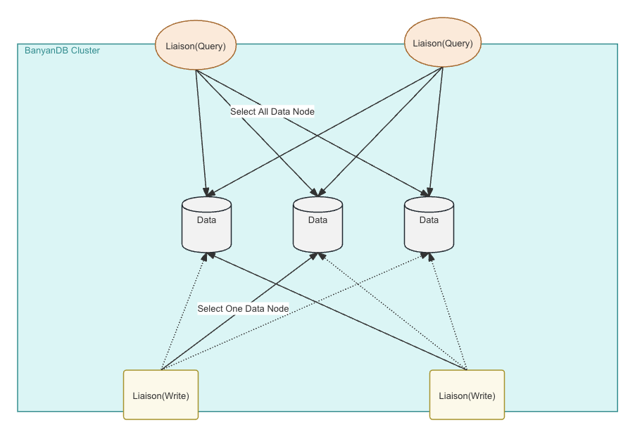
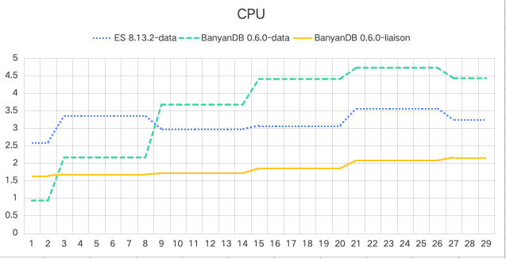
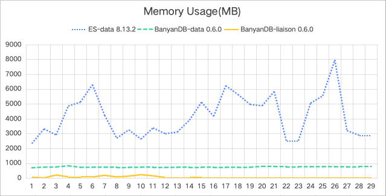
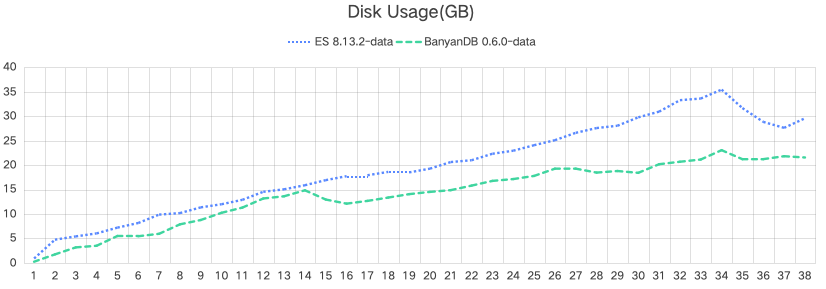
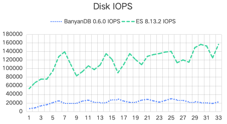
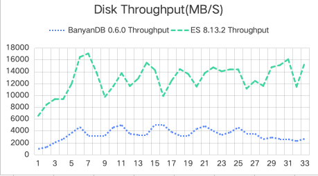

# Introduction

We are excited to announce the release of BanyanDB v0.6, a significant milestone in the evolution of our database technology. This latest version introduces a groundbreaking column-based file system that enhances performance and improves efficiency in handling large datasets. After extensive testing, we can confirm that this new file system is ready for production. BanyanDB is now production-ready.

In this blog post, we’ll dive deep into the new architecture and the performance improvements observed and provide a step-by-step guide on installing and getting started with BanyanDB v0.6.

# Understanding BanyanDB Architecture

BanyanDB is designed as a highly scalable, multi-model database. The architecture of BanyanDB is modular, allowing for flexibility in storage and indexing strategies, which makes it an ideal choice for complex data environments.

### Key Features:

- **Multi-Model Support:** Seamlessly handles various data types.
- **Scalability:** Designed to scale horizontally across multiple nodes.
- **High Performance:** Optimized for quick data retrieval and high data ingestion rates.

## Data Model

BanyanDB is a multi-model database engineered to support diverse data types, including time series and key-value data. This flexibility is essential for modern APM systems that require versatile data handling capabilities.


BanyanDB Models

### Time-Series Data:

BanyanDB manages time-series data, which are data points indexed in time order, typically logged at successive, equally spaced points in time. This makes it ideal for a sequence of discrete-time data. In BanyanDB, you can store time-series data through two structures:

- **Stream**: This type of data is suitable for logging, such as logs, traces, and events. Streams help manage data that are continuously generated and sequentially recorded.
- **Measure**: Designed for ingesting metrics and profiles. Measures are useful for statistical representations over intervals of time.

### Key-Value Data:

The key-value model in BanyanDB is a subset of the Property model. Each property is identified by a unique key formatted as `<group>/<name>/<id>`, which acts as a primary key for retrieving data. This key is immutable once set, ensuring data consistency and integrity.

Properties consist of several key-value pairs, referred to as Tags. You can dynamically add, update, or drop tags based on the tag's key, offering flexibility in managing and storing data. For example, SkyWalking UI templates utilize this model to store configuration data efficiently.

## Clustering in BanyanDB

BanyanDB's architecture not only ensures efficient data management and high availability but also emphasizes scalability across its clustered environment. The system includes three distinct node types, each capable of scaling independently to meet varying workload demands.

### Data Nodes

Data Nodes are central to storing and managing all raw time series data, metadata, and indexed data. Operating under a shared-nothing architecture, these nodes do not communicate directly with each other nor share any data, enhancing cluster availability and simplifying maintenance and scaling. This design prioritizes availability, allowing the system to remain operational for data ingestion and querying even if some nodes are temporarily unavailable.

### Meta Nodes

Implemented using etcd, Meta Nodes manage the overarching cluster metadata and ensure consistency across the system. They maintain a global view of the node states and database schemas, facilitating coordinated operations within the cluster.

### Liaison Nodes

Liaison Nodes serve as the communication bridge, routing queries and data to the appropriate Data Nodes. They handle security functions like authentication and TTL enforcement, and manage distributed query execution to optimize performance. They play a crucial role in maintaining service availability; as long as at least one Data Node is operational, Liaison Nodes can continue to serve queries. In scenarios where some Data Nodes are unavailable, Liaison Nodes reroute traffic to the remaining healthy nodes, which may lead to increased resource use on these nodes.



BanyanDB Cluster

### Communication

- **Meta Nodes** synchronize metadata across the cluster.
- **Data Nodes** interact with Meta Nodes to update and fetch metadata.
- **Liaison Nodes** route data to Data Nodes and coordinate query processes, leveraging metadata from Meta Nodes for efficient distribution and execution.

### Scalability and Fault Tolerance

Each node type within the BanyanDB cluster can be scaled independently based on the specific needs of the deployment:

- **Scaling Data Nodes** increases data handling capacity and improves performance under heavier loads.
- **Scaling Meta Nodes** enhances the management capabilities and resiliency of cluster metadata operations. The number of such nodes should be odd.
- **Scaling Liaison Nodes** improves the throughput of query processing and data routing capabilities.

This flexibility allows BanyanDB to adapt to changes in demand without compromising performance or availability. If some components become temporarily unavailable, the system is designed to continue operations, prioritizing availability over strict consistency. However, during such events, if the active nodes do not have sufficient resources to handle the current workload, users may experience delays or failures in data ingestion and query processing.

# Installation On Kubernetes

To install BanyanDB on Kubernetes, you can use our Helm chart, which simplifies the deployment process.  You can find detailed installation instructions in [our official documentation](https://github.com/apache/skywalking-helm/tree/v4.6.0).

This step-by-step guide assumes you have a basic understanding of Kubernetes and Helm, the package manager for Kubernetes. If you're new to Helm, you might want to familiarize yourself with Helm basics before proceeding.

## Prerequisites

Before we begin, ensure you have the following:

1. **A Kubernetes Cluster**: You can use Minikube for a local setup, or any cloud provider like AWS, GCP, or Azure that supports Kubernetes.
2. **Helm 3**: Ensure Helm 3 is installed and configured on your machine. You can download it from [Helm's official website](https://helm.sh/).

## Step 1: Configure Helm to Use OCI

Since the BanyanDB Helm chart is hosted as an OCI chart in Docker Hub, you need to ensure your Helm is configured to handle OCI artifacts.

```bash
helm registry login registry-1.docker.io
```

You will be prompted to enter your Docker Hub username and password. This step is necessary to pull Helm charts from Docker Hub.

## Step 2: Setup Env Variables

Next, set up the environment variables for the SkyWalking release version, name, and namespace. These variables will be used in subsequent commands.

```bash
export SKYWALKING_RELEASE_VERSION=4.6.0
export SKYWALKING_RELEASE_NAME=skywalking
export SKYWALKING_RELEASE_NAMESPACE=default
```

## Step 3: Install BanyanDB+SkyWalking Using Helm

```bash
helm install "${SKYWALKING_RELEASE_NAME}" \
  oci://registry-1.docker.io/apache/skywalking-helm \
  --version "${SKYWALKING_RELEASE_VERSION}" \
  -n "${SKYWALKING_RELEASE_NAMESPACE}" \
  --set oap.image.tag=10.0.1 \
  --set oap.storageType=banyandb \
  --set ui.image.tag=10.0.1 \
  --set elasticsearch.enabled=false \
  --set banyandb.enabled=true \
  --set banyandb.image.tag=0.6.1 \
  --set banyandb.standalone.enabled=false \
  --set banyandb.cluster.enabled=true \
  --set banyandb.etcd.enabled=true
```

This command will deploy the SkyWalking OAP cluster and BanyanDB cluster to your Kubernetes environment.

## Step 4: Verify the Installation

Check the status of the pods to ensure they are running properly:

```bash
kubectl get pods -l release=skywalking
```

You should see the following pods in a `Running` or `Completed` state if everything is configured correctly.


Pods in BanyanDB Cluster

## Step 5: Access SkyWalking UI

To access the SkyWalking UI, you can check the service by :

```bash
kubectl get svc
```

You should select the service `skywalkin-skywalking-helm-ui` to access the UI.

# Performance Test

We benchmarked BanyanDB v0.6.1 against Elasticsearch 8.13.2, SkyWalking’s recommended database. The new BanyanDB outperformed Elasticsearch in several key areas, particularly in memory usage and disk space.

## Data Generation Tool

For this test, we used a custom data generation tool designed to create data that mimics a typical real-world scenario for trace and metrics data. 

### Services, Instances, and Endpoints

- **Total Services:** 20
- **Groups of Services:** Each of the 3 generator instances runs two groups, contributing to the total count of services.
- **Instances per Service:** Each service is represented by 20 instances, leading to 400 instances across all services.
- **Endpoints per Service:** Each service instance hosts 100 endpoints.
- **Total Endpoints:** With 20 services, the total number of endpoints is 2000.

### Trace and Segment Generation

- **Trace Generation Rate:** Each group of services generates 1000 traces per second, effectively simulating a high-load scenario typical in large-scale microservice environments.
- **Spans per Trace:** Each trace comprises five segments, detailing the simulated interactions between various services and instances.
- Total Writes per Second: 2 groups * 3 data-generators * 1000 traces * 5 segments = 30k segments.

The additional query types were designed to represent typical read operations performed in a production environment monitoring microservice architectures by SkyWalking. Each query type targets a different aspect of service data:

### 1. **Service Dashboard Queries**

- **Purpose:** Fetch 5 service-level metrics over the last 30 minutes.
- **Frequency:** 1 query per second

### 2. **Top-N List Queries**

- **Purpose:** Retrieve the top 5 metrics for 2 specific services over the last 30 minutes.
- **Frequency:** 1 query per second.

### 3. **Segment List Queries**

- **Purpose:** Fetch a list of service segments ordered by descending latency within the last 30 minutes.
- **Frequency:** 1 query per second.

### 4. **Trace Detail Queries**

- **Purpose:** Retrieve all trace details from the segment list.
- **Frequency:** 2 queries per second.

## Setup

Below is a detailed table that outlines the specifications of each component within the clusters, allowing for an easy comparison of hardware resources allocated to each system. This provides a clear and structured comparison of the deployment configurations used for Elasticsearch 8.13.2 and BanyanDB v0.6.1 in our performance tests.


Performance Test Setup

## Cluster Configuration Table

| Component | System | Quantity | CPU Cores | RAM (GB) | Storage (GB) | Role Description |
| --- | --- | --- | --- | --- | --- | --- |
| Master Nodes | Elasticsearch | 3 | 2 | 6 | N/A | Cluster coordination and management |
| Data Nodes | Elasticsearch | 3 | 4 | 8 | 50 (Premium RWO) | Data storage, indexing, and query processing |
| ETCD Nodes | BanyanDB | 3 | 2 | 4 | N/A | Metadata and cluster state storage |
| Data Nodes | BanyanDB | 3 | 8 | 4 | 50 (Premium RWO) | Data storage and processing |
| Liaison Nodes | BanyanDB | 2 | 4 | 4 | N/A | Coordination between client applications and data nodes |

## Result

Here we consolidate the performance test results for Elasticsearch 8.13.2 and BanyanDB v0.6.1, focusing on resource usage comparisons. The results are organized into two tables for better clarity—one detailing CPU and memory usage, and the other focusing on disk-related metrics.

## CPU and Memory Usage




| System | Mean CPU Usage (cores) | Mean Memory Usage (MB) |
| --- | --- | --- |
| Elasticsearch Data | 3.2 | 4147 |
| BanyanDB Data | 3.6 | 738 |
| BanyanDB Liaison | 1.9 | 62 |

### Observations:

- **CPU Usage:** BanyanDB data nodes have slightly higher CPU usage due to their operations on compressing and decompressing data files. However, BanyanDB liaison nodes use significantly less CPU.
- **Memory Usage:** BanyanDB shows markedly lower memory usage for both data and liaison nodes, using nearly 5x less memory than Elasticsearch data nodes, highlighting its efficiency in memory utilization.

## Disk Usage, IOPS, and Throughput



Disk Usage




Disk IOPS & Throughput

| System | Mean Disk Usage (GB) | IOPS (k) | Disk Throughput (GB/s) |
| --- | --- | --- | --- |
| Elasticsearch Data | 29.6 | 115.5 | 12.8 |
| BanyanDB Data | 21.6 | 21.4 | 3.3 |

### Observations:

- **Disk Space Usage:** BanyanDB utilizes about 30% less disk space than Elasticsearch, which can translate into lower storage costs.
- **IOPS and Throughput:** BanyanDB's IOPS and disk throughput are significantly lower, indicating less strain on disk resources. This could be beneficial for reducing operational costs and extending the lifespan of physical storage devices.

# Conclusion

The release of BanyanDB v0.6 marks a significant advancement in database technology with its new column-based file system. This version demonstrates substantial improvements in both performance and efficiency, particularly in memory usage and disk space compared to Elasticsearch. BanyanDB's ability to handle various data types, its scalable architecture, and its high performance in data retrieval and ingestion make it a robust solution for complex data environments. The introduction of a flexible clustering system allows for independent scaling of node types, ensuring adaptability to changing demands without compromising on performance or availability. Overall, BanyanDB v0.6 positions itself as a cost-effective and reliable choice for modern application performance management (APM) systems.