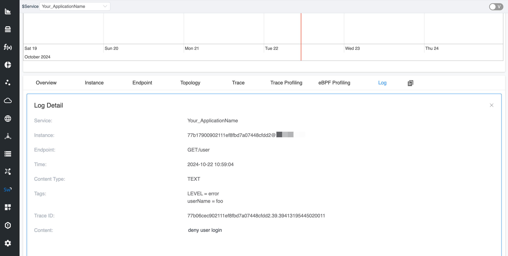

## Intro

Apache SkyWalking Go is an observability tool specifically designed for Golang applications, aimed at monolithic services, microservices, cloud-native architectures, and containerized applications. It is the Go language implementation of the Apache SkyWalking probe project, providing comprehensive capabilities for service tracing, performance metrics analysis, and application topology analysis.

SkyWalking Go leverages Go's concurrency features to achieve efficient data collection and analysis. By inserting a minimal amount of probe code into the application during compilation using AST (Abstract Syntax Tree), it can capture service request and response data, as well as system runtime status information. By reporting this collected data, SkyWalking Go can generate detailed service call chain diagrams, helping developers understand the dependencies between services and the performance status of each service.

SkyWalking Go currently provides the following three capabilities for users to manually report relevant information:
* Trace
* Metrics
* Log

This document aims to guide users on how to manually report log entries and metrics using the toolkit. For information on how to report trace linkage information with the toolkit, please refer to the [SkyWalking Go Toolkit Trace Detailed Explanation](https://skywalking.apache.org/zh/2023-10-18-skywalking-toolkit-trace/).

Before diving deeper, you may want to check the [SkyWalking Go Agent Quick Start Guide](https://skywalking.apache.org/zh/2023-06-01-quick-start-with-skywalking-go-agent/) to learn how to use the SkyWalking Go Agent.

The following sections will introduce how to use these interfaces in specific scenarios.

## Import Trace Toolkit

First, execute the following command in the root directory of the project:

```shell
go get github.com/apache/skywalking-go/toolkit
```

## Manually report logs

In traceability, logs play a crucial role. They record detailed information about each request in the system, including timestamps, processing nodes, error messages, etc., which helps developers and operations teams quickly identify performance bottlenecks and the root causes of failures. By comparing logs from different requests, teams can analyze the flow of requests, optimize system architecture, and improve service response speed and stability.

In the SkyWalking Go toolkit, manually reported logs will be **attached to the current context Span**, allowing us to associate specific log information with particular spans.

First, we need to import the toolkit log package:

```go
"github.com/apache/skywalking-go/toolkit/logging"
```

We can build a simple web service that determines the validity of a username based on the request parameters. When the userName parameter is invalid, we log an error using the logging.Error API. This log will be attached to the currently active Span in the context.

When recording logs, we can also append keyValues to the log information using variadic parameters, making the log entries more descriptive.

For detailed usage documentation, please refer to [SkyWalking Go toolkit-logging](https://skywalking.apache.org/docs/skywalking-go/next/en/advanced-features/manual-apis/toolkit-log/).


```go
package main

import (
	"log"
	"net/http"

	_ "github.com/apache/skywalking-go"
	"github.com/apache/skywalking-go/toolkit/logging"
)

func main() {
	http.HandleFunc("/user", func(w http.ResponseWriter, r *http.Request) {
		userName := r.URL.Query().Get("userName")
		if len(userName) == 0 || userName != "root" {
			// Log an entry, which will be attached to the currently active Span in the context.
			// We can append log tags using variadic parameters.
			logging.Error("deny user login", "userName", userName)
			w.WriteHeader(http.StatusUnauthorized)
			return
		}

		w.WriteHeader(http.StatusAccepted)
	})

	if err := http.ListenAndServe(":8080", nil); err != nil {
		log.Fatalln("server running by err:", err)
	}
}

```

Then we enhance it using the SkyWalking `Go Agent`:

```shell
go build -toolexec="/path/go-agent" -a -o demo .
```




## Manually reporting metrics information

Metrics are extremely important in traceability, as they provide quantitative analysis of system performance. By monitoring metrics such as request latency, throughput, and error rates, teams can identify performance bottlenecks and potential issues, allowing them to optimize system architecture and resource allocation. Combined with traceability, metrics can reveal the flow of requests between services, helping teams gain deeper insights into the health status and usage patterns of the system, ensuring high availability of services and a positive user experience, ultimately supporting business objectives effectively.

The current toolkit metrics support the following types of metrics:
* Counter
* Gauge
* Histogram

First, execute the following command in the root directory of the project:

```go
"github.com/apache/skywalking-go/toolkit/metric"
```

We can build a simple Echo service that creates a Counter type metric to record the number of requests. At the same time, we can use metric.WithLabels to add additional labels to the metric.

```go
package main

import (
	"log"
	"net/http"

	_ "github.com/apache/skywalking-go"
	"github.com/apache/skywalking-go/toolkit/metric"
)

func main() {
	// Create a Counter type metric
	// We also set labels for this Counter
	counter := metric.NewCounter(
		"http_request_count",
		metric.WithLabels("path", "/ping"),
	)

	http.HandleFunc("/ping", func(w http.ResponseWriter, r *http.Request) {
		// Increment the count by one for each incoming request
		counter.Inc(1)

		w.WriteHeader(http.StatusOK)
	})

	if err := http.ListenAndServe(":8080", nil); err != nil {
		log.Fatalln("server running by err:", err)
	}
}
```

Then we enhance it using the SkyWalking `Go Agent`:

```shell
go build -toolexec="/path/go-agent" -a -o demo .
```

We can display the metric information in the [SkyWalking Custom Dashboard](https://skywalking.apache.org/docs/main/next/en/ui/readme/#widget).


## Summarize

This document discusses the basic usage of the Log APIs and Metrics APIs in SkyWalking Go. It provides users with the functionality to customize and report log entries and metric information.

The SkyWalking Go toolkit was designed with simplicity in mind, aiming to shorten the distance between users and the product.

For more information, please refer to [SkyWalking Go](https://skywalking.apache.org/docs/skywalking-go/next/readme/).