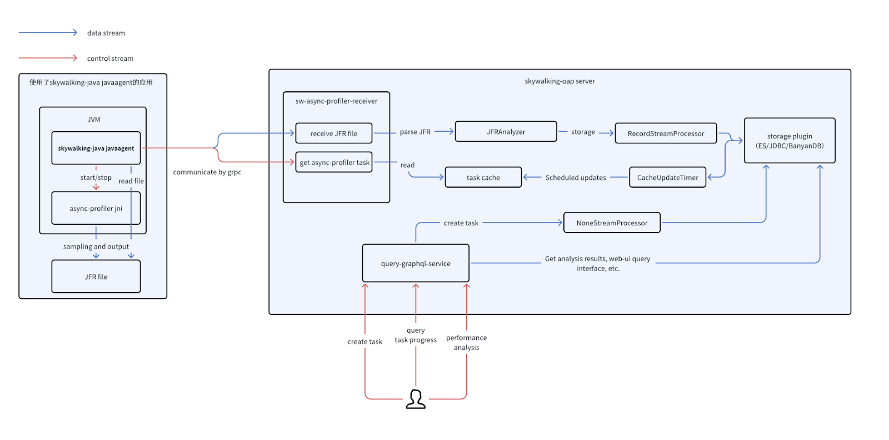
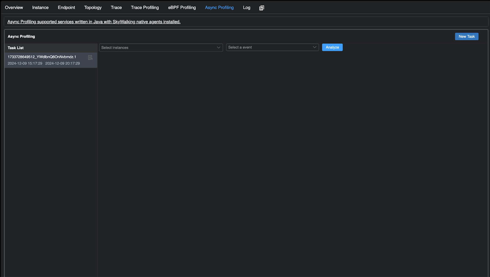
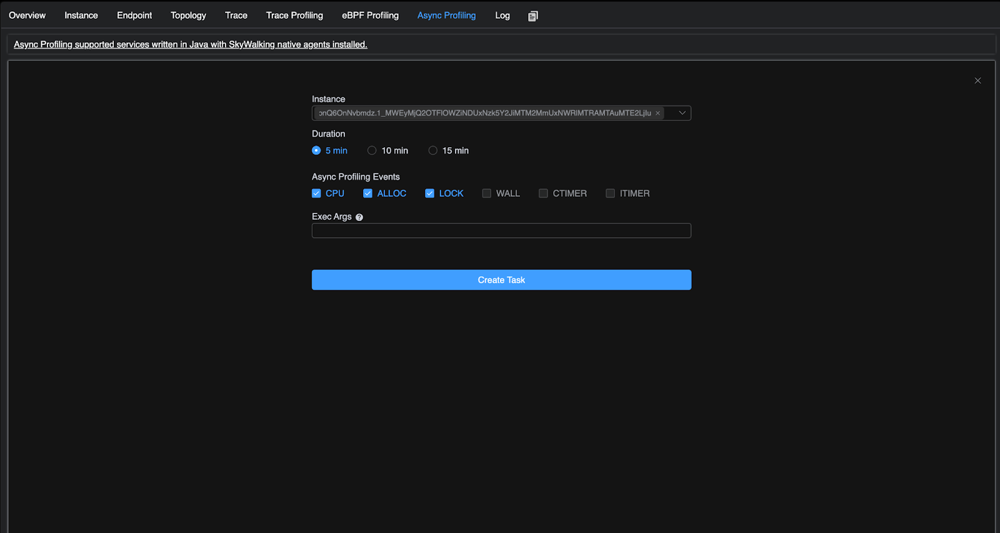
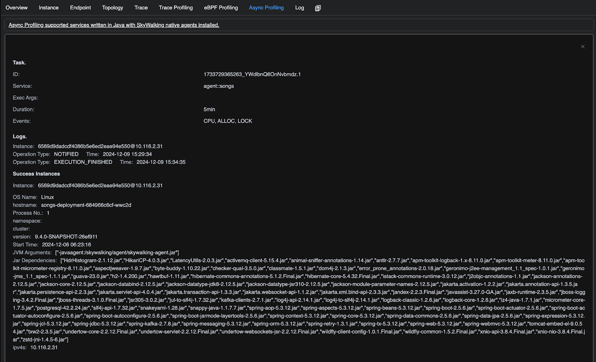
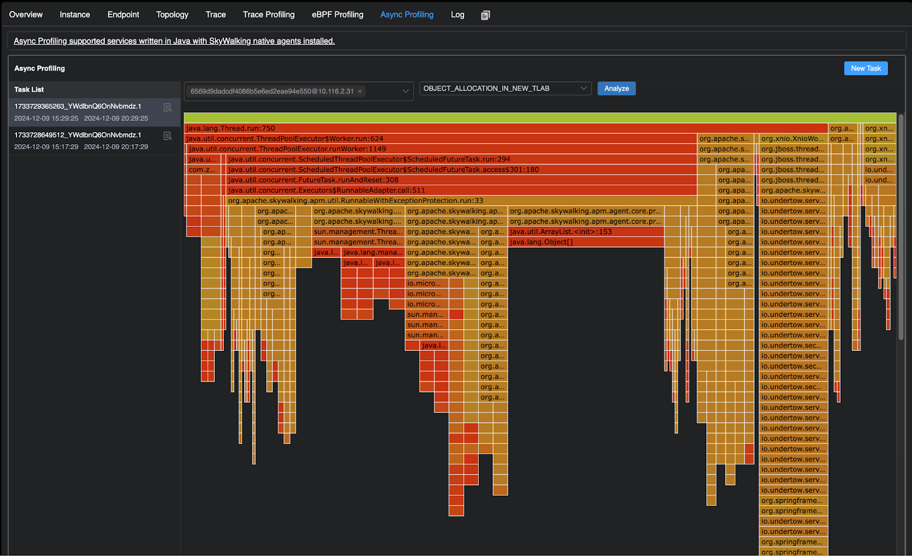

## Background

[Apache SkyWalking](https://skywalking.apache.org/) is an open-source Application Performance Management system that helps users gather logs, traces, metrics, and events from various platforms and display them on the UI.
In version 10.1.0, Apache SkyWalking can perform CPU analysis through eBPF, which supports multiple languages, but not Java. This article discusses how Apache SkyWalking 10.2.0 uses async-profiler to collect CPU, memory allocation, and locks for analysis, solving this limitation, and also provides memory allocation and occupancy analysis.

## Why use async-profiler

The async-profiler is a low overhead sampling profiler for Java that does not suffer from the [Safepoint bias problem](http://psy-lob-saw.blogspot.ru/2016/02/why-most-sampling-java-profilers-are.html). It features HotSpot-specific API to collect stack traces and to track memory allocations. The profiler works with OpenJDK and other Java runtimes based on the HotSpot JVM. The async-profiler also officially supports the instruction set architectures commonly used on Linux and Mac platforms, and the sampling data can be stored in the JFR format. Compared with the JFR tool officially provided by JDK, it supports lower JDK versions (JDK 6).

## Architecture diagram



### The processes of running a profiling task

1. A user submits a async-profiler task in the UI
2. The Java agent retrieves the task from the OAP Server
3. Java agent excuses the task to collect profiling data sampling through async-profiler
4. After the profiling is completed, the agent uploads the JFR file to the OAP server.
5. The server parses the JFR file to generate profiling results and marks the task as completed status.
6. The user could check the performance analysis result from the UI side.

## Demo 

You can setup SkyWalking showcase locally to preview this feature. In this demo, we only deploy service, the latest released SkyWalking OAP, and UI.

```sh
export FEATURE_FLAGS=java-agent-injector,single-node,elasticsearch
make deploy.kubernetes
```

After deployment is complete, please run the following script to open SkyWalking UI: http://localhost:8080/.

```sh
kubectl port-forward svc/ui 8080:8080 --namespace default
```

### Run the Async Profiling Task Step by Step

After the deployment is complete, users can navigate to the service page where the Java agent is configured. Upon entering the service page, users will be able to see the `Async Profiling` component. By clicking on this component, users will gain access to the relevant functionality page, where they can perform some operations.



### Create a New Task

Clicking **New Task** on the **Async Profiling** page will direct you to the following configuration page. The usage of each parameter is explained as follows:

- **Instance**: This parameter allows you to select the instance of the service that will execute the profiling. It supports selecting multiple instances simultaneously for performance analysis.
- **Duration**: Specifies the duration for the task. The default duration is conservatively set to a maximum of 20 minutes, but this can be adjusted through the [Java agent configuration]((https://github.com/apache/skywalking-java/blob/7e200bbbb052f0e03e5b2db09e1b0a4c6cf1d71c/apm-sniffer/config/agent.config#L170)).
- **Async Profiling Events**: The profiling events are categorized into three types of sampling, which will be explained below:
  - **CPU Sampling**: CPU, WALL, CTIMER, ITIMER. [See the differences between these four CPU sampling types](#Differences-in-CPU-sampling-during-task-creation).
  - **Memory Allocation Sampling**: ALLOC.
  - **Lock Occupancy Sampling**: LOCK.
- **ExecArgs**: Extended parameters for **async-profiler**. Detailed [usage instructions](#ExecArgs-in-task-creation) are available.



### Check the Progresses Of the Task

By clicking the task details icon, users can view the **task status logs, relevant parameters, as well as instances where data collection has either failed or been successfully completed**. Instances that have successfully completed data collection will be available for subsequent performance analysis.

> It is important to note that, in containerized deployments where users have not configured volume mounts, there may be cases where JFR files cannot be received. To address this, the OAP Server by default uses memory to receive and parse JFR files. The maximum acceptable size for JFR files is conservatively set to 30MB by default.
>
> Users can customize the default JFR file size in the OAP configuration and opt to store the files on the filesystem before parsing them, enabling the platform to handle larger JFR files and ensuring smoother memory allocation.
>
> Currently, the JFR parser requires approximately 1GB of memory to process a 200MB JFR file. (Note that this refers only to memory allocation, not the actual memory required for parsing.) Users can use this as a reference when configuring their OAP Server



### Performance Analysis

Users can select a task and choose the instances they wish to analyze for performance (multiple instances can be selected for aggregated flame graph analysis). After selecting the desired JFR event type for analysis, users can click the **Analyze** button to display the corresponding flame graph.



## Some Details

### Differences in CPU sampling during task creation

The CPU sampling mechanism supports several modes, each representing a different sampling engine implemented by async-profiler. These modes include CPU, WALL, CTIMER, and ITIMER, and differ primarily in how they collect and generate sampling signals. The following provides a detailed description of each sampling: 

- **CPU**: cpu mode relies on [perf_events](https://man7.org/linux/man-pages/man2/perf_event_open.2.html). The idea is the same - to generate a signal every N nanoseconds of CPU time, which in this case is achieved by configuring PMU to generate an interrupt every K CPU cycles. 
- **WALL**: Same as CPU sampling, but also samples threads in non-runnable state, such as threads in sleep
- **ITIMER**:  itimer mode is based on [setitimer(ITIMER_PROF)](https://man7.org/linux/man-pages/man2/setitimer.2.html) syscall, which ideally generates a signal every given interval of the CPU time consumed by the process.
- **CTIMER**: ctimer aims to address these limitations of [perf_events](https://man7.org/linux/man-pages/man2/perf_event_open.2.html) and itimer. ctimer relies on [timer_create](https://man7.org/linux/man-pages/man2/timer_create.2.html). It combines benefits of cpu and itimer, except that it does not allow collecting kernel stacks.

For details, please refer to [async-profiler](https://github.com/async-profiler/async-profiler/blob/master/docs/CpuSamplingEngines.md)

### ExecArgs in task creation

By default, task parameters are separated by commas. When creating a task, users should refer to the following example format for input: `lock=10us,interval=10ms`.

Currently, the following parameters are supported by default:

| Option            | Description                                                |
| :---------------- | :--------------------------------------------------------- |
| chunksize=N       | approximate size of JFR chunk in bytes (default: 100 MB)   |
| chunktime=N       | duration of JFR chunk in seconds (default: 1 hour)         |
| lock\[=DURATION\] | profile contended locks overflowing the DURATION ns bucket |
| jstackdepth=N     | maximum Java stack depth (default: 2048\)                  |
| interval=N        | sampling interval in ns (default: 10'000'000, i.e. 10 ms)  |
| alloc\[=BYTES\]   | profile allocations with BYTES interval                    |

For other parameters, please refer to [async-profiler](https://github.com/async-profiler/async-profiler/blob/master/src/arguments.cpp#L44) and need to be tested by yourself

### Comparison table between sampling types and JFR events in task analysis

| Task sample type                            | JFR event type                                               | Description                                                  | Unit                                                         |
| :------------------------------------------ | :----------------------------------------------------------- | :----------------------------------------------------------- | :----------------------------------------------------------- |
| CPU<br />WALL<br /><br />ITIMER<br />CTIMER | EXECUTION\_SAMPLE                                            | Multiple **AsyncProfilerEventType** types correspond to the **EXECUTION_SAMPLE** event. This is primarily due to the fact that different sampling types employ distinct underlying mechanisms and have varying sampling scopes. | Sample times. <br />The execution time can be calculated based on the sampling interval. For instance, if the number of samples is 10 and the interval is set to 10ms, the total execution time can be estimated as 100ms (the default interval is 10ms) |
| LOCK                                        | THREAD\_PARK<br />JAVA\_MONITOR\_ENTER                       | Empty                                                        | ns                                                           |
| ALLOC                                       | OBJECT\_ALLOCATION\_IN\_NEW\_TLAB<br />OBJECT\_ALLOCATION\_OUTSIDE\_TLAB | Empty                                                        | byte                                                         |
| Add `live` option to extended parameters    | PROFILER\_LIVE\_OBJECT                                       | Because it is not in the event parameter of async-profiler, it is not selected separately in the task sampling type of the UI during implementation, but is used as an extended parameter | byte                                                         |

### Performance expenses

**There is no performance overhead when an instance is not receiving an async-profiler task.** Performance impact is only introduced once the async-profiler performance analysis is initiated. The extent of this overhead depends on the specific configuration parameters. When using the default settings, the performance impact typically ranges from 0.3% to 10%. For more detailed information, please refer to the [issue](https://github.com/async-profiler/async-profiler/issues/14).