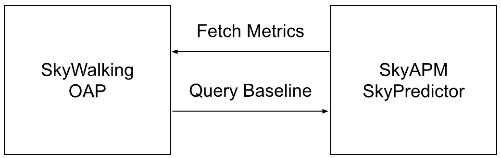
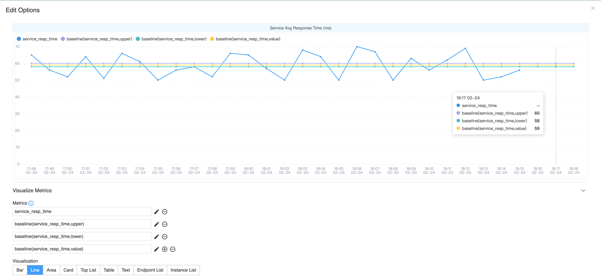

## Background

[Apache SkyWalking](https://skywalking.apache.org/) is an open-source application performance monitoring (APM) system
that collects various data from business applications, including metrics, logs, and distributed tracing information,
and visualizes them through its UI.
It also allows users to configure alerting rules by setting threshold values for specific metrics in the configuration file.
When a metric associated with a particular service exceeds the predefined threshold within a given period, an alert is triggered.

However, in real-world scenarios, traffic patterns and invocation behaviors vary across different time periods.
For example, in a shopping system, the number of purchases is significantly lower during late-night hours compared to daytime.
As a result, system metrics fluctuate within different ranges depending on the time of day.
This makes it challenging to rely solely on static threshold values for accurate alerting.

Therefore, dynamically generating thresholds for each time period based on historical data becomes crucial.

## Introduce SkyAPM SkyPredictor

Based on the above scenario, we developed the [SkyAPM SkyPredictor](https://github.com/SkyAPM/SkyPredictor/) project to fix this issue.
SkyAPM SkyPredictor periodically collects data from SkyWalking and generates dynamic baselines.
Meanwhile, SkyWalking queries from SkyPredictor to obtain predicted metric values for the recent period, enabling more precise and adaptive alerting.

NOTE: SkyWalking does not have a hard dependency on the SkyWalking Predictor service. 
If SkyPredictor is not configured, no predicted values would be retrieved, and not cause any failures in SkyWalking.
Additionally, you can use your own AI engine to build a custom prediction system. Simply implement the required protocol as outlined in the official documentation:
https://skywalking.apache.org/docs/main/next/en/setup/ai-pipeline/metrics-baseline-integration/

### Architecture diagram



As shown in the diagram, the process consists of two steps:

1. **Data Collection & Prediction**: The Predictor queries history metrics from SkyWalking's OAP via its HTTP service.
   Then processes this data to generate dynamic predicted values for a future time period.
2. **Baseline Query & Alerting**: The OAP periodically sends queries to the Predictor to fetch the predicted dynamic baseline.
   Then evaluates the current metric values with prediction result using **MQE**. If the deviation exceeds a certain threshold, an alert is triggered.

### Data Collection

The Predictor utilizes the following three APIs to query data:

1. [**Status API**](https://skywalking.apache.org/docs/main/next/en/status/query_ttl_setup/): Retrieves the TTL (Time-to-Live) of history data stored in OAP, helping to determine the available time range for exporting all history metrics.
2. [**Metadata API**](https://skywalking.apache.org/docs/main/next/en/api/query-protocol/#v2-apis): Fetches the list of services within a specified Layer from OAP, providing insights into which services are generating data.
3. [**MQE API**](https://skywalking.apache.org/docs/main/next/en/api/metrics-query-expression/): Iterates through the required metrics and the list of services to fetch all history metrics values for each metric associated with each service.

These APIs collectively enable the Predictor to gather history metrics data, which is then used to compute dynamic baselines for future alerting.

### Prediction

Once the Prediction service collects data from OAP, it proceeds with forecasting using the [open-source Prophet library](https://github.com/facebook/prophet).
The prediction process consists of the following steps:

1. **Data Preparation**: The collected metric data is split into multiple [DataFrames](https://pandas.pydata.org/docs/reference/api/pandas.DataFrame.html), each corresponding to a unique combination of service + metric name.
2. **Data Sufficiency Check**: If a DataFrame contains less than **two days** (configurable) of data, the prediction is skipped. This is to ensure accuracy, as an insufficient data volume may lead to unreliable forecasts.
3. **Forecasting**: Using Prophet, the Predictor estimates the metric values for **each hour over the next day** (configurable).
4. **Result Storage**: The generated predictions are stored in local files, enabling querying from external services.

#### Predicted Value

The Prediction service supports calculating the following two types of values:
1. **Predicted Value**: Computes the expected metric value for the next hour based on history metrics data.
2. **Prediction Range**: Determines the possible **upper and lower bounds** for the metric in the next hour, representing its expected fluctuation range.

These values help establish a dynamic baseline, allowing the alerting system to account for natural variations while accurately detecting anomalies.

### Baseline MQE with Alarm

In OAP, predicted values can be queried directly using an MQE within MQE operation. This operation enables retrieving forecasted values for a future time period.

Since SkyWalking's alerting system already supports query through MQE expressions, users can configure alerts directly in the alerting configuration file using MQE.

For more details, please refer to the [official documentation](https://skywalking.apache.org/docs/main/next/en/api/metrics-query-expression/#baseline-operation).

### Impact of Data Collection on Prediction Accuracy

The Predictor service supports two different data collection and prediction granularity, each with its own trade-offs in accuracy and resource consumption.

1. Minute Level: Collects minutes level metrics data.
   1. More effective for metrics with high fluctuations, as it captures finer details.
   2. Consumes more resources (OAP, DB CPU and System Load resources, Predictor CPU and Memory resources).
   3. Alerts are configured based on current value comparisons.
2. Hour Level: Collects hourly metrics data.
   1. Less resource-intensive compared to minute-level collection.
   2. Less data volume, resource, and processing cost.
   3. Alerts are configured based on predicted range values.

| Granularity | Data Fluctuation   | Data Volume | Current Value Prediction Accuracy  | Range Prediction Accuracy | Best Use Case                                                          |
|-------------|--------------------|-------------|------------------------------------|---------------------------|------------------------------------------------------------------------|
| Minute      | Higher fluctuation | Large       | Less accurate                      | More accurate             | Ideal for highly fluctuating metrics, using range-based alerting rules |
| Hour        | Lower fluctuation  | Small       | More accurate                      | Relatively accurate       | Suitable for stable metrics, using current value-based predictions     |


Choosing the appropriate granularity depends on the nature of the metric and the desired alerting method.
For metrics with high volatility, minute-level collection provides better accuracy when using range-based alerts.
For stable metrics, hourly aggregation is sufficient and allows for efficient predictions using current-value comparisons.

Predict use Hourly level by default.

### OAP and Predictor Scheduling & Caching

Both SkyWalking OAP and SkyAPM Predictor implement caching strategies to prevent excessive execution and optimize resource usage.

By default, Predictor runs at 00:10, 08:10, and 16:10 every day. It forecasts the next 24 hours and stores the results locally.
Updating predictions every 8 hours balances resource efficiency and real-time accuracy. The 10-minute delay 
(instead of running at exactly 00:00, 08:00, etc.) ensures historical data is fully written to the database before querying.

OAP queries Predictor for all required predicted metrics of a single service. The query covers a ±24-hour time range from the current moment.
Results are cached for one hour to reduce redundant queries and improve efficiency.

These mechanisms ensure that predictions remain up-to-date, while minimizing unnecessary processing and system load.

## Demo

In this section, I will demonstrate how to preview the predicted values of a metric by deploying a SkyWalking cluster along with the Predictor service
in a Kubernetes cluster. This hands-on example will help you understand how to use these components effectively.

### Deploy SkyWalking Showcase

SkyWalking Showcase contains a complete set of example services and can be monitored using SkyWalking.
For more information, please check the [official documentation](https://skywalking.apache.org/docs/skywalking-showcase/next/readme/).

In this demo, we only deploy the predictor service, SkyWalking OAP, and UI.

```shell
export FEATURE_FLAGS=single-node,banyandb,baseline
make deploy.kubernetes
```

### Import History Data

Since a newly deployed cluster does not contain history data,
I have created a Python script to simulate data. This allows the Predictor service to import data and generate baseline predictions for a future period.

Before importing data, you must expose the `11800` port of the OAP service in your Kubernetes cluster.
You can achieve this using kubectl by running the following command:

```shell
kubectl port-forward -n skywalking-showcase   service/demo-oap 11800:11800
```

Then, you can download and run the demo script using the following command:

```shell
# clone and get into the demo repository
git clone https://github.com/mrproliu/SkyPredictorDemo && cd SkyPredictorDemo
# installing dependencies
make install
# import data(7 days)
python3 -m client.generate localhost:11800 7
```

Finally, you can see the output in the console: **Metrics send success!**.

### Prediction metrics

Since the Predictor service runs based on a **cron schedule**, it does not automatically execute immediately after data import.
To force it to collect data and perform a prediction, you can manually delete the Predictor pod, prompting Kubernetes to restart it:

```shell
kubectl delete pod -n skywalking-showcase $(kubectl get pods -n skywalking-showcase --no-headers -o custom-columns=":metadata.name" | grep "skywalking-predictor")
```

Once the Predictor pod restarts, you can check its logs to confirm that the prediction process has been completed.

```
Predicted for e2e-test-dest-service of service_xxx to xxxx-xx-xx xx:xx:xx.
```

### View in SkyWalking UI

Once the prediction process is complete, you can visualize the predicted values in the SkyWalking UI by configuring the appropriate metric widgets.

First, Run the following command to forward the UI service port to your local machine:

```shell
kubectl port-forward svc/demo-ui 8080:80 --namespace skywalking-showcase
```

Then, you can access this page to view the service traffic that was generated using the Python script earlier:
http://localhost:8080/dashboard/MESH/Service/ZTJlLXRlc3QtZGVzdC1zZXJ2aWNl.1/Mesh-Service

To display predicted values, edit the Service Avg Resp Time Widget and add the following MQE:

```
# The maximum predicted response time.
baseline(service_resp_time, upper)
# The predicted response time.
baseline(service_resp_time, value)
# The minimum predicted response time.
baseline(service_resp_time, lower)
```

Finally, you can see the predicted values displayed in the widget.



Since the default data collection is hourly and the metric has significant fluctuations,
the predicted values are derived from hourly averages rather than minute-level granularity.
This approach smooths out fluctuations and provides a more stable baseline for monitoring.

Now, you should see the predicted response times visualized alongside actual values, helping you analyze trends and configure dynamic alerting thresholds effectively.

## Conclusion

SkyAPM SkyPredictor enhances alert accuracy by using dynamic baselines instead of static thresholds.
It collects history metrics data, forecasts future values with Prophet, and supports minute or hour-level collection for better precision.
By integrating predictions into SkyWalking UI, users can optimize alerting and improve system observability.

By integrating dynamic thresholds, SkyWalking can adapt to traffic patterns and detect anomalies more effectively,
reducing false positives and improving system observability.
