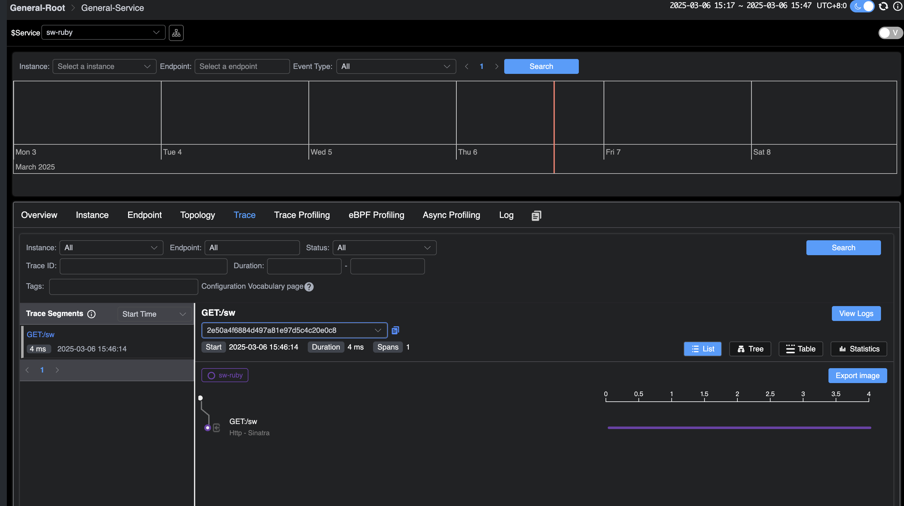
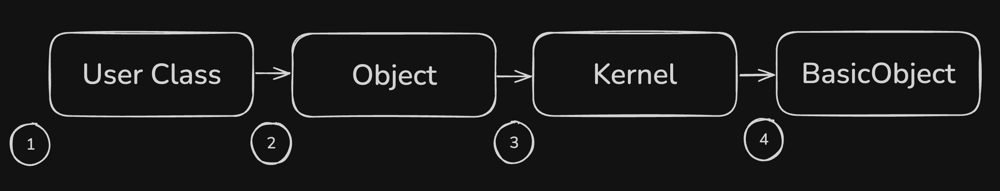

## Background

Ruby is a dynamic, object-oriented programming language with concise and elegant syntax, supporting multiple programming
paradigms, including object-oriented, functional, and metaprogramming. Leveraging its powerful metaprogramming
capabilities, Ruby allows modifying the behavior of classes and objects at runtime.
SkyWalking provides a [Ruby gem](https://rubygems.org/gems/skywalking) to facilitate integration with Ruby projects, and
this gem supports many out-of-the-box frameworks and gems.

This article is based on skywalking-ruby-v0.1. We will guide you on how to quickly integrate the skywalking-ruby project
into Ruby projects and briefly introduce the implementation principle of SkyWalking Ruby's auto-instrumentation plugins using
redis-rb as an example.

The demonstration includes the following steps:

1. **Deploy SkyWalking**: This involves setting up the SkyWalking backend and UI programs to enable you to 
   see the final results.
2. **Integrate SkyWalking into Different Ruby Projects**: This section explains how to integrate SkyWalking into
   different Ruby projects.
3. **Application Deployment**: You will export environment variables and deploy the application to facilitate
   communication between your service and the SkyWalking backend.
4. **Visualization on SkyWalking UI**: Finally, you will send requests and observe the results in the SkyWalking UI.

## Deploy SkyWalking

Please download the SkyWalking APM program from the official SkyWalking website, 
and then you can start all the required services using the [quick start script](https://skywalking.apache.org/docs/main/next/en/setup/backend/backend-docker/#start-the-storage-oap-and-booster-ui-with-docker-compose).

Next, you can access the address http://localhost:8080/. At this point, since no applications have been deployed, you
will not see any data.

Integrate SkyWalking into Different Ruby Projects
It is recommended to use [Bundler](https://bundler.io/) to install and manage SkyWalking dependencies. Simply declare it in the Gemfile and run
bundle install to complete the installation.

```bash
# Gemfile
source "https://rubygems.org"

gem "skywalking"
```

### Integration in Rails Projects

For Rails projects, it is recommended to use the following command to automatically generate the configuration file:

```bash
bundle exec rails generate skywalking:start
```

This command will automatically generate a `skywalking.rb` file in the `config/initializers` directory, where you can
configure the startup parameters.

### Integration in Sinatra Projects

For Sinatra projects, you need to manually call `Skywalking.start` when the application starts. For example:

```ruby
require 'sinatra'
require 'skywalking'

Skywalking.start

get '/sw' do
  "Hello SkyWalking!"
end
```

In the Gemfile, place skywalking after sinatra and use `Bundler.require` during initialization, or call 
`require 'skywalking'` after the sinatra gem is loaded. Note that the skywalking gem needs to be placed after 
other gems (such as redis, elasticsearch).

## Application Deployment

Before starting the application deployment, you can change the service name of the current application in SkyWalking
through environment variables. You can also modify its configuration, such as the server-side address. For more details,
please refer to the [documentation](https://skywalking.apache.org/docs/skywalking-ruby/next/en/setup/quick-start/#configuration).

Here, we will change the current service name to `sw-ruby`.

Next, you can start the application. Here is an example using `sinatra`:

```bash
export SW_AGENT_SERVICE_NAME=sw-ruby

ruby sinatra.rb
```

## Visualization on SkyWalking UI

Now, send requests to the application and observe the results in the SkyWalking UI.

After a few seconds, revisit the SkyWalking UI at http://localhost:8080. You will be able to see the deployed `demo`
service on the homepage.


Additionally, on the tracing page, you can see the request you just sent.



## Plugin Implementation Mechanism

To understand the implementation mechanism of Ruby Agent's auto-instrumentation plugins, it is essential to understand the concept
of the ancestor chain in Ruby. The ancestor chain is an ordered list, and in Ruby, each class or module has an ancestor
chain that includes all its parent classes and mixin modules (modules mixed in via include, prepend, or extend).
When Ruby looks up a method, it searches in the order of the ancestor chain until it finds the target method or throws a
`NoMethodError`.

```ruby
class User
end
```

We have defined a User class, and its ancestor chain is as shown in the following figure:



Next, mix in a module using the `prepend` method:

```ruby
module Dapper
  def brave
    "Hello from brave"
  end
end

class User
  prepend Dapper
end

p User.new.brave # => "Hello from brave"
```

`prepend` will insert at position 1 in the above figure. Ruby first looks for the brave method in the Dapper module, finds
it, and calls it. If the brave method is not found in Dapper, Ruby continues to search in the User class. If it is not
found in the User class, Ruby continues to search in Object, and so on.

Based on this mechanism, let's briefly introduce how we instrument the [redis-rb](https://github.com/redis-rb/redis-client) method. 
The following code is the target method to be instrumented:

```ruby
# lib/redis/client.rb
class Redis
  class Client < ::RedisClient
    def call_v(command, &block)
      super(command, &block)
    rescue ::RedisClient::Error => error
      Client.translate_error!(error)
    end
  end
end
```

Below is the core code for instrumentation:

```ruby
module Skywalking
  module Plugins
    class Redis5 < PluginsManager::SWPlugin
      module Redis5Intercept
        def call_v(args, &block)
          operation = args[0] rescue "UNKNOWN"
          return super if operation == :auth

          Tracing::ContextManager.new_exit_span(
            operation: "Redis/#{operation.upcase}"
          ) do |span|
            # Omitted handling of span 
            super(args, &block) # Call the original method
          end
        end
      end

      def install
        ::Redis::Client.prepend Redis5Intercept
      end
    end
  end
end
```

Here, we define a Redis5Intercept module and prepend it to `::Redis::Client`. According to Ruby's method lookup mechanism,
when the `call_v` method of `Redis::Client` is called, Ruby will first execute the `call_v` method in `Redis5Intercept`. The
order of the ancestor chain is as follows:

```markdown
Redis5Intercept -> Redis::Client -> ... (other parent classes and modules)
```

At the same time, in the `call_v` method of `Redis5Intercept`, `super(args, &block)` will find the next method with the same
name along the ancestor chain, which in this case is the original `call_v` method in `Redis::Client`, while passing the
original arguments and block.

## Conclusion

This article explained the integration methods of SkyWalking Ruby in Ruby projects and briefly introduced the
implementation mechanism of SkyWalking Ruby's auto-instrumentation plugins.

Currently, the Ruby auto-instrumentation is in the early stages of development. In the future, we will continue to expand the
functionality of SkyWalking Ruby and add support for more plugins. So, stay tuned!