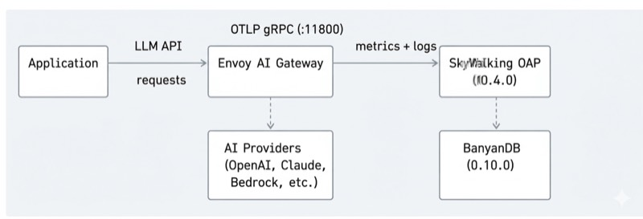
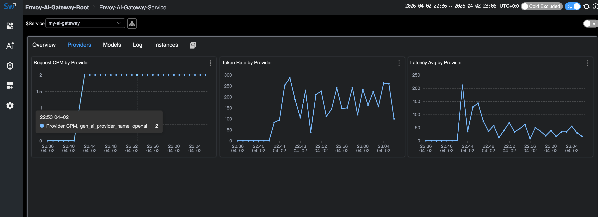

## The Problem: Flying Blind with LLM Traffic

LLM traffic is becoming a first-class citizen in production infrastructure. Teams are calling OpenAI, Anthropic,
AWS Bedrock, Azure OpenAI, Google Gemini — often multiple providers at once. But most organizations have
no unified visibility into this traffic:

- **Token costs spiral** without knowing which teams, models, or providers drive the spend.
  A single misconfigured prompt template can burn through thousands of dollars before anyone notices.
- **Provider outages cause cascading failures.** When OpenAI has a bad hour, your application goes down
  with it — and you have no failover visibility to understand what happened or switch providers automatically.
- **No unified metrics** across heterogeneous LLM calls. Latency, Time to First Token (TTFT),
  Time Per Output Token (TPOT), token usage, error rates — each provider reports these differently,
  if at all. There is no single dashboard to compare them.

This is the same observability gap that microservices faced a decade ago. The solution then was
service meshes and API gateways with built-in telemetry. For AI workloads, the answer is an AI gateway.

## Why an AI Gateway

[Envoy AI Gateway](https://aigateway.envoyproxy.io/) is an open-source AI gateway built on top of
[Envoy Proxy](https://www.envoyproxy.io/) and [Envoy Gateway](https://gateway.envoyproxy.io/).
It is not a standalone SaaS product or a Python proxy — it is infrastructure-grade software built on
the same Envoy that already handles traffic for a large portion of cloud-native deployments.

Key capabilities:

- **Multi-provider routing** — supports 16+ AI providers (OpenAI, Anthropic, AWS Bedrock, Azure OpenAI,
  Google Gemini, Mistral, Cohere, DeepSeek, and more) behind a unified API.
- **Token-based rate limiting** — rate limit by token consumption, not just request count.
- **Provider fallback** — automatic failover when a provider is down or slow.
- **Model virtualization** — abstract model names so applications are decoupled from specific providers.
- **Two-tier architecture** — a reference architecture with a centralized entry gateway (Tier 1) for
  auth and global routing, and per-cluster gateways (Tier 2) for inference optimization.
- **CNCF ecosystem native** — runs on Kubernetes, composes with existing Envoy filters, WASM plugins,
  and standard Kubernetes Gateway API resources.

Because Envoy AI Gateway natively emits GenAI metrics and access logs via OTLP following
[OpenTelemetry GenAI Semantic Conventions](https://opentelemetry.io/docs/specs/semconv/gen-ai/),
it plugs directly into any OpenTelemetry-compatible backend.

Starting from SkyWalking 10.4.0, the OAP server natively receives and analyzes Envoy AI Gateway's
OTLP metrics and access logs — no OpenTelemetry Collector needed in between.

## Data Flow

The AI Gateway pushes telemetry directly to SkyWalking via OTLP gRPC:



1. **Application** sends LLM API requests through the Envoy AI Gateway.
2. **Envoy AI Gateway** routes requests to AI providers (or local models like Ollama)
   and records GenAI metrics (token usage, latency, TTFT, TPOT) and access logs.
3. The gateway pushes metrics and logs via **OTLP gRPC** directly to **SkyWalking OAP** on port 11800.
4. SkyWalking OAP parses metrics with MAL rules and access logs with LAL rules,
   then stores everything in **BanyanDB**.

No OpenTelemetry Collector is needed. SkyWalking OAP's built-in OTLP receiver handles everything.

## Try It Locally

This demo uses [Ollama](https://ollama.com/) as a local LLM backend so you can try
everything without an API key. The [Envoy AI Gateway CLI](https://github.com/envoyproxy/ai-gateway/tree/main/cmd/aigw)
(`aigw`) provides a standalone mode that runs outside Kubernetes — perfect for local testing.

### Prerequisites

- Docker and Docker Compose
- [Ollama](https://ollama.com/) installed on your host

### Step 1: Start Ollama

Start Ollama on all interfaces so Docker containers can reach it:

```bash
OLLAMA_HOST=0.0.0.0 ollama serve
```

Pull a small model for testing:

```bash
ollama pull llama3.2:1b
```

### Step 2: Start the Stack

Create a `docker-compose.yaml`:

```yaml
services:
  banyandb:
    image: apache/skywalking-banyandb:0.10.0
    container_name: banyandb
    ports:
      - "17912:17912"
    command: standalone --stream-root-path /tmp/stream-data --measure-root-path /tmp/measure-data
    healthcheck:
      test: ["CMD-SHELL", "wget -qO- http://localhost:17913/api/healthz || exit 1"]
      interval: 5s
      timeout: 3s
      retries: 10

  oap:
    image: apache/skywalking-oap-server:10.4.0
    container_name: oap
    depends_on:
      banyandb:
        condition: service_healthy
    ports:
      - "11800:11800"
      - "12800:12800"
    environment:
      SW_STORAGE: banyandb
      SW_STORAGE_BANYANDB_TARGETS: banyandb:17912
    healthcheck:
      test: ["CMD-SHELL", "bash -c 'echo > /dev/tcp/localhost/12800' || exit 1"]
      interval: 10s
      timeout: 5s
      retries: 30
      start_period: 60s

  ui:
    image: apache/skywalking-ui:10.4.0
    container_name: ui
    depends_on:
      oap:
        condition: service_healthy
    ports:
      - "8080:8080"
    environment:
      SW_OAP_ADDRESS: http://oap:12800

  aigw:
    image: envoyproxy/ai-gateway-cli:latest
    container_name: aigw
    depends_on:
      oap:
        condition: service_healthy
    environment:
      - OPENAI_BASE_URL=http://host.docker.internal:11434/v1
      - OPENAI_API_KEY=unused
      - OTEL_SERVICE_NAME=my-ai-gateway
      - OTEL_EXPORTER_OTLP_ENDPOINT=http://oap:11800
      - OTEL_EXPORTER_OTLP_PROTOCOL=grpc
      - OTEL_METRICS_EXPORTER=otlp
      - OTEL_LOGS_EXPORTER=otlp
      - OTEL_METRIC_EXPORT_INTERVAL=5000
      - OTEL_RESOURCE_ATTRIBUTES=job_name=envoy-ai-gateway,service.instance.id=aigw-1,service.layer=ENVOY_AI_GATEWAY
    ports:
      - "1975:1975"
    extra_hosts:
      - "host.docker.internal:host-gateway"
    command: ["run"]
```

Start everything:

```bash
docker compose up -d
```

Wait for all services to become healthy (BanyanDB starts first, then OAP, then UI and AI Gateway):

```bash
docker compose ps
```

The key OTLP configuration on the `aigw` service:

| Env Var | Value | Purpose |
|---------|-------|---------|
| `OTEL_SERVICE_NAME` | `my-ai-gateway` | Service name in SkyWalking |
| `OTEL_EXPORTER_OTLP_ENDPOINT` | `http://oap:11800` | SkyWalking OAP gRPC endpoint |
| `OTEL_EXPORTER_OTLP_PROTOCOL` | `grpc` | OTLP transport |
| `OTEL_METRICS_EXPORTER` | `otlp` | Enable metrics push |
| `OTEL_LOGS_EXPORTER` | `otlp` | Enable access log push |

The `OTEL_RESOURCE_ATTRIBUTES` must include:
- `job_name=envoy-ai-gateway` — routing tag for MAL/LAL rules
- `service.instance.id=<id>` — instance identity
- `service.layer=ENVOY_AI_GATEWAY` — routes logs to AI Gateway LAL rules

The MAL and LAL rules are enabled by default in SkyWalking OAP. No OAP-side configuration is needed.

### Step 3: Run the Demo App

Create a simple Python application that sends requests through the AI Gateway (`app.py`).
It mixes normal requests, streaming requests (for TTFT/TPOT metrics), and error requests
(non-existent model → HTTP 404, always captured by the LAL sampling policy):

```python
import time, random, requests

GATEWAY = "http://localhost:1975"
HEADERS = {"Authorization": "Bearer unused", "Content-Type": "application/json"}

questions = [
    "What is Apache SkyWalking? Answer in one sentence.",
    "What is Envoy Proxy used for? Answer in one sentence.",
    "What are the benefits of an AI gateway? Answer in two sentences.",
    "Explain observability in three sentences.",
]

def chat(model, question, stream=False):
    resp = requests.post(
        f"{GATEWAY}/v1/chat/completions",
        json={"model": model, "messages": [{"role": "user", "content": question}], "stream": stream},
        headers=HEADERS, timeout=60, stream=stream,
    )
    if stream:
        chunks = []
        for line in resp.iter_lines():
            if line:
                chunks.append(line.decode())
        return resp.status_code, f"[streamed {len(chunks)} chunks]"
    return resp.status_code, resp.json()

while True:
    r = random.random()
    if r < 0.2:
        # Error request: non-existent model triggers 404
        status, body = chat("non-existent-model", "hello")
        print(f"[error] model=non-existent-model status={status}")
    elif r < 0.5:
        # Streaming request — generates TTFT and TPOT metrics
        q = random.choice(questions)
        status, info = chat("llama3.2:1b", q, stream=True)
        print(f"[stream] status={status} {info}")
    else:
        # Normal non-streaming request
        q = random.choice(questions)
        status, body = chat("llama3.2:1b", q)
        answer = body.get("choices", [{}])[0].get("message", {}).get("content", "")[:80]
        tokens = body.get("usage", {})
        print(f"[ok] status={status} tokens={tokens} answer={answer}...")
    time.sleep(random.randint(20, 30))
```

Run it:

```bash
pip install requests
python app.py
```

The application talks to the AI Gateway on port 1975, which routes to Ollama.
Each request generates GenAI metrics (token usage, latency, TTFT, TPOT) and access logs
that the gateway pushes to SkyWalking via OTLP.

The error requests (non-existent model → HTTP 404) are always captured by the access log
sampling policy, so you will see them in the SkyWalking log view.

### Step 4: View in SkyWalking UI

Open [http://localhost:8080](http://localhost:8080) and select the **GenAI > Envoy AI Gateway** menu.

The service list shows `my-ai-gateway` with CPM, latency, and token rates at a glance:


Click into the service to see the full dashboard — Request CPM, Latency (average + percentiles),
Input/Output Token Rates, TTFT, and TPOT:


The **Providers** tab breaks down metrics by AI provider:



The **Models** tab shows per-model metrics including TTFT and TPOT (streaming only).
Note the `unknown` model entries — these are the error requests with non-existent models:


The **Log** tab shows access logs. The sampling policy drops normal successful responses
but always captures errors (HTTP 404) and high-token requests:


### Cleanup

```bash
docker compose down
```

## Deploying on Kubernetes

For production deployments, Envoy AI Gateway runs as a full Kubernetes controller with
Envoy Gateway as the control plane. See the
[Envoy AI Gateway getting started guide](https://aigateway.envoyproxy.io/docs/getting-started/)
for Kubernetes installation.

The OTLP configuration is the same — set the `OTEL_*` environment variables on the
AI Gateway's external processor to point at SkyWalking OAP's gRPC port (11800).
See the [SkyWalking Envoy AI Gateway Monitoring](https://skywalking.apache.org/docs/main/next/en/setup/backend/backend-envoy-ai-gateway-monitoring/)
documentation for details.

## GenAI Observability Without an AI Gateway

Not every deployment uses an AI gateway. If your applications call LLM providers directly,
SkyWalking 10.4.0 also provides GenAI observability through the
[Virtual GenAI](https://skywalking.apache.org/docs/main/next/en/setup/service-agent/virtual-genai/) layer.

This works with any SkyWalking-instrumented, OpenTelemetry-instrumented, or Zipkin-instrumented application.
When traces carry `gen_ai.*` tags (following
[OpenTelemetry GenAI Semantic Conventions](https://opentelemetry.io/docs/specs/semconv/gen-ai/)),
SkyWalking derives per-provider and per-model metrics from the client side:
latency, token usage, success rate, and estimated cost.

For Java applications, the SkyWalking Java Agent (9.7+) includes a Spring AI plugin that automatically
instruments calls to 13+ providers (OpenAI, Anthropic, AWS Bedrock, Google GenAI, DeepSeek, Mistral, etc.)
with the correct `gen_ai.*` span tags — no code changes needed.

This is a different use case from the Envoy AI Gateway monitoring covered above:

- **Envoy AI Gateway layer**: infrastructure-level observability — what the gateway sees across all traffic.
  Best for platform teams managing centralized AI routing.
- **Virtual GenAI layer**: application-level observability — what each instrumented app sees for its own LLM calls.
  Best for teams without a centralized gateway, or for per-application cost tracking.

## References

- [Envoy AI Gateway](https://aigateway.envoyproxy.io/) — project site and documentation
- [Envoy AI Gateway CLI](https://github.com/envoyproxy/ai-gateway/tree/main/cmd/aigw) — standalone mode for local development
- [SkyWalking Envoy AI Gateway Monitoring](https://skywalking.apache.org/docs/main/next/en/setup/backend/backend-envoy-ai-gateway-monitoring/) — OAP setup doc
- [SkyWalking Virtual GenAI](https://skywalking.apache.org/docs/main/next/en/setup/service-agent/virtual-genai/) — client-side GenAI observability
- [OpenTelemetry GenAI Semantic Conventions](https://opentelemetry.io/docs/specs/semconv/gen-ai/) — the metric/attribute standard both projects follow
