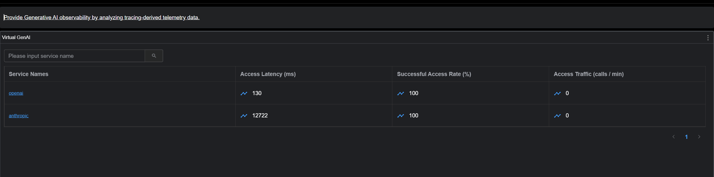
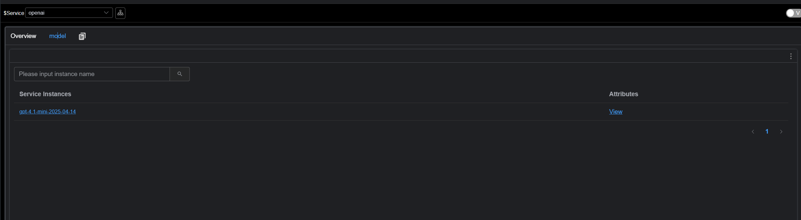

# The Problem: As Applications "Consume" LLMs, Monitoring Leaves a Blind Spot

With the deep penetration of Generative AI (GenAI) into enterprise workflows, developers face a challenging paradox: while powerful LLM capabilities are easily integrated via `Spring AI` or `OpenAI SDKs`, the actual performance and reliability of these calls remain largely invisible.

### 1. The "Black Box" of Cost and Performance: Is the Expensive Model Worth It?
Facing high LLM bills, organizations often only see a total sum paid to a provider, but cannot calculate the "ROI" within the application.
* **Blind Upgrades:** You might switch to a premium flagship model for a better experience. But in your specific business scenario, does paying several times more per token actually yield lower latency or a faster **TTFT (Time to First Token)**?
* **Lack of Real-World Benchmarks:** Official benchmarks mean little without your real-world business requests. You need to know which model achieves the perfect balance between "Token/Cost Consumption" and "Response Speed" under your actual prompt lengths and concurrency levels.

### 2. The Vanishing "Golden Timeout"
Many teams set timeouts for LLM calls arbitrarily (e.g., 30s or 60s).
* **Too Short:** During peak periods or long-text generation, requests are frequently interrupted, causing business failure rates to soar.
* **Too Long:** If a provider hangs, requests pile up in memory, blocking execution threads and potentially leading to the collapse of the entire Java application or microservice cluster.
  Only by mastering the **P99/P95 Latency** can you set rational timeout policies based on data rather than intuition.

### 3. The Overlooked Experience Killer: TTFT
In GenAI scenarios, a user's perception of speed depends less on the total duration of the conversation and more on **"when the first word appears."** * A streaming response with a 10s total duration but a **500ms TTFT** feels instantaneous.
* A non-streaming response with a 5s total duration but a **4s TTFT** feels "frozen."
  If your observability system only tracks total latency, you miss the core UX metric that explains why users complain about "AI slowness."

---

**SkyWalking 10.4: A "Digital Dashboard"**  
From the Application Perspective The **Virtual GenAI** capability introduced in Apache SkyWalking 10.4 fills this "observability vacuum." It avoids reliance on external gateways by using application-side probes (like the Java Agent) to collect the most authentic data from the client's perspective.

* **Precise Latency Distribution:** Multi-dimensional metrics (P50, P90, P99) help visualize LLM fluctuations to inform dynamic timeout strategies.
* **Core UX Metric — TTFT Monitoring:** Native support for first-token latency in streaming calls.
* **Multi-dimensional Model Profiling:** Aligns token usage, estimated cost, and performance across Providers and Models, helping you choose the most cost-effective solution for your specific needs.

---

# Virtual GenAI Observability

> **Virtual GenAI** represents Generative AI service nodes detected by probe plugins. All performance metrics are based on the **GenAI Client Perspective**.

For instance, the **Spring AI plugin** in the Java Agent detects the response latency of a Chat Completion request. SkyWalking then visualizes these in the dashboard:
* **Traffic & Success Rate** (CPM & SLA)
* **Latency & TTFT**
* **Token Usage** (Input/Output)
* **Estimated Cost**

**Screenshots:**






# How It Works

When the SkyWalking Java Agent or OTLP probes intercept calls to mainstream AI frameworks (e.g., Spring AI, OpenAI SDK), they report Trace data to the SkyWalking OAP.
The OAP aggregates and computes this data to generate performance metrics for both **Providers** and **Models**, which are then rendered in the built-in Virtual-GenAI dashboards.

# Installation & Configuration

## Requirements
* **SkyWalking Java Agent:** >= 9.7
* **SkyWalking OAP:** >= 10.4

## Semantic Conventions & Compatibility
SkyWalking Virtual GenAI follows **OpenTelemetry GenAI Semantic Conventions**. OAP identifies GenAI-related Spans based on:

### SkyWalking Java Agent
* Spans must be of type Exit, have the SpanLayer attribute set to GENAI, and contain the gen_ai.response.model tag.

### OTLP / Zipkin Probes
* Spans must contain the `gen_ai.response.model` tag.

For details, refer to the E2E configurations:
* [SkyWalking Java Agent Reporting](https://github.com/apache/skywalking/blob/master/test/e2e-v2/cases/virtual-genai/docker-compose.yml)
* [Probe Reporting OTLP Data](https://github.com/apache/skywalking/blob/master/test/e2e-v2/cases/otlp-virtual-genai/docker-compose.yml)
* [Probe Reporting Zipkin Data](https://github.com/apache/skywalking/blob/master/test/e2e-v2/cases/zipkin-virtual-genai/docker-compose.yml)

---

# GenAI Estimated Cost Configuration

## Overview
SkyWalking provides a built-in [GenAI Billing Configuration File](https://github.com/apache/skywalking/blob/master/oap-server/server-starter/src/main/resources/gen-ai-config.yml).

This file defines how SkyWalking maps model names from Trace data to their corresponding providers and estimates the token cost for each LLM call. The estimated cost is displayed in the SkyWalking UI alongside trace and metric data, helping users intuitively understand the financial impact of their GenAI usage.

> **Important:** The pricing in this file is intended for cost estimation only and must not be treated as actual billing or invoice amounts. Users are advised to regularly verify the latest rates on the providers' official pricing pages.

## Configuration Structure

### Top-level Fields
| Field | Type | Description |
| :--- | :--- | :--- |
| `last-updated` | `date` | The last update date of the pricing data. All prices are based on public billing standards announced by providers prior to this date. |
| `providers` | `list` | List of GenAI provider definitions. Each entry contains matching rules and specific model pricing information. |

### Provider Definition
Each entry under `providers` defines a GenAI provider:
```yaml
providers:
- provider: <provider-name>
  prefix-match:
    - <prefix-1>
    - <prefix-2>
  models:
    - name: <model-name>
      aliases: [<alias-1>, <alias-2>]
      input-estimated-cost-per-m: <cost>
      output-estimated-cost-per-m: <cost>
```

| Field | Type | Required | Description |
| :--- | :--- | :--- | :--- |
| `provider` | `string` | Yes | The provider identifier (e.g., `openai`, `anthropic`, `gemini`). It is displayed as the Virtual GenAI service name in SkyWalking. |
| `prefix-match` | `list[string]` | Yes | A list of prefixes used to match model names to this provider. If a model name in the Trace data starts with any of these prefixes, it will be mapped to this provider. |
| `models` | `list[model]` | No | A list of model definitions containing pricing information. If omitted, the system can still identify the provider but will not perform cost estimation. |

### Model Definition
Each entry under `models` defines the pricing for a specific model:

| Field | Type | Required | Description |
| :--- | :--- | :--- | :--- |
| `name` | `string` | Yes | The standard model name used for matching. |
| `aliases` | `list[string]` | No | Alternative names that should resolve to the same billing entry. This is useful when providers use different naming conventions (see the "Model Aliases" section). |
| `input-estimated-cost-per-m` | `float` | No | Estimated cost per 1,000,000 (one million) input (Prompt) tokens. The default unit is USD. |
| `output-estimated-cost-per-m` | `float` | No | Estimated cost per 1,000,000 (one million) output (Completion) tokens. The default unit is USD. |

## Model Matching Mechanism
### Provider-Level Prefix Matching
When SkyWalking receives a Trace containing a GenAI call, it determines the **Provider** based on the following priority order:

1. **`gen_ai.provider.name` tag**: This tag is retrieved first. It follows the latest `OpenTelemetry` GenAI semantic conventions.
2. **`gen_ai.system` tag**: If the above tag is missing, the system falls back to this legacy tag. Note: This tag is only parsed when processing OTLP or Zipkin format data, primarily for compatibility with older versions of libraries like the Python auto-instrumentation.
3. **Prefix Matching**: If neither of the above tags exists, `SkyWalking` reads the `prefix-match` rules defined in `gen-ai-config.yml` and attempts to identify the provider by matching the **Model Name**.

```yaml
- provider: openai
  prefix-match:
    - gpt
```
Any model name starting with **gpt** (such as **gpt-4o**, **gpt-4.1-mini**, or **gpt-5-nano**) will be mapped to the **openai** provider.
A single provider can have multiple prefixes:
```yaml
- provider: tencent
  prefix-match:
    - hunyuan
    - Tencent
```
### Model-level Longest-Prefix Matching
Once the provider is determined, SkyWalking uses a Trie-based longest-prefix matching algorithm to find the best billing entry. This is crucial because model names returned in provider API responses often include version numbers or timestamps, differing from the base model name in the config.
Example OpenAI config:
```yaml
models:
- name: gpt-4o
  input-estimated-cost-per-m: 2.5
  output-estimated-cost-per-m: 10.0
- name: gpt-4o-mini
  input-estimated-cost-per-m: 0.15
  output-estimated-cost-per-m: 0.6
```
Matching behavior:

| Model Name in Trace | Matched Configuration Entry | Reason |
| :--- | :--- | :--- |
| `gpt-4o` | `gpt-4o` | Exact match |
| `gpt-4o-2024-08-06` | `gpt-4o` | Longest prefix is `gpt-4o` |
| `gpt-4o-mini` | `gpt-4o-mini` | Exact match (Longer prefix `gpt-4o-mini` takes priority over `gpt-4o`) |
| `gpt-4o-mini-2024-07-18` | `gpt-4o-mini` | Longest prefix is `gpt-4o-mini` |

This mechanism ensures versioned API model names map to the correct pricing tier without requiring exact full names in the configuration file.

### Model Aliases
Some providers use different naming conventions across API responses and documentation. For example, Anthropic's model might appear as `claude-4-sonnet` or `claude-sonnet-4`. The aliases field supports both formats under a single billing entry:
```yaml
- name: claude-4-sonnet
  aliases: [claude-sonnet-4]
  input-estimated-cost-per-m: 3.0
  output-estimated-cost-per-m: 15.0
```

Under this configuration, `claude-4-sonnet` and `claude-sonnet-4` (as well as any versioned variants, such as `claude-sonnet-4-20250514`) will resolve to the same **billing entry**.  
**Note:** Aliases also participate in **longest prefix matching**. Therefore, `claude-sonnet-4-20250514` will match the alias `claude-sonnet-4`, which in turn resolves to the pricing information for `claude-4-sonnet`.

## Custom Configuration
### Adding a New Provider
To add a provider that is not included in the default configuration:

```yaml
providers:
# ... Existing providers ...

- provider: ollama
  prefix-match:
    - mymodel
  models:
    - name: mymodel-large
      input-estimated-cost-per-m: 1.0
      output-estimated-cost-per-m: 5.0
    - name: mymodel-small
      input-estimated-cost-per-m: 0.1
      output-estimated-cost-per-m: 0.5
```

For OTLP/Zipkin data, a dedicated estimated tag has been added. You can now view the cost of each GenAI call directly on the UI.


#   Main Metrics
## 1.Provider Level

| Metric ID | Description | Meaning |
| :--- | :--- | :--- |
| `gen_ai_provider_cpm` | Calls Per Minute | Requests per minute (Throughput) |
| `gen_ai_provider_sla` | Success Rate | Request success rate |
| `gen_ai_provider_resp_time` | Avg Response Time | Average response time |
| `gen_ai_provider_latency_percentile` | Latency Percentiles | Response time percentiles (P50, P75, P90, P95, P99) |
| `gen_ai_provider_input_tokens_sum/avg` | Input Token Usage | Total and average input token usage |
| `gen_ai_provider_output_tokens_sum/avg` | Output Token Usage | Total and average output token usage |
| `gen_ai_provider_total_estimated_cost/avg` | Estimated Cost | Total estimated cost and average cost per call |

## 2. Model Level

| Metric ID | Description | Meaning |
| :--- | :--- | :--- |
| `gen_ai_model_call_cpm` | Calls Per Minute | Requests per minute for this specific model |
| `gen_ai_model_sla` | Success Rate | Model-specific request success rate |
| `gen_ai_model_latency_avg/percentile` | Latency | Average and percentiles of model response duration |
| `gen_ai_model_ttft_avg/percentile` | TTFT | Time to First Token (Streaming only) |
| `gen_ai_model_input_tokens_sum/avg` | Input Token Usage | Detailed input token consumption for the model |
| `gen_ai_model_output_tokens_sum/avg` | Output Token Usage | Detailed output token consumption for the model |
| `gen_ai_model_total_estimated_cost/avg` | Estimated Cost | Estimated total cost and average cost for the model |

## Recommended Usage Scenarios

* Performance Evaluation: Use Latency and Time to First Token (TTFT) metrics to analyze model inference efficiency and the end-user interaction experience.
* Token Monitoring: Real-time monitoring of Input and Output token consumption to analyze resource utilization across different business scenarios.
* Cost Alerting: Set alert thresholds based on Estimated Cost or token consumption to promptly detect abnormal calls and prevent budget overruns.
