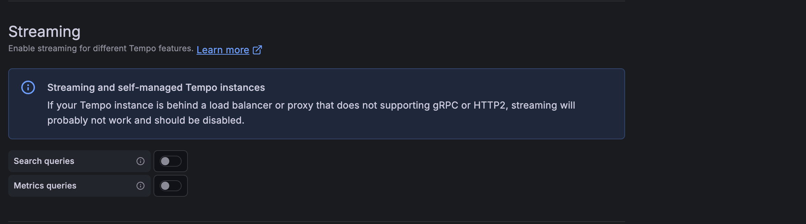
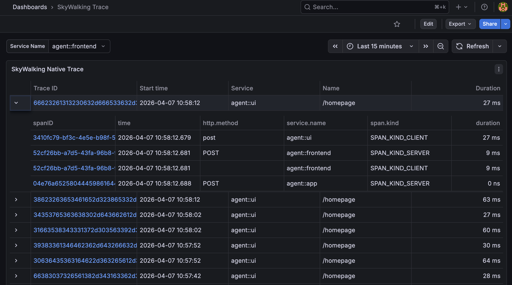
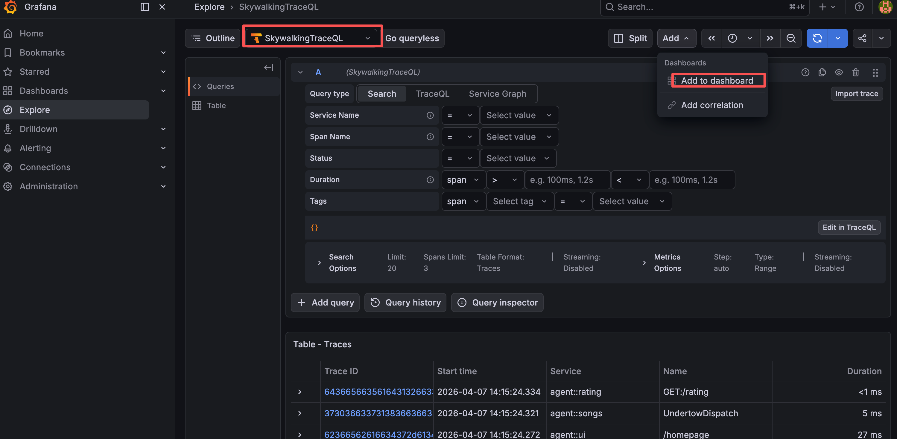
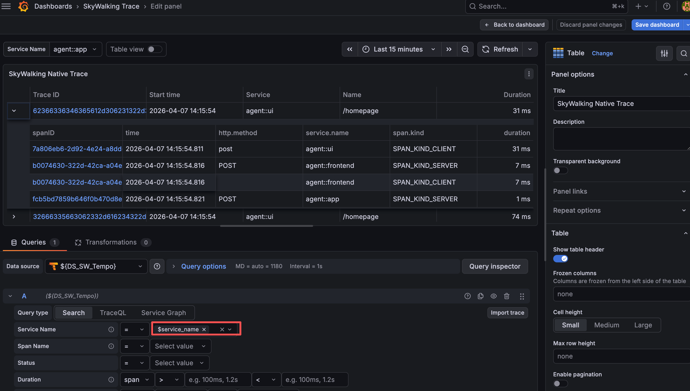
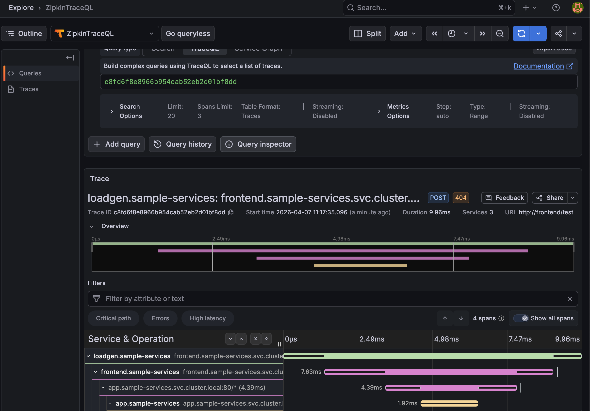

# Query SkyWalking and Zipkin Traces with TraceQL and Visualize in Grafana

Apache SkyWalking introduced **TraceQL** support in version **10.4.0**, implementing
[Grafana Tempo's HTTP query APIs](https://grafana.com/docs/tempo/v2.10.x/api_docs/) so that
Grafana can query and visualize traces stored in SkyWalking without any additional plugins.
This means you can now use the familiar Grafana Tempo data source to search, filter, and
drill into both **SkyWalking native traces** and **Zipkin-compatible traces** — all served
by your existing SkyWalking OAP server.

## Architecture Overview

```
┌────────────────────┐         Tempo HTTP API           ┌─────────────────────────────┐
│                    │  ──── /skywalking/api/search ──► │  SkyWalking Native Backend  │
│      Grafana       │                                  │  (Query Traces V2 API)      │
│  (Tempo Data Src)  │                                  ├─────────────────────────────┤
│                    │  ──── /zipkin/api/search ──────► │  Zipkin-Compatible Backend  │
└────────────────────┘                                  └──────────┬──────────────────┘
                                                                   │
                                                        ┌──────────▼──────────────────┐
                                                        │    SkyWalking OAP Server    │
                                                        │  ┌───────────────────────┐  │
                                                        │  │   TraceQL Service     │  │
                                                        │  │  (port 3200)          │  │
                                                        │  └───────────────────────┘  │
                                                        │  ┌───────────────────────┐  │
                                                        │  │  Storage (BanyanDB /  │  │
                                                        │  │  Elasticsearch / …)   │  │
                                                        │  └───────────────────────┘  │
                                                        └─────────────────────────────┘
```

The TraceQL Service sits inside the OAP server and exposes the Tempo-compatible HTTP API on
port `3200` (default). It converts traces from their native format into
[Tempo's format](https://github.com/grafana/tempo/blob/main/pkg/tempopb/tempo.proto),
where the trace detail part (`Trace` message) reuses OTLP `Trace` definitions.

## Limitations and Supported TraceQL Features

TraceQL is a rich query language, but SkyWalking currently implements a practical subset.
The following features are **supported**:

| Feature              | Examples                                               |
|----------------------|--------------------------------------------------------|
| Spanset filter       | `{resource.service.name="frontend"}`                   |
| Resource attributes  | `resource.service.name`                                |
| Span attributes      | `span.http.method`, `span.http.status_code`            |
| Intrinsic fields     | `duration`, `name`, `status`                           |
| Comparison operators | `=`, `>`, `>=`, `<`, `<=`                              |
| Compound conditions  | `{resource.service.name="frontend" && duration>100ms}` |
| Duration units       | `us`/`µs`, `ms`, `s`, `m`, `h`                         |

The following features are **not yet supported**:

- Spanset logical operations (`{...} AND {...}`, `{...} OR {...}`)
- Pipeline operations (`|` operator)
- Aggregate functions (`count()`, `avg()`, `max()`, `min()`, `sum()`)
- Regular expression matching (`=~`, `!~`)
- `event` and `link` scopes
- `kind` intrinsic field
- Streaming mode (must be disabled in the Grafana Tempo data source settings)

> **Important**: SkyWalking native trace support in TraceQL is based on the
> [Query Traces V2 API](https://skywalking.apache.org/docs/main/next/en/api/query-protocol/#trace-v2).
> Currently, only **BanyanDB** storage implements this API. Other storage backends
> (e.g., Elasticsearch, MySQL, PostgreSQL) do not support SkyWalking native trace queries via TraceQL.
> Zipkin-compatible traces are **not** subject to this restriction.

## Trace Format Conversion

Since the trace detail part of Tempo's format reuses
[OTLP Trace](https://opentelemetry.io/docs/reference/specification/protocol/) definitions,
the conversion descriptions below refer to OTLP field names (e.g., span kind, status code).

### SkyWalking Native Trace

#### Trace ID Encoding

SkyWalking native trace IDs are arbitrary strings (e.g.,
`2a2e04e8d1114b14925c04a6321ca26c.38.17739924187687539`), while Grafana Tempo require
pure hex-encoded trace IDs. The TraceQL Service encodes each UTF-8 byte of the original trace
ID as two lowercase hex characters:

```
Original:  2a2e04e8d1114b14925c04a6321ca26c.38.17739924187687539
Encoded:   32613265303465386431313134623134393235633034613633323163613236632e33382e3137373339393234313837363837353339
```

This encoded hex trace ID is what appears in all API responses and in Grafana. When you click a
trace ID in Grafana, the TraceQL Service automatically decodes it back to the original SkyWalking
trace ID for the internal query.

#### Span Kind Mapping

| SkyWalking Span Type | OTLP Span Kind       |
|----------------------|----------------------|
| `Entry`              | `SPAN_KIND_SERVER`   |
| `Exit`               | `SPAN_KIND_CLIENT`   |
| `Local`              | `SPAN_KIND_INTERNAL` |

#### Status Mapping

| SkyWalking `isError` | OTLP Status Code    |
|----------------------|---------------------|
| `true`               | `STATUS_CODE_ERROR` |
| `false`              | `STATUS_CODE_OK`    |

#### SpanAttachedEvents
SkyWalking [SpanAttachedEvents](https://skywalking.apache.org/docs/main/next/en/concepts-and-designs/event/) are converted to OTLP span events,
with `tags` mapped as string attributes and `summary` mapped as numeric attributes (serialized as strings).

### Zipkin Trace

#### Span Kind Mapping

| Zipkin Span Kind | OTLP Span Kind       |
|------------------|----------------------|
| `CLIENT`         | `SPAN_KIND_CLIENT`   |
| `SERVER`         | `SPAN_KIND_SERVER`   |
| `PRODUCER`       | `SPAN_KIND_PRODUCER` |
| `CONSUMER`       | `SPAN_KIND_CONSUMER` |

#### Status Mapping
1. If the `otel.status_code` tag is present, it is used directly.
2. Otherwise, if the `error` tag equals `true`, the status is `STATUS_CODE_ERROR`.
3. If neither tag is present, the status defaults to `STATUS_CODE_UNSET`.

#### Endpoint and Annotation Mapping
Zipkin endpoint fields are mapped to OTLP attributes (e.g., `localEndpoint.ipv4` → `net.host.ip`),
and Zipkin annotations are converted to OTLP span events.

For the full conversion details, see the [TraceQL Service documentation](https://skywalking.apache.org/docs/main/next/en/api/traceql-service/).

## How to Enable TraceQL

### Step 1: Enable the TraceQL Module

By default, the TraceQL module is **disabled** (`selector: ${SW_TRACEQL:-}`). To enable it, set
the selector to `default`:

```yaml
# In application.yml
traceQL:
  selector: ${SW_TRACEQL:default}
  default:
    enableDatasourceSkywalking: ${SW_TRACEQL_ENABLE_DATASOURCE_SKYWALKING:true}
    enableDatasourceZipkin: ${SW_TRACEQL_ENABLE_DATASOURCE_ZIPKIN:true}
```

Or via environment variables:

```bash
export SW_TRACEQL=default
export SW_TRACEQL_ENABLE_DATASOURCE_SKYWALKING=true
export SW_TRACEQL_ENABLE_DATASOURCE_ZIPKIN=true
```

### Step 2: Enable the Zipkin Receiver (for Zipkin traces only)

If you want to query Zipkin traces, you also need to enable the Zipkin receiver so that
SkyWalking can ingest Zipkin trace data:

```yaml
# In application.yml
receiver-zipkin:
  selector: ${SW_RECEIVER_ZIPKIN:default}
  default:
    searchableTracesTags: ${SW_ZIPKIN_SEARCHABLE_TAG_KEYS:http.method}
    sampleRate: ${SW_ZIPKIN_SAMPLE_RATE:10000}
    restHost: ${SW_RECEIVER_ZIPKIN_REST_HOST:0.0.0.0}
    restPort: ${SW_RECEIVER_ZIPKIN_REST_PORT:9411}
```

Or via environment variable:

```bash
export SW_RECEIVER_ZIPKIN=default
```

### Full Configuration Reference

For the complete list of all configuration options and their default values, see the
[Configuration section of the TraceQL Service documentation](https://skywalking.apache.org/docs/main/next/en/api/traceql-service/#configuration).

## Configuring Grafana Tempo Data Source

> **Prerequisite**: Grafana **12 or later** is required.

Each trace backend (SkyWalking native / Zipkin) needs its own Tempo data source in Grafana,
because each is served under a different context path.

### Context Paths

The two backends are served under separate context paths on the same port:

| Backend           | Default Context Path | Env Variable                              | Full Default URL                    |
|-------------------|----------------------|-------------------------------------------|-------------------------------------|
| SkyWalking native | `/skywalking`        | `SW_TRACEQL_REST_CONTEXT_PATH_SKYWALKING` | `http://<oap-host>:3200/skywalking` |
| Zipkin            | `/zipkin`            | `SW_TRACEQL_REST_CONTEXT_PATH_ZIPKIN`     | `http://<oap-host>:3200/zipkin`     |

### Setting Up the SkyWalking Data Source

1. In Grafana, go to **Configuration → Data Sources → Add data source**.
2. Choose **Tempo**.
3. Set the URL to `http://<oap-host>:3200/skywalking`.
4. **Disable the Streaming option** (SkyWalking does not support streaming mode).



5. Save and test the data source.


### Setting Up the Zipkin Data Source

Same as above, but set the URL to `http://<oap-host>:3200/zipkin`.


## Configuring Trace List Result Tags

When you search for traces in Grafana, the trace list panel shows a summary of each trace.
The `tracesListResultTags` configuration controls **which span tags are included in the search
result** and displayed as columns in the trace list.

| Env Variable                                    | Default Value                                                                                  | Purpose                          |
|-------------------------------------------------|------------------------------------------------------------------------------------------------|----------------------------------|
| `SW_TRACEQL_ZIPKIN_TRACES_LIST_RESULT_TAGS`     | `http.method,error`                                                                            | Tags shown for Zipkin traces     |
| `SW_TRACEQL_SKYWALKING_TRACES_LIST_RESULT_TAGS` | `http.method,http.status_code,rpc.status_code,db.type,db.instance,mq.queue,mq.topic,mq.broker` | Tags shown for SkyWalking traces |

Note that `service.name` and `span.kind` are **always included** regardless of this setting.

These tags appear as attribute columns in the Grafana Tempo trace search results, making it
easier to identify and group traces at a glance:

**SkyWalking native trace list:**



**Zipkin trace list:**


You can customize these tags based on your application's instrumentation. For example, if your
services heavily use messaging, you might add `mq.destination` or `messaging.system` to the list.

## Building a Trace Dashboard in Grafana

### SkyWalking Native Trace Dashboard

#### Step 1: Explore and Save

1. Go to the **Explore** page in Grafana.
2. Select the Tempo data source you configured for SkyWalking (e.g., `SkyWalkingTraceQL`).
3. Run a test query, then click **Add to dashboard** and save it as `SkyWalking Trace`.



#### Step 2: Configure Variables

Add dashboard variables so users can filter traces dynamically (e.g., by service name):


#### Step 3: Add a Trace Panel

1. Choose a **Table** chart (or edit the panel you saved).
2. Set **Query type** to `Search`.
3. Set the **Service Name** query condition to the variable `$Service`.
4. Add other query conditions as needed (e.g., duration, span name, tags).
5. Test and save.



#### Step 4: View Trace Details

Click any trace ID in the trace panel to jump to the Explore page showing the full trace
waterfall view with all spans, tags, and events:


### Zipkin Trace Dashboard

The setup for Zipkin traces is identical to SkyWalking native traces — just use the Zipkin
Tempo data source you configured (e.g., `ZipkinTraceQL`).

**Zipkin trace detail view:**



## Summary

With TraceQL support in SkyWalking 10.4.0, you can now leverage Grafana's powerful Tempo
data source to query and visualize both SkyWalking native traces and Zipkin-compatible traces.
The key points to remember:

1. **Enable the TraceQL module** by setting `SW_TRACEQL=default` and enabling the desired backends.
2. **Configure separate Tempo data sources** in Grafana for each backend (`/skywalking` and `/zipkin`).
3. **Disable the Streaming option** in the Grafana Tempo data source settings.
4. **Customize result tags** via `SW_TRACEQL_SKYWALKING_TRACES_LIST_RESULT_TAGS` and `SW_TRACEQL_ZIPKIN_TRACES_LIST_RESULT_TAGS` to control what's shown in search results.
5. **SkyWalking native trace queries require BanyanDB** storage (Zipkin traces work with all storage backends).

For the complete API reference and conversion details, see the
[TraceQL Service documentation](https://skywalking.apache.org/docs/main/next/en/api/traceql-service/).
For Grafana integration details, see
[Use Grafana As The UI](https://skywalking.apache.org/docs/main/next/en/setup/backend/ui-grafana/#use-grafana-as-the-ui).
