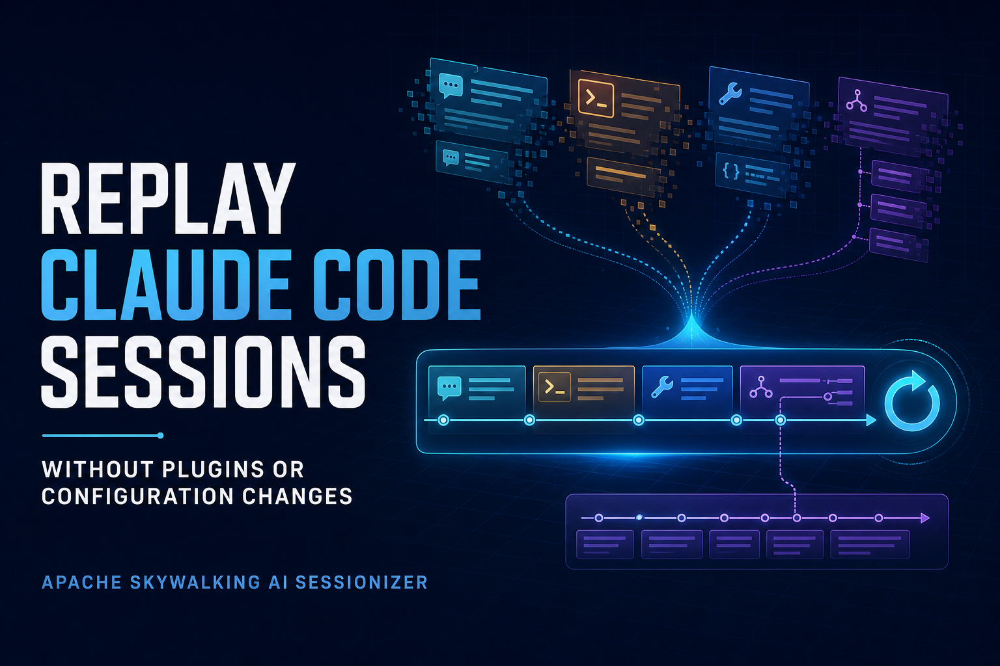
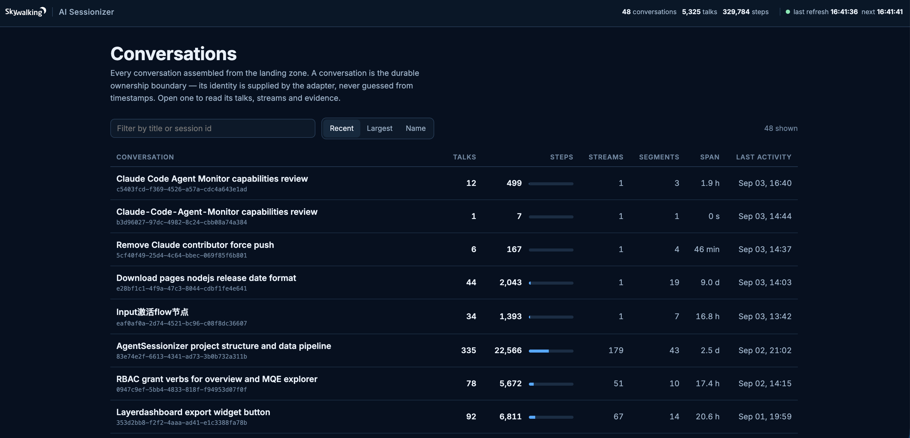
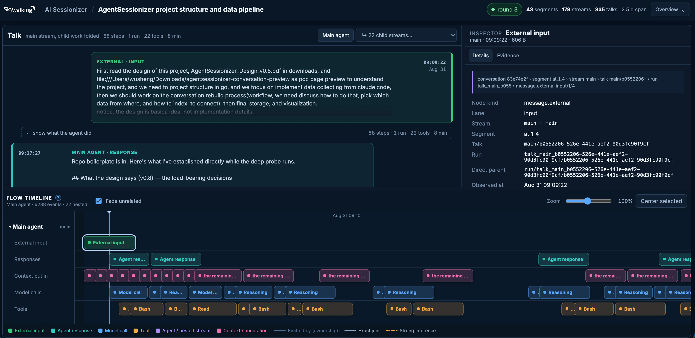
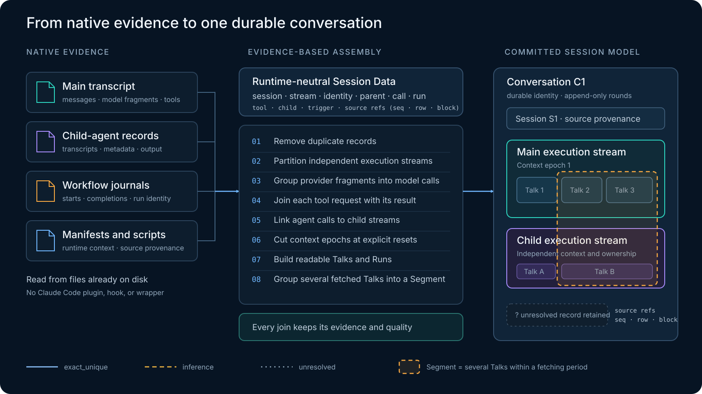
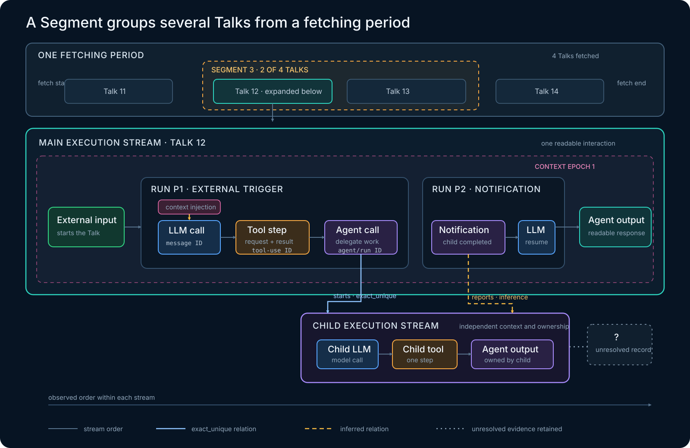

After Claude Code has worked through a long task, how do you revisit what happened? You may want to follow the conversation, inspect a tool call and its result, or see what a child agent contributed. The records already exist on your machine, but a task that spans hours, tools, context compactions, and child agents can be spread across many files.

Today we are sharing [Apache SkyWalking AI Sessionizer](https://github.com/apache/skywalking-ai-sessionizer), a new pre-alpha project offering an early local replay view for Claude Code sessions. It reads the native evidence Claude Code has already written, connects the conversation with tool and child-agent activity, and lets you explore that execution in your browser. **No plugin installation or configuration changes are needed in Claude Code**, and you can start with history recorded before you began using Sessionizer.

## What does replay mean?

**Replay means reconstructing and navigating a recorded session from the evidence it left behind.** Open a conversation, follow its inputs and responses, inspect recorded tool requests and results, and explore parent and child-agent activity on a time axis. The aim is to make a long agent session understandable after it happened.

For example, when Claude Code delegates part of a task, you can inspect the parent's request, explore the child's recorded work in its own execution stream, and follow the relationship back to the parent where the evidence supports that connection. This brings the conversation and the activity behind it into one view.

Replay here does not rerun the model or execute tools again. Claude Code's local files do not expose every exact provider request, system instruction, cache annotation, timing boundary, or retry identity. The view reconstructs the recorded activity and makes gaps and uncertain connections visible; it cannot reproduce hidden reasoning.

Collection and assembly are implemented, and the local replay view is still developing. Static export and remote telemetry integration are future work. We are opening the project at pre-alpha so developers can try the experience and help shape the conversation model and evidence rules.

## Nothing to install or configure in Claude Code

Sessionizer reads existing local files. There is no Claude Code plugin to install, hook script to register, process wrapper to use, or environment and runtime configuration to change. You do not need to start a new Claude Code session to capture data: retained history can already be explored.

**Sessionizer itself runs as a separate program.** The walkthrough below builds it from source and starts the local view.

## Start the local replay view

To build Sessionizer from source, use Go 1.27 or later. Clone the project, build it, and start the local replay view:

```sh
git clone https://github.com/apache/skywalking-ai-sessionizer.git
cd skywalking-ai-sessionizer
make build
./bin/asz view
```

Then open [http://127.0.0.1:8787](http://127.0.0.1:8787). `asz view` is the command that gets the local experience up and running: it starts the page, discovers existing Claude Code data, collects and parses it in the same process, and continues refreshing it on the configured interval.

Two additional commands are useful for inspecting the pipeline, but they are not required before `asz view`:

```sh
./bin/asz sources          # list discovered sessions and source files
./bin/asz collect -once    # collect the current local evidence once, without the UI
```

Run these commands from the repository root so Sessionizer reads the included `asz.yaml`. The defaults discover existing Claude Code data and serve the local view without any configuration edits.


Figure 1: The conversation index summarizes talks, steps, streams, segments, active span, and last activity across the assembled Claude Code sessions.</br>

The browser view begins with conversations and talks, then exposes the parent and child execution streams behind them. Transcript content and a time-axis flow can be inspected alongside model calls, tools, agent activity, relations, and the source evidence used to build those relations.


Figure 2: The talk view connects readable input and output with parent and child streams, an evidence inspector, and a time-axis flow of context, model, and tool activity.</br>

## From a transcript to a session

A transcript is useful, but it is not the whole execution.

Claude Code may place the main transcript, child-agent transcripts, child metadata, workflow journals, manifests, and scripts in different locations. Some records are a readable conversation. Others describe tool execution, model calls, delegation, or workflow state. A single source does not necessarily establish how every piece relates to the others.

Before assembly, the Claude Code adapter maps those runtime-specific artifacts into **Session Data**, a common evidence format. Each record keeps its session and stream, native identifiers and parent references, call, run, tool, and child-agent keys, and a stable source location. This separates the meaning of the evidence from the file format in which one runtime happened to write it.

## How Sessionizer links the evidence

Assembly follows eight ordered stages because each establishes facts required by the next. Repeated records are removed first, keeping the first landed copy. Records are then partitioned into independent parent and child execution streams. Assistant fragments are grouped into model calls by message ID; tool requests and results are joined by tool-use ID; and agent calls are connected to child streams through the available agent and run identities.

Only an explicit reset record can open a new context epoch. Talks and Runs are then built by following triggers and parent ancestry, rather than assuming that nearby lines belong together. The fetching period provides the window in which Segments are determined. A Segment groups several Talks from that period, but it does not necessarily contain every Talk fetched in the period. Landed order remains authoritative throughout this process because timestamps from different records can move backward.


Figure 3: Fragmented native artifacts become a durable conversation through ordered, evidence-based assembly. A Segment groups several—but not necessarily all—Talks from one fetching period, while unresolved records and the quality of every join remain visible.</br>

The assembled result separates **ownership** from **relationship**. A node has at most one containment parent: Session → Execution Stream → Context Epoch → Talk → Run → Step. Cross-stream flow and other causal claims are represented as sparse, typed relations such as `starts`, `reports`, `ends_with`, `follows`, `summarizes`, and `in_segment`. Every such relation carries both its source evidence and correlation quality.

A Conversation supplies the durable chain identity, while a Session preserves source-runtime provenance. Parent and child agents remain in distinct Execution Streams so the child's messages and tools are not copied into the parent. A Segment is not another containment parent. It relates several Talks found within a fetching period without implying that all Talks in that period belong to the Segment.

## A Segment groups several Talks from a fetching period

The fetching period determines the window used to form Segments. Figure 4 shows four Talks collected in one period. Segment 3 groups Talk 12 and Talk 13; Talk 11 and Talk 14 remain outside it. Talk 12 is expanded to expose the agent activity behind that readable interaction.

### One Talk can contain an entire agent loop

A Talk is the readable interaction that begins with input from outside the agent. It is not necessarily one prompt followed by one reply. More human input can arrive while work is running, the agent can speak between tool calls, and a child-completion notification can start another Run while the original Talk continues.

A Run is therefore an agent loop, not a single model call. Inside a Run, one model response can request a tool, the tool result can lead to another model call, and delegation can open an independent child stream. Sessionizer joins a tool request and its result into one Tool step. Child output stays owned by the child stream; the parent receives a qualified relation to that activity instead of absorbing it.


Figure 4: A fetching period contains four Talks, but Segment 3 groups only two of them. The expanded Talk shows how one readable interaction can span multiple parent Runs and an independent child-agent stream; solid, dashed, and unresolved links preserve what the evidence can establish.</br>

This process is what we mean by **sessionizing**: turning fragmented runtime evidence into a coherent, durable session without discarding its source or pretending that every relationship is certain.

The complete rules and object definitions are documented in [Conversation Assembly](https://github.com/apache/skywalking-ai-sessionizer/blob/main/docs/en/concepts-and-designs/conversation-assembly.md) and the [Unified Conversation Model](https://github.com/apache/skywalking-ai-sessionizer/blob/main/docs/en/concepts-and-designs/unified-conversation-model.md).

## Evidence has to remain evidence

An attractive timeline can easily look more certain than the underlying records justify. Sessionizer therefore treats evidence quality as part of the data rather than a footnote in the UI.

Every claim is qualified as observed and replayable, observed but report-only, proposed, or unavailable. Correlations are also given resolution states such as exact and unique, exact but ambiguous, strongly inferred, unresolved, or conflicting. If one identifier matches several candidates, the assembler keeps the ambiguity instead of silently selecting the most convenient one.

That discipline applies throughout the model. Session identity is not guessed from a username or timestamp proximity. Parent and child streams retain their own continuity. Information absent from the source stays unavailable rather than being approximated into a fact.

The result is useful for more than rendering a page. It is a committed session-data foundation on which future views, exports, measurements, and evaluations can operate with the same understanding of what was observed.

## Where we want to take it

The current Claude Code path gives us something concrete to examine, but the project is intended to grow beyond a local viewer and beyond one agent runtime. Our agenda has three directions.

### 1. Unify local and remote collection with one data format

Local evidence is valuable because it provides immediate access to current and historical sessions without requiring runtime integration. Remote collection is necessary when sessions need to be observed across machines, teams, or managed environments.

Our direction is to make these complementary collection paths feed the same session-data format. A conversation collected from local artifacts and one assembled with remote telemetry should retain the same core hierarchy, provenance rules, evidence qualifications, and execution boundaries. Local reconstruction, portable export, remote ingestion, and centralized storage should not create separate meanings for the same agent behavior.

This also creates a path from today's local inspection toward near-real-time monitoring and shareable session evidence. The data model comes first; transport and presentation can then evolve without redefining the session each time.

### 2. Move beyond Claude Code to Codex and LangChain/LangGraph agents

Claude Code is a useful starting point because it already leaves rich local evidence and exercises many of the difficult cases: long conversations, tool calls, context changes, subagents, workflows, and activity distributed across files.

It is not intended to be the boundary of the project. We plan to explore adapters for Codex and for agents built in the LangChain and LangGraph ecosystems. Each runtime has its own vocabulary and exposes different evidence, so an adapter should preserve those runtime-specific facts while mapping them into the common conversation structure.

The goal is not to force every agent into a lowest-common-denominator transcript. It is to give different agent ecosystems a shared session boundary while retaining the evidence needed to understand each one accurately.

### 3. Derive metrics and analysis dashboards as a bonus

Once session data is collected and normalized, useful measurements follow naturally. Session duration, model and tool activity, token usage when available, child-agent participation, errors, context discontinuities, and other behavioral signals can be derived from the same committed structure.

This makes metrics analysis and dashboards a valuable bonus of sessionization. They can help operators understand activity and trends across many sessions, while a click into an individual session can retain the detailed evidence needed for investigation. Over time, the same foundation could also support whole-session evaluation: judging the trajectory and outcome of an agent conversation rather than scoring isolated inputs and outputs.

These dashboards and evaluations are a direction, not a feature we are announcing as complete today. The immediate work is to make the underlying session data trustworthy enough that future analysis has a sound basis.

## Why share it this early?

The most important decisions in Sessionizer are not page colors or chart types. They are decisions about identity, continuity, causality, provenance, privacy, and uncertainty. Those decisions become much harder to change after adapters and stored data depend on them.

That is why we are sharing the project at pre-alpha. We want developers of agents, observability systems, and evaluation tools to inspect the model, try the Claude Code adapter against real sessions, and challenge the cases we have not yet seen. Early contributions are especially valuable around schemas, privacy-safe fixtures, deterministic assembly, qualification rules, and golden tests.

If you would like to share your thoughts or discuss the project's direction with us, join the conversation in [Apache SkyWalking Discussions](https://github.com/apache/skywalking/discussions).

Explore the source and documentation in the [Apache SkyWalking AI Sessionizer repository](https://github.com/apache/skywalking-ai-sessionizer). Start with a Claude Code session already on your machine, explore its recorded execution in the local replay view, and help us build toward broader agent replay, monitoring, and analysis.
